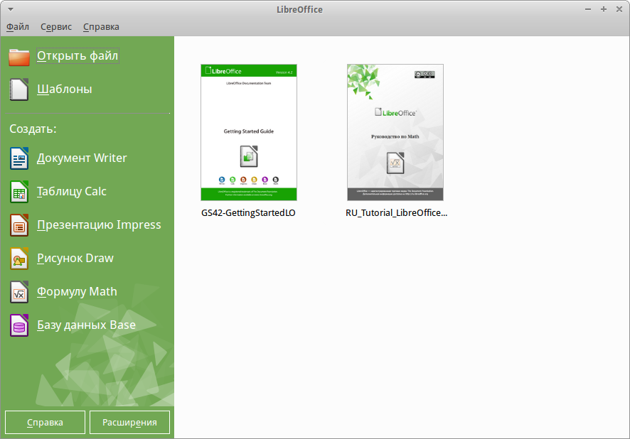
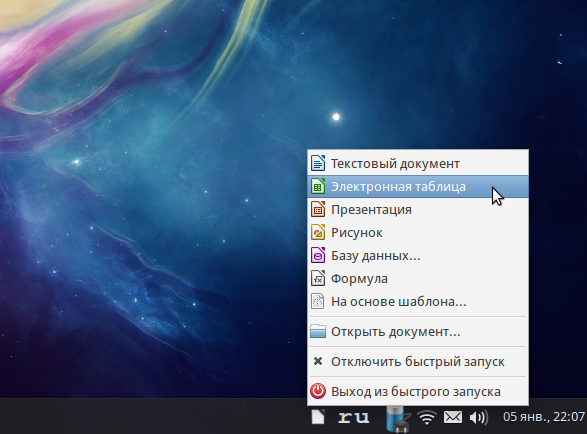

.. meta::
   :description: Краткое руководство по LibreOffice 
   :keywords: LibreOffice, Writer, Impress, Calc, Math, Base, Draw, либреоффис

.. Список автозамен

.. |br| raw:: html

    

Глава 1 – Введение в LibreOffice
================================

Что такое LibreOffice?
----------------------

LibreOffice – это свободный и бесплатный, полнофункциональный набор офисных программ. Его собственным форматом файлов является Open Document Format (ODF). Этот формат является открытым, принят как международный стандарт :abbr:`ISO(Международная организация по стандартизации)`/:abbr:`IEC (Международная электротехническая комиссия)` 26300 [#]_ и используется правительствами многих стран по всему миру, как формат публикации и обмена документами, в том числе и в Российской Федерации [#]_ .

.. [#] http://www.iso.org/iso/catalogue_detail.htm?csnumber=43485
.. [#] ГОСТ Р ИСО/МЭК 26300-2010. Введён в действие с 1 июня 2011 года. Официальное уведомление об утверждении стандарта: http://webportalsrv.gost.ru/portal/UVED_2007st.nsf/438c8c3c9e06dc87c32573a100549873/c4b660ff237e33ea432578020033edf5?OpenDocument

LibreOffice также открывает и сохраняет документы во многих других форматах, включая форматы файлов нескольких версий Microsoft Office.

LibreOffice включает в себя следующие компоненты:

Writer (текстовый процессор)
~~~~~~~~~~~~~~~~~~~~~~~~~~~~

Writer – многофункциональный текстовый процессор. Он достаточно прост для создания быстрых заметок, достаточно мощный, чтобы создавать целые книги с содержанием, диаграммами, указателями и т.д. Вы можете вставить в документ Writer изображения и объекты из других компонентов LibreOffice. Writer поддерживает экспорт файлов в форматы HTML, XHTML, XML, Adobe PDF и в несколько версий  форматов Microsoft Word.

Calc (электронные таблицы)
~~~~~~~~~~~~~~~~~~~~~~~~~~~~

Calc  – табличный процессор, включающий в себя продвинутые средства для анализа, построения диаграмм и принятия решений. В распоряжении пользователя более 300 функций для финансовых, статистических и математических операций. Менеджер сценариев дает возможность проводить анализ типа «что если». 
  
Calc позволяет создавать 2D и 3D диаграммы, которые впоследствии могут быть встроены в другие документы LibreOffice. Вы также можете открывать и работать с файлами Microsoft Excel и сохранять их также в формате Excel. Calc может экспортировать электронные таблицы в несколько форматов, включая, например, CSV, Adobe :abbr:`PDF (Portable Document Format)` и HTML.

Impress (презентации)
~~~~~~~~~~~~~~~~~~~~~~~~~~~~

Impress обеспечивает все средства для создания мультимедиа презентаций, включая специальные элементы, анимацию и средства для рисования. Impress интегрирован с компонентами LibreOffice Draw и Math. Слайд-шоу может быть дополнено специальными эффектами для текста, а также звуком и видеоклипами. Impress совместим с форматом файлов Microsoft PowerPoint и может сохранять вашу работу в многочисленных графических форматах, включая Macromedia Flash (SWF) и Adobe :abbr:`PDF (Portable Document Format)`.

Draw (векторная графика)
~~~~~~~~~~~~~~~~~~~~~~~~~~~~

Draw – это инструмент для создания векторной графики, с помощью которого можно создавать всё, от простых диаграмм и блок-схем до сложной 3D-графики. Его мощные функции позволяют быстро создавать рисунки и использовать их  в любом компоненте LibreOffice. Вы также можете создать свой собственный клип-арт и добавить его в :guilabel:`Галерею`, или воспользоваться уже готовым клип-артом других авторов с сайта Open Clip Art Library.

Draw может открывать множество различных форматов файлов и сохранять результат в более чем 20 форматах, включая PNG, HTML, Adobe :abbr:`PDF (Portable Document Format)` и Flash.

Base (база данных)
~~~~~~~~~~~~~~~~~~~~~~~~~~~~

Base предоставляет простой интерфейс для ежедневной работы с базами данных. Вы можете создавать и редактировать формы, отчеты, запросы, таблицы, представления и связи, так же, как в других популярных приложениях для работы с базами данных. Base предоставляет возможность анализировать и редактировать связи в схеме представлений. 

Также Base включает в себя движок реляционной базы данных HSQLDB, но может использовать и другие движки: dBASE, Microsoft Access, MySQL или Oracle, или другие :abbr:`ODBC (Open Database Connectivity)` совместимые или :abbr:`JDBC (Java DataBase Connectivity — соединение с базами данных на Java)` совместимые базы данных. Base предоставляет поддержку для подмножества ANSI-92 SQL.

Math (редактор формул)
~~~~~~~~~~~~~~~~~~~~~~~~~~~~

Math – это инструмент для создания и редактирования формул в LibreOffice. Вы можете использовать его для создания сложных формул, которые включают в себя символы, недоступные в стандартных наборах шрифтов. Math обычно используется для создания формул в текстовых документах Writer и презентациях Impress, но может использоваться и как самостоятельный программный продукт. Вы можете сохранять формулы в стандартном формате Mathematical Markup Language (MathML) для включения их в веб-страницы и другие документы, созданные не в LibreOffice.

-------

Преимущества LibreOffice
------------------------

Вот некоторые преимущества  LibreOffice перед другими офисными пакетами:

* **Отсутствие лицензионных отчислений.** LibreOffice бесплатен для любого использования и распространения. Многие функции, которые доступны за отдельную плату в других офисных пакетах (например, экспорт в PDF), доступны бесплатно в LibreOffice. Он не требует никаких скрытых затрат сейчас и не потребует в будущем.

* **Открытый исходный код.** Вы можете распространять, копировать и модифицировать программное обеспечение, в соответствии с лицензией LibreOffice.

* **Многоплатформенность.** LibreOffice работает на различных аппаратных архитектурах и под управлением различных операционных систем, таких, как Microsoft Windows, Mac OS X и Linux.

* **Широкая поддержка языков.** Пользовательский интерфейс LibreOffice доступен на более чем 40 языках. Проект LibreOffice предоставляет словари, схемы переносов и тезаурусы для более чем 70 языков и диалектов. LibreOffice также поддерживает  сложно-форматированный текст (CTL) и языки с письмом справа налево (RTL) (таких как урду, иврит и арабский).

* **Единообразный пользовательский интерфейс.** Все компоненты обладают похожим внешним видом, что упрощает использование продукта.

* **Интеграция.** Компоненты LibreOffice хорошо интегрированы друг с другом. 

    * Все компоненты совместно используют модуль проверки орфографии и другие инструменты, которые одинаково используются во всем продукте. Например, инструменты рисования, доступные в Writer, также доступны в Calc, а более развитые средства рисования есть в  Impress и Draw.
    * Вам не нужно знать, каким компонентом создан тот или иной файл. Например, вы можете открыть документ Draw из компонента Writer.

* **Гибкость настройки.** Обычно, если вы изменяете глобальные настройки, они применяются во всем пакете. Тем не менее, настройки в LibreOffice могут быть установлены для отдельного компонента или даже для отдельного документа.

* **Файловая совместимость.** В дополнение к родному формату OpenDocument, LibreOffice включает в себя поддержку экспорта в PDF и Flash, а также поддержку сохранения и открытия файлов во множестве форматов, включая Microsoft Office, HTML, XML, WordPerfect и Lotus 1-2-3. Дополнительное расширение (включено в пакет) позволяет импортировать и редактировать некоторые PDF файлы.

* **Отсутствует привязка к единственному производителю программного обеспечения.** LibreOffice использует OpenDocument, файл в формате XML, разработанный, как отраслевой стандарт OASIS. Эти файлы могут быть легко распакованы и прочитаны в любом текстовом редакторе, а их структура открыта и публично доступна.

* **У вас есть голос.** Улучшения, исправления ошибок в программном обеспечении, даты релизов определяются сообществом. Вы можете присоединиться к сообществу и влиять на развитие продукта, которым пользуетесь.

Вы можете узнать больше о LibreOffice и The Document Foundation на этих сайтах: http://www.libreoffice.org/ и http://www.documentfoundation.org/.

Минимальные системные требования
---------------------------------

Для работы с LibreOffice 4.0 и более поздних выпусков требуется одна из следующих операционных систем:

* Microsoft Windows XP, Vista, Windows 7 или Windows 8;
* GNU/Linux с ядром версии от 2.6.18, glibc2 v2.5 или выше и gtk v2.10.4 или выше;
* Mac OS X 10.4 (Tiger) или выше.

Для установки необходимы права администратора. Также рекомендуется создавать резервные копии данных и системы при установке и удалении программного обеспечения.

Некоторые возможности LibreOffice (например, встроенная база данных HSQLDB) требуют установленного на компьютере Java Runtime Environment (JRE). LibreOffice может работать без Java, но в этом случае некоторые функции будут недоступны.

Для уточнения требований посетите сайт LibreOffice http://www.libreoffice.org/download/system-requirements/.

Где можно получить LibreOffice
------------------------------

LibreOffice можно скачать с сайта http://ru.libreoffice.org/. Также вы можете скачать LibreOffice при помощи торрент-клиента, скачав торрент-файл на странице загрузки.

.. tip:: Скачивайте LibreOffice только с официального сайта (https://ru.libreoffice.org).

Во многих Linux-дистрибутивах LibreOffice установлен по умолчанию или доступен в стандартных репозиториях.

Подробнее о получении LibreOffice смотрите *Приложении А*.

Как установить LibreOffice
--------------------------

Информацию об установке и настройке LibreOffice смотрите в *Приложении А*.

Расширения и дополнения
-----------------------

Расширения и дополнения также доступны для улучшения LibreOffice. Информация о расширениях и дополнениях доступна на сайте http://extensions.libreoffice.org/. Смотрите *Главу 14 – Настройка LibreOffice* данного руководства для получения информации об установке расширений и дополнений.

Запуск LibreOffice
------------------

Самый распространенный способ запуска любого компонента LibreOffice это использование системного меню из которого запускается большинство приложений. В Windows -  это меню :guilabel:`Пуск`. В GNOME – это меню приложений. В KDE – оно обозначено логотипом KDE. В Mac OS X – меню приложений.

При установке LibreOffice на ваш компьютер, кнопки запуска всех компонентов LibreOffice автоматически добавляются в системное меню операционных систем. На компьютерах под управлением Mac OS X, в меню добавляется только пункт меню LibreOffice.

.. _ch1-lo-screen-001:

.. figure:: _static/chapter1/ch1-lo-screen-001.png
    :scale: 50%
    :align: center
    :alt: Иконки запуска компонентов LibreOffice в системном меню Xubuntu GNU/Linux

    Иконки запуска компонентов LibreOffice |br| в системном меню Xubuntu GNU/Linux

При нажатии на пункт меню LibreOffice открывается стартовый экран LibreOffice, в котором вы можете выбрать любой компонент LibreOffice. Также вы можете выбрать пункт :guilabel:`&Открыть файл` или использовать :guilabel:`&Шаблоны`.

.. _ch1-lo-screen-002:

    Стартовый экран LibreOffice 4.3

Запуск нажатием на существующий документ
""""""""""""""""""""""""""""""""""""""""

Вы можете запустить LibreOffice дважды нажмите левой кнопкой мыши на документ файловом менеджере вашей операционной системы (например для ОС Windows это *Проводник*). Будет запущен соответствующий компонент LibreOffice и документ откроется в нём.

Если Microsoft Office установлен на вашем компьютере и вы при установке настроили ассоциации файлов Microsoft Office (подробнее смотрите *Приложени Б*) с LibreOffice, то при двойном нажатии на файл:

* Для файлов Word (``*.doc`` или ``*.docx``), они откроются в компоненте Writer;
* Для файлов Excel (``*.xls`` или ``*.xlsx``), они откроются в компоненте Calc;
* Для файлов PowerPoint (``*.ppt`` или ``*.pptx``), они откроются в компоненте Impress.

Если вы не настраивали ассоциации файлов Microsoft Office и он установлен на вашем компьютере, то при попытке открыть файл Microsoft Office будет использован соответствующий компонент Microsoft Office.

Для получения более подробной информации смотрите раздел *Открытие существующих документов* **????????????????????**.

Быстрый запуск в Windows
~~~~~~~~~~~~~~~~~~~~~~~~

LibreOffice включает функцию :guilabel:`Быстрого запуска` (Quickstarter). При её активации в системном лотке (трее) появляется значок |lo-tray|, а LibreOffice загружается в оперативную память при старте операционной системы, что позволяет достичь более быстрого запуска офисного пакета.

.. |lo-tray| image:: _static/icons/lo-tray-icon.png 
             :scale: 13%

Если :guilabel:`Быстрый запуск` не активирован, то смотрите раздел `Активация Быстрого запуска`_ для его включения.

Использование Быстрого запуска
~~~~~~~~~~~~~~~~~~~~~~~~~~~~~~

Обычно системный лоток (трей) операционной системы располагается в правом нижнем углу, рядом с часами. Одиночное нажатие на иконку :guilabel:`Быстрого запуска` LibreOffice в системном лотке, открывает меню, из которого можно открыть существующий документ, открыть шаблоны или запустить любой компонент LibreOffice. 

.. _ch1-lo-screen-003:

    Иконка быстрого запуска LibreOffice

Отключение Быстрого запуска
~~~~~~~~~~~~~~~~~~~~~~~~~~~

Для отключения функции :guilabel:`Быстрого запуска` нажмите правой кнопкой мыши по его значку в системном трее и в меню выберите пункт :guilabel:`Выход из быстрого запуска`. При следующем запуске компьютера компонент будет загружен снова.

Для полного отключения  функции :guilabel:`Быстрого запуска` нажмите правой кнопкой мыши по его значку в системном трее и в меню выберите пункт :guilabel:`Отключить быстрый запуск`. Или же снимите галочку напротив :guilabel:`&Использовать быстрый запуск` в меню :menuselection:`С&ервис --> &Параметры --> LibreOffice --> Память`.

.. note:: На компьютерах с небольшим объемом оперативной памяти целесообразно отключать функцию :guilabel:`Быстрого запуска`, для ускорения работы компьютера.

Активация Быстрого запуска
~~~~~~~~~~~~~~~~~~~~~~~~~~

Если :guilabel:`Быстрый запуск` был отключен, то вы можете активировать его используя пункт :guilabel:`&Использовать быстрый запуск` в меню :menuselection:`С&ервис --> &Параметры --> LibreOffice --> Память`.

.. _ch1-lo-screen-004:

.. figure:: _static/chapter1/ch1-lo-screen-004.png
    :scale: 40%
    :align: center
    :alt: Активация быстрого запуска LibreOffice

    Активация быстрого запуска LibreOffice

Быстрый запуск в Linux и Mac OS X
"""""""""""""""""""""""""""""""""

В Mac OS X и некоторых дистрибутивах Linux модуль :guilabel:`Быстрый запуск` отсутствует.  Для запуска LibreOffice воспользуйтесь системным меню.

------

