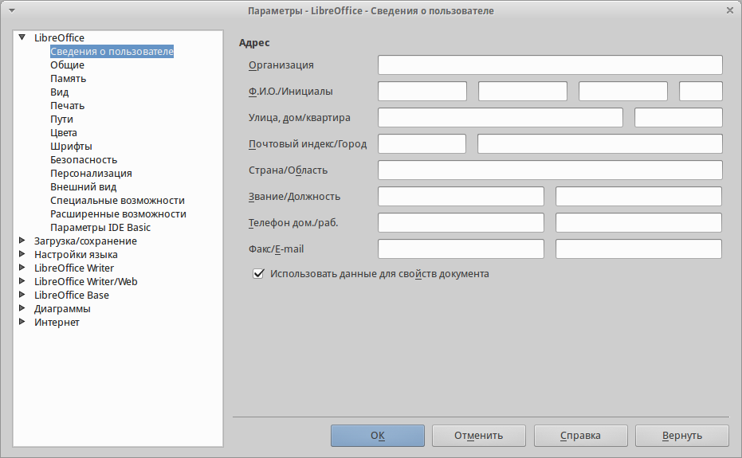
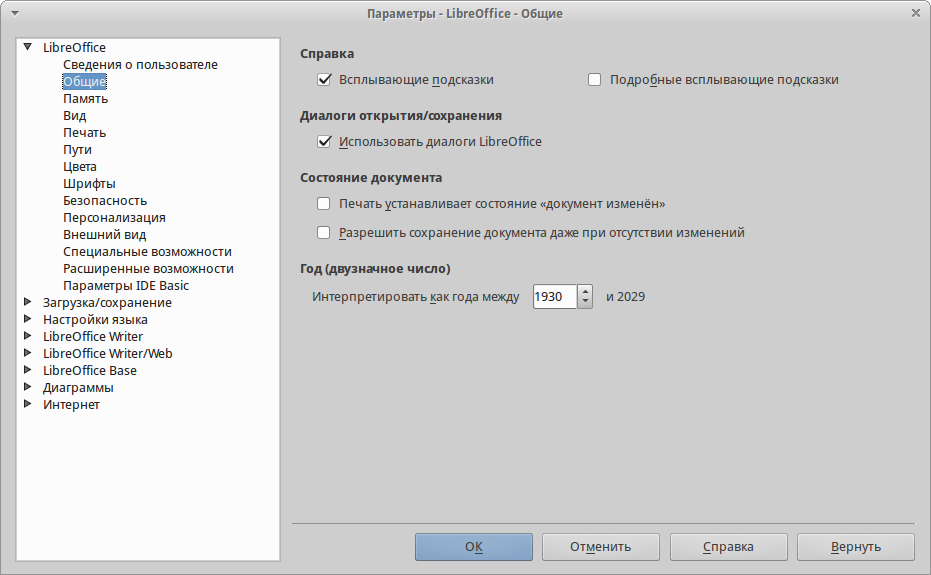
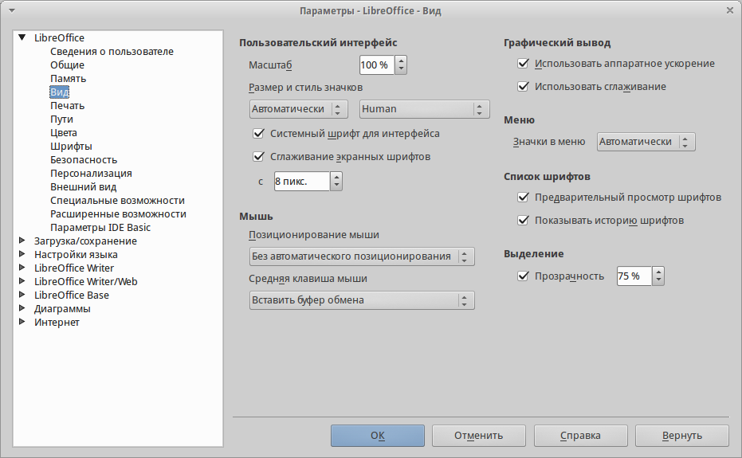

.. meta::
   :description: Краткое руководство по LibreOffice 
   :keywords: LibreOffice, Writer, Impress, Calc, Math, Base, Draw, либреоффис

Глава 2 – Общие параметры LibreOffice
=====================================

В главе рассматриваются общие параметры, применяемые ко всем компонентам LibreOffice.

Выбор параметров, общих для всех компонентов LibreOffice
---------------------------------------------------------

Выберите в главном меню пункт :menuselection:`С&ервис --> &Параметры`. Список в левой части открывшегося окна :guilabel:`Параметры`  зависит от того, какой компонент LibreOffice открыт. Иллюстрации в этой главе показывают список параметров, доступный если открыт документ Writer.

Нажмите на маркер (``+`` или треугольник) слева от надписи LibreOffice, чтобы раскрыть список категорий. При выборе категории в списке в левой части окна, в правой части окна будут отображаться соответствующие этой категории настройки.

.. _ch2-lo-screen-002:

    Параметры LibreOffice. Сведения о пользователе

.. note:: В правом нижнем углу диалога :guilabel:`Параметры` расположена кнопка :guilabel:`Вернуть`, при нажатии на которую настройки будут возращены в значение, установленное до открытия диалогового окна :guilabel:`Параметры`. 

Сведения о пользователе
~~~~~~~~~~~~~~~~~~~~~~~

LibreOffice использует некоторые данные пользователя (Ф.И.О., инициалы, город, название организации и другие) в различных функциях, например, в полях с данными, примечаниях или в свойствах документа. Задать эти данные можно в разделе настроек LibreOffice – *Сведения о пользователе* (иллюстрация :ref:`ch2-lo-screen-002`).

Вы можете заполнить текстовые поля формы, удалить или изменить любую существующую информацию.

Общие
~~~~~

Ниже приведено описание параметров из категории :menuselection:`LibreOffice --> Общие`.

.. _ch2-lo-screen-003:

    Выбор параметров вида для LibreOffice

**Справка**

* *Всплывающие подсказки* — если данная функция активирована, то при наведении курсора мыши на любой элемент интерфейса (значок, кнопку, поле, команду меню), будет появляться короткая всплывающая подсказка, описывающая действие того или иного элемента интерфейса.
* *Подробные всплывающие подсказки* — включает при наведении курсора мыши на любой элемент интерфейса (значок, кнопку, поле, команду меню) более подробные всплывающие подсказки. 

**Диалоги открытия/сохранения файлов**

* *Использовать диалоги LibreOffice*  — включение этой функции позволяет использовать встроенные в LibreOffice диалоги открытия/сохранения файлов. Если функция не активна, то используются стандартные диалоги операционной системы. Подробнее о встроенных диалогах LibreOffice смотрите главу :ref:`Chapter-1-Introducing-LibreOffice`.

.. ==== Этот кусок не отображается при генерации ==============
.. В GS 4.3 про диалоги печати отсутствует информация. И сам пункт у меня в ЛО 4.3 отсутствует. Поэтому убираю этот раздел.
 
   Диалоги печати – Использовать диалоги LibreOffice (только для ОС Mac OS X) 
   Для использования стандартных диалогов печати Mac OS X, снимите флажок с опции Использовать диалоги LibreOffice. Если флажок у опции установлен, то будут использоваться диалоги печати, поставляемые с LibreOffice. В этой книге в иллюстрациях используются диалоги печати LibreOffice .

.. ==== Конец комментария =====================================

**Состояние документа**

* *Печать устанавливает состояние «документ изменён»* – если установлен флажок для этой опции, то в следующий раз при печати документа, дата печати будет записана в его свойства. А при попытке закрыть документ, будет выведено уведомление о сохранении документа, даже если с документом кроме печати ничего не происходило.

* *Разрешить сохранение документа даже при отсутствии изменений*  – по умолчанию, если документ не изменялся, пункт меню :menuselection:`&Файл --> Со&хранить` и значок :guilabel:`Сохранить` на стандартной панели инструментов неактивны. Также ничего не происходит и при нажатии сочетания клавиш `Ctrl + S`. При активации данной опции, документ  можно будет всегда сохранить, независимо от того изменялся ли он или нет.

.. note:: Функция :menuselection:`&Файл --> Сохранить &как` активна в любом случае.

**Год (двузначное число)**

* Определяет, как интерпретировать введенные двузначным числом года. Например, если значение в поле установлено 1930 и пользователь вводит в документе дату ``1/1/30`` или более позднюю, то дата автоматически будет преобразована в ``1/1/1930``. Если задать дату ``1/1/20``, то она будет преобразована в ``1/1/2020``.

.. note:: Преобразование дат зависит от настроек языка. Например, в Российской Федерации числа в датах принято разделять точкой, а не косой чертой.

Память
~~~~~~

Вид
~~~

Настройки из раздела :menuselection:`LibreOffice --> Вид` влияют на отображение окна документа и его поведение. Некоторые из этих настроек описаны ниже.

.. _ch2-lo-screen-001:

    Выбор параметров вида для LibreOffice

Печать
~~~~~~

Пути
~~~~

Цвета
~~~~~

Шрифты
~~~~~~

Безопасность
~~~~~~~~~~~~

Параметры и предупреждения безопасности
~~~~~~~~~~~~~~~~~~~~~~~~~~~~~~~~~~~~~~~

Персонализация
~~~~~~~~~~~~~~

Внешний вид
~~~~~~~~~~~

Специальные возможности
~~~~~~~~~~~~~~~~~~~~~~~

Расширенные возможности
~~~~~~~~~~~~~~~~~~~~~~~~

Проверка обновлений
~~~~~~~~~~~~~~~~~~~

----------------------------------------------------

Выбор параметров Загрузка/сохранение
-------------------------------------

Общие
~~~~~

Свойства VBA
~~~~~~~~~~~~~~~~~~~~

Microsoft Office
~~~~~~~~~~~~~~~~~~~~

Совместимость с HTML
~~~~~~~~~~~~~~~~~~~~

-----------------------------------------------------------------

Выбор параметров языка
----------------------

Установка необходимых словарей
~~~~~~~~~~~~~~~~~~~~~~~~~~~~~~~~~~~~

Смена локальных и языковых настроек
~~~~~~~~~~~~~~~~~~~~~~~~~~~~~~~~~~~~

Выбор параметров лингвистики
~~~~~~~~~~~~~~~~~~~~~~~~~~~~~~~~~~~~

Выбор параметров Интернет
~~~~~~~~~~~~~~~~~~~~~~~~~~~~~~~~~~~~

Управление функцией Автозамена в LibreOffice
---------------------------------------------
