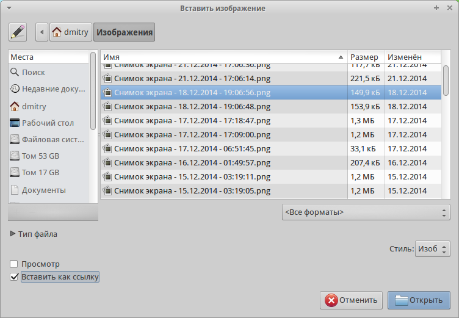

.. meta::
   :description: Краткое руководство по LibreOffice: Глава 12 – Создание веб-страниц
   :keywords: LibreOffice, Writer, Impress, Calc, Math, Base, Draw, либреоффис

.. _Creating-Web-Pages:

Глава 12 – Создание веб-страниц
================================================

В этой главе описывается, как сделать в Writer, Calc, Impress и Draw следующее: 

* Создание гиперссылок внутри документа и на другие документы, такие как веб-страницы, PDF и другие файлы. 
* Сохранять документы, как веб-страницы (документы HTML).

При создании документа, который вы планируете использовать, как веб-страницу, необходимо учитывать следующее: 

* В HTML документе гиперссылки активные (на них можно щелкать и переходить по соответствующим адресам), а другие перекрестные ссылки, вставляемые LibreOffice, таковыми не являются. 
* Объект, такой как изображение, сохранится в отдельном файле. Однако, если этот объект был помещен во врезку или фрейм (например, с соответствующей надписью), то он не сохранится и не появится в HTML документе, на экране появится только имя фрейма. 

Относительные и абсолютные гиперссылки 
--------------------------------------

Гиперссылки, хранящиеся в файле, могут быть абсолютными или относительными. 

Относительная гиперссылка содержит сведения о том, как попасть в какое-то место, начиная с того места, где документ находится сейчас (то есть из папки, в которой сохранён текущий документ), а абсолютная гиперссылка содержит сведения о месте назначения, которые позволят перейти туда, независимо от того, где расположен документ.
Абсолютная ссылка будет работать, если цель ссылки переместится. Относительная ссылка перестанет работать, если изменить местоположение начального и целевого места относительно друг друга. Например, если есть две таблицы в одной папке, связанных друг с другом, и вся папка будет перемещена в новое место, то абсолютная гиперссылка сломается, а относительная нет.

Чтобы изменить способ, которым LibreOffice сохраняет гиперссылки в файле, в меню :menuselection:`Сервис --> Параметры --> Загрузка/Сохранение --> Общие` выберите в разделе *Сохранение* вариант *Относительные пути к файлам* или *Относительные интернет адреса* или оба.

Calc всегда будет отображать абсолютную гиперссылку. Не пугайтесь, когда он делает это, даже если сохранена относительная гиперссылка. Этот «абсолютный» адрес будет обновляться, если файл переместить.

.. note:: Убедитесь, что структура каталогов на вашем компьютере такая же, как структура на веб-сервере, если сохраняете ссылки и собираетесь загрузить страницы в Интернет.

.. tip:: Если навести курсор мыши на гиперссылку, отобразится всплывающая подсказка с абсолютной ссылкой, поскольку внутри LibreOffice используется абсолютная адресация. Полный путь и адрес можно увидеть только при просмотре результата экспорта в HTML (сохранение таблицы в качестве HTML файла), а затем загрузки HTML файла в виде текста или, открыв его в текстовом редакторе.

Создание гиперссылки
--------------------

При вводе текста (например, адреса веб-сайтов или URL), который может быть использован в качестве гиперссылки, нажмите клавишу пробел или клавишу ``Enter``. LibreOffice автоматически создает гиперссылку и применит форматирование к тексту (как правило цвет и подчеркивание). Если это не произойдет, то можно включить эту функцию, выбрав в меню :menuselection:`Сервис --> Параметры автозамены` на вкладке *Параметры* опцию *Распознавать URL-адреса*.

Если вы не хотите чтобы LibreOffice производил преобразование конкретного URL в гиперссылку, выберите пункт меню :menuselection:`Правка --> Отменить` или нажмите сочетание клавиш ``Ctrl + Z`` сразу же после применения форматирования, или поместите курсор на гиперссылку, нажмите правой кнопкой мыши и выберите в контекстном меню пункт *Удалить гиперссылку*. 

.. tip:: Чтобы изменить цвет гиперссылки, в меню :menuselection:`Сервис --> Параметры --> LibreOffice --> Внешний вид` в списке *Настройка цветов* найдите пункт *Не посещённые ссылки* и/или *Посещённые ссылки*, выберите для них новый цвет и нажмите *OK*. Внимание: это изменение цвета гиперссылки будет применено во всех компонентах LibreOffice; возможно это не требуется.

 В Writer и Calc (но не в Draw или Impress) также можно изменить стиль символов интернет-ссылки  или определить и применить новый стиль для выбранных ссылок.
 
Использование Навигатора
-------------------------

Можно вставлять гиперссылки, используя *Навигатор*. Это простой способ вставить гиперссылку на другую часть этого же документа. 

1) Откройте документы, содержащие элементы, на которые нужно создать перекрестную ссылку.

2) Нажмите на значок *Навигатор*  или выберите пункт меню :menuselection:`Вид --> Навигатор` |ch12-lo-screen-001|, или нажмите клавишу ``F5``, чтобы открыть окно *Навигатор*.

3) Нажмите на треугольник справа от значка *Режим перетаскивания* и выберите пункт *Вставить как гиперссылку*. Значок Режим перетаскивания по умолчанию выглядит, как значок *Гиперссылка* |ch12-lo-screen-002|.

4) Выберите документ из выпадающего списка в нижней части *Навигатора*, который содержит элемент, на который вы хотите создать перекрестную ссылку. 

5) В списке *Навигатора*, выберите элемент, который вы хотите добавить в качестве гиперссылки.

6) Перетащите элемент на место в документе, куда нужно вставить гиперссылку. Имя элемента будет вставлено в документ в качестве активной гиперссылки.

