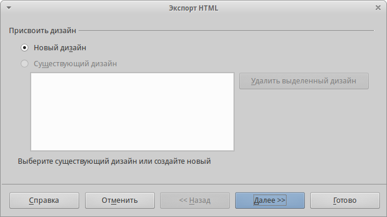

.. meta::
   :description: Краткое руководство по LibreOffice: Глава 12 – Создание веб-страниц
   :keywords: LibreOffice, Writer, Impress, Calc, Math, Base, Draw, либреоффис

.. _Creating-Web-Pages:

Глава 12 – Создание веб-страниц
================================================

В этой главе описывается, как сделать в Writer, Calc, Impress и Draw следующее: 

* Создание гиперссылок внутри документа и на другие документы, такие как веб-страницы, PDF и другие файлы. 
* Сохранять документы, как веб-страницы (документы HTML).

При создании документа, который вы планируете использовать, как веб-страницу, необходимо учитывать следующее: 

* В HTML документе гиперссылки активные (на них можно щелкать и переходить по соответствующим адресам), а другие перекрестные ссылки, вставляемые LibreOffice, таковыми не являются. 
* Объект, такой как изображение, сохранится в отдельном файле. Однако, если этот объект был помещен во врезку или фрейм (например, с соответствующей надписью), то он не сохранится и не появится в HTML документе, на экране появится только имя фрейма. 

Относительные и абсолютные гиперссылки 
--------------------------------------

Гиперссылки, хранящиеся в файле, могут быть абсолютными или относительными. 

Относительная гиперссылка содержит сведения о том, как попасть в какое-то место, начиная с того места, где документ находится сейчас (то есть из папки, в которой сохранён текущий документ), а абсолютная гиперссылка содержит сведения о месте назначения, которые позволят перейти туда, независимо от того, где расположен документ.
Абсолютная ссылка будет работать, если цель ссылки переместится. Относительная ссылка перестанет работать, если изменить местоположение начального и целевого места относительно друг друга. Например, если есть две таблицы в одной папке, связанных друг с другом, и вся папка будет перемещена в новое место, то абсолютная гиперссылка сломается, а относительная нет.

Чтобы изменить способ, которым LibreOffice сохраняет гиперссылки в файле, в меню :menuselection:`Сервис --> Параметры --> Загрузка/Сохранение --> Общие` выберите в разделе *Сохранение* вариант *Относительные пути к файлам* или *Относительные интернет адреса* или оба.

Calc всегда будет отображать абсолютную гиперссылку. Не пугайтесь, когда он делает это, даже если сохранена относительная гиперссылка. Этот «абсолютный» адрес будет обновляться, если файл переместить.

.. note:: Убедитесь, что структура каталогов на вашем компьютере такая же, как структура на веб-сервере, если сохраняете ссылки и собираетесь загрузить страницы в Интернет.

.. tip:: Если навести курсор мыши на гиперссылку, отобразится всплывающая подсказка с абсолютной ссылкой, поскольку внутри LibreOffice используется абсолютная адресация. Полный путь и адрес можно увидеть только при просмотре результата экспорта в HTML (сохранение таблицы в качестве HTML файла), а затем загрузки HTML файла в виде текста или, открыв его в текстовом редакторе.

Создание гиперссылки
--------------------

При вводе текста (например, адреса веб-сайтов или URL), который может быть использован в качестве гиперссылки, нажмите клавишу пробел или клавишу ``Enter``. LibreOffice автоматически создает гиперссылку и применит форматирование к тексту (как правило цвет и подчеркивание). Если это не произойдет, то можно включить эту функцию, выбрав в меню :menuselection:`Сервис --> Параметры автозамены` на вкладке *Параметры* опцию *Распознавать URL-адреса*.

Если вы не хотите чтобы LibreOffice производил преобразование конкретного URL в гиперссылку, выберите пункт меню :menuselection:`Правка --> Отменить` или нажмите сочетание клавиш ``Ctrl + Z`` сразу же после применения форматирования, или поместите курсор на гиперссылку, нажмите правой кнопкой мыши и выберите в контекстном меню пункт *Удалить гиперссылку*. 

.. tip:: Чтобы изменить цвет гиперссылки, в меню :menuselection:`Сервис --> Параметры --> LibreOffice --> Внешний вид` в списке *Настройка цветов* найдите пункт *Не посещённые ссылки* и/или *Посещённые ссылки*, выберите для них новый цвет и нажмите *OK*. Внимание: это изменение цвета гиперссылки будет применено во всех компонентах LibreOffice; возможно это не требуется.

 В Writer и Calc (но не в Draw или Impress) также можно изменить стиль символов интернет-ссылки  или определить и применить новый стиль для выбранных ссылок.
 
Использование Навигатора
-------------------------

Можно вставлять гиперссылки, используя *Навигатор*. Это простой способ вставить гиперссылку на другую часть этого же документа. 

1) Откройте документы, содержащие элементы, на которые нужно создать перекрестную ссылку.

2) Нажмите на значок *Навигатор*  или выберите пункт меню :menuselection:`Вид --> Навигатор` |ch12-lo-screen-001|, или нажмите клавишу ``F5``, чтобы открыть окно *Навигатор*.

.. |ch12-lo-screen-001| image:: _static/chapter12/ch12-lo-screen-001.png
        :scale: 90% 

3) Нажмите на треугольник справа от значка *Режим перетаскивания* и выберите пункт *Вставить как гиперссылку*. Значок Режим перетаскивания по умолчанию выглядит, как значок *Гиперссылка* |ch12-lo-screen-002|.

.. |ch12-lo-screen-002| image:: _static/chapter12/ch12-lo-screen-002.png
        :scale: 70% 

4) Выберите документ из выпадающего списка в нижней части *Навигатора*, который содержит элемент, на который вы хотите создать перекрестную ссылку. 

5) В списке *Навигатора*, выберите элемент, который вы хотите добавить в качестве гиперссылки.

6) Перетащите элемент на место в документе, куда нужно вставить гиперссылку. Имя элемента будет вставлено в документ в качестве активной гиперссылки.

.. _ch4-lo-screen-003:

.. figure:: _static/chapter12/ch12-lo-screen-003.png
    :scale: 60%
    :align: center
    :alt: Вставка гиперссылки, используя Навигатор

    Вставка гиперссылки, используя *Навигатор*

При использовании *Навигатора* для вставки гиперссылки на объект, например, график, рекомендуется дать гиперссылке узнаваемое имя, например, «График продаж за 2009 год» . Необходимо задавать имена таким объектам, а не оставлять имя по умолчанию, например, «График_6», иначе придется изменять имя результирующей ссылки с помощью диалога Гиперссылка, как описано ниже. 

Также можно использовать *Навигатор* для вставки гиперссылки из одного документа (источника) в определенное место другого документа (цели).

Использование диалога Гиперссылка
---------------------------------

Диалог *Гиперссылка* используется для вставки гиперссылки и изменения всех гиперссылок в документе:

1) Выделите существующий текст, который будет использоваться, как ссылка.

2) Нажмите на значок *Гиперссылка* |ch12-lo-screen-002| на стандартной панели инструментов или выберите пункт меню :menuselection:`Вставка --> Гиперссылка`, чтобы открыть одноименный диалог.

.. |ch12-lo-screen-002| image:: _static/chapter12/ch12-lo-screen-002.png
        :scale: 70% 

3) В левой части выберите одну из четырёх категорий гиперссылки:

* *Интернет*: гиперссылка указывает на веб-адрес, как правило, начинается с ``http://``.
* *Почта и новости*: гиперссылка открывается, как сообщение электронной почты, предварительно адресованное конкретному получателю. 
* *Документ*: гиперссылка указывает на другой документ или на другое место в текущем документе.
Создать документ: гиперссылка создает новый документ.

.. _ch4-lo-screen-004:

.. figure:: _static/chapter12/ch12-lo-screen-004.png
    :scale: 50%
    :align: center
    :alt: Диалог Гиперссылка. Настройки для ссылки в Интернет

    Диалог *Гиперссылка*. Настройки для ссылки в Интернет

4) Настройки в этом диалоговом окне изменяются в зависимости от типа выбранной гиперссылки. Введите все необходимые данные для создания гиперссылки. 

5) Нажмите кнопку *Применить*, чтобы создать гиперссылку. Диалог *Гиперссылка* останется открытым, позволяя создавать другую гиперссылку. 

6) Нажмите кнопку *Закрыть*, чтобы закрыть диалог.

Вид диалога меняется в зависимости от выбора категории гиперссылки в левой панели. Полное описание всех вариантов и их взаимодействия выходит за рамки этой главы. Вот краткое изложение наиболее распространенных вариантов:

* Для гиперссылки *Интернет*: выберите тип гиперссылки (Интернет или FTP) и введите требуемый адрес (URL).

* Для гиперссылки *Почта и новости*: выберите почту или новости, введите адрес получателя и тему для письма.

* Для гиперссылки *Документ*: укажите путь до документа (нажатие на кнопку *Открыть файл* открывает обозреватель файлов) или оставьте это поле пустым, если хотите установить ссылку в этом же документе. При необходимости укажите *Цель в документе* (например некий конкретный слайд или изображение). Нажмите на кнопку *Ссылка на элемент документа*, чтобы открыть одноименное окно, где вы можете выбрать тип цели, или, если известно имя цели, можно ввести его в поле.

* Для гиперссылки *Создать документ*: укажите, следует ли немедленно изменить вновь созданный документ (вариант *Редактировать сейчас*), или просто создать его (вариант *Редактировать позже*). Введите имя файла и выберите тип создаваемого документа (текст, электронная таблица и т.д.). Нажмите на кнопку *Выбрать путь*, чтобы открыть файловый браузер и выбрать, куда сохранить файл. 

Раздел *Дополнительные настройки* в нижней правой части диалогового окна является общим для всех категорий гиперссылок, хотя некоторые варианты актуальны только для некоторых типов гиперссылок. 

* Значение поля *Фрейм* определяет, как будет открыта гиперссылка. Это относится к документам, которые открываются в веб-браузере. 

* Значение поля *Форма* определяет, будет ли ссылка представлена в виде текста или в виде кнопки. Смотрите *Руководство по Writer* *Глава 15 — Использование форм во Writer*, для получения дополнительной информации. 

В поле *Текст* вводится текст, который будет показан пользователю в качестве имени гиперссылки. Если в этом поле ничего не вводить, то LibreOffice отобразит полный адрес или путь к файлу в качестве имени ссылки. Заметим, что если ссылка является относительной, а файл будет перемещён, то текст не изменится. 

* Значение в поле *Имя* применимо к HTML документам. Здесь задаётся текст, который будет добавлен в качестве имени атрибута в HTML код после гиперссылки. 

* События: нажмите на этот значок, чтобы открыть диалог Назначить макрос и выбрать макрос, который будет запускаться при нажатии на ссылку. Смотрите *Главу 13 — Начало работы с макросами* в этом руководстве для получения дополнительной информации.

Редактирование гиперссылок
~~~~~~~~~~~~~~~~~~~~~~~~~~

Чтобы изменить существующую гиперссылку:

1) Установите курсор в тексте гиперссылки.
2) Нажмите на значок *Гиперссылка* |ch12-lo-screen-002| на стандартной панели инструментов или выберите пункт меню :menuselection:`Правка --> Гиперссылка`, или нажмите правой кнопкой мыши и выберите пункт контекстного меню *Изменить гиперссылку*. Откроется диалог *Гиперссылка*.
3) Внесите необходимые изменения и нажмите кнопку *Применить для сохранения*. Диалог останется открытым для возможности продолжения редактирования гиперссылок. Нажимайте кнопку *Применить для каждой отредактированной гиперссылки*.
4) После завершения редактирования нажмите кнопку *Закрыть*.

Стандартно (по умолчанию) для перехода по гиперссылке в LibreOffice используется сочетание клавиши ``Ctrl + щелчок мыши``. Это может быть изменено в меню :menuselection:`Сервис --> Параметры --> LibreOffice --> Безопасность`, нажмите на кнопку *Параметры* и снимите в появившемся окне флажок с пункта *Ctrl-щелчок необходим для перехода по гиперссылкам*. Если при простом нажатии на ссылку происходит переход, проверьте эту страницу настроек, чтобы уточнить активна ли данная опция. 

Удаление гиперссылок
~~~~~~~~~~~~~~~~~~~~

Можно удалить ссылку из гиперссылки и оставить только текст. Нажмите правой кнопкой мыши по гиперссылке и выберите пункт *Удалить гиперссылку* из контекстного меню. После этого к оставшемуся тексту возможно придется повторно применить форматирование, чтобы внешний вид текста соответствовал остальной части документа. 

Чтобы стереть текст гиперссылки или кнопки из документа полностью, выберите их и нажмите клавишу ``Backspace`` или ``Delete``.

--------

Создание веб-страниц при помощи Веб-мастера
--------------------------------------------

Веб-мастер в LibreOffice позволяет создавать несколько типов стандартных веб-страниц и доступен из всех модулей LibreOffice. Однако, каждый раз, когда открывается веб-мастер из модуля LibreOffice, до появления окна веб-мастера будет автоматически запускаться Writer. Веб-мастер связан с Writer и, как правило, используется именно в Writer для создания веб-страниц.

1) Используйте пункт меню :menuselection:`Файл --> Мастер --> Веб-страница`, чтобы открыть диалог Веб-мастер.

.. _ch4-lo-screen-005:

    Диалог Веб-мастер. Шаг 1. Введение 
    
2) На первой странице мастера выберите установки и нажмите кнопку *Дальше*. Если это первый опыт создания веб-страниц, то не изменяйте значение по умолчанию *<стандарт>*.

3) Выберите или добавьте документ, который нужно отформатировать. Информация в полях *Заголовок*, *Краткое описание* и *Автор* берётся из свойств документа. При необходимости можно изменить эту информацию. 

.. _ch4-lo-screen-006:

    Диалог Веб-мастер. Шаг 2. Документы

4) Нажмите кнопку *Дальше* и выберите внешний вид веб-сайта, используя миниатюры.

.. _ch4-lo-screen-007:

    Диалог Веб-мастер. Шаг 3. Основная разметка

5) Нажмите кнопку *Дальше*, чтобы настроить выбранный внешний вид, выбрать информацию и разрешение экрана.

.. _ch4-lo-screen-008:

    Диалог Веб-мастер. Шаг 4. Подробности разметки

6) Нажмите кнопку *Дальше* и выберите стиль страницы. Используйте выпадающий список с различными стилями. Найдите и выберите изображение фона и набор пиктограмм из *Галереи*.

.. _ch4-lo-screen-009:

    Диалог Веб-мастер. Шаг 5. Стиль

7) Нажмите кнопку *Дальше* и введите общую информацию о сайте, такую, как *Заголовок* и *Метаданные HTML*.

.. _ch4-lo-screen-010:

    Диалог Веб-мастер. Шаг 6. Информация о веб-сайте

8) Нажмите кнопку *Дальше* и выберите место для сохранения файла и, если желаете, можно предварительно просмотреть страницу.

.. _ch4-lo-screen-011:

    Диалог Веб-мастер. Шаг 7. Просмотр

9) Введите информацию о том, где опубликовать этот веб-сайт. 

10) Нажмите на кнопку *Готово*, чтобы сохранить файл и закрыть веб-мастер.

Сохранение документа, как веб-страницы
--------------------------------------

Возможности HTML в LibreOffice включают в себя сохранение и экспорт существующих документов в формат HTML. Также можно создать несколько различных типов веб-страниц с помощью веб-мастера, входящего в комплект LibreOffice (смотрите раздел `Создание веб-страниц при помощи Веб-мастера`). 

Самый простой способ создать HTML документ – это начать с существующего документа. Можно получить хорошее представление о том, как документ будет выглядеть в виде веб-страницы с помощью меню :menuselection:`Вид --> Режим веб-страницы`. Однако, этот режим не покажет, какие функции будут правильно сохранены в формате HTML. 

Документы Writer
~~~~~~~~~~~~~~~~

Одна веб-страница
"""""""""""""""""

Чтобы сохранить документ в качестве одной веб-страницы (в формате HTML), используйте пункт меню :menuselection:`Файл --> Сохранить какё и укажите в качестве типа файла «документ HTML (Writer)» или пункт меню :menuselection:`Файл --> Экспортё с указанием в качестве типа файла формата XHTML. 

Серия веб-страниц
"""""""""""""""""

Writer может сохранять большой документ, как серию веб-страниц (HTML файлов) с отдельной страницей оглавления.

1) Решите, какие заголовки в документе должны начинаться с новой страницы и убедитесь, что все эти заголовки имеют один и тот же стиль абзаца (например, *Заголовок1*). 

2) Выберите пункт меню :menuselection:`Файл --> Отправить --> Создать документ HTML`, чтобы открыть диалог *Имя и путь к документу HTML*.

.. _ch4-lo-screen-012:

    Создание серии веб-страниц из одного документа

3) Введите имя файла.

4) Укажите, какой стиль указывает на начало новой страницы, используя выпадающий список со списком стилей в нижней части диалогового окна (например, *Заголовок1*). 

5) Нажмите *Сохранить*, чтобы создать многостраничный HTML документ. Полученные HTML файлы соответствуют спецификациям HTML версии 4. 

Электронные таблицы Calc
~~~~~~~~~~~~~~~~~~~~~~~~~

Calc может сохранять файлы, как HTML документы. Используйте пункт меню :menuselection:`Файл --> Сохранить как* и выберите тип файла *Документ HTML (Calc)*. Это похоже на создание одной веб-странице, смотрите раздел `Одна веб-страница`.

Если файл содержит более одного листа, и веб-страницы создаются с помощью веб-мастера  (смотрите раздел `Создание веб-страниц при помощи Веб-мастера`), то дополнительные листы будут следовать один за другим в HTML файле. Ссылки на каждый лист будут размещены в верхней части документа. 

Calc также позволяет вставлять ссылки непосредственно в электронную таблицу, используя для этого диалог Гиперссылка. Смотрите раздел `Создание гиперссылки` для получения более подробной информации.

Презентации Impress
~~~~~~~~~~~~~~~~~~~

.. note:: При сохранении презентаций в виде веб-страниц в формате HTML не сохраняются анимация и эффекты смены слайдов.

Презентации Impress не могут быть сохранены, как документы в формате HTML, но могут быть экспортированы в документ HTML. Обратите внимание, что вы можете нажать кнопку *Создать* на любом этапе в описанном ниже порядке экспорта. В этом случае созданные веб-страницы будут использовать настройки по умолчанию, даже если вы что-то меняли на одном из шагов экспорта.

1) Используйте пункт меню :menuselection:`Файл --> Экспорт` и укажите имя и расположение файла, куда сохранится веб-версия вашей презентации. 

2) Выберите тип файла *Документ HTML (Impress)* и нажмите *Сохранить*, чтобы открыть диалог *Экспорт HTML*.

.. _ch4-lo-screen-013:

    Диалог *Экспорт HTML*. Страница *Присвоить дизайн*

3) На странице *Присвоить дизайн* можно выбрать создание нового или применение существующего дизайна. Укажите *Новый дизайн* или *Существующий дизайн* и нажмите *Далее*. Если никакой дизайн веб-страниц ранее не сохранялся, то вариант *Существующий дизайн* не доступен.  

 * *Новый дизайн* – создание нового дизайна на последующих страницах мастера. 
 * *Существующий дизайн* – загружает существующий дизайн из списка для использования в качестве отправной точки на последующих шагах. В списке отображаются все существующие проекты.
 * Кнопка *Удалить выделенный дизайн* – удаляет выбранный стиль из списка. Если дизайн удалить, удаляется только информация о дизайне. Экспортируемый файл при этом удален не будет.

.. _ch4-lo-screen-014:

    Диалог Экспорт HTML. Страница Тип публикации

4) Укажите *Тип публикации* для веб-страницы, затем нажмите *Далее*. Тип публикации определяет основные параметры для экспорта. Возможные варианты: 

 * *Стандартный формат HTML* – создаёт стандартные страницы HTML из экспортируемых страниц.
 * *Стандартный HTML с фреймами* – создаёт стандартные страницы HTML с фреймами. Экспортируемая страница будет помещена в основной фрейм, а во фреймах слева будет отображено оглавление в виде гиперссылок. 
 * *Автоматически* – создает HTML презентацию в виде «киоска», в котором слайды меняются автоматически по прошествии определенного количества времени.
 * *Интернет-трансляция* – при экспорте интернет-трансляции автоматически генерируются скрипты с поддержкой Perl или ASP. Это позволяет показывающему презентацию (например, при телеконференции через Интернет) менять слайды в веб-браузерах, используемых аудиторией. 

Для получения более подробной информации о доступных типах публикации нажмите на кнопку *Справка*.

5) Укажите параметры в разделах *Сохранять изображения как*, *Разрешение экрана* и *Эффекты для веб-страницы*, затем нажмите *Далее*. Параметры, доступные на этой странице диалога, следующие: 

 * *Сохранять изображения как* – определяет формат изображения. Также можно указать значение сжатия при экспорте для формата JPG.
 * *Разрешение экрана* – определяет разрешение экрана. В зависимости от выбранного разрешения, изображение будет отображаться в уменьшенном размере. Уменьшить изображение можно до 80% от первоначального размера. При выборе разрешения нужно учитывать, какие экраны у большинства зрителей. Если указать высокое разрешение, то зритель со средним разрешением монитора будет пользоваться горизонтальной прокруткой для того, чтобы увидеть весь слайд. А это, вероятно, не желательно. 
 * *Эффекты* – возможно экспортировать звуки, как эффект при смене слайдов, и указать, экспортируются ли какие-либо скрытые слайды. 

Для получения более подробной информации о доступных параметрах на этой странице нажмите на кнопку *Справка*.

.. _ch4-lo-screen-015:

    Диалог Экспорт HTML. Выбор типа изображения, разрешения экрана и эффектов

6) Укажите *Информацию* для титульной страницы для использования с веб-версией презентации. Титульная страница обычно содержит имя автора, адрес электронной почты и стартовую страницу, а также любые дополнительные сведения, которые, возможно, нужно будет включить сюда. Эта страница диалога будет не доступна, если ранее было выбрано не создавать титульный лист или *Тип публикации* был задан *Автоматически* или *Интернет-трансляция*.

.. _ch4-lo-screen-016:

    Диалог Экспорт HTML. Информация для титульной страницы

7) Отметьте флажком пункт *Ссылка на копию исходной презентации*, если нужно создать гиперссылку для загрузки копии файла презентации, а затем нажмите кнопку *Далее*.

8) Выберите *Стиль кнопок* для использования на веб-странице из доступных вариантов и затем нажмите *Далее*. Если не выбрать ни один стиль кнопок, LibreOffice создаст текстовый навигатор. 

Эта страница диалога будет не доступна, если ранее *Тип публикации* был задан *Автоматически* или *Интернет-трансляция*.

.. _ch4-lo-screen-017:

    Диалог Экспорт HTML. Страница выбора стиля кнопок

9) Выберите *Цветовую схему* для использования на веб-странице. Эта страница диалога будет не доступна, если ранее *Тип публикации* был задан *Автоматически* или *Интернет-трансляция*.

.. _ch4-lo-screen-018:

    Диалог Экспорт HTML. Страница выбора стиля кнопок

10) Нажмите *Готово*.

11) Если создается новый дизайн веб-страницы, задайте ему имя и нажмите *Сохранить*.

.. note:: В зависимости от размера вашей презентации и количества графики, которые она содержит, функция экспорта HTML создаст несколько HTML, JPG и GIF файлов. Например, если при экспорте задать каталог для сохранения Рабочий стол, а не отдельный каталог, то отдельные HTML и графические файлы заполонят все пространство Рабочего стола, что будет весьма неудобно. Рекомендуется создать отдельный каталог для хранения всех файлов, созданных для веб-версии презентации. 

Документы Draw
~~~~~~~~~~~~~~

Документы Draw не могут быть сохранены, как документы в формате HTML, но могут быть экспортированы в документ HTML. Экспорт рисунков в виде веб-страниц из Draw похож на экспорт презентации из Impress. Выберите пункт меню :menuselection:`Файл --> Экспорт` и выберите тип файла *Документ HTML (Draw)*, а затем следуйте процедуре, описанной выше для экспорта презентации из Impress.
