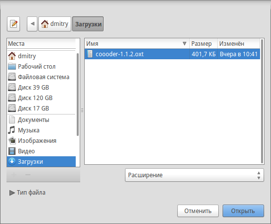
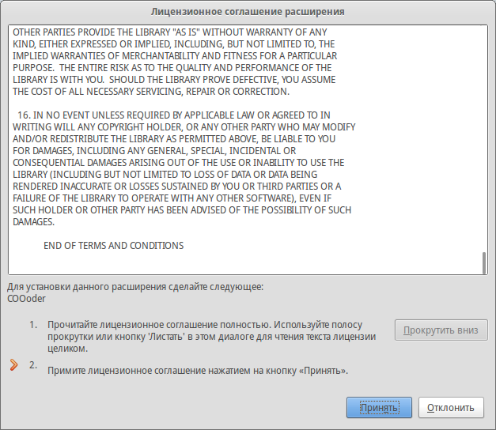

.. meta::
   :description: Краткое руководство по LibreOffice: Глава 14 – Дополнительная настройка LibreOffice
   :keywords: LibreOffice, Writer, Impress, Calc, Math, Base, Draw, либреоффис, Предисловие

.. _Customizing-LibreOffice:

Глава 14 – Дополнительная настройка LibreOffice
===============================================

Эта глава описывает некоторые дополнительные настройки LibreOffice.

Можно настраивать под себя меню, панели инструментов и сочетания клавиш LibreOffice, добавлять новые меню и панели инструментов и назначить макросы на события. При этом контекстные меню настраивать нельзя.

Множество других настроек можно легко сделать при помощи расширений, которые можно установить с сайта LibreOffice или из других источников.

.. note:: Настройки для меню и панелей инструментов могут быть сохранены в шаблоне. Для этого сначала сохраните их в документе, а затем сохраните документ в качестве шаблона, как описано в *Главе 3 – Использование стилей и шаблонов*.

Настройка содержимого меню
--------------------------

В дополнение к изменению шрифта меню (описано в :ref:`Setting-up-LibreOffice`), можно добавлять и изменять категории в строке меню, добавлять команды в меню и вносить другие изменения. 
Для настройки меню:

1. Выберите пункт меню :menuselection:`Сервис --> Настройка`.
2. В диалоге *Настройка* выберите вкладку *Меню*.

.. _ch14-lo-screen-001:

.. figure:: _static/chapter14/ch14-lo-screen-001.png
    :scale: 50%
    :align: center
    :alt: Диалог Настройка. Вкладка Меню

    Диалог *Настройка*. Вкладка *Меню*

3. В выпадающем списке *Сохранить* в выберите, следует ли сохранить изменения меню для всего приложения (например, LibreOffice Writer) или только для выбранного документа (например, ``Ваш_файл.odt``). 
4. В разделе Меню LibreOffice [имя компонента (на рисунке выше это Writer)] выберите из выпадающего списка *Меню* название меню, которое необходимо настроить. Список содержит все основные меню, а также подменю (меню, которые содержатся в другом меню). Например, в дополнение к основным меню *Файл*, *Правка*, *Вид* и так далее, есть подменю *Файл | Отправить и Правка | Изменения*. Команды, доступные для выбранного меню, показаны в центральной части диалога. 
5. Чтобы настроить выбранный пункт меню, нажмите на кнопку *Изменить*. Также можно добавить команды в меню, нажав на кнопку *Добавить*. Эти действия описаны в последующих разделах. Используйте стрелки вверх и вниз рядом со списком элементов меню, чтобы переместить выбранный пункт меню в другое место. 
6. После завершения настроек нажмите кнопку *ОК* (не показана на рисунке выше), чтобы сохранить изменения.

Создание нового меню
~~~~~~~~~~~~~~~~~~~~

На вкладке *Меню* диалога *Настройка* нажмите на кнопку *Создать*, чтобы открыть диалог *Новое меню,* показанный.

1. Введите название для нового меню в соответствующем поле.
2. Используйте стрелки вверх и вниз, чтобы перемещать новое меню в желаемое положение в строке меню.
3. Нажмите кнопку *OK* для сохранения.

Новое меню станет доступно в списке меню в диалоге Настройки. (В самой строке меню новое меню появится после сохранения настроек.)

После создания нового меню в него необходимо добавить какие-либо команды, как это описано в разделе `Добавление команды в меню`_.

.. _ch14-lo-screen-002:

    Добавление нового меню

Изменение существующего меню
~~~~~~~~~~~~~~~~~~~~~~~~~~~~

Чтобы изменить стандартное или добавленное пользователем меню, выберите его в списке *Меню*, затем нажмите справа кнопку *Меню*, откроется выпадающий список со следующими вариантами действий: *Переместить*, *Переименовать*, *Удалить*. Не все из этих действий могут быть применены к некоторым записям в списке *Меню*. Например, команда *Переименовать* и *Удалить* не доступны для стандартных меню из поставки LibreOffice, а *Переместить* не доступна для подменю.

Чтобы переместить меню (например, *Файл*), выберите в выпадающем списке вариант *Переместить*. Откроется диалог, аналогичный показанному на рисунке 2 (только без поля для ввода названия меню). Используйте стрелки вверх и вниз для перемещения меню на необходимую позицию.

Чтобы переместить подменю (например, *Файл | Отправить*), выберите главное меню *Файл* в выпадающем списке *Меню*, затем в списке элементов меню выделите подменю *Отправить* и, используя стрелки вверх и вниз рядом со списком элементов, переместите подменю

Помимо переименования, можно в имени пользовательского меню выделить букву, которая будет подчеркнута, и будет использоваться в качестве ярлыка, что позволит выбрать это меню, нажав `Alt + эту букву` (например, :menuselection:`&Файл`). В существующих подменю также можно изменить такую букву. 

1. Выберите пользовательское меню или подменю в выпадающем списке *Меню*.
2. Нажмите на кнопку *Меню* и выберите *Переименовать*.
3. Добавьте тильду (`~`) перед буквой, которую вы хотите использовать в качестве ярлыка. Например, чтобы выбрать команду *Отправить* нажатием сочетания клавиш  ``Alt + О``, введите *~Отправить*. Если хотите назначить букву *Т*, то введите *О~тправить*.

.. note:: Можно использовать любые буквы в качестве ярлыков, даже уже используемые в командах меню. Тем не менее, желательно использовать неиспользуемые буквы, если это возможно, для упрощения использования функции.

Добавление команды в меню
~~~~~~~~~~~~~~~~~~~~~~~~~

Команды можно добавлять, как в стандартные существующие меню, так и в меню, созданные пользователем. В диалоге *Настройка* выберите нужное меню из списка *Меню* и нажмите кнопку *Добавить*.

В диалоге *Добавить команды*, выберите нужную категорию и команду, и нажмите кнопку *Добавить*. Диалог останется открытым, так что можно добавить еще команды. После завершения добавления команд нажмите кнопку *Закрыть*. В диалоге *Настройка* добавленные команды можно перемещать кнопками вверх и вниз на необходимые места в меню.

.. _ch14-lo-screen-003:

    Добавление команды в меню

Изменение элементов меню
~~~~~~~~~~~~~~~~~~~~~~~~

В дополнение к изменению последовательности элементов в меню или в подменю, можно добавлять подменю, переименовывать или удалять элементы, а также добавлять разделители групп. 

Для начала выберите изменяемое меню или подменю из списка меню в диалоге *Настройка*, а затем выберите запись в списке элементов. Нажмите кнопку *Изменить* и выберите нужное действие из выпадающего списка действий.
Пункт списка *Добавить разделитель* добавляет разделительную линию после выделенного элемента. 

------------

Настройка панелей инструментов
-------------------------------

Настраивать панели инструментов можно в нескольких направлениях, в том числе можно выбирать, какие значки отображать на панелях, и закреплять положение панели инструментов (как описано в :ref:`Introducing-LibreOffice`), добавлять или удалять значки (команды) на панели инструментов. Также можно создавать новые панели инструментов. В этом разделе описывается, как создавать новую панель инструментов и добавлять или удалять значки на уже существующих.

Чтобы открыть диалог настройки панели инструментов выполните одно из следующих действий:

* Нажмите правой кнопкой мыши на панели инструментов и выберите пункт контекстного меню *Настройка панели инструментов*.
* Выберите пункт меню :menuselection:`Вид --> Панели инструментов --> Настройка`.
* Выберите пункт меню :menuselection:`Сервис --> Настройка` и перейдите на вкладку *Панели инструментов*.

.. _ch14-lo-screen-004:

    Диалог *Настройка*. Вкладка *Панели инструментов*

Изменение существующих панелей инструментов
~~~~~~~~~~~~~~~~~~~~~~~~~~~~~~~~~~~~~~~~~~~

Чтобы изменить существующую панель инструментов:

1. В выпадающем списке *Сохранить* в выберите, где сохранять изменения панели инструментов: в приложении (например, Writer) или в выбранном документе.
2. В разделе Панели инструментов LibreOffice [название программы (например: Writer)] выберите из выпадающего списка панель инструментов, которую нужно настроить.
3. Нажмите справа кнопку *Панель инструментов* или *Изменить*, или добавьте команды на панель инструментов, нажав кнопку *Добавить*. Также можно создать новую панель инструментов, используя кнопку *Создать*. Эти действия описаны в разделах ниже.
4. После завершения изменений нажмите кнопку *OK *для сохранения настроек.

Создание новой панели инструментов
~~~~~~~~~~~~~~~~~~~~~~~~~~~~~~~~~~

Чтобы создать новую панель инструментов:

1. Выберите пункт меню :menuselection:`С&ервис --> &Настройка` и перейдите на вкладку *Панели инструментов*.
2. Нажмите кнопку *Создать*. В открывшемся диалоге *Название* введите имя для новой панели инструментов и выберите в выпадающем списке, где её сохранить. Нажмите кнопку *OK*.

Новая панель будет показана в списке панелей инструментов в диалоговом окне *Настройка*. После создания новой панели инструментов нужно добавить на неё некоторые команды, как описано ниже.

Добавление команд на панель инструментов
~~~~~~~~~~~~~~~~~~~~~~~~~~~~~~~~~~~~~~~~

Если список доступных значков для панели инструментов не включает в себя необходимые команды, то нужные команды можно добавить. При создании новой панели инструментов необходимо добавить к ней команды. 

1. На вкладке *Панели инструментов* в диалоге *Настройка* выберите нужную панель из выпадающего списка и нажмите справа кнопку *Добавить*.
2. Диалог *Добавить команды* для панелей инструментов выглядит так же, как при добавлении команд в меню. Выберите категорию, а затем команду и нажмите кнопку *Добавить*. Окно останется открытым, так что можно будет выбрать несколько команд. Когда закончите добавление команд, нажмите кнопку *Закрыть*. Если вставить элемент, не имеющий соответствующего значка, на панели инструментов будет отображаться полное имя элемента. В следующем разделе описывается, как задать значок для команды панели инструментов. 
3. После возврата в диалог *Настройка* можно кнопками вверх и вниз перемещать команды на панели инструментов.
4. После завершения настройки нажмите кнопку *OK* для сохранения настроек.

Выбор значков для команд на панелях инструментов
~~~~~~~~~~~~~~~~~~~~~~~~~~~~~~~~~~~~~~~~~~~~~~~~

Кнопки на панели инструментов – это, как правило, значки, а не названия команд, однако не все команды имеют связанные с ними значки.

Чтобы выбрать значок для команды панели инструментов, выберите команду в списке элементов и нажмите кнопку *Изменить* и выберите пункт выпадающего списка *Выбрать значок*. В диалоговом окне *Изменить значок* можно просмотреть доступные значки. Выберите один из них и нажмите кнопку *ОК*, чтобы назначить его команде.

.. _ch14-lo-screen-005:

    Диалог *Изменить значок*

Чтобы использовать собственный значок для команды, создайте его в графическом редакторе и импортируйте его в LibreOffice, нажав на кнопку *Добавить* в диалоговом окне *Изменить значок*. Пользовательские значки должны быть размером 16х16 пикселей для достижения наилучшего качества и не должны содержать более 256 цветов. 

Пример: Добавление значка Факс на панель инструментов
"""""""""""""""""""""""""""""""""""""""""""""""""""""

Можно настроить LibreOffice так, чтобы одним щелчком мыши на значке автоматически отправлять текущий документ, как факс.

1. Проверьте, что драйвер факса установлен. Для получения дополнительной информации обратитесь к документации факс-модема. 
2. Выберите пункт меню :menuselection:`С&ервис --> &Параметры --> LibreOffice Writer --> Печать`. 
3. Выберите драйвер факса из списка *Факс* и нажмите *ОК*.
4. Нажмите правой кнопкой мыши на *Стандартной панели инструментов*. Выберите в контекстном меню пункт *Настройка панели инструментов*. Откроется вкладка *Панели инструментов* и в диалоге *Настройка*. Нажмите кнопку *Добавить*.
5. В диалоге *Добавить команды*  выберите в списке *Категория* пункт *Документы*, затем выберите пункт *Отправить факс* в списке *Команды*. Нажмите кнопку *Добавить*. Теперь можно увидеть новый значок в списке *Команды* для панели инструментов *Стандартная*. 
6. В списке *Команды* нажимайте кнопки вверх и вниз, чтобы поместить новый значок в необходимое положение на панели. Нажмите *OK* и затем *Закрыть*.

На панели инструментов теперь есть новый значок для отправки текущего документа по факсу. 

Назначение сочетаний клавиш для выполнения действий
---------------------------------------------------

Дополнение к используемым по умолчанию сочетаниям клавиш (перечислены в :ref:`KeyboardShortcuts`) можно определить свои сочетания. Можно назначить сочетания клавиш на стандартные функции LibreOffice или на свои макросы и сохранить их для использования во всем пакете LibreOffice.

.. warning:: Будьте осторожны при переназначении предопределенных сочетаний клавиш операционной системы или LibreOffice. Многие клавиши универсальны, такие, как клавиша ``F1`` для вызова справки, и они всегда должны предоставлять определенные результаты. Хотя можно легко сбросить сочетания клавиш заданные в LibreOffice на значения по умолчанию, изменение некоторых общих сочетаний клавиш может вызвать путаницу при использовании компьютера.

Для адаптации сочетания клавиш под ваши нужды, используйте диалоговое окно *Настройка*, как описано ниже.
 
1. Выберите пункт меню :menuselection:`С&ервис --> &Настройка`, выберите вкладку *Клавиатура*.
2. Для того, чтобы назначенные сочетания клавиш были доступны во всех компонентах LibreOffice, в правом верхнем углу диалога выберите вариант LibreOffice. 
3. Далее выберите необходимую функцию из списков *Категория* и *Команда*.
4. Теперь выберите желаемое сочетание клавиш из списка *Комбинации клавиш* и нажмите кнопку *Назначить*.
5. Нажмите *OK*, чтобы применить изменения. Теперь при нажатии выбранного сочетания клавиш будет выполнена функция, выбранная в шаге 3 выше. 

.. note:: Все существующие сочетания клавиш для выбранной в данный момент функции перечислены в окне выбора клавиш. Если список *Клавиши* пуст, это означает, что сочетание клавиш для этой функции не назначено. Если это не так, но вы хотите переназначить сочетание клавиш на новое, то необходимо сначала удалить существующее сочетание из списка *Клавиши*.

    Сочетания клавиш, которые выделены серым цветом в списке в диалоговом окне *Настройка*, такие как ``F1`` и ``F10``, недоступны для переназначения.

Пример: Назначение сочетаний клавиш для применения стилей
"""""""""""""""""""""""""""""""""""""""""""""""""""""""""

Можно настроить сочетания клавиш для быстрого применения стилей в документе. Некоторые сочетания уже существуют, например, ``Ctrl + 0`` для стиля *Основной текст*, ``Ctrl + 1`` для стиля *Заголовок1* и ``Ctrl + 2`` для *Заголовок2*. Можно изменить эти сочетания и создать свои собственные. 

1. Выберите пункт меню :menuselection:`Сервис --> Настройка`, выберите вкладку *Клавиатура*.
2. Для того, чтобы назначенное сочетание клавиш было доступно только для одного компонента (например, Writer), выберите имя этого компонента в верхнем правом углу страницы, в противном случае выберите вариант LibreOffice, чтобы сделать сочетание доступным для каждого компонента. 
3. Выберите сочетание клавиш, которое хотите назначить на применение стиля. В нашем примере это будет ``Ctrl+9``. Кнопка *Назначить* станет доступной.
4. В разделе *Команды* внизу диалога пролистайте список *Категория* вниз до пункта *Стили*. Нажмите на плюс (``+``) или маленький треугольник слева от пункта, чтобы раскрыть список стилей.
5. Выберите категорию стилей (В этом примере используйте стили абзаца, но можно выбрать и любые другие стили). В списке *Категория* будут показаны все доступные стили.
6. Чтобы назначить сочетание ``Ctrl+9`` для стиля *Нумерованный список 1*, выберите его в списке *Команда* и затем нажмите кнопку *Назначить*. Сочетание клавиш ``Ctrl+9`` теперь появилось в списке *Клавиши* внизу справа, и подпись *Нумерованный список 1* появится справа от ``Ctrl+9`` в поле *Комбинации клавиш* в верхней части диалога.
7. Внесите другие необходимые изменения, а затем нажмите *OK*, чтобы сохранить настройки и закрыть диалоговое окно. 

.. _ch14-lo-screen-006:

    Назначение сочетания клавиш для применения стилей

Сохранение изменений комбинаций клавиш в файл
~~~~~~~~~~~~~~~~~~~~~~~~~~~~~~~~~~~~~~~~~~~~~

Изменения в назначенных комбинациях клавиш могут быть сохранены в файле конфигурации клавиатуры для использования в более позднее время, что позволяет создавать и применять различные конфигурации по мере необходимости. Чтобы сохранить настройки сочетания клавиш в файле:

1. После назначения сочетаний клавиш нажмите кнопку *Сохранить* в правой части диалога (рисунок 6).
2. В диалоге *Сохранить* настройки клавиатуры выберите из списка тип файла Все файлы.
3. Далее введите имя для конфигурационного файла в поле *Имя файла* или найдите и  выберите существующий файл из списка.
4. Нажмите *Сохранить*. При попытке переписать существующий файл появится диалоговое окно с подтверждением перезаписи, в противном случае файл просто будет сохранен.

Загрузка сохранённого файла конфигурации
~~~~~~~~~~~~~~~~~~~~~~~~~~~~~~~~~~~~~~~~

Для загрузки сохраненного файла конфигурации и замены существующей конфигурации, нажмите кнопку *Загрузить* в правой части диалогового окна *Настройка*, а затем выберите файл конфигурации в диалоговом окне *Загрузить настройки клавиатуры*. 

Сброс настроек сочетаний клавиш
~~~~~~~~~~~~~~~~~~~~~~~~~~~~~~~

Чтобы сбросить все сочетания клавиш к значениям по умолчанию, нажмите кнопку *Восстановить* в нижнем правом углу диалогового окна *Настройка*. Используйте эту функцию с осторожностью, поскольку при этом не будет показано никакого окна для подтверждения сброса. В значения по умолчанию будут установлены все сочетания без дополнительного уведомления.

Назначение макроса на событие
------------------------------

Когда что-то происходит в LibreOffice, то мы говорим, что произошло событие. Например, был открыт документ, была нажата клавиша или переместился курсор мыши. Можно связать макрос с событием так, что макрос будет запускаться, когда происходит событие. Распространено назначение макроса на событие *Открытие документа*, который выполняет определенные задачи при открытии документа в LibreOffice.

Чтобы назначить макрос на событие используйте вкладку *События* в диалоге *Настройка*. Более подробно это описано в *Главе 13* данного руководства.

---------------

Добавление функциональности, используя расширения
-------------------------------------------------

Расширение — это модуль, который может быть установлен в LibreOffice, позволяющий расширить его функционал. Официальный репозиторий расширений находится на http://extensions.libreoffice.org. Эти расширения являются бесплатными.

Некоторые расширения из сторонних источников бесплатны. Другие доступны за отдельную плату. Проверьте описание расширений, чтобы увидеть их лицензии и размер платы. 

Установка расширений
~~~~~~~~~~~~~~~~~~~~

Для установки расширения:

1. Скачайте, интересующее Вас расширение из репозитория и сохраните его на компьютере;
2. Откройте LibreOffice и перейдите в :menuselection:`Сервис --> Управление расширениями`;

.. _ch14-lo-screen-007:

    :menuselection:`Сервис --> Управление расширениями`

3. В диалоговом окне *Управление расширениями* нажмите кнопку *Добавить*;

.. _ch14-lo-screen-008:

    Диалоговое окно *Управление расширениями*

4. В диалоговом окне *Добавить расширение* найдите файл с загруженным расширением. Расширения LibreOffice имеют формат ``OXT``;

.. _ch14-lo-screen-009:

    Диалоговое окно выбора расширения для установки
    
5. Выберите расширение, которое надо установить и нажмите кнопку *Открыть*;

6. Если это расширение уже установлено, появится диалоговое окно, в котором будет предложено подтвердить перезапись текущей версии расширения на новую. Для прерывания установки нажмите кнопку *Отмена*, для продолжения нажмите кнопку *Да*;

.. _ch14-lo-screen-010:

    Подтверждение или отмена переустановки расширения

7) Далее появится диалоговое окно, в котором будет предложено установить расширение *Только для меня* или *Для всех пользователей*. В случае установки расширения *Только для меня*, оно устанавливается в профиль пользователя и другие пользователи не имеют доступ к нему. Для установки расширения *Для всех пользователей*, необходимо иметь права администратора. В этом случае расширение устанавливается в системную папку LibreOffice и доступно всем пользователям;

.. _ch14-lo-screen-011:

    Установка расширения для всех пользователь или только для текущего
    
8. Затем появится диалоговое окно подтверждения лицензионного соглашения;

.. _ch14-lo-screen-012:

    Подтверждение лицензионного соглашения

9. Используйте полосу прокрутки или кнопку *Прокрутить вниз* для чтения текста лицензии. В конце текста лицензии кнопка *Принять* станет доступна;
10. Для перехода к установке, нажмите кнопку *Принять*;
11. После завершения установки, расширение появится в списке диалогового окна *Управления расширениями*.

.. _ch14-lo-screen-013:

    Диалог *Управление расширениями*
    
Для завершения установки, нажмите кнопку *Закрыть* и выйдите из LibreOffice, в том числе из режима быстрого запуска. Если режим быстрого запуска включен, его иконка находится на панели программ и может быть закрыта с помощью правой кнопки мыши.
При следующем запуске LibreOffice, расширение станет доступно.

.. _ch14-lo-screen-014:

    Панель инструментов расширения COOoder

Некоторые популярные расширения
~~~~~~~~~~~~~~~~~~~~~~~~~~~~~~~

В этом разделе перечислены некоторые из наиболее популярных расширений LibreOffice. Часть из них установлена по умолчанию. Все перечисленные расширения имеют открытый исходный код и распространяются бесплатно.

Pager
"""""

Плагин, который добавляет во вкладку *Вставка* пункт *Номера страниц*. Этот пункт вызывает диалоговое окно *Вставить номера страниц*, которое позволяет легко управлять нумерацией. В том числе, с его помощью можно убрать нумерацию на первой странице.

.. _ch14-lo-screen-006:

    Диалоговое окно плагина Pager
    
COOoder
"""""""

Добавляет функцию подсветки синтаксиса для языков программирования. Используется для приведения в документе примеров кода.

AltSearch
"""""""""

Альтернативный диалог *Поиска и замены*, поддерживает расширенный набор регулярных выражений поиска и замены.

CyrillicTools
"""""""""""""

Расширение для работы с кириллическим текстом, когда при открытии в LibreOffice документов в ``doc`` и ``xls`` старых форматов (созданных в MS Office 97 и ранее) набранный кириллицей текст оказывается нечитаемым.
Расширение представляет собой набор макросов, решающих две основные задачи:

* Перекодировка латиницы в кириллицу (Writer и Calc);
* Генерирование суммы прописью (Calc).

LanguageTool
""""""""""""

Расширение для проверки грамматики. Может работать как расширение OpenOffice.org и LibreOffice. Реализована возможность проверки для русского, английского, немецкого, польского и других языков.

OOoFBTools
""""""""""

Кроссплатформенное расширение предназначенное для конвертации документов из форматов, поддерживаемых OpenOffice.org Writer в формат FictionBook2. 

PDF Import
""""""""""

Позволяет вносить незначительные изменения в текст существующих PDF файлов, при отсутствии исходного файла.  После установки расширения, в диалоговом окне :menuselection:`Файл --> Открыть`, в выпадающем списке выбора типа файла, появляется пункт PDF. 

Наилучшие результаты достигаются с PDF файлами, созданными из ODF документов. Гибридные PDF/ODF файлы будут открываться в LibreOffice как файл ODF без изменения структуры. 

Не гибридные PDF документы открываются в Draw. Возможность вносить изменения и сохранять такие документы, зависит от сложности структуры PDF файла.  Может сбиться структура документа или произойти замена шрифтов. 

Документы с более сложной структурой, которые создаются в профессиональных издательских приложениях, использующих специальные шрифты и сложную векторную графику, не подходят для расширения PDF Import. Кроме того, импорт больших документов может привести к проблемам с производительностью. 

Presenter Console
"""""""""""""""""

Обеспечивает дополнительный контроль при просмотре презентаций в Impress. Например, ведущий может видеть текущий слайд, следующий слайд, заметки к слайду и таймер презентации, а зритель видит только текущий слайд. 

Presenter Console отображает элементы в трех режимах просмотра:

* Первый режим отображает текущий слайд и следующий;
* Второй режим показывает заметки к слайду(имеется возможность изменять масштаб заметок), а также текущий и предстоящий слайд;
* Третий режим показывает все слайды в виде миниатюр.

.. note:: Presenter Console работает только в операционных системах, которые поддерживают несколько мониторов.

Report Builder
""""""""""""""

Создает профессиональные базы данных отчетов в Base. Вы можете определить группы и заголовки страниц, нижние колонтитулы, а также параметры полей.  И экспортировать отчеты в формате PDF или ODF, или отправлять их в виде вложений электронной почты.

Professional Template Pack II
"""""""""""""""""""""""""""""

Содержит более 120 шаблонов для Writer, Calc и Impress. Расширение доступно на нескольких языках. После установки, шаблоны располагаются в :menuselection:`Файл --> Создать --> Шаблоны и документы`.

Template Changer (для Writer)
"""""""""""""""""""""""""""""

Добавляет два новых пункта в меню :menuselection:`Файл --> Шаблоны` в Writer, которые позволяют назначить новый шаблон для текущего документа или папки документов. Все стили и форматирование будут загружаться из этого шаблона и документ будет выглядеть так, будто он был создан с помощью этого шаблона.

Solver for Nonlinear Programming (для Calc)
"""""""""""""""""""""""""""""""""""""""""""

Calc выпускается с движком решающей программы только для линейного программирования. Это расширение добавляет решающие программы, применимые для решения как линейных, так и нелинейных задач.

* DEPS – Дифференциальная эволюция и Метод роя частиц;
* SCO – Оптимизация социального познания.

DataPilot Tools для Calc
""""""""""""""""""""""""

Добавляет некоторые вспомогательные функции, которые облегчают работу с Calc DataPilot:

* Показать текущий диапазон исходных данных для DataPilot;
* Изменить диапазон исходных данных для DataPilot;
* Обновить все DataPilots на текущем листе.
