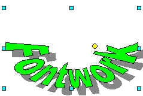

.. meta::
   :description: Краткое руководство по LibreOffice: Глава 11 – Галерея, Графика и Текстовые эффекты
   :keywords: LibreOffice, Writer, Impress, Calc, Math, Base, Draw, либреоффис

.. Список автозамен

.. |br| raw:: html

    

.. _Graphics-the-Gallery-and-Fontwork:

Глава 11 – Галерея, Графика и Текстовые эффекты
================================================

В документы LibreOffice можно добавлять различные графические файлы и изображения, включая фотографии, рисунки, сканированные изображения и другие. LibreOffice может импортировать различные векторные и растровые форматы файлов. Наиболее часто используемые графические форматы – GIF, JPG, PNG и BMP. Смотрите *Приложение B* для ознакомления с полным списком графических форматов, которые может импортировать LibreOffice. 

Графика в LibreOffice бывает трех основных типов:

* Файлы изображений, такие как: фотографии, рисунки и сканированные изображения;
* Диаграммы, созданные с помощью инструментов рисования LibreOffice;
* Диаграммы, созданные с помощью компонента Chart в LibreOffice.

В этой главе рассматриваются изображения и диаграммы.

Более подробное описание по работе с инструментами рисования можно найти в *Руководстве по Draw* и в *Руководстве по Impress*. Как создавать диаграммы, описано в *Руководстве по Calc*.

.. note:: Также примеры по созданию диаграмм приведены в блоге `Информатика в экономике и управлении <http://infineconomics.blogspot.ru/>`_

Добавление изображений в документ
----------------------------------

Изображения могут быть добавлены в документ несколькими способами: путем вставки  изображения непосредственно из программы обработки графики или со сканера, из файла, сохраненного на компьютере, копированием и вставкой изображения из иного источника.

Вставка файла изображения
~~~~~~~~~~~~~~~~~~~~~~~~~

Если изображение представляет из себя файл, хранящийся в компьютере, можно вставить его в документ LibreOffice, используя один из следующих методов:

Перетаскивание
""""""""""""""""""""""""""""""

1) Откройте файловый менеджер и найдите нужный файл изображения.
2) Перетащите изображение из файлового браузера в документ LibreOffice и поместите его в нужное место документа. Тонкая вертикальная линия отмечает место, куда будет вставлено изображение.

Этот метод встраивает (копирует) файл изображения в документ. Чтобы связать файл изображения с документом вместо встраивания, удерживайте нажатыми клавиши ``Shift+Ctrl`` при перетаскивании файла изображения. 

Диалог Вставить изображение
""""""""""""""""""""""""""""""

1) Нажмите мышкой в документе LibreOffice, в месте, куда нужно вставить изображение.
2) Выберите пункт меню :menuselection:`Вставка --> Изображение --> Из файла`.
3) В открывшемся диалоге найдите нужный файл с изображением и выберите его. В нижней части диалога (рисунок ниже) доступна опция *Связь*. О том, как использовать эту опцию, смотрите раздел `Связывание с файлом изображения`.
4) Нажмите кнопку *Открыть*.

.. _ch11-lo-screen-001:

    Диалог *Вставить изображение*

.. note:: Если выбрать опцию *Связь*, то, после нажатия на кнопку *Открыть*, появится окно с сообщением. В нём будет сказано, что изображение не сохранится в документе, а вместо этого в документе будет только ссылка на изображение. Будет задан вопрос о встраивании изображения вместо ссылки. Нажмите на кнопку *Оставить связь*, если вы хотите, чтобы в документ была вставлена связь, или нажмите на кнопку *Внедрить изображение*, если передумали. Чтобы в дальнейшем это сообщение не отображалось, снимите флажок *Подтверждать связывание изображений* в нижней части сообщения. 

Связывание с файлом изображения
~~~~~~~~~~~~~~~~~~~~~~~~~~~~~~~

Если в диалоге *Вставить изображение* была выбрана опция *Связь*, LibreOffice создаст ссылку на файл с изображением вместо сохранения копии изображения в документе. В результате изображение будет отображено в документе, но при сохранении документа в нём будет содержаться только ссылка на файл с изображением, а не само изображение. Документ и изображение остаются в виде двух отдельных файлов, они объединяются вместе только, когда документ будет открыт еще раз.

Связывание с изображением имеет два преимущества и один недостаток: 

* Преимущество №1 – Связывание уменьшает размер документа при его сохранении, так как сам файл изображения в документе не содержится. Размер файла, как правило, не проблема для современного компьютера с разумным количеством памяти, если документ не содержит очень большого количества графических файлов; тем не менее LibreOffice может работать с довольно большими файлами документов.

* Преимущество №2 – Можно изменять сам файл изображения отдельно, не затрагивая документ, поскольку ссылка на файл остается без изменений, а измененное изображение будет отображено в документе при следующем его открытии. Это может быть большим преимуществом, если вы (или кто-то другой, скажем, художник) часто обновляете изображения.

* Недостаток – Если послать документ кому-то еще или переместить его на другой компьютер, необходимо будет отправить следом файлы изображений, иначе получатель не сможет увидеть связанные изображения. Нужно следить за расположением изображений и проверять, что при открытии документа изображения будут отображаться. Например, можно сохранить изображения в подкаталог *Images* (относительно расположения самого документа); получателю документа необходимо будет поместить соответствующие изображения в каталоге с тем же именем и в том же месте относительно документа.

.. note:: При вставке в документ одного и того же изображения несколько раз, казалось бы, выгодно выбирать *Связь*, а не встраивание изображения. Однако, это не так. LibreOffice встраивает только один экземпляр файла изображения в документ вне зависимости от количества вставок.

Встраивание связанных изображений в документ
""""""""""""""""""""""""""""""""""""""""""""""""""""""""""""

Если вы сделали связь с изображением в документе, то позже вы можете легко внедрить изображение по одной или нескольким связям. Для этого:

1) Откройте документ в LibreOffice и выберите пункт меню :menuselection:`Правка --> Связи`.
2) В диалоге *Редактирование связей* (рисунок ниже) показаны все связанные с документом файлы. В списке *Исходный файл* выберите файлы, которые вы хотите изменить из связанных на внедрённые. 
3) Нажмите кнопку *Разорвать связь*.
4) Сохраните документ.

.. _ch11-lo-screen-002:

.. figure:: _static/chapter11/ch11-lo-screen-002.png
    :scale: 40%
    :align: center
    :alt: Диалог Редактирование связей

    Диалог *Редактирование связей*

.. note:: Обратная операция (из встроенных в связанные) выполняется не так просто. Необходимо будет удалить все встроенные изображения и вставлять их обратно в документ по одному, выбирая опцию Связь.

Вставка изображения из буфера обмена
~~~~~~~~~~~~~~~~~~~~~~~~~~~~~~~~~~~~

Используя буфер обмена, можно вставить изображение в документ LibreOffice из другого документа LibreOffice или из других программ. Для этого: 

1) Откройте оба документа, источник изображения и файл, куда нужно вставить изображение.
2) В документе-источнике выделите изображение, нажав на него мышкой.
3) Нажмите сочетание клавиш ``Ctrl+C``, чтобы скопировать изображение в буфер обмена.
4) Перейдите ко второму документу, в который нужно вставить изображение.
5) Нажмите мышкой в том месте документа, куда требуется вставить изображение.
6) Нажмите сочетание клавиш ``Ctrl+V``, для вставки изображения.

.. tip:: Если приложение, из которого было скопировано изображение, будет закрыто до вставки изображения в целевой документ, изображение в буфере обмена может быть потеряно. 

Вставка изображения со сканера
~~~~~~~~~~~~~~~~~~~~~~~~~~~~~~~~~~~~

Если сканер подключен к компьютеру, LibreOffice может вызвать приложение для сканирования и затем вставить результат сканирования в документ в виде изображения. Чтобы начать эту процедуру, поместите курсор в нужное место документа и выберите пункт меню :menuselection:`Вставка --> Изображение --> Сканировать --> Выбрать источник`. 

Хотя этот метод позволяет быстро и легко получить изображение, вряд ли можно сразу со сканера получить высококачественное изображение нужного размера. Можно получить лучшие результаты, обработав отсканированный материал в графическом редакторе, прежде чем вставлять это изображение в LibreOffice. 

Вставка изображения из Галереи
~~~~~~~~~~~~~~~~~~~~~~~~~~~~~~~~~~~~

Галерея представляет удобный способ для группировки многократно используемых объектов, таких, как графика и звуки, которые можно вставлять в документы. Галерея доступна во всех компонентах LibreOffice. Смотрите раздел `Управление Галереей в LibreOffice`. Можно скопировать объект из галереи в документ или связать объект из галереи с документом. 

Чтобы вставить объект:

1) Выберите пункт меню :menuselection:`Сервис --> Галерея` или нажмите на значок *Галерея* |ch11-lo-screen-003.png| на стандартной панели инструментов (в Writer и Calc), или на панели инструментов *Рисование* (в Impress, Writer и Draw). Галерея также доступна из *Боковой панели* (выберите пункт меню :menuselection:`Вид --> Боковая панель` и нажмите по значку *Галерея*).
2) Выберите тему.
3) Выберите объект одним щелчком мыши.
4) Перетащите изображение в документ.

.. |ch11-lo-screen-003.png| image:: _static/chapter11/ch11-lo-screen-003.png
        :scale: 70% 

После этого в верхней части окна программы панель инструментов *Врезка* заменит собой панель инструментов *Форматирование*, а в нижней части окна программы появится прикрепленная к статусной строке панель инструментов *Изображение*, используя которые можно отредактировать вставленный из *Галереи* объект.

Чтобы вставить объект, как связь:

1) Выберите пункт меню :menuselection:`Сервис --> Галерея` и выберите тему.
2) Выберите объект с помощью однократного нажатия левой кнопкой мыши, а затем, удерживая нажатыми сочетание клавиш ``Shift+Ctrl``, перетащите объект в документ. 

Вставка изображения из Галереи, как фона
~~~~~~~~~~~~~~~~~~~~~~~~~~~~~~~~~~~~~~~~~~

Чтобы вставить изображение в качестве фона страницы или абзаца: 

1) Выберите пункт меню :menuselection:`Сервис --> Галерея` и выберите тему.
2) Выберите объект с помощью одного нажатия мышью, нажмите на него правой кнопкой мыши и выберите пункт контекстного меню :menuselection:`Вставить фоном --> Страница или Абзац`.

.. note:: Пример использования *Галереи* смотрите в статье `LibreOffice: Подложка или как сделать надпись Образец (Водяной знак) <http://librerussia.blogspot.ru/2014/11/libreoffice_2.html>`_.

-------

Модификация и позиционирование графических объектов
----------------------------------------------------

В LibreOffice есть множество инструментов для изменения размера, модификации, фильтрации и позиционирования графических объектов, настройки обтекания текста вокруг графических объектов, использование графических объектов в качестве фона и в качестве водяных знаков. Эти инструменты описаны в соответствующих главах других руководств. Сложные модификации графических объектов лучше всего делать в специализированных программах для работы с изображениями и потом результаты вставлять в LibreOffice. 

.. _ch11-lo-screen-004:

    Копирование графического объекта из *Галереи* в документ (Ручка позволяет скрыть/отобразить Галерею)

Управление Галереей в LibreOffice
---------------------------------

Графические объекты в *Галерее* сгруппированы по темам, таким как *Маркеры*, *Символы* и *Фоны*. Можно создать другие группы или темы и добавить свои собственные изображения или найти расширения, содержащие дополнительную графики.

В *Галерее*, в списке слева перечисляются доступные темы. Нажмите на тему, чтобы просмотреть её содержимое в окне *Галереи*. 

Можно просматривать *Галерею* в виде значков или в детализированном виде, также можно временно скрыть *Галерею*, нажав на кнопку *Скрыть*.

По умолчанию *Галерея* прикреплена над рабочей областью, если она не открыта в боковой панели, в этом случае *Галерея* расположена вертикально в правой части окна программы. Для увеличения области просмотра *Галереи*, поместите курсор мыши над линией, которая отделяет её от рабочей области. Когда курсор изменит форму на две параллельные линии со стрелками, зажмите левую кнопку мыши и перетащите границу на нужное расстояние.

Как и другие прикреплённые окна, *Галерею* можно открепить, поместив курсор мыши над краем окна *Галерея*, и, удерживая нажатой клавишу ``Ctrl``, дважды нажав по краю. Перетащите откреплённое окно *Галерея* к любому из краёв окна LibreOffice, чтобы снова прикрепить *Галерею*.

.. _ch11-lo-screen-005:

    Просмотр *Галереи* в виде значков
    

Добавление объектов в Галерею
~~~~~~~~~~~~~~~~~~~~~~~~~~~~~~~~~~~~~

В *Галерею* можно добавить свои часто используемые изображения, например, логотип компании. В дальнейшем такие изображения очень легко вставлять в документы.

**Метод 1 (выбор файлов)**

1) Нажмите правой кнопкой мыши на нужной теме и выберите пункт *Свойства* из контекстного меню.
2) В открывшемся диалоге выберите вкладку *Файлы*.

На вкладке Файлы:

a) Нажмите на кнопку *Найти файлы*.
b) В появившемся диалоге *Выбрать путь* можно ввести путь к каталогу с файлами в текстовом поле или можно просто найти каталог с файлами в структуре каталогов. 
c) Нажмите на кнопку *ОК*, что начать поиск изображений в указанном каталоге. Список графических файлов будет показан в диалоге *Свойства*. Используйте выпадающий список *Тип файла*, чтобы ограничить список только нужным форматом файлов.
d) Чтобы добавить все файлы, отображаемые в списке, нажмите кнопку *Добавить все*. В противном случае выделите необходимые файлы и нажмите кнопку *Добавить* (для выделения нескольких файлов используйте клавиши ``Shift`` или ``Ctrl``).

Или, чтобы добавить один файл:

a) Нажмите на кнопку *Добавить*.
b) В открывшемся диалоге найдите нужный файл. Выберите его и нажмите кнопку *Открыть*, чтобы добавить его в тему.
c) Нажмите кнопку *OK* в диалоге *Свойства*, чтобы закрыть его.

.. _ch11-lo-screen-006:

    Галерея. Диалог *Свойства*

**Метод 2 (перетаскивание)**

Изображения можно перетаскивать в Галерею из документа.

1) Откройте документ, содержащий нужное изображение, и выберите в *Галерее* тему, в которую это изображение нужно добавить.
2) Поместите курсор мыши на изображение, не нажимая по нему.
3) Если курсор мыши изменит форму на «руку», то изображение содержит гиперссылку. В этом случае нажмите и удерживайте клавишу ``Alt`` во время нажатия на изображение, чтобы выбрать его без активации ссылки. Если указатель мыши не меняет форму, то можно просто нажать на изображение, чтобы выбрать его. 
4) После выбора изображения вокруг него появится цветные маркеры. Нажмите на изображение левой кнопкой мыши ещё раз и, подождав 2-3 секунды, не отпуская кнопку мыши, перетащите изображение в *Галерею*.
5) Отпустите кнопку мыши.

.. note:: Пример использования *Галереи* смотрите в статье `LibreOffice: Подложка или как сделать надпись Образец (Водяной знак) <http://librerussia.blogspot.ru/2014/11/libreoffice_2.html>`_.

Удаление изображения из Галереи
~~~~~~~~~~~~~~~~~~~~~~~~~~~~~~~~~~~~~

Чтобы удалить изображение из темы:

1) Нажмите правой кнопкой мыши по изображению в *Галерее*.
2) Выберите в контекстном меню пункт *Удалить*. Появится сообщение с просьбой подтвердить удаление объекта. Нажмите *Да*.

.. note:: Удаление имени файла из списка *Галереи* не удаляет сам файл с жёсткого диска или из любых других мест. Оно происходит только в специальной папке в *Галерее*.

Добавление новой темы в Галерею
~~~~~~~~~~~~~~~~~~~~~~~~~~~~~~~~~~~~~

Чтобы добавить новую тему в Галерею:

1) Нажмите кнопку *Создать тему* над списком тем *Галереи*.
2) В диалоге *Свойства* выберите вкладку *Общие* и введите имя новой темы.
3) Выберите вкладку *Файлы* и добавьте изображения в тему, как это было описано ранее.

Удаление темы из Галереи
~~~~~~~~~~~~~~~~~~~~~~~~~~~~~~~~~~~~~

Чтобы удалить тему из *Галереи*:

1) Выберите пункт меню :menuselection:`Сервис --> Галерея`.
2) Выберите из списка тем ту, которую нужно удалить.
3) Нажмите на теме правой кнопкой мыши и выберите в контекстном меню пункт *Удалить*.

Расположение Галереи и объектов в ней
~~~~~~~~~~~~~~~~~~~~~~~~~~~~~~~~~~~~~

Графика и другие объекты, показанные в *Галерее*, могут быть расположены в любом месте на жестком диске вашего компьютера, на сетевом диске или на съемном носителе. Списки в *Галерее* показывают фактическое местоположение для каждого объекта. При добавлении в *Галерею* изображений по первому методу, файлы не перемещаются и не копируются, местоположение каждого нового объекта добавляется, как ссылка. При добавлении файлов с помощью перетаскивания, они копируются в папку (DragDrop) в *Галерее* и им назначается уникальное имя. 

На рисунке ниже показан детальный вид списка элементов в *Галерее* с примером изображений добавленных первым методом и вторым. В первом случае файл не поменял свое местоположение, во втором – файл был скопирован в подкаталог dragdrop *Галереи* и ему было присвоено новое имя.

.. _ch11-lo-screen-007:

    Детальный список изображений в *Галерее* с примерами файлов, добавленных разными методами

Местоположение пользовательской Галереи настраивается в меню :menuselection:`Сервис --> Параметры --> LibreOffice --> Пути`. Можно изменить местоположение и скопировать файлы *Галереи* (SDV) на другой компьютер.

Содержимое *Галереи*, предустановленное с LibreOffice, хранится в другом месте. Его изменить нельзя. 

---------

Создание сенсорного изображения
-------------------------------

Сенсорное изображение определяет область изображения (называемую хотспотом) с гиперссылками на веб-адреса, на другие файлы на компьютере, или на некую часть внутри одного и того же документа. Хотспот - это графический эквивалент текста гиперссылки (описаны в главе 12). При нажатии на хотспот LibreOffice открывает связанную страницу в соответствующей программе (например, браузер по умолчанию для HTML страницы; LibreOffice Calc для файла ODS; программа просмотра PDF для PDF-файла). Хотспоты могут быть созданы в различной форме. 

1) В документе LibreOffice нажмите на изображение, в котором хотите создать хотспот.
2) Выберите пункт меню :menuselection:`Правка --> Сенсорное изображение`. Откроется соответствующий редактор.
3) Используйте инструменты и поля в диалоговом окне (описаны ниже), чтобы определить хотспоты и необходимые линии. 
4) Нажмите на значок *Применить* |ch11-lo-screen-008|, чтобы применить настройки.
5) Когда закончите, нажмите значок *Сохранить* |ch11-lo-screen-009|, чтобы сохранить сенсорное изображение в файле, а затем нажмите крестик в правом верхнем углу, чтобы закрыть диалоговое окно.

Основная часть диалога показывает изображение, на котором определены хотспоты. Хотспот определяется линией, указывающей его форму. 

Панель в верхней части диалога содержит следующие инструменты:

* Кнопка *Применить*: нажмите на эту кнопку, чтобы применить изменения.
* Значки *Загрузить*, *Сохранить* и  *Выделить*.
* Инструменты для нанесения форм доступа: эти инструменты работают точно так же, как и соответствующие инструменты в панели инструментов *Рисование*.
* *Редактировать*, *Переместить*, *Вставить*, *Удалить узлы*: расширенные инструменты редактирования для изменения формы многоугольника хотспота. Выберите инструмент *Изменение геометрии*, чтобы активировать другие инструменты. 
* Значок *Активный*: переключает статус выбранного хотспота между активным и неактивным .
* Значок *Макрос*: связывает макрос, а не просто гиперссылку, с хотспотом. 
* Значок *Свойства*: настройка свойств гиперссылки и добавляет атрибут *Имя гиперссылки*. 

.. _ch11-lo-screen-010:

    Диалог создания и редактирования сенсорного изображения

Ниже панели инструментов укажите для выбранного хотспота:

* *Адрес*: адрес, на который указывает гиперссылка. Также можно указать привязку к документу, написав адрес в следующем формате:  ``file:///<путь_к_документу>/имя_документа#имя_привязки``
* *Текст*: введите текст, который будет отображаться возле курсора мыши, при наведении его на хотспот.
* *Фрейм*: указывает, в каком приложении открывать гиперссылку: выберите из ``_blank`` (открыть в новом окне браузера), ``_self`` (открыть в активном окне браузера), ``_top`` или ``_parent``.

.. tip:: Вариант ``_self``, как правило, работает просто отлично. Поэтому не рекомендуется использовать другие варианты. 

Использование инструментов рисования LibreOffice
------------------------------------------------

Можно использовать инструменты рисования LibreOffice для создания графических изображений, таких, как простые схемы, используя для этого прямоугольники, круги, линии, текст и другие предопределенные фигуры. Также можно сгруппировать несколько объектов рисунка и убедиться, что они сохраняют свои относительные позиции и пропорции. 
Можно размещать графические объекты непосредственно на странице документа или можно вставлять их во врезку. 

Также можно использовать инструменты рисования, чтобы комментировать фотографии, скриншоты или другие иллюстрации, но это не рекомендуется, потому что: 

* Нельзя группировать изображения и нарисованные объекты, поэтому возможна ситуация, когда изображение сместится относительно графических объектов.

* При преобразовании документа в другой формат, например, в HTML, объекты изображение и графические объекты не останутся связанными – они сохраняются отдельно. 

В общем, если нужно создать сложный рисунок, то рекомендуется использовать LibreOffice Draw, который включает в себя гораздо больше функций, таких как слои, стили и так далее. 

Создание графических объектов
~~~~~~~~~~~~~~~~~~~~~~~~~~~~~~~

Чтобы начать использование инструментов рисования необходима панель инструментов *Рисование*, для ее отображения используйте меню :menuselection:`Вид --> Панели инструментов --> Рисование`.

Если планируется использовать инструменты рисования неоднократно, можно эту панель  переместить в удобное место в окне LibreOffice. 

.. _ch11-lo-screen-011:

    Панель инструментов *Рисование*
    
    **1** — Выделить; **2** — Линия; **3** — Прямоугольник; **4** — Эллипс; **5** — Полилиния; **6** — Текст; **7** — Выноски; **8** — Основные фигуры; **9** — Фигуры-символы; **10** — Блочные стрелки; **11** — Блок-схемы; **12** — Выноски; **13** — Звёзды; **14** — Изменение геометрии; **15** — Галерея текстовых эффектов; **16** — Из файла; **17** — Вкл/Выкл экструзию.

Для использования инструментов рисования:

1) Нажмите в документе на место, где будет прикреплен рисунок. Место привязки можно при необходимости изменить позднее.
2) Выберите инструмент на панели *Рисование*. Курсор мыши изменит вид на перекрестие с маленьким примером выбранной фигуры, например вот такой |ch11-lo-screen-012|.
3) Поместите курсор-перекрестие мыши на нужное место в документе, нажмите и, удерживая левую кнопку мыши, тяните курсор в сторону. Отпустите кнопку мыши. Выбранный инструмент рисования останется выбранным, так что можно нарисовать еще один объект такого же вида.
4) Чтобы отменить выбор функции рисования, нажмите на клавишу ``Esc`` или нажмите на значок *Выделить* (в виде стрелки) на панели *Рисование*.
5) Теперь можно изменить свойства (цвет заливки, тип и толщину линии, привязку и другое) нарисованного объекта, используя либо панель *Свойства рисунка*, либо пункты и диалоги контекстного меню объекта.

Установка или изменение свойств графического объекта
~~~~~~~~~~~~~~~~~~~~~~~~~~~~~~~~~~~~~~~~~~~~~~~~~~~~~~~~~~~~~~

Чтобы установить свойства объекта до его рисования:

1) На панели *Рисование*, нажмите на значок *Выделить*.
2) На панели *Свойства рисунка*, нажимайте на значки каждого свойства и выбирайте для них нужное вам значение. 
3) Для большего контроля или определения новых атрибутов можно нажать на значок *Область* или *Линия* на панели инструментов, чтобы отобразить подробные диалоговые окна.

.. _ch11-lo-screen-013:

    Панель инструментов *Свойства рисунка*

    **1** — Стили; **2** — Линия; **3** — Стиль стрелок; **4** — Стиль линии; **5** — Толщина линии; **6** — Цвет линии; **7** — Область; **8** — Стиль / заливка  области; **9** — Тень; **10** — Эффекты; **11** — Выравнивание; **12** — Положение

Настройки по умолчанию относятся только к текущему документу. Они не сохраняются при закрытии документа или закрытии Writer, и они не относятся к какому-либо другому открываемому документу. Значения по умолчанию применяются ко всем объектам рисунка, кроме текстовых объектов.

Для изменения свойств существующего графического объекта:

1) Выделите объект.
2) Выполните шаги 2 и 3, описанные выше.

Также можно указать положение и размер объекта, повернуть или наклонить объект:

1) Нажмите правой кнопкой мыши на объект и выберите пункт контекстного меню *Положение и размер*. Откроется одноименный диалог.
2) Выберите в нем необходимые параметры.

Изменение размера графического объекта
~~~~~~~~~~~~~~~~~~~~~~~~~~~~~~~~~~~~~~~~~~~~~~~~~~~~~~~~~~~~~~

Изменение размеров графического объекта производится таким же образом, как изменение размеров изображения. Выберите объект, нажмите на один из появившихся восьми маркеров на его границе и перетащите его на новое место. Для пропорционального  изменения размера объекта, выберите один из угловых маркеров и удерживая клавишу ``Shift`` нажатой, перетащите его на новое место. 

Для более сложного контроля за размером объекта выберите пункт меню :menuselection:`Формат --> Объект --> Положение и размер`. Используйте диалог *Положение и размер*, чтобы независимо установить ширину и высоту объекта. Если выбран вариант *Пропорционально*, то ширина и высота изменяются таким образом, чтобы сохранилась изначальная пропорция между ними. 

Группировка графических объектов
~~~~~~~~~~~~~~~~~~~~~~~~~~~~~~~~

Для группировки графических объектов:

1) Выделите один объект, затем, удерживая нажатой клавишу ``Shift``, выделите остальные объекты, входящие в группу. Габаритный прямоугольник расширится, включив в себя все выделенные объекты.
2) После выберите пункт меню :menuselection:`Формат --> Группировка --> Сгруппировать` или нажмите правой кнопкой мыши по любому объекту внутри габаритного прямоугольника и выберите пункт контекстного меню :menuselection:`Группировка --> Сгруппировать`.

.. note:: Нельзя группировать встроенное в документ или связанное изображение с графическими объектами.

Использование текстовых эффектов
----------------------------------

С использованием текстовых эффектов можно создавать графические текстовые объекты для повышения привлекательности документа. Есть много различных настроек для таких объектов. 

Текстовые эффекты доступны из каждого компонента LibreOffice, но есть небольшие различия в отображении их в каждом компоненте. 

Панель инструментов Текстовые эффекты
~~~~~~~~~~~~~~~~~~~~~~~~~~~~~~~~~~~~~~~~

Доступны две различных панели инструментов для создания и редактирования текстовых эффектов. 

Выберите одну из них в меню :menuselection:`Вид --> Панели инструментов --> Текстовые эффекты` или в меню :menuselection:`Вид --> Панели инструментов --> Рисование`. 

.. _ch11-lo-screen-014:

    Панель инструментов *Текстовые эффекты*

Если нажать по существующему объекту *Текстовые эффекты*, то панель инструментов *Форматирование* будет заменена на панель параметров *Текстовые эффекты*. Содержимое этой панели меняется в зависимости от компонента LibreOffice, в котором она используется. 

Создание объекта Текстовые эффекты
~~~~~~~~~~~~~~~~~~~~~~~~~~~~~~~~~~~~~~~~

1) На выбранной панели инструментов нажмите на значок *Галерея* текстовых эффектов |ch11-lo-screen-015|.

2) В *Галерее* текстовых эффектов выберите нужный стиль, затем нажмите *OK*. Объект *Текстовые эффекты* появится в документе. Обратите внимание на цветные квадратики вокруг края (указание на то, что объект выбран) и желтую точку: они описываются в разделе `Перемещение и изменение размера объекта Текстовые эффекты`.

.. _ch11-lo-screen-016:

    Галерея текстовых эффектов

3) Дважды нажмите по объекту, чтобы изменить текст. Выделите текст и введите собственный текст вместо черного текста, который отображается над объектом. 
4) Нажмите мышкой вне объекта или нажмите клавишу ``Esc``, чтобы применить изменения.

.. _ch11-lo-screen-017:

    
    Правка текста объекта

Изменение объекта Текстовые эффекты
~~~~~~~~~~~~~~~~~~~~~~~~~~~~~~~~~~~~~~~~

Теперь, когда объект *Текстовые эффекты* создан, можно изменить некоторые его атрибуты. Чтобы сделать это, можно использовать панель инструментов Текстовые эффекты, панель инструментов *Свойства рисунка* или меню так, как описано в этом разделе. Если выбранный объект *Текстовые эффекты* является 3D-объектом, можно также использовать панель инструментов *Параметры 3D*. 

Использование панели инструментов Текстовые эффекты
"""""""""""""""""""""""""""""""""""""""""""""""""""

Убедитесь, что панель инструментов *Текстовые эффекты* видна. Если нет, то используйте пункт меню :menuselection:`Вид --> Панели инструментов --> Текстовые эффекты`. Нажимайте на различные значки для изменения объекта *Текстовые эффекты*.

Форма текстового эффекта |ch11-lo-screen-018|: изменяет форму выбранного объекта. Можно выбирать из достаточно большого количества вариантов форм. 

.. _ch11-lo-screen-019:

    
    Панель *Текстовые эффекты* с развернутой палитрой доступных форм

Текстовые эффекты с одинаковой высотой букв |ch11-lo-screen-020|: изменяет высоту символов в объекте. Переключение между нормальной высотой символов и выравниванием всех букв по высоте.

    Слева: нормальная высота букв; справа: буквы одинаковой высоты

Выравнивание текста |ch11-lo-screen-022|: задаёт выравнивание символов. Выберите из следующих вариантов: *По левому краю*, *По центру*, *По правому краю*, *По ширине*, *По ширине с растягиванием*. Эффект от выравнивания текста можно увидеть, только если текст занимает более двух строк. В последнем варианте каждая строка будет заполнена символами с соответствующим их увеличением.

    Выравнивание текста

Межсимвольный интервал в тексте объекта |ch11-lo-screen-024|: изменяет размер интервала и кернинг пар символов в объекте. Выберите один из вариантов в выпадающем списке. 

    Межсимвольный интервал в тексте объекта
    

Использование панели инструментов Свойства рисунка
"""""""""""""""""""""""""""""""""""""""""""""""""""

Теперь пойдем дальше и настроим еще несколько атрибутов объекта *Текстовые эффекты*.

Нажмите на объект *Текстовые эффекты*. Панель инструментов *Форматирование* будет заменена на панель *Свойства рисунка*, которая содержит опции для редактирования объекта. (Панель инструментов, показанная на рисунке ниже появляется при использовании текстовых эффектов в Writer.) 

.. figure:: _static/chapter11/ch11-lo-screen-029.png
    :scale: 80%
    :align: center
    :alt: Панель инструментов Форматирование для объекта Текстовые эффекты в Writer

    Панель инструментов *Форматирование* для объекта *Текстовые эффекты* в Writer
    
    
    

Использование меню
""""""""""""""""""""

Можно использовать некоторые пункты меню *Формат* для настройки привязки, выравнивания, обтекания текстом, расположения, отражения, поворота объекта *Текстовые эффекты*.

Также можно щелкнуть правой кнопкой мыши на объекте *Текстовые эффекты* и выбрать многие пункты из контекстного меню. Контекстное меню также обеспечивает быстрый доступ к диалогам *Линия*, *Область*, *Текст* и *Положение и размер*. Диалог *Текст* предлагает только несколько параметров для объектов с эффектами и здесь не обсуждается. В диалоге Положение и размер можно ввести точные значения размера и положения объекта. Для получения более подробной информации о всех этих параметрах меню Формат смотрите *Руководство по Draw*.

Использование панели инструментов Параметры 3D
"""""""""""""""""""""""""""""""""""""""""""""""

Если выбранный объект *Текстовые эффекты* является объектом 3-D, то можно использовать параметры на панели инструментов *Параметры 3D*. Также можно превратить 2D-объект *Текстовые эффекты* в 3D-объект (или наоборот, 3D-объект в 2D-объект), нажав на значок *Вкл./Выкл. Экструзию* на панели инструментов *Параметры 3D*. Для получения дополнительной информации смотрите *Руководство по Draw*.

.. _ch11-lo-screen-026:

    
    Панель инструментов *Параметры 3D*

Перемещение и изменение размера объекта Текстовые эффекты
"""""""""""""""""""""""""""""""""""""""""""""""""""""""""""""""

При выборе объекта *Текстовые эффекты* по краям объекта появятся восемь цветных квадратиков (маркеров), как показано ниже. Можно перетаскивать эти маркеры, чтобы изменять размер объекта. 

.. _ch11-lo-screen-027:

    
    Перемещение и изменение размера объекта *Текстовые эффекты*

На объекте также появляется жёлтая точка. Она может быть у края объекта или где-то еще. При наведении указателя мыши на эту жёлтую точку, курсор мыши превращается в символ руки. Можно перемещать точку в различных направлениях, чтобы исказить объект.

Если задержать курсор над другими частями объекта, он превращается в обычный символ для перетаскивания объекта в другую часть страницы. 

Для более точного контроля местоположения и размера объекта, используйте диалог *Положение и размер*. 

