.. meta::
   :description: Краткое руководство по LibreOffice: Глава 1 – Введение в LibreOffice
   :keywords: LibreOffice, Writer, Impress, Calc, Math, Base, Draw, либреоффис

.. Список автозамен

.. |br| raw:: html

    

.. _Chapter-1-Introducing-LibreOffice:

Глава 1 – Введение в LibreOffice
================================

Что такое LibreOffice?
----------------------

LibreOffice – это свободный и бесплатный, полнофункциональный набор офисных программ. В качестве собственного формата файлов используется Open Document Format (ODF). Этот формат является открытым, принят как международный стандарт :abbr:`ISO(Международная организация по стандартизации)`/:abbr:`IEC (Международная электротехническая комиссия)` 26300 [#]_ и используется правительствами многих стран по всему миру, как формат публикации и обмена документами, в том числе и в Российской Федерации [#]_ .

.. [#] http://www.iso.org/iso/catalogue_detail.htm?csnumber=43485
.. [#] ГОСТ Р ИСО/МЭК 26300-2010. Введён в действие с 1 июня 2011 года. Официальное уведомление об утверждении стандарта: http://webportalsrv.gost.ru/portal/UVED_2007st.nsf/438c8c3c9e06dc87c32573a100549873/c4b660ff237e33ea432578020033edf5?OpenDocument

LibreOffice также открывает и сохраняет документы во многих других форматах, включая форматы файлов нескольких версий Microsoft Office.

LibreOffice включает в себя следующие компоненты:

Writer (текстовый процессор)
~~~~~~~~~~~~~~~~~~~~~~~~~~~~

Writer – многофункциональный текстовый процессор. Он достаточно прост для создания быстрых заметок, достаточно мощный, чтобы создавать целые книги с содержанием, диаграммами, указателями и т.д. Вы можете вставить в документ Writer изображения и объекты из других компонентов LibreOffice. Writer поддерживает экспорт файлов в форматы HTML, XHTML, XML, Adobe PDF и в несколько версий  форматов Microsoft Word.

Calc (электронные таблицы)
~~~~~~~~~~~~~~~~~~~~~~~~~~~~

Calc – табличный процессор, включающий в себя продвинутые средства для анализа, построения диаграмм и принятия решений. В распоряжении пользователя более 300 функций для финансовых, статистических и математических операций. Менеджер сценариев дает возможность проводить анализ типа «что если». 
  
Calc позволяет создавать 2D и 3D диаграммы, которые впоследствии могут быть встроены в другие документы LibreOffice. Вы также можете открывать и работать с файлами Microsoft Excel и сохранять их также в формате Excel. Calc может экспортировать электронные таблицы в несколько форматов, включая, например, CSV, Adobe :abbr:`PDF (Portable Document Format)` и HTML.

Impress (презентации)
~~~~~~~~~~~~~~~~~~~~~~~~~~~~

Impress обеспечивает все средства для создания мультимедиа презентаций, включая специальные элементы, анимацию и средства для рисования. Impress интегрирован с компонентами LibreOffice Draw и Math. Слайд-шоу может быть дополнено специальными эффектами для текста, а также звуком и видеоклипами. Impress совместим с форматом файлов Microsoft PowerPoint и может сохранять презентацию в многочисленных графических форматах, включая Macromedia Flash (SWF) и Adobe :abbr:`PDF (Portable Document Format)`.

Draw (векторная графика)
~~~~~~~~~~~~~~~~~~~~~~~~~~~~

Draw – это инструмент для создания векторной графики, с помощью которого можно создавать всё, от простых диаграмм и блок-схем до сложной 3D-графики. Его мощные функции позволяют быстро создавать рисунки и использовать их  в любом компоненте LibreOffice. Также можно создать свой собственный клип-арт и добавить его в :guilabel:`Галерею` или воспользоваться уже готовым клип-артом других авторов с сайта Open Clip Art Library.

Draw может открывать множество различных форматов файлов и сохранять результат в более чем 20 форматах, включая PNG, HTML, Adobe :abbr:`PDF (Portable Document Format)` и Flash.

Base (база данных)
~~~~~~~~~~~~~~~~~~~~~~~~~~~~

Base предоставляет простой интерфейс для ежедневной работы с базами данных. Вы можете создавать и редактировать формы, отчеты, запросы, таблицы, представления и связи, так же, как в других популярных приложениях для работы с базами данных. Base предоставляет возможность анализировать и редактировать связи в схеме представлений. 

Также Base включает в себя движок реляционной базы данных HSQLDB, но может использовать и другие движки: dBASE, Microsoft Access, MySQL или Oracle, или другие :abbr:`ODBC (Open Database Connectivity)` совместимые или :abbr:`JDBC (Java DataBase Connectivity — соединение с базами данных на Java)` совместимые базы данных. Base предоставляет поддержку для подмножества ANSI-92 SQL.

Math (редактор формул)
~~~~~~~~~~~~~~~~~~~~~~~~~~~~

Math – это инструмент для создания и редактирования формул в LibreOffice. Вы можете использовать его для создания сложных формул, которые включают в себя символы, недоступные в стандартных наборах шрифтов. Math обычно используется для создания формул в текстовых документах Writer и презентациях Impress, но может использоваться и как самостоятельный программный продукт. Созданные формулы можно сохранять в стандартном формате Mathematical Markup Language (MathML) для включения их в веб-страницы и другие документы, созданные не в LibreOffice.

-------

Преимущества LibreOffice
------------------------

Вот некоторые преимущества  LibreOffice перед другими офисными пакетами:

* **Отсутствие лицензионных отчислений.** LibreOffice бесплатен для любого использования и распространения. Многие функции, которые доступны за отдельную плату в других офисных пакетах (например, экспорт в PDF), доступны бесплатно в LibreOffice. Он не требует никаких скрытых затрат сейчас и не потребует в будущем.

* **Открытый исходный код.** Данное программное обеспечение можно распространять, копировать и модифицировать в соответствии с лицензией LibreOffice.

* **Многоплатформенность.** LibreOffice работает на различных аппаратных архитектурах и под управлением различных операционных систем, таких, как Microsoft Windows, Mac OS X и Linux.

* **Широкая поддержка языков.** Пользовательский интерфейс LibreOffice доступен на более чем 40 языках. Проект LibreOffice предоставляет словари, схемы переносов и тезаурусы для более чем 70 языков и диалектов. LibreOffice также поддерживает  сложно-форматированный текст (CTL) и языки с письмом справа налево (RTL) (таких как урду, иврит и арабский).

* **Единообразный пользовательский интерфейс.** Все компоненты обладают похожим внешним видом, что упрощает использование продукта.

* **Интеграция.** Компоненты LibreOffice хорошо интегрированы друг с другом. 

    * Все компоненты совместно используют модуль проверки орфографии и другие инструменты, которые одинаково используются во всем продукте. Например, инструменты рисования, доступные в Writer, также доступны в Calc, а более развитые средства рисования есть в  Impress и Draw.
    * Нет необходимости знать, каким компонентом LibreOffice создан тот или иной файл. Например, можно открыть документ Draw из компонента Writer.

* **Гибкость настройки.** Обычно, если изменить глобальные настройки, то они применяются во всем пакете. Тем не менее, настройки в LibreOffice могут быть установлены для отдельного компонента или даже для отдельного документа.

* **Файловая совместимость.** В дополнение к родному формату OpenDocument, LibreOffice включает в себя поддержку экспорта в PDF и Flash, а также поддержку сохранения и открытия файлов во множестве форматов, включая Microsoft Office, HTML, XML, WordPerfect и Lotus 1-2-3. Дополнительное расширение (включено в пакет) позволяет импортировать и редактировать некоторые PDF файлы.

* **Отсутствует привязка к единственному производителю программного обеспечения.** LibreOffice использует OpenDocument, файл в формате XML, разработанный, как отраслевой стандарт OASIS. Эти файлы могут быть легко распакованы и прочитаны в любом текстовом редакторе, а их структура открыта и публично доступна.

* **У вас есть голос.** Улучшения, исправления ошибок в программном обеспечении, даты релизов определяются сообществом. Вы можете присоединиться к сообществу и влиять на развитие продукта, которым пользуетесь.

Узнать больше о LibreOffice и The Document Foundation можно на этих сайтах: http://www.libreoffice.org/ и http://www.documentfoundation.org/.

Минимальные системные требования
---------------------------------

Для работы с LibreOffice 4.0 и более поздних выпусков требуется одна из следующих операционных систем:

* Microsoft Windows XP, Vista, Windows 7 или Windows 8;
* GNU/Linux с ядром версии от 2.6.18, glibc2 v2.5 или выше и gtk v2.10.4 или выше;
* Mac OS X 10.4 (Tiger) или выше.

Для установки необходимы права администратора. Также рекомендуется создавать резервные копии данных и системы при установке и удалении программного обеспечения.

Некоторые возможности LibreOffice (например, встроенная база данных HSQLDB) требуют установленного на компьютере Java Runtime Environment (JRE). LibreOffice может работать без Java, но в этом случае некоторые функции будут недоступны.

Для уточнения требований посетите сайт LibreOffice http://www.libreoffice.org/download/system-requirements/.

Где можно получить LibreOffice
------------------------------

LibreOffice можно скачать с сайта http://ru.libreoffice.org/. Также можно скачать LibreOffice при помощи торрент-клиента, скачав торрент-файл на странице загрузки.

.. tip:: Скачивайте LibreOffice только с официального сайта (https://ru.libreoffice.org).

Во многих Linux-дистрибутивах LibreOffice установлен по умолчанию или доступен в стандартных репозиториях.

Подробнее о получении LibreOffice смотрите *Приложении А*.

Как установить LibreOffice
--------------------------

Информацию об установке и настройке LibreOffice смотрите в *Приложении А*.

Расширения и дополнения
-----------------------

Для улучшения LibreOffice доступны расширения и дополнения. Информация о расширениях и дополнениях доступна на сайте http://extensions.libreoffice.org/. Смотрите *Главу 14 – Настройка LibreOffice* данного руководства для получения информации об установке расширений и дополнений.

Запуск LibreOffice
------------------

Самый распространенный способ запуска любого компонента LibreOffice это использование системного меню из которого запускается большинство приложений. В Windows -  это меню :guilabel:`Пуск`. В GNOME – это меню приложений. В KDE – оно обозначено логотипом KDE. В Mac OS X – меню приложений.

При установке LibreOffice на компьютер, кнопки запуска всех компонентов LibreOffice автоматически добавляются в системное меню операционных систем. На компьютерах под управлением Mac OS X, в меню добавляется только пункт меню LibreOffice.

.. _ch1-lo-screen-001:

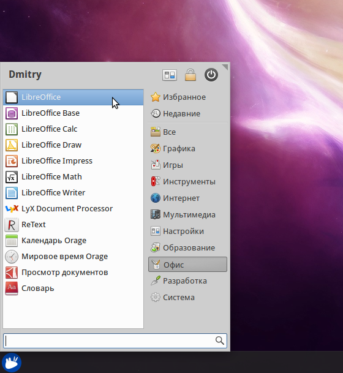

    Иконки запуска компонентов LibreOffice |br| в системном меню Xubuntu GNU/Linux

При нажатии на пункт меню LibreOffice открывается стартовый экран LibreOffice, в котором можно выбрать любой компонент LibreOffice. Также можно выбрать пункт :guilabel:`&Открыть файл` или использовать :guilabel:`&Шаблоны`.

.. _ch1-lo-screen-002:

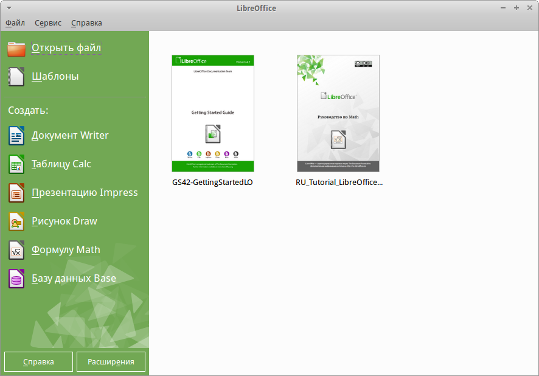

    Стартовый экран LibreOffice 4.3

Запуск нажатием на существующий документ
""""""""""""""""""""""""""""""""""""""""

Также LibreOffice можно запустить, дважды нажав левой кнопкой мыши на документе в файловом менеджере вашей операционной системы (например для ОС Windows это *Проводник*). Будет запущен соответствующий компонент LibreOffice и документ откроется в нём.

Если на компьютере установлен Microsoft Office и при установке LibreOffice были настроены ассоциации файлов Microsoft Office (подробнее смотрите *Приложение Б*) с LibreOffice, то при двойном нажатии на файл:

* Для файлов Word (``*.doc`` или ``*.docx``), они откроются в компоненте Writer;
* Для файлов Excel (``*.xls`` или ``*.xlsx``), они откроются в компоненте Calc;
* Для файлов PowerPoint (``*.ppt`` или ``*.pptx``), они откроются в компоненте Impress.

Если ассоциации файлов Microsoft Office не были настроены и он установлен на компьютере, то при попытке открыть файл Microsoft Office будет использован соответствующий компонент Microsoft Office.

Для получения более подробной информации смотрите раздел `Открытие существующих документов`_.

Быстрый запуск в Windows и Linux
~~~~~~~~~~~~~~~~~~~~~~~~~~~~~~~~

LibreOffice включает в себя функцию :guilabel:`Быстрого запуска` (Quickstarter). При её активации в системном лотке (трее) появляется значок |lo-tray|, а LibreOffice загружается в оперативную память при старте операционной системы, что позволяет достичь более быстрого запуска офисного пакета.

Если :guilabel:`Быстрый запуск` не активирован, то смотрите раздел `Активация Быстрого запуска`_ для его включения.

Использование Быстрого запуска
~~~~~~~~~~~~~~~~~~~~~~~~~~~~~~

Обычно системный лоток (трей) операционной системы располагается в правом нижнем углу, рядом с часами. Одиночное нажатие на иконку :guilabel:`Быстрого запуска` LibreOffice в системном лотке, открывает меню, из которого можно открыть существующий документ, открыть шаблоны или запустить любой компонент LibreOffice. 

.. _ch1-lo-screen-003:

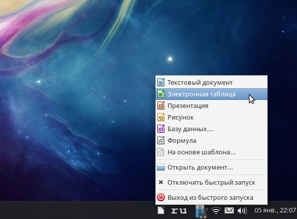

    Иконка быстрого запуска LibreOffice

Отключение Быстрого запуска
~~~~~~~~~~~~~~~~~~~~~~~~~~~

Для отключения функции :guilabel:`Быстрого запуска` нажмите правой кнопкой мыши по его значку в системном трее и в меню выберите пункт :guilabel:`Выход из быстрого запуска`. При следующем запуске компьютера компонент будет загружен снова.

Для полного отключения  функции :guilabel:`Быстрого запуска` нажмите правой кнопкой мыши по его значку в системном трее и в меню выберите пункт :guilabel:`Отключить быстрый запуск`. Или же снимите галочку напротив :guilabel:`&Использовать быстрый запуск` в меню :menuselection:`С&ервис --> &Параметры --> LibreOffice --> Память`.

.. note:: На компьютерах с небольшим объемом оперативной памяти целесообразно отключать функцию :guilabel:`Быстрого запуска`, для ускорения работы компьютера.

Активация Быстрого запуска
~~~~~~~~~~~~~~~~~~~~~~~~~~

Если :guilabel:`Быстрый запуск` был отключен, то вы можете активировать его используя пункт :guilabel:`&Использовать быстрый запуск` в меню :menuselection:`С&ервис --> &Параметры --> LibreOffice --> Память`.

.. _ch1-lo-screen-004:

.. figure:: _static/chapter1/ch1-lo-screen-004.png
    :scale: 40%
    :align: center
    :alt: Активация быстрого запуска LibreOffice

    Активация быстрого запуска LibreOffice
    
-----------------------------------------------------
    
Элементы главного окна программы
---------------------------------

Главное окно выглядит одинаково для всех компонентов LibreOffice, однако могут быть отличия в деталях. Смотрите соответствующие главы в этом руководстве, посвященные  Writer, Calc, Draw и Impress, для их уточнения.

Общие элементы для окон всех компонентов LibreOffice — это главное меню, стандартная панель и панель форматирования в верхней части окна и строка состояния в нижней.

Главное меню
~~~~~~~~~~~~

Главное меню находится в верхней части окна LibreOffice, сразу под заголовком окна. При выборе одного из пунктов меню, из перечисленных ниже, раскрываются подменю, содержащие различные команды.

.. _ch1-lo-screen-005:

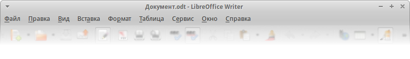

    Главное меню

* :guilabel:`&Файл` – содержит команды, применимые ко всему документу, такие как :guilabel:`&Открыть`, :guilabel:`Со&хранить` или :guilabel:`Экспорт в &PDF`.

* :guilabel:`&Правка` – содержит команды для редактирования документов, такие как :guilabel:`Отменить: ххх` (где xxx – это отменяемое действие) и :guilabel:`На&йти и заменить`. Также содержит команды :guilabel:`Выре&зать`, :guilabel:`&Копировать` и :guilabel:`Вставит&ь` для выбранной части документа.

* :guilabel:`&Вид` – содержит команды для управления отображением документа на экране, такие как :guilabel:`&Масштаб` и :guilabel:`Режим &веб-страницы`.

* :guilabel:`Вст&авка` – содержит команды для вставки элементов в документ, такие как :guilabel:`&Верхний колонтитул`, :guilabel:`&Нижний колонтитул` и :guilabel:`&Изображение`.

* :guilabel:`Фо&рмат` – содержит команды такие, как :guilabel:`Сти&ли`, :guilabel:`Авто&замена` для форматирования макета документа.

* :guilabel:`&Таблица` – содержит все команды для вставки и редактирования таблиц в текстовых документах.

* :guilabel:`С&ервис` – содержит такие функции, как :guilabel:`&Орфография и грамматика`, :guilabel:`&Настройка`, :guilabel:`&Параметры`.

* :guilabel:`&Окно` – содержит команды настройки отображения окна, например, позволяет открыть копию текущего окна и переключаться между уже открытыми окнами.

* :guilabel:`&Справка` – содержит ссылки на файл справки LibreOffice, пункт :guilabel:`&Что это такое?` и информацию о программе.

Панели инструментов
~~~~~~~~~~~~~~~~~~~

В LibreOffice есть два типа панелей инструментов: закрепленные (зафиксированные на месте) и плавающие. Закрепленные панели можно перемещать в другое место или делать плавающими, а плавающие панели можно закреплять. Плавающие панели имеют свою рамку окна и могут быть перемещены в любое удобное место на экране.

.. _ch1-lo-screen-006:

.. figure:: _static/chapter1/ch1-lo-screen-006.png
    :scale: 40%
    :align: center
    :alt: Закрепленная и плавающая панель

    Закрепленная и плавающая панель инструментов

По-умолчанию под главным меню закреплена :guilabel:`Стандартная панель инструментов`. Она есть во всех компонентах LibreOffice.

.. _ch1-lo-screen-007:

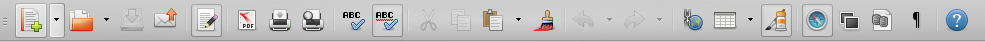

    Стандартная панель инструментов

Вторая панель сверху по умолчанию — :guilabel:`Панель инструментов Форматирование`. Она изменяется в зависимости от контекста, то есть показывает инструменты в соответствии с текущим положением курсора или выбранным объектом. Например, когда курсор находится на изображении, панель Форматирование показывает инструменты для работы с графическими объектами, когда курсор в тексте — показывает инструменты для форматирования текста.

.. note:: Одни и те же действия в LibreOffice можно выполнять и с помощью главного меню и с помощью значков на панелях инструментов. Панели инструментов в основном служат для быстрого доступа к тем или иным действиям.

Отображение и скрытие панелей инструментов
""""""""""""""""""""""""""""""""""""""""""

Для отображения или скрытия панелей зайдите в меню :menuselection:`&Вид --> &Панели инструментов` и нажмите левой кнопкой мыши на название панели в выпадающем списке. Активные (отображаемые в данный момент) панели будут отмечены галочкой рядом со своим  названием.

Чтобы закрыть панель инструментов нажмите на крестик справа от имени панели (если панель плавающая) или зайдите в меню :menuselection:`&Вид --> &Панели инструментов` и снова нажмите левой кнопкой мыши на название панели.

Подменю и наборы инструментов
"""""""""""""""""""""""""""""

Значки на панели инструментов, которые имеют справа маленький треугольник, при нажатии отображают подменю с набором инструментов или другими элементами, в зависимости от функции значка.

.. _ch1-lo-screen-008:

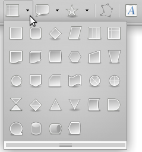

    Значки с выпадающим подменю

Наборы инструментов могут открепляться в виде плавающей панели. Для этого необходимо нажать левой кнопкой мыши на «ручку» панели и не отпуская кнопку мыши потянуть панель в сторону.  Смотрите разделы `Перемещение панелей инструментов`_ и `Плавающие панели инструментов`_ для получения дополнительной информации о перемещении и откреплении панелейв, созданных из наборов инструментов.

.. _ch1-lo-screen-009:

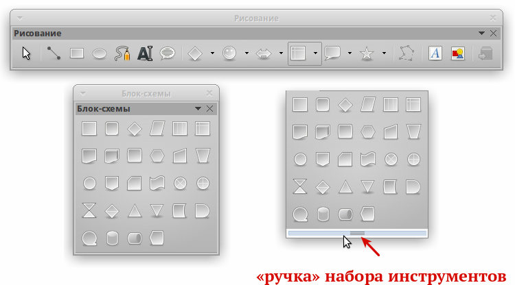

    Создание плавающей панели из набора инструментов

Перемещение панелей инструментов
""""""""""""""""""""""""""""""""

Закрепленная панель инструментов также может быть перемещена на новое место или сделана плавающей.

1. Поместите курсор мыши на «ручку» панели инструментов, которая представляет собой штриховую вертикальную линию с левой стороны закрепленной панели.
2. Нажмите на «ручку» и, удерживая левую кнопку мыши, перетащите панель инструментов на новое место. Панель инструментов будет закреплена в новой позиции сверху, слева, справа или внизу главного окна программы, в ином случае будет создана плавающая панель инструментов.
3. Отпустите кнопку мыши.
4. Чтобы переместить плавающую панель инструментов, нажмите на заголовок панели и перетащите её на новое место или закрепите панель сверху или снизу главного окна программы.

.. _ch1-lo-screen-010:

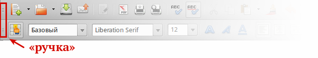

    «Ручка» панели инструментов

.. tip:: Также можно прикрепить плавающую панель инструментов, удерживая клавишу Ctrl и щелкая по заголовку панели.

Плавающие панели инструментов
"""""""""""""""""""""""""""""

Некоторые панели инструментов появляются в зависимости от контекста, например, если курсор находится в таблице, то появится (по умолчанию в нижней части главного окна программы) панель *Таблица*, если курсор в маркированном или нумерованном списке, то появится панель *Маркеры и нумерация*.

Часть подобных панелей по-умолчанию настроены как плавающие. Вы можете закрепить эти панели в любой части главного окна программы или изменить их положение на экране (смотрите раздел `Перемещение панелей инструментов`_ выше).

Настройка панелей инструментов
""""""""""""""""""""""""""""""

На панелях инструментов можно настраивать отображаемые значки. Также можно добавить значки на панель или создать новую панель, как это описано в *Главе 14 Настройка LibreOffice*. Для доступа к настройкам панели нажмите правой кнопкой мыши на панель, откроется контекстное меню:

* Для отображения или скрытия значков на выбранной панели инструментов, нажмите  :guilabel:`Показать кнопки`. Отображаемые значки панели выделены контуром вокруг значков или галочкой рядом со значком (в зависимости от используемой операционной системы). Установите или снимите выделение со значка, чтобы отобразить или скрыть значок на панели.

.. _ch1-lo-screen-011:

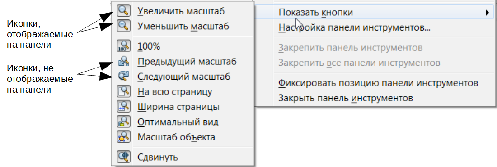

    Выбор значков, отображаемых на панели инструментов

* Нажмите :guilabel:`Настройка панели инструментов` для открытия диалога *Настройка*. Смотрите *Главу 14 Настройка LibreOffice* для более подробной информации.

* Нажмите :guilabel:`Фиксировать позицию панели инструментов` для запрета перемещения панели. По умолчанию панель будет закреплена в верхней части рабочей области программы. Положение панели инструментов можно изменить, смотрите раздел `Перемещение панелей инструментов`_.

* Нажмите :guilabel:`Закрепить все панели инструментов` (только в меню плавающих панелей) для закрепления всех плавающих панелей. По умолчанию панели будут закреплены в верхней части рабочей области программы. Положение панелей инструментов можно изменять, смотрите раздел `Перемещение панелей инструментов`_.

* Нажмите :guilabel:`Закрыть панель инструментов` для закрытия выбранной панели.

Фиксированные и плавающие диалоги
"""""""""""""""""""""""""""""""""

Некоторые диалоги LibreOffice также могут быть прикреплены и зафиксированы у одного из краев рабочей области. При необходимости их можно открепить и сделать плавающим. К подобным диалогам относится, например, диалог :guilabel:`Стили и форматирование` или :guilabel:`Навигатор`.

Для открепления диалога, нажмите левой кнопкой мыши в его верхней части, рядом со значками и, не отпуская левой кнопки мыши, потяните в сторону. Вокруг диалога появится рамка окна, потянув за которую можно изменить размер диалога или переместить его. Чтобы прикрепить диалог, нажмите левой кнопкой мыши на его заголовок и потяните к краю рабочей области. При появлении контура диалога, отпустите левую кнопку мыши.

.. _ch1-lo-screen-012:

.. figure:: _static/chapter1/ch1-lo-screen-012.png
    :scale: 40%
    :align: center
    :alt:  Прикрепление диалога

    Прикрепление диалога

Также можно просто нажать один раз левой кнопкой мыши в верхней области диалога (рядом со значками), удерживая при этом нажатой клавишу ``Ctrl``. Если диалог закреплен, то он открепится. Если диалог плавающий, то он будет прикреплен к тому месту, где находился по умолчанию. 

Контекстное меню
""""""""""""""""

:guilabel:`Контекстное меню` позволяет осуществить быстрый доступ ко многим функциям LibreOffice и вызывается нажатием правой кнопки мыши на объекте (абзац, рисунок, символ и тому подобное). Функции и настройки, показанные в контекстном меню, зависят от объекта, на который нажали правой кнопкой мыши. Контекстное меню может быть самым простым способом найти и выполнить нужную операцию, особенно если вы не знаете, где эта операция находится в основном меню.

Контекстное меню также частично дублирует функции, доступные в главном меню или на панелях инструментов. Контекстное меню может быть вызвано нажатием на клавиатуре клавиши ``Menu`` или сочетания клавиш ``Shift + F10`` в ОС Windows и Linux. В в Mac OS нажатием кнопки мыши при нажатой клавише  ``Control``.

Строка состояния
""""""""""""""""

Строка состояния (иногда её ещеё называют Статусной строкой) расположена в нижней части рабочей области программы. В ней содержится информация о документе. Также с её помощью можно быстро изменить некоторые параметры. Строка состояния присутствует во всех компонентах LibreOffice, но в каждом из компонентов содержит свои специфические элементы. Пример строки состояния Writer приведен ниже.

.. _ch1-lo-screen-013:

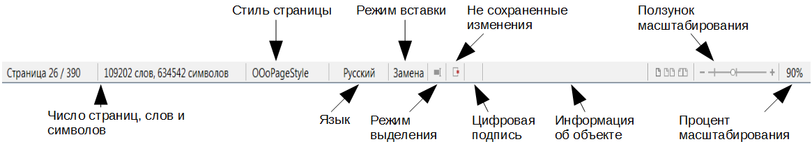

    Строка состояния Writer

Строка состояния разделена на области, которые отображают:

* **Число страниц, листов или слайдов** — показывает номер текущей страницы, листа или слайда и общее количество страниц, листов или слайдов в документе. Двойное нажатие левой кнопкой мыши на этой области открывает :guilabel:`Навигатор` по документу. Другие области применения этого поля зависят от компонента LibreOffice.

* **Число слов и символов** — показывает число слов и символов во всем документе, а если выделен фрагмент текста, то число слов и символов в выделенном фрагменте. Двойное нажатие левой кнопкой мыши на этой области открывает диалог :guilabel:`Количество слов`.

* **Стиль страницы или слайда** — показывает текущий стиль страницы или слайда. Для редактирования текущего стиля страницы или слайда дважды нажмите левой кнопкой мыши по этой области.

* **Язык**  —  показывает текущий язык всего документа или выделенного фрагмента текста. Двойное нажатие левой кнопкой мыши по данной области открывает контекстное меню, позволяющее настроить параметры языка.

* **Режим вставки**  —  показывает режим вставки. Если данная область пустая, то программа находится в режиме вставки. Если нажать клавишу ``Ins`` (``Insert``) на клавиатуре, то программа перейдет в режим *Замены*. Повторное нажатие на клавишу ``Ins`` (``Insert``)  возвращает режим *Вставка*. Также можно дважды нажать на эту область левой кнопкой мыши, для смены режима вставки.

* **Режим выделения текста**  —  показывает режим выделения текста. Одиночное нажатие на область открывает контекстно меню, позволяющее выбрать режим выделения текста.

* **Статус изменения документа** —  показывает статус изменения документа. Если документ был изменен, но ещё не сохранен, то значок будет отображать красный восклицательный знак. Двойное нажатие левой кнопкой мыши по области сохраняет документ.

* **Цифровая подпись** — если документ содержит цифровую подпись, в области будет показан значок. Нажав два раза на значок левой кнопкой мыши, можно будет посмотреть сертификат подписи.

* **Информация об объекте** — отображает информацию, относящуюся к позиции курсора или выбранному элементу документа. Двойное нажатие левой кнопкой мыши на этом поле откроет соответствующий диалог.

* **Ползунок масштабирования** — перетаскивайте ползунок или нажимайте  левой кнопкой мыши по ``+`` (плюс) и ``-`` (минус) для увеличения или уменьшения масштаба соответственно. Слева от ползунка масштабирования в Writer находятся значки, позволяющие настроить отображение страниц документа друг относительно друга: *По одной странице*, *Страницы рядом* (зависит от масштаба), *По две страницы встык*.

* **Масштаб** — показывает уровень масштабирования документа. Нажатие правой кнопкой мыши на числе процентов откроет список вариантов масштабирования: *В процентах*, *На всю страницу*, *По ширине страницы* и *Оптимально*. Двойное нажатие левой кнопкой мыши открывает диалог :guilabel:`Масштабирование и режимы просмотра`.

------------------

Создание новых документов
-------------------------

Создать новый документ в LibreOffice можно несколькими способами. 

Если LibreOffice запущен, но ни один документ не открыт, то отображается стартовый экран (смотрите рисунок :ref:`ch1-lo-screen-002`). Нажмите на один из пунктов для создания нужного документа или выберите пункт :guilabel:`Шаблоны`, чтобы создать документ на основе шаблона.

Также можно создать документ одним из следующих способов:

* Используйте пункт главного меню :menuselection:`&Файл --> &Создать` и выберите нужный тип документа из списка.
* Нажмите сочетание клавиш ``Ctrl+N`` для создания нового текстового документа.
* Используйте пункт главного меню :menuselection:`&Файл --> &Мастер` и выберите тип создаваемого с использованием мастера документа.
* Если в LibreOffice уже открыт какой-либо документ, нажмите на значок :guilabel:`Создать` |newdoc-icon| на стандартной панели инструментов и новый документ того же типа будет создан в новом окне программы.
* При нажатии на маленький треугольник справа от значка :guilabel:`Создать` будет показан список типов создаваемых документов, таким образом, можно создать из открытого документа Writer новый документ Calc.

Открытие существующих документов
--------------------------------

Открыть существующие документы можно следующими способами:

* Если нет открытых документов, нажмите на значок :guilabel:`Открыть файл` на стартовом экране и выберите из списка доступных документов.
* Нажмите маленький треугольник справа от значка :guilabel:`Открыть` на стандартной панели инструментов и выберите из списка последних открытых документов.
* Используйте пункт главного меню :menuselection:`&Файл --> &Открыть`.
* Щелкните значок :guilabel:`Открыть` на стандартной панели, если какой-либо документ уже открыт.
* Нажмите сочетание клавиш ``Ctrl + O`` на клавиатуре.

В каждом из описанных способов откроется окно выбора файлов. Перейдите в нужный каталог, выберите требуемый файл и нажмите кнопку :guilabel:`Открыть`. Если какой-либо документ уже открыт в LibreOffice, то второй документ откроется в новом окне.

В диалоге открытия файлов можно сократить список отображаемых файлов, задав тип (расширение) необходимых вам файлов. Например, если указать тип файла *Текстовый документ*, то в окне будут показаны только документы Writer (включая файлы с расширением ``.odt``, ``.doc``, ``.txt``); если указать *Электронные таблицы*, то вы увидите файлы с расширениями ``.ods``, ``.xls`` и другие файлы, открываемые в Calc.

Также можно открыть существующий документ в формате, который поддерживает LibreOffice,  нажав два раза на файл на рабочем столе или в окне файлового менеджера (таком как Windows Explorer). Будет запущен соответствующий формату файла компонент LibreOffice.

Сохранение документов
---------------------

Сохранять документы можно одним из следующих способов:

* Используя команду :guilabel:`Сохранить` (нажмите на клавиатуре ``Ctrl + S`` или используйте пункт меню :menuselection:`&Файл --> Со&хранить` или нажмите на значок |lo-save| на стандартной панели инструментов), если сохраняете документ с его текущим именем и месторасположением. Команда :guilabel:`Сохранить` перезапишет последний сохраненный вариант документа. Если документ сохраняется впервые, то будет выведено диалоговое окно сохранения документа, в котором можно будет выбрать название, формат и местоположение документа.

* Используя команду :guilabel:`Сохранить как...` (нажмите на клавиатуре ``Ctrl + Shift + S`` или используйте пункт меню :menuselection:`&Файл --> Сохранить &как...`) если хотите создать новый документ из текущего или изменить имя файла и/или формат файла, или сохранить файл в другом месте.

Используйте защиту документа паролем, если хотите ограничить число людей, которые могут открывать, просматривать и редактировать документ. Подробнее об этом смотрите в разделе `Защита паролем`_.

.. _ch1-lo-screen-014:

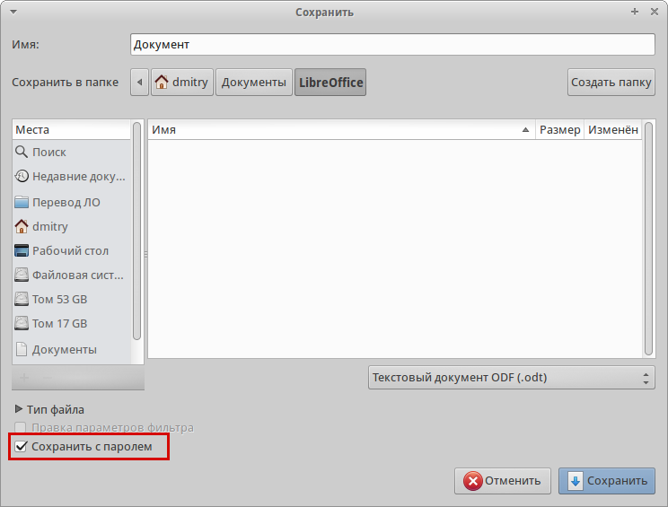

    Диалог сохранения документа

Когда открыт диалог сохранения, введите имя файла, выберите желаемый формат файла, выберите нужный каталог (если необходимо), и нажмите кнопку :guilabel:`Сохранить`.

Вид открывающегося диалога :guilabel:`Сохранить как...` зависит от настроек LibreOffice. Смотрите раздел `Диалоговые окна «Открыть» и «Сохранить как...»`_ для получения более подробной информации.

Защита паролем
~~~~~~~~~~~~~~

Чтобы ограничить число людей, которые могут открывать и читать документ или открывать и редактировать документ, нужно использовать защиту документа паролем. Для этого:

1. В диалоговом окне :guilabel:`Сохранить как...` выберите опцию :guilabel:`Сохранить с паролем` (смотрите рисунок :ref:`h1-lo-screen-014`).

2. Нажмите кнопку :guilabel:`Сохранить`, откроется диалоговое окно :guilabel:`Задать пароль`.

.. _ch1-lo-screen-015:

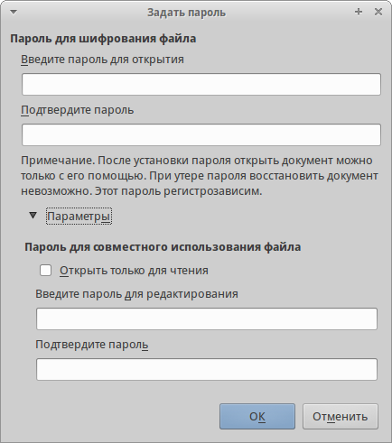

    Диалог :guilabel:`Задать пароль`

3. В разделе :guilabel:`Пароль для шифрования файла` введите пароль на открытие документа и повторите пароль для подтверждения.
4. Для установки пароля на :guilabel:`редактирования файла` нажмите кнопку :guilabel:`Детали`.
5. В разделе :guilabel:`Пароль для совместного использования файла` установите галочку :guilabel:`Открыть только для чтенияё и введите пароль на редактирование документа, ниже повторите пароль для подтверждения .
6. Нажмите кнопку :guilabel:`OK` для закрытия диалога. Если пароли совпадают, то документ сохранится с защитой паролем. Если пароли не совпадают, то на экране будет показано соответствующее сообщение об ошибке.

.. warning:: LibreOffice использует очень стойкий механизм шифрования, что делает практически невозможным восстановление данных из документа в случае, если вы забыли пароль!

Смена пароля
""""""""""""

Если документ защищен паролем, то изменить пароль можно только в открытом документе. Откройте меню :menuselection:`&Файл --> Сво&йства --> Общие` и нажмите кнопку :guilabel:`Изменить пароль`. Откроется диалоговое окно :guilabel:`Задать пароль`, в котором вы сможете ввести новый пароль.

Снятие защиты паролем
"""""""""""""""""""""

Чтобы снять пароль с документа, необходимо пересохранить его, воспользовавшись меню :menuselection:`&Файл --> Сохранить &как` и убрав галочку напротив опции :guilabel:`Сохранить с паролем`.

Автосохранение документов
~~~~~~~~~~~~~~~~~~~~~~~~~

LibreOffice может сохранять файлы автоматически. Эта функция является частью функции автовосстановления документов LibreOffice. Автоматическое сохранение похоже на обычное сохранение документа, оно перезаписывает последнее сохраненное состояние файла. Чтобы установить автоматическое сохранение файлов:

1. Откройте в главном меню :menuselection:`С&ервис --> &Параметры --> Загрузка/сохранение --> Общие`;
2. У опции :guilabel:`Автосохранение каждые` установите временной интервал в минутах.
3. Нажмите :guilabel:`OK`, чтобы применить изменения.

Переименование и удаление файлов
--------------------------------

Переименовывать или удалять файлы с жесткого диска можно в диалогах открытия/сохранения файлов LibreOffice, точно так же, как в файловом менеджере. Выберите файл и нажмите на него правой кнопкой мыши, откроется контекстное меню. Выберите :guilabel:`Удалить` или :guilabel:`Переименовать` в зависимости от потребности. 

Диалоговые окна «Открыть» и «Сохранить как...»
------------------------------------------------------------------

Можно выбрать, какие диалоги открытия/сохранения файлов использовать: те, которые есть в самом LibreOffice, или стандартные диалоги вашей операционной системы.

Для использования диалогов открытия/сохранения файлов, встроенных в LibreOffice, откройте меню :menuselection:`С&ервис --> &Параметры --> LibreOffice --> Общие` и поставьте флажок на опции :guilabel:`Использовать диалоги LibreOffice`. Для использования стандартных диалогов системы - снимите данный флажок.

Для примера сравните диалоги на изображениях :ref:`ch1-lo-screen-014` и :ref:`ch1-lo-screen-017`.

.. _ch1-lo-screen-017:

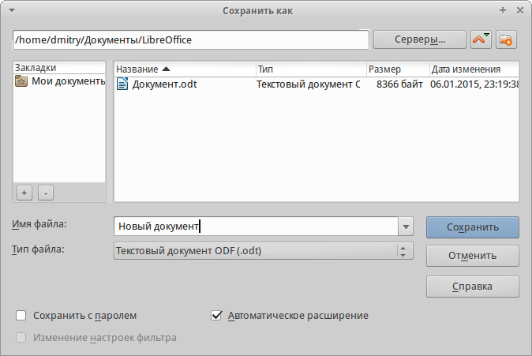

    Стандартный диалог сохранения фалов LibreOffice

Тремя значками в верхнем правом углу диалога открытия/сохранения файлов LibreOffice являются:

* **Подключиться к серверу** |lo-servers| – откроется диалоговое окно, позволяющее подключиться к удаленному серверу, если искомый документ находится не на вашем компьютере. Это одна из не самых очевидных функций LibreOffice, она позволяет, в том числе, подключаться к таким сервисам как: Яндекс Диск, Google Drive (Документы) и некоторым другим. Подробнее смотрите *Приложение Г*.

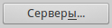

* **На уровень вверх** |lo-levels| – показывает содержимое каталога, расположенного выше в файловой иерархии относительно текущего. Нажмите и удерживайте кнопку мыши на этом значке до появления выпадающего списка всех выше расположенных в иерархии (по отношению к текущему) каталогов. Переместите курсор к нужному каталогу и отпустите кнопку мыши для перехода в него.

* **Создать папку** |lo-new-folder| – создание нового вложенного каталога в текущем каталоге.

Используйте поле :guilabel:`Тип файла`, чтобы указать тип файла, который необходимо открыть или формат файла для сохраняемого файла.

.. в английском варианте тут шла информация о параметре "Только для чтения". Этот параметр теперь вынесен в Свойства документа и не отображается в диалоге сохранения.

Использование Навигатора
------------------------

В :guilabel:`Навигаторе` LibreOffice отображаются объекты, содержащиеся в документе, разбитые по категориям. Например, в Writer он отображает Заголовки (сделанные с помощью Стилей), Таблицы, Врезки, Комментарии, Изображения, Закладки и иные элементы, как показано на изображении :ref:`ch1-lo-screen-018`. 

В Calc он отображает Листы, Названия диапазонов, Диапазоны базы данных, Изображения, Графические объекты и иные элементы. В Impress и Draw показываются Слайды, Изображения и другие элементы.

Чтобы открыть :guilabel:`Навигатор`, нажмите на значок :guilabel:`Навигатор` |lo-navigator| на стандартной панели инструментов или нажмите клавишу ``F5`` на клавиатуре, или откройте меню :menuselection:`&Вид --> Навига&тор`. Также можно нажать на область в :guilabel:`Строке` состояния, показывающую количество страниц, подробнее смотрите раздел `Строка состояния`_.

:guilabel:`Навигатор` можно закрепить у любой из сторон главного окна программы или оставить его плавающим. Нажмите на маркер (``+`` или треугольник) рядом с любой категорией, чтобы отобразить список объектов в этой категории.

.. _ch1-lo-screen-018:

.. figure:: _static/chapter1/ch1-lo-screen-018.png
    :scale: 60%
    :align: center
    :alt:  Навигатор в Writer

    Навигатор в Writer

Навигатор предоставляет несколько удобных способов перемещения по документу и поиска элементов в нем:

* Если в категории есть объекты, дважды нажмите левой кнопкой мыши по объекту для перехода к нему в документе.
* Объекты легче искать, если им присваивать при создании узнаваемые имена, а не использовать стандартные имена LibreOffice типа Лист1, Таблица1, Рисунок1 и тому подобные. Стандартное имя может не соответствовать фактическому положению объекта в документе.
* :guilabel:`Навигатор` в компонентах LibreOffice имеет разный набор функций. Об этих функциях рассказывается далее в соответствующих темах, посвященных компонентам LibreOffice.

Отмена и возврат изменений
--------------------------

Чтобы отменить самое последнее изменение в документе используйте сочетание клавиш ``Ctrl+Z`` или нажмите на значок :guilabel:`Отменить` |lo-undo| на стандартной панели инструментов, или используйте пункт главного меню :menuselection:`Правка --> Отменить`. Нажмите на маленький треугольник справа от значка :guilabel:`Отменить`, появится список всех изменений, которые можно отменить. Можно выбрать несколько последних изменений и отменить их все одновременно.

.. _ch1-lo-screen-019:

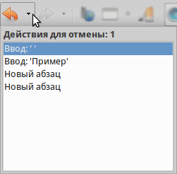

    Отмена изменений

После отмены изменений можно вернуть отмененные изменения. Чтобы вернуть изменения используйте сочетание клавиш ``Ctrl + Y`` или нажмите на значок :guilabel:`Вернуть` |lo-redo|, или используйте пункт главного меню :menuselection:`&Правка --> &Вернуть`. Так же, как и в :guilabel:`Отмене`, нажмите на маленький треугольник справа от значка, чтобы получить список изменений, которые могут быть восстановлены.

Чтобы изменить количество изменений доступных для отмены, откройте в главном меню :menuselection:`С&ервис --> &Параметры --> LibreOffice --> Память`. В секции :guilabel:`Отмена` увеличьте или уменьшите *Количество шагов*. Чем больше вы задаете число запоминаемых изменений, тем большее количество оперативной памяти потребуется LibreOffice во время работы.

Закрытие документа
------------------

Если открыт только один документ, перейдите в главном меню в :menuselection:`&Файл --> &Закрыть` или нажмите на ``х`` (крестик) справа вверху на главном меню (не путать с заголовком окна). Последний документ будет закрыт, а LibreOffice отобразит стартовый экран.

.. _ch1-lo-screen-020:

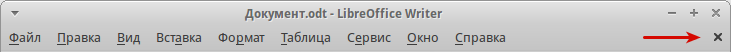

    Значок ``х`` (крестик), закрывающий документ

Если открыто более одного документа, перейдите в главном меню в :menuselection:`&Файл --> &Закрыть` или нажмите на ``х`` (крестик) в заголовке окна программы. ``х`` (крестик) может располагаться как справа, так и слева от заголовка окна программы в зависимости от настроек вашей операционной системы. Когда останется только один открытый документ, ``х`` (крестик) появится в строке главного меню.

Если документ не был сохранен после внесения последних изменений, будет показано сообщение с предложением сохранить изменения. Выберите, следует ли сохранить или отказаться от изменений. 

.. warning:: Не сохранение документа может привести к потере последних изменений или даже всего файла.

Закрытие LibreOffice
--------------------

Чтобы полностью закрыть LibreOffice, выберите в главном меню :menuselection:`&Файл  --> Выйти &из LibreOffice` в ОС Windows и Linux. В ОС Mac OS X выберите  в главном меню :menuselection:`LibreOffice  --> Выйти из LibreOffice`.

Если последний открытый документ закрыть нажатием на ``x`` (крестик) в заголовке окна программы, то LibreOffice закроется полностью. Для ОС Mac OS X данная функция недоступна; вместо этого нужно выбрать в главном меню :menuselection:`LibreOffice  --> Выйти из LibreOffice`.

Также можно использовать сочетания клавиш:

* В Windows и Linux – ``Ctrl + Q``
* В Mac OS X – ``⌘Command + Q``

Если какие-либо документы не были сохранены с момента последнего изменения, то будет показано сообщение с предложением сохранить изменения. Выберите, следует ли сохранить или отказаться от изменений.
