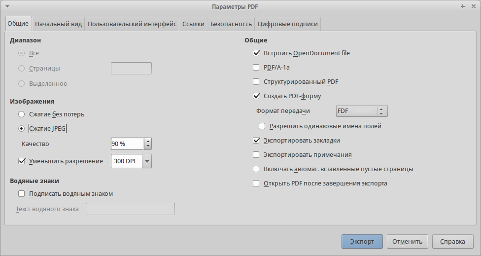
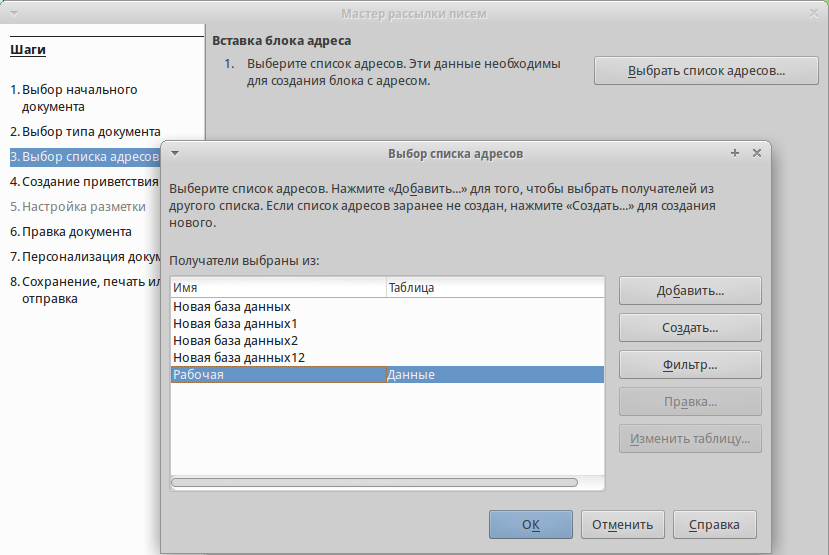

.. meta::
   :description: Краткое руководство по LibreOffice: Глава 10 – Печать, экспорт и почтовая рассылка
   :keywords: LibreOffice, Writer, Impress, Calc, Math, Base, Draw, либреоффис

.. Список автозамен

.. |br| raw:: html

    

.. _Printing-Exporting-and-E-mailing:

Глава 10 – Печать, экспорт и почтовая рассылка
===============================================

Быстрая печать
--------------

Нажмите на значок *Печать* (|ch10-lo-screen-001|), чтобы распечатать весь документ на принтере по умолчанию для вашего компьютера.

.. |ch10-lo-screen-001| image:: _static/chapter10/ch10-lo-screen-001.png
        :scale: 80% 

.. note:: Можно изменить действие значка *Печать* так, чтобы документ был отправлен на принтер, определенный для конкретного документа, вместо принтера, заданного по умолчанию для компьютера. В меню :menuselection:`Сервис --> Параметры --> Загрузка/Сохранение --> Общие` отметьте галочкой пункт *Загружать с документом настройки принтера*. 

Контролируемая печать
---------------------

Для контроля за процессом печати используйте диалог Печать (пункт меню :menuselection:`Файл --> Печать..` или нажмите сочетание клавиш ``Ctrl+P``).

.. _ch10-lo-screen-002:

    Диалог *Печать*

.. note:: Настройки, выбранные в диалоге *Печать*, применяются только для печати текущего документа.

 Чтобы задать параметры печати по умолчанию для всего пакета LibreOffice, используйте меню :menuselection:`Сервис --> Параметры --> LibreOffice --> Печать` и :menuselection:`Сервис --> Параметры --> LibreOffice Writer --> Печать`. Обратитесь к :ref:`Setting-up-LibreOffice` данного руководства для получения более подробной информации. 

В диалоге *Печать* есть четыре вкладки, на которых можно выбрать различные параметры печати. 

Для различных компонентов LibreOffice доступны различные настройки печати.

.. csv-table:: 
    :header: Возможность,Writer,Calc,Impress,Draw
    :widths: 15,3,3,3,3
    
    Выбор страниц/листов/слайдов для печати,Да,Да,Да,Да
    Печать нескольких страниц/листов/слайдов на одном листе бумаги,Да,Да,Да,Да
    Печать брошюр,Да,Нет,Да,Да
    Печать на конвертах,Да,Нет,Нет,Нет
    Печать этикеток и визиток,Да,Нет,Нет,Нет
    Предварительный просмотр страниц/листов перед печатью,Да,Да,Нет,Нет

Выбор общих настроек печати
~~~~~~~~~~~~~~~~~~~~~~~~~~~

На вкладке Общие в диалоге Печать можно выбрать:

* Принтер (из доступных принтеров)
* Какие страницы печатать, количество копий для печати и настройки упорядочивания нескольких копий (Раздел *Область печати и копии*)
* Настройки печати примечаний. 

Некоторые настройки в диалоге могут быть не доступны. Например, если документ не содержит ни одного примечания, то выпадающий список с настройками для их печати будет недоступен.

.. _ch10-lo-screen-003:

.. figure:: _static/chapter10/ch10-lo-screen-003.png
    :scale: 50%
    :align: center
    :alt: Печать примечаний и выбор места их печати

    Печать примечаний и выбор места их печати

Нажмите на кнопку *Свойства*, чтобы отобразить настройки выбранного принтера, в которых можно выбрать ориентацию: книжную или альбомную, указать лоток для подачи бумаги и размер бумаги для печати. 

В диалоге *Печать*, на вкладке *Настройки*, один из пунктов, *Подача бумаги согласно настройкам принтера*, отсутствует в Calc.

.. _ch10-lo-screen-004:

    Диалог *Печать*. Вкладка *Настройки*
    
Печать нескольких страниц документа на одном листе бумаги
~~~~~~~~~~~~~~~~~~~~~~~~~~~~~~~~~~~~~~~~~~~~~~~~~~~~~~~~~

Можно печатать несколько страниц документа на одном листе бумаги. Для этого:

1) В диалоге *Печать* выберите вкладку *Макет страницы*.

.. _ch10-lo-screen-005:

.. figure:: _static/chapter10/ch10-lo-screen-005.png
    :scale: 50%
    :align: center
    :alt: Печать нескольких страниц на одном листе бумаги

    Печать нескольких страниц на одном листе бумаги

2) В разделе *Разметка* выберите из выпадающего списка количество страниц для печати на одном листе. Область предварительного просмотра в левой части диалога *Печать* покажет, как будет напечатан документ.
При печати более двух страниц на одном листе можно выбрать порядок их расположения на листе.

.. _ch10-lo-screen-006:

.. figure:: _static/chapter10/ch10-lo-screen-006.png
    :scale: 50%
    :align: center
    :alt: Печать нескольких страниц на одном листе бумаги

    Печать нескольких страниц на одном листе бумаги

3) В разделе *Страницы*, можно выбрать, нужно ли печатать оборотные, лицевые или все страницы. Нажмите кнопку *OK*.  

.. tip:: В Writer, для печати двух страниц на одном листе в стиле «разворот» (книжная компоновка), печатайте из окна *Предварительный просмотр* вместо диалога *Печать*. Смотрите раздел `Предварительный просмотр страниц/листов перед печатью`_.

Выбор страниц/листов/слайдов для печати
~~~~~~~~~~~~~~~~~~~~~~~~~~~~~~~~~~~~~~~~

Помимо печати документа полностью, можно выбрать для печати отдельные страницы/листы/слайды, диапазоны страниц/листов/слайдов или выделенный фрагмент документа. Есть незначительные отличия в деталях для Writer, Calc, Draw и Impress, они описаны ниже в этом разделе. 

Writer
""""""

Печать отдельной страницы:

1) Выберите пункт меню :menuselection:`Файл --> Печать...` или нажмите сочетание клавиш ``Ctrl+P``.
2) В диалоге *Печать* выберите страницу для печати:
    
    a) В разделе *Область печати* и копии на вкладке *Общие*, выберите пункт *Страницы*. Справа в текстовом поле отображается номер текущей страницы.
    b) Введите номер страницы, которую нужно напечатать. В области предварительного просмотра слева будет показана выбранная страница.

3) Нажмите кнопку *OK*.

Печать диапазона страниц:

1) Выберите пункт меню :menuselection:`Файл --> Печать` или нажмите сочетание клавиш ``Ctrl+P``.
2) В диалоге *Печать* задайте диапазон страниц для печати:
    
    a) В разделе *Область печати* и копии на вкладке *Общие*, выберите пункт *Страницы*.
    b) Введите диапазон номеров печатаемых страниц (например, 1–4 или 1,3,7,11).

3) Нажмите кнопку *OK*.

Печать выделенного текста:

1) В документе выделите фрагмент (текст и/или изображения) для печати.
2) Выберите пункт меню :menuselection:`Файл --> Печать` или нажмите сочетание клавиш ``Ctrl+P``.
3) В разделе *Область печати* и копии на вкладке *Общие*, выберите пункт *Выделение* и в области предварительного просмотра слева будет показан выделенный фрагмент. 
4) Нажмите кнопку *OK*.

.. _ch10-lo-screen-007:

    Печать выделенного текста

Calc
"""""

Можно выбрать для печати отдельные листы, несколько листов и выделенные ячейки.

.. _ch10-lo-screen-008:

    Выбор области печати в Calc

Печать отдельных листов:

1) В открытой электронной таблице щелкните по ярлыку листа, чтобы выбрать его для печати.
2) Выберите пункт меню :menuselection:`Файл --> Печать` или нажмите сочетание клавиш ``Ctrl+P``.
3) В разделе *Область печати* и копии на вкладке *Общие*, выберите пункт *Выбранные листы*.
4) Нажмите кнопку *OK*.

Печать диапазона листов:

1) В открытой электронной таблице выделите листы для печати.

    a) Выделите первый лист.
    b) Нажмите и удерживайте клавишу ``Ctrl``.
    c) Нажмите на ярлыки дополнительных листов.
    d) Отпустите клавишу ``Ctrl`` после выделения всех нужных листов. (также можно использовать клавишу ``Shift``: при удежрании выделяются все листы лежащие между первым и вторым выделенными)

2) Выберите пункт меню :menuselection:`Файл --> Печать...` или нажмите сочетание клавиш ``Ctrl+P``.
3) В разделе *Область печати* и копии на вкладке *Общие*, выберите пункт *Выбранные листы*.
4) Нажмите кнопку *OK*.

Печать выделенных ячеек:

1) В таблице выделите диапазон ячеек для печати.
2) Выберите пункт меню :menuselection:`Файл --> Печать` или нажмите сочетание клавиш ``Ctrl+P``.
3) В разделе *Область печати* и копии на вкладке *Общие*, выберите пункт *Выделенные ячейки*.
4) Нажмите кнопку *OK*.

.. warning:: После печати не забудьте снять выделение с лишних листов. Если они все останутся выделенными, то при вводе данных на одном листе, они (данные) введутся одновременно на всех выделенных листах. 

Impress
"""""""

Можно выбрать для печати отдельные слайды, диапазоны слайдов или выделенный фрагмент слайда.

.. _ch10-lo-screen-009:

.. figure:: _static/chapter10/ch10-lo-screen-009.png
    :scale: 50%
    :align: center
    :alt: Выбор области печати в Impress

    Выбор области печати в Impress

Печать отдельного слайда:

1) Выберите пункт меню :menuselection:`Файл --> Печать...` или нажмите сочетание клавиш ``Ctrl+P``.
2) Выберите слайд для печати:

    a) В разделе *Область печати и копии* на вкладке *Общие*, выберите пункт *Слайды*.
    b) Введите номер слайда для печати.

3) Нажмите кнопку *OK*.

Печать диапазона слайдов:

1) Выберите пункт меню :menuselection:`Файл --> Печать...` или нажмите сочетание клавиш ``Ctrl+P``.
2) Выберите слайд для печати:

    a) В разделе *Область печати и копии* на вкладке *Общие*, выберите пункт *Слайды*.
    b) В поле справа введите диапазон слайдов для печати (например, 1-4 или 1,3,7,11).

3) Нажмите кнопку *OK*.

Печать выделенного фрагмента слайда (или нескольких слайдов):

1) В документе выделите часть слайда для печати.
2) В Выберите пункт меню :menuselection:`Файл --> Печать...` или нажмите сочетание клавиш ``Ctrl+P``.
3) В разделе *Область печати и копии* на вкладке *Общие*, выберите пункт *Выделение*.
4) Нажмите кнопку *OK*.

Печать тезисов, примечаний или структуры в Impress
~~~~~~~~~~~~~~~~~~~~~~~~~~~~~~~~~~~~~~~~~~~~~~~~~~

*Тезисы* печатаются в виде слайдов в уменьшенном размере, в количестве от одного до девяти слайдов на странице. Слайды могут быть напечатаны по горизонтали (альбомная ориентация) или по вертикали (в портретной ориентации).

*Примечания* печатаются в виде одного слайда на листе с любыми примечаниями, введенными для этого слайда в режиме Примечания.

*Структура* печатается в виде названия и заголовков каждого слайда в формате структуры. 

Чтобы напечатать *Тезисы*, *Примечания* или *Структуру*:

1) Выберите пункт меню :menuselection:`Файл --> Печать...` или нажмите сочетание клавиш ``Ctrl+P``.
2) В разделе *Печать* на вкладке *Общие* диалога *Печать* выберите нужные параметры.
3) Для печати *Тезисов* можно дополнительно задать количество слайдов, печатаемых на одном листе и порядок их размещения на листе.
4) Нажмите кнопку *OK*.

Draw
""""

Диалог печати Draw аналогичен диалогу печати Writer.

Печать брошюр
~~~~~~~~~~~~~

В Writer, Impress и Draw можно распечатать документ в режиме двух страниц на каждой стороне листа бумаги, расположенных в таком порядке, что после сгиба напечатанных страниц по середине и размещения их в нужном порядке, они сформируют буклет или брошюру. Как правило, из большинста принтеров на выходе получается правильно упорядоченная стопка листов. Для печати брошюрой необходима двухсторонняя печать.

.. tip:: Планируйте документ так, чтобы он хорошо выглядел при печати в половинном размере. Выберите соответствующие поля, размер шрифта и прочие параметры. Скорее всего, нужно будет немного поэкспериментировать. 

Чтобы напечатать брошюру на принтере без встроенной функции двухсторонней печати:

1) Выберите пункт меню :menuselection:`Файл --> Печать` или нажмите сочетание клавиш ``Ctrl+P``.
2) В диалоге *Печать*, на вкладке *Общие*, нажмите кнопку *Свойства*.
3) Проверьте настройки принтера: ориентация (книжная или альбомная) должна совпадать с настройками страницы в документе. Обычно ориентация не имеет значения, но в данном случае, для печати брошюр, это важно. Нажмите кнопку *ОК*, чтобы вернуться к диалогу *Печать*. 
4) Выберите вкладку *Макет страницы*.
5) Выберите вариант *Брошюра* в разделе *Разметка*.
6) В разделе *Страницы* выберите из выпадающего списка *Оборотные стороны/левые страницы*.
7) Нажмите кнопку *OK*.
8) Возьмите распечатанные страницы из принтера, переверните страницы и положите их обратно в принтер в правильном положении для печати на чистой стороне. Возможно, придется немного поэкспериментировать, чтобы выяснить, какое положение бумаги в этом случае для вашего принтера правильное. Для этого ограничьте количество страниц для печати хотя бы до 9.
9) В диалоге *Печать*, на вкладке *Макет страницы*, в разделе *Страницы* выберите из выпадающего списка *Лицевые стороны/правые страницы*.
10) Нажмите кнопку *OK*.

.. tip:: Если принтер поддерживает автоматическую двухстороннюю печать, то выбирайте из выпадающего списка вариант *Все страницы*.

Печать на конвертах, печать этикеток и визиток
~~~~~~~~~~~~~~~~~~~~~~~~~~~~~~~~~~~~~~~~~~~~~~~

Печать на конвертах и печать этикеток и визиток в Writer подразумевает два этапа: настройка и печать.
Для получения подробной информации о настройке смотрите *Главу 11 — Использование рассылки писем* в *Руководстве по Writer*. 

Чтобы напечатать:

1) Выберите пункт меню :menuselection:`Файл --> Печать...` или нажмите сочетание клавиш ``Ctrl+P``.
2) В диалоге *Печать*, в разделе *Область печати и копии* на вкладке *Общие*, выберите пункт *Страницы* и введите в поле рядом число 1. Нажмите кнопку *OK*.

Печать чёрно-белым (на цветном принтере)
~~~~~~~~~~~~~~~~~~~~~~~~~~~~~~~~~~~~~~~~

Можно распечатывать документы в черно-белом варианте  на цветном принтере. Доступно несколько вариантов настройки. Пожалуйста, обратите внимание на то, что некоторые цветные принтеры будут печатать в цвете, независимо от выбранных настроек в LibreOffice. 

Измените настройки принтера для печати чёрно-белым или оттенками серого: 

1) Выберите пункт меню :menuselection:`Файл --> Печать...` или нажмите сочетание клавиш ``Ctrl+P``.
2) На вкладке *Общие* нажмите кнопку *Свойства*, чтобы открыть диалог настроек принтера. Доступные варианты зависят от модели принтера, но там должны быть варианты для настройки цвета. Смотрите справку или руководство пользователя принтера для получения дополнительной информации.
3) Выбор цветовых настроек может включать в себя варианты черно-белый или оттенки серого. Выберите нужный. 
4) Нажмите кнопку *OK*, чтобы подтвердить выбор и вернуться к диалогу *Печать*.
5) Нажмите кнопку *OK*, чтобы распечатать документ.

.. tip:: Оттенки серого – лучший выбор, если у вас есть какие-то графические объекты в документе. Чёрно-белая печать подходит для отсканированных изображений, содержащих только текст.

Измените настройки LibreOffice, чтобы печатать весь цветной текст и графические объекты оттенками серого:

1) Выберите пункт меню :menuselection:`Сервис --> Параметры --> LibreOffice --> Печать`.
2) Отметьте галочкой пункт *Преобразовать цвета в оттенки серого*. Нажмите кнопку *OK*, чтобы записать изменения.
3) Откройте диалог *Печать*, выбрав пункт меню :menuselection:`Файл --> Печать...` или нажав сочетание клавиш ``Ctrl+P``.
4) Нажмите кнопку *OK*, чтобы распечатать документ.

Измените настройки LibreOffice Writer (или Calc, Impress, Draw), чтобы печатать весь цветной текст чёрным цветом, а все графические объекты оттенками серого:

1) Выберите пункт меню :menuselection:`Сервис --> Параметры --> LibreOffice Writer --> Печать`.
2) В разделе *Содержимое* отметьте галочкой пункт *Печатать текст чёрным*. Нажмите кнопку *OK*, чтобы сохранить изменения.
3) Откройте диалог печать, выбрав пункт меню :menuselection:`Файл --> Печать` или нажав сочетание клавиш ``Ctrl+P``.
4) Нажмите кнопку *OK*, чтобы распечатать документ.

Предварительный просмотр страниц/листов перед печатью
~~~~~~~~~~~~~~~~~~~~~~~~~~~~~~~~~~~~~~~~~~~~~~~~~~~~~~

Можно использовать функцию Предварительный просмотр в Writer и Calc, чтобы посмотреть документ перед его распечаткой. Доступны различные варианты просмотра. 

Writer
""""""

Нормальный вид страницы в Writer показывает как будет выглядеть каждая страница при печати; в этом представлении можно редактировать страницы. Если вы готовите документ, который будет печататься на обеих сторонах листов бумаги (книга или брошюра), то можно увидеть, как выглядит книжный разворот. В Writer есть два способа сделать это: 

* Вид макета (можно редактировать): используйте кнопку Предварительный просмотр книжного разворота в строке состояния.

.. _ch10-lo-screen-010:

    Режим отображения страниц

* Предварительный просмотр страницы (режим «только для чтения»).

Чтобы использовать Предварительный просмотр страницы:

1) Выберите пункт меню :menuselection:`Файл --> Предварительный просмотр страницы`, или нажмите на значок *Предварительный просмотр страницы* (|ch10-lo-screen-011|) на стандартной панели инструментов, или нажмите сочетание клавиш ``Ctrl+Shift+O``. В Writer вместо панели инструментов *Форматирование* будет показана панель инструментов *Предварительный просмотр страницы*.

.. _ch10-lo-screen-012:

    
    Панель инструментов Предварительный просмотр страницы (Writer)

2) Выберите нужный значок предварительного просмотра: *Две страницы* (|ch10-lo-screen-015|), *Несколько страниц* (|ch10-lo-screen-013|) или *Предварительный просмотр книги* (|ch10-lo-screen-014|).

        

3) Чтобы распечатать документ из этого режима, нажмите значок *Печать документа* (|ch10-lo-screen-016|), чтобы открыть диалог *Печать*. Выберите настройки печати и нажмите кнопку *OK*.

Calc
""""

Для предварительного просмотра листов Calc перед печатью:

1) Выберите пункт меню :menuselection:`Файл --> Предварительный просмотр страницы`.
 
 В окне Calc вместо панели инструментов *Форматирование* будет показана панель инструментов *Предварительный просмотр страницы*.

.. _ch10-lo-screen-017:

    
    Панель инструментов Предварительный просмотр страницы (Calc)

2) Чтобы распечатать документ из этого режима, нажмите значок *Печать документа* (|ch10-lo-screen-016|), чтобы открыть диалог *Печать*.
3) Выберите настройки печати и нажмите кнопку *OK.*

---------

Экспорт в PDF
-------------

LibreOffice может экспортировать документы в формат PDF (Portable Document Format). Этот отраслевой формат идеально подходит для передачи файлов кому-то ещё для просмотра. 

Процесс и диалоги одинаковы для Writer, Calc, Impress и Draw, небольшие различия указаны в данном разделе. 

Быстрый экспорт в PDF
~~~~~~~~~~~~~~~~~~~~~

Нажмите на значок *Экспорт в PDF* (|ch10-lo-screen-018|), чтобы экспортировать весь документ, используя предыдущие настройки экспорта в PDF из диалогового окна *Параметры PDF* (см. ниже). Вам будет предложено ввести имя файла и указать расположение итогового файла PDF, но при этом нельзя будет выбрать диапазон страниц, сжатие изображений или задать прочие настройки экспорта. 

Управление содержимым и качеством файла PDF
~~~~~~~~~~~~~~~~~~~~~~~~~~~~~~~~~~~~~~~~~~~~~

Для большего контроля над содержимым и качеством полученного PDF файла, используйте пункт меню :menuselection:`Файл --> Экспорт в PDF`. Откроется диалоговое окно *Параметры PDF*. Это диалоговое окно имеет шесть вкладок (*Общие*, *Начальный вид*, *Пользовательский интерфейс*, *Ссылки*, *Безопасность* и *Цифровые подписи*). Выберите необходимые параметры и нажмите кнопку *Экспорт*. Вам будет предложено ввести местоположение и имя файла в формате PDF, нажмите *Сохранить*, чтобы завершить экспорт файла. 

.. note:: То же самое можно сделать, используя пункт меню :menuselection:`Файл --> Экспорт`. Откроется диалог *Экспорт*. Выберите формат файла PDF, задайте имя файла и укажите место сохранения файла и нажмите кнопку *Экспорт*. Откроется диалог *Параметры PDF*, описанный выше. Нажмите кнопку *Экспорт* после выбора необходимых параметров.

Диалог Параметры PDF. Вкладка Общие
"""""""""""""""""""""""""""""""""""

На вкладке *Общие*, можно выбрать, какие страницы включать в PDF, тип сжатия для использованных изображений (что влияет на качество изображений в PDF) и другие параметры.

На вкладке *Общие*, можно выбрать, какие страницы включать в PDF, тип сжатия для использованных изображений (что влияет на качество изображений в PDF) и другие параметры. 

.. _ch10-lo-screen-019:

    
    Диалог *Параметры PDF*. Вкладка *Общие*

**Раздел Диапазон**

* **Все**: Экспорт всего документа в PDF. 
* **Страницы**: Чтобы экспортировать диапазон страниц, используйте формат 3-6 (страницы с 3 по 6). Чтобы экспортировать отдельные страницы, используйте формат 7, 9, 11 (страницы 7, 9 и 11). Также можно экспортировать комбинацию диапазонов и отдельных страниц, используя следующий формат: 3-6, 8, 10, 12. 
* **Выделенное**: Экспорт всего выделенного материала.

**Раздел Изображения**

* **Сжатие без потерь**: Изображения при экспорте сохраняются без потери качества. Имеет тенденцию создавать большие файлы при использовании в документе фотографий. Рекомендуется для других видов изображений или графики. 
* **Сжатие JPEG**: Позволяет устанавливать различные степени качества. Установка качества на 90% хорошо работает с фотографиями (небольшой размер файла, незаметные потери качества). 
* **Уменьшить разрешение**: Снижение значения DPI (точек на дюйм) вызовет понижение качества изображения. Для просмотра на экране компьютера, как правило, достаточно разрешения 96 dpi (для Windows или GNU/Linux), в то время как для печати предпочтительнее использовать по крайней мере 300 или 600dpi, в зависимости от возможностей принтера. Более высокие значения DPI значительно увеличивают размер экспортируемого файла. 

.. note:: EPS (Encapsulated PostScript) изображения с внедренными предварительными просмотрами экспортируются в виде только  предварительного просмотра. EPS изображения без внедренных предварительных просмотров экспортируются, как пустые заполнители.

**Раздел Водяные знаки**

* **Подписать водяным знаком**: После выбора этой опции, на каждой странице PDF документа будет наложен полупрозрачный зелёный текст, который был введён в текстовое поле. 

**Раздел Общие**

* **Встроить OpenDocument file**: Используйте этот параметр, чтобы экспортировать документ в PDF, как файл, содержащий два формата: PDF и ODF. В программах просмотра PDF он ведет себя, как обычный PDF файл, и остается полностью редактируемым в LibreOffice. 
* **PDF/A-1a**: PDF/A является стандартом ISO для долгосрочного хранения документов, путем вложения всей информации, необходимой для точного воспроизведения (например, шрифтов), и запрещающий другие элементы (в том числе формы, настройки безопасности и шифрование). Теги PDF записываются. Если выбрать PDF / A-1a, то запрещенные элементы будут показаны серым цветом (недоступны). 
* **Структурированный PDF**: Структурированный PDF содержит информацию о структуре содержимого документа. Это может помочь при отображении документа на устройствах с различными экранами, а также при использовании программного обеспечения для чтения с экрана. Некоторые теги (оглавление, гиперссылки и элементы управления) экспортируются. Активация этой опции может значительно увеличить размеры PDF файла. 
* **Создать PDF форму – Формат передачи**: Выберите формат передачи форм внутри файла PDF. Данный параметр отменяет URL для свойства элемента управления, который установлен в документе. Можно задать только один общий параметр, действующий на весь PDF документ: PDF (передаёт весь документ), FDF (передаёт содержимое элементов управления), HTML и XML. Чаще всего выбирают формат PDF. 
* **Экспортировать закладки**: Экспорт заголовков из документов Writer и номеров страниц или названий слайдов из документов Impress и Draw, как закладок (оглавление отображается большинством программ для просмотра PDF, в том числе Adobe Reader). 
* **Экспортировать примечания**: Экспорт примечаний, как PDF примечаний. Вам эта возможность может быть не нужна!
* **Включать автоматически вставленные пустые страницы**: Если выбрать этот пункт, то автоматически вставленные пустые страницы экспортируются в PDF. Это нужно, если вы планируете печатать двухсторонний PDF. Например, в книгах обычно есть главы, которые всегда начинаются на нечетной (правой) странице. Если предыдущая глава заканчивается на нечетной странице, то LibreOffice вставляет пустую страницу между двумя нечетными страницами. Эта опция управляет экспортом подобных пустых страниц.

Диалог параметры PDF. Вкладка Начальный вид
"""""""""""""""""""""""""""""""""""""""""""

На вкладке Начальный вид можно настроить внешний вид документа PDF при открытии его в программе для просмотра PDF. Названия вариантов говорят сами за себя. 

Если в настройках LibreOffice активна поддержка языков *Сложные системы письменности* (CTL) в меню :menuselection:`Сервис --> Параметры --> Настройки языка --> Языки`, то в разделе *Разметка страницы* будет доступна дополнительная опция: *Первая страница слева* (обычно, первая страница справа).

.. _ch10-lo-screen-020:

    Диалог *Параметры PDF*. Вкладка *Начальный вид*

Диалог параметры PDF. Пользовательский интерфейс
""""""""""""""""""""""""""""""""""""""""""""""""

На вкладке *Пользовательский интерфейс* можно выбрать другие параметры для управления программой для просмотра PDF при открытии файла. Некоторые из этих параметров особенно полезны при создании PDF для использования в качестве презентации или отображения в «киосках». 

.. _ch10-lo-screen-021:

    Диалог параметры PDF. Вкладка Пользовательский интерфейс

**Раздел Свойства окна**

* **Изменить размер окна по начальной странице**. Заставляет окно просмотра PDF изменить размеры так, чтобы соответствовать первой странице PDF файла. 
* **По центру экрана**. Заставляет окно просмотра PDF открываться по центру экрана.
* **Открыть в полноэкранном режиме**. Заставляет окно просмотра PDF разворачиваться при открытии файла на полный экран. 
* **Показать заголовок документа**. Заставляет программу для просмотра PDF отображать заголовок документа в заголовке окна.

**Раздел Свойства пользовательского интерфейса**

* **Скрыть панель меню**. Заставляет программу для просмотра PDF скрывать панель меню.
* **Скрыть панель инструментов**. Заставляет программу для просмотра PDF скрывать панель инструментов.
* **Скрыть элементы управления окном**. Заставляет программу для просмотра PDF скрывать элементы управления окном.

**Раздел Переходы**

Для Impress: отображать эффекты перехода слайдов, как соответствующие эффекты PDF.

**Раздел Закладки**

Выберите количество уровней заголовков, отображаемых в виде закладок, при выборе опции Экспортировать закладки на вкладке Общие. 

Диалог параметры PDF. Вкладка Ссылки
""""""""""""""""""""""""""""""""""""

На вкладке *Ссылки* можно выбрать, какие ссылки экспортировать в PDF.

.. _ch10-lo-screen-022:

    Диалог *Параметры PDF*. Вкладка *Ссылки*
 
**Экспортировать закладки как именованные**

Если вы выбрали названия закладок в Writer, или листов в Calc, или слайдов Impress, или страниц Draw, то эта опция экспортирует их как перекрестные ссылки на определённые веб-страницы или PDF документы.

**Преобразовывать перекрестные ссылки в ссылки PDF**

Если в документе есть ссылки на другие документы с расширениями OpenDocument (например: .odt, .ods или .odp), то эта опция конвертирует расширения файлов для получения ``.pdf`` в экспортируемом PDF документе.

**Экспортировать относительные URL**

Если в документе есть относительные ссылки, то эта опция экспортирует эти ссылки в PDF. 

**Перекрестные ссылки между документами**

Определяет поведение при нажатии на ссылки в PDF файле. Выберите один из следующих вариантов:

* **Режим по умолчанию**: Ссылки PDF будут обрабатываться так, как указано в вашей операционной системе. 
* **Открыть при помощи просмотрщика PDF**: Использовать то же приложение, которое используется для отображения PDF документа, чтобы открыть связанные документы в формате PDF. 
* **Открыть при помощи браузера**: Использовать интернет-браузер по умолчанию для отображения связанных документов в формате PDF. 

Диалог параметры PDF. Вкладка Безопасность
""""""""""""""""""""""""""""""""""""""""""

Экспорт в PDF поддерживает настройки шифрования PDF файла (будет требовать пароль при открытии файла) и некоторые параметры управления цифровыми правами доступа (DRM). 

* Если **установить пароль для открытия файла**, то PDF может быть открыт только с паролем. После открытия файла не будет никаких ограничений на действия пользователя с документом (например, будут доступны: печать, копирование информации из файла, изменение файла и прочее).

* Если установить **пароль для ограничения прав**, то PDF может быть открыт любым пользователем, но с ограниченными правами на действия с фалом и его содержимым. После установки пароля для ограничений прав, на вкладке *Безопасность* станут доступны различные дополнительные параметры. 

* При установке **двух паролей** (на открытие и на ограничение прав) PDF может быть открыт только, если знаешь пароль на открытие файла, при этом права на работу с документом могут быть ограничены вторым паролем. 

.. note:: Ограничение прав действует при условии, когда программа пользователя для просмотра PDF поддерживает стандарты и не игнорирует настройки. Не является надёжной защитой файла.

.. _ch10-lo-screen-023:

    Диалог *Параметры PDF*. Вкладка *Безопасность*

На рисунке выше показано диалоговое окно, появляющееся при нажатии на кнопку *Установить пароли* на вкладке *Безопасность* диалогового окна *Параметры PDF*. 

После настройки всех необходимых параметров нажмите на кнопку *Экспорт*, чтобы открыть диалоговое окно, в котором можно задать имя файла и место сохранения. 

.. _ch10-lo-screen-024:

    Установка паролей для шифрования PDF

Диалог параметры PDF. Вкладка Цифровые подписи
""""""""""""""""""""""""""""""""""""""""""""""

Имеется возможность подписи файла PDF цифровой подписью. На вкладке *Цифровая подпись* вы можете выбрать сертификат из установленных в вашей операционной системе.

.. _ch10-lo-screen-025:

    Установка паролей для шифрования PDF

-----------

Экспорт в другие форматы
-------------------------

LibreOffice использует термин «экспорт» для некоторых файловых операций, связанных с изменением типа файла. Если в меню :menuselection:`Файл --> Сохранить как...` нет нужного варианта, то посмотрите также в меню :menuselection:`Файл --> Экспорт`. 

LibreOffice может экспортировать файлы в формат XHTML. Также, компоненты Draw и Impress могут экспортировать в формат Adobe Flash (SWF) и в большое количество графических форматов.

Чтобы экспортировать в один из этих форматов, откройте пункт меню :menuselection:`Файл --> Экспорт`. В диалоговом окне *Экспорт* укажите имя файла для экспортируемого документа, а затем выберите нужный формат в списке *Тип файла* и нажмите кнопку *Сохранить*. 

Рассылка документов электронной почтой
--------------------------------------

LibreOffice предлагает несколько способов отправить документы по электронной почте быстро и легко, как вложения, в одном из трех форматов: OpenDocument (формат LibreOffice по умолчанию), форматы Microsoft Office или PDF. 

.. note:: Документы могут быть отправлены из меню LibreOffice только при условии, что почтовый профиль был создан в меню :menuselection:`Сервис --> Параметры --> LibreOffice Writer --> Рассылка электронной почты`. 

Чтобы отправить текущий документ в формате OpenDocument:

1) Выберите пункт меню :menuselection:`Файл --> Отправить --> Документ эл. почтой`. LibreOffice откроет вашу почтовую программу, заданную по умолчанию в вашей операционной системе. Документ будет прикреплен к письму, как вложение.
2) В программе для работы с электронной почтой введите адресата, тему письма и любой дополнительный текст, затем отправьте электронное письмо.

Выбор пункта меню :menuselection:`Файл --> Отправить-- > Эл. почтой как текст` (таблицы или презентации) ODF даст тот же эффект. 

Если выбрать вариант *Эл. как MS* [*Word, Excel*, или *PowerPoint*], LibreOffice сначала создаст файл в указанном формате, а затем откроет почтовую программу и вложит этот документ в письмо.

Точно так же, если выбрать *Эл. почтой как Adobe PDF...*, LibreOffice сначала создаст PDF файл с настройками экспорта в PDF по умолчанию (как при использовании кнопки *Экспорт в PDF* на стандартной панели инструментов), а затем откроет программу электронной почты с прилагаемым файлом PDF. 

Рассылка документа электронной почтой нескольким адресатам
~~~~~~~~~~~~~~~~~~~~~~~~~~~~~~~~~~~~~~~~~~~~~~~~~~~~~~~~~~

Чтобы отправить документ нескольким получателям по электронной почте, можно использовать соответствующие функции в программе электронной почты или можно использовать средства почтовой рассылки LibreOffice для извлечения адресов электронной почты из адресной книги. 

Использовать LibreOffice для почтовой рассылки можно двумя путями:

* Использовать мастер *Письмо...* для создания документа и его отправки. Смотрите *Главу 11 — Использование почтовой рассылки* в *Руководстве по Writer* для получения более подробной информации.
* Создать документ в Writer без использования мастера, а затем отправить его с помощью мастера. Этот метод описан ниже.

Чтобы использовать *Мастер рассылки* писем для отправки предварительно созданного документа:

1) Выберите пункт меню :menuselection:`Сервис --> Рассылка писем...`. На первом шаге мастера выберите вариант *Использовать текущий документ* и нажмите на кнопку *Далее*.

.. _ch10-lo-screen-026:

    Мастер рассылки писем. Шаг 1. Выбор документа

2) На втором шаге выберите вариант *Электронное сообщение* и нажмите кнопку *Далее*.

.. _ch10-lo-screen-027:

    Мастер рассылки писем. Шаг 2. Выбор типа документа

3) На третьем шаге мастера нажмите на кнопку *Выбрать список адресатов*. Выберите необходимый список адресов (даже, если он только один) и нажмите кнопку *ОК*. (Если нужный список адресов здесь не показан, можно нажать кнопку *Добавить*, чтобы найти его и добавить в список). Нажмите кнопку *Далее*. 

.. _ch10-lo-screen-028:

    Мастер рассылки писем. Шаг 3. Выбор списка адресов

4) На четвёртом шаге снимите галочку с пункта *Документ* должен содержать приветствие.

.. _ch10-lo-screen-029:

    
    Отмена создания приветствия

5) В списке шагов слева выберите *Шаг 8. Сохранение, Печать или Отправка*. LibreOffice отобразит сообщение «Создание документа», а затем страницу мастера.

6) Выберите вариант *Отправить письма по электронной почте*. Нижняя часть страницы изменится и покажет настройки выбора электронной почты.

7) Введите тему письма и нажмите кнопку *Отправить документы*. LibreOffice отправит электронную почту.

.. _ch10-lo-screen-030:

    
    Отправка документа по электронной почте

Цифровая подпись документа
--------------------------

Чтобы подписать документ в цифровой форме, необходим персональный ключ, также известный, как сертификат. Персональный ключ хранится на вашем компьютере в виде комбинации закрытого ключа, который должен храниться в секрете, и открытого ключа, который вы добавляете к вашим документам при их подписании. Вы можете получить сертификат в центре сертификации, который может быть частной компанией или государственном учреждением. 

Когда документ подписывается цифровой подписью, получается своего рода контрольная сумма, состоящая из содержимого документа и плюс ваш личный ключ. Контрольная сумма и общий ключ сохраняются вместе с документом. 

Когда кто-то открывает подписанный документ на любом компьютере с установленной последней версией LibreOffice, программа вычислит контрольную сумму и сравнит ее с сохраненной в документе контрольной суммой. Если они совпадут, то программа просигнализирует, что это оригинальный, никем дополнительно не измененный документ. Кроме того, программа может показать информацию из общедоступного части ключа сертификата пользователя, подписавшего документ. Вы можете сравнить информацию из общедоступного ключа с информацией, опубликованной на веб-сайте центра сертификации. Всякий раз, когда кто-то что-то меняет в документе, происходит нарушение цифровой подписи. 

В операционных системах Windows для проверки электронной подписи используются встроенные функции Windows. В операционных системах Solaris и Linux используются системные файлы, которые поставляются с Thunderbird, Mozilla или Firefox. Для получения более детальной информации о получении и управлении сертификатом, а также проверке цифровой подписи, смотрите раздел справки LibreOffice «О цифровой подписи». 

Чтобы подписать документ:

1) Выберите пункт меню :menuselection:`Файл --> Цифровая подпись`.
2) Если вы не ещё сохранили документ после внесения последних изменений, то появится окно с сообщением. Нажмите *Да*, чтобы сохранить файл. 
3) Откроется диалог *Цифровые подписи*. Нажмите кнопку *Подписать документ*, чтобы добавить публичный ключ к документу.
4) В открывшемся диалоге *Выберите сертификат* выберите нужный сертификат и нажмите кнопку *OK*, чтобы вернуться к диалогу *Цифровые подписи*.
5) Используемый сертификат отображается в диалоге рядом со значком.

 * Значки показывают статус цифровой подписи:
 * Значок с красной печатью  (|ch10-lo-screen-031|) указывает, что документ был подписан и сертификат был проверен.
 * Значок с желтым предупреждающим треугольником, перекрывающим красную печать (|ch10-lo-screen-032|) указывает, что документ подписан, но сертификат не может быть проверен.
 * Значок жёлтый предупреждающий треугольник (|ch10-lo-screen-033|) указывает на неверную цифровую подпись.

        

6) Нажмите кнопку *Закрыть*, чтобы применить цифровую подпись.

При открытии подписанного документа в строке состояния отображается специальный значок. Вы можете дважды нажать по нему, чтобы просмотреть данные сертификата. К документу может быть добавлено более одной подписи.

Удаление персональных данных
----------------------------

Допустим, нужно убедиться, что персональные данные, версии, заметки, скрытая информация или записанные изменения полностью удалены из файлов перед отправкой их другим людям или создания из них файлов PDF. 

В меню :menuselection:`Сервис --> Параметры --> LibreOffice --> Безопасность --> Параметры` можно настроить появление напоминания (предупреждения) о том, что файлы содержат определенную информацию и настроить автоматическое удаление личной информации при сохранении. 

Для удаления личных и некоторых других данных из файла выберите пункт меню :menuselection:`Файл --> Свойства`. На вкладке *Общие* снимите флажок с пункта *Применить* данные пользователя, а затем нажмите кнопку *Сброс*. Произойдёт удаление любых имён в созданных и измененных полях, удаление дат модификации и печати и сброс времени редактирования на ноль, замена даты создания на текущую и время, а номер версии станет равным 1. 

Чтобы удалить информацию о версии документа, либо выберите пункт меню :menuselection:`Файл --> Версии`, выберите версии из списка и нажмите кнопку *Удалить*, либо используйте пункт меню :menuselection:`Файл --> Сохранить` как и сохраните файл под другим именем. 
