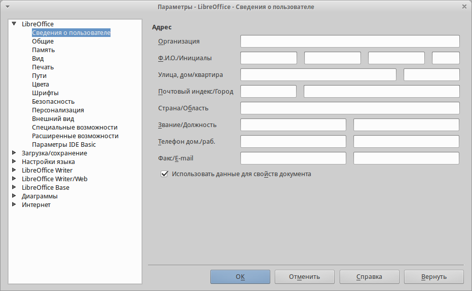
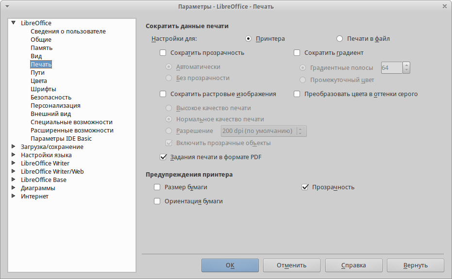
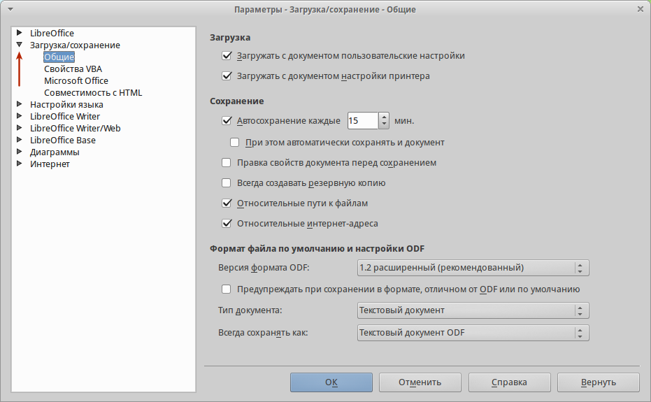

.. meta::
   :description: Краткое руководство по LibreOffice: Глава 2 – Общие параметры LibreOffice
   :keywords: LibreOffice, Writer, Impress, Calc, Math, Base, Draw, либреоффис

.. Список автозамен

.. |br| raw:: html

    

Глава 2 – Общие параметры LibreOffice
=====================================

В главе рассматриваются общие параметры, применяемые ко всем компонентам LibreOffice.

Выбор параметров, общих для всех компонентов LibreOffice
---------------------------------------------------------

Выберите в главном меню пункт :menuselection:`С&ервис --> &Параметры`. Список в левой части открывшегося окна :guilabel:`Параметры`  зависит от того, какой компонент LibreOffice открыт. Иллюстрации в этой главе показывают список параметров, доступный если открыт документ Writer.

Нажмите на маркер (``+`` или треугольник) слева от надписи LibreOffice, чтобы раскрыть список категорий. При выборе категории в списке в левой части окна, в правой части окна будут отображаться соответствующие этой категории настройки.

.. _ch2-lo-screen-002:

    Параметры LibreOffice. Сведения о пользователе

.. note:: В правом нижнем углу диалога :guilabel:`Параметры` расположена кнопка :guilabel:`Вернуть`, при нажатии на которую настройки будут возращены в значение, установленное до открытия диалогового окна :guilabel:`Параметры`. 

Сведения о пользователе
~~~~~~~~~~~~~~~~~~~~~~~

LibreOffice использует некоторые данные пользователя (Ф.И.О., инициалы, город, название организации и другие) в различных функциях, например, в полях с данными, примечаниях или в свойствах документа. Задать эти данные можно в разделе настроек LibreOffice – *Сведения о пользователе* (иллюстрация :ref:`ch2-lo-screen-002`).

Вы можете заполнить текстовые поля формы, удалить или изменить любую существующую информацию.

Общие
~~~~~

Ниже приведено описание параметров из категории :menuselection:`LibreOffice --> Общие`.

.. _ch2-lo-screen-003:

.. figure:: _static/chapter2/ch2-lo-screen-003.png
    :scale: 40%
    :align: center
    :alt: Выбор параметров вида для LibreOffice

    Выбор параметров вида для LibreOffice

**Справка**

* *Всплывающие подсказки* — если данная функция активирована, то при наведении курсора мыши на любой элемент интерфейса (значок, кнопку, поле, команду меню), будет появляться короткая всплывающая подсказка, описывающая действие того или иного элемента интерфейса.
* *Подробные всплывающие подсказки* — включает при наведении курсора мыши на любой элемент интерфейса (значок, кнопку, поле, команду меню) более подробные всплывающие подсказки. 

**Диалоги открытия/сохранения файлов**

* *Использовать диалоги LibreOffice* — включение этой функции позволяет использовать встроенные в LibreOffice диалоги открытия/сохранения файлов. Если функция не активна, то используются стандартные диалоги операционной системы. Подробнее о встроенных диалогах LibreOffice смотрите главу :ref:`Chapter-1-Introducing-LibreOffice`.

.. ==== Этот кусок не отображается при генерации ==============
.. В GS 4.3 про диалоги печати отсутствует информация. И сам пункт у меня в ЛО 4.3 отсутствует. Поэтому убираю этот раздел.
 
   Диалоги печати – Использовать диалоги LibreOffice (только для ОС Mac OS X) 
   Для использования стандартных диалогов печати Mac OS X, снимите флажок с опции Использовать диалоги LibreOffice. Если флажок у опции установлен, то будут использоваться диалоги печати, поставляемые с LibreOffice. В этой книге в иллюстрациях используются диалоги печати LibreOffice .

.. ==== Конец комментария =====================================

**Состояние документа**

* *Печать устанавливает состояние «документ изменён»* – если установлен флажок для этой опции, то в следующий раз при печати документа, дата печати будет записана в его свойства. А при попытке закрыть документ, будет выведено уведомление о сохранении документа, даже если с документом кроме печати ничего не происходило.

* *Разрешить сохранение документа даже при отсутствии изменений*  – по умолчанию, если документ не изменялся, пункт меню :menuselection:`&Файл --> Со&хранить` и значок :guilabel:`Сохранить` на стандартной панели инструментов неактивны. Также ничего не происходит и при нажатии сочетания клавиш `Ctrl + S`. При активации данной опции, документ  можно будет всегда сохранить, независимо от того изменялся ли он или нет.

.. note:: Функция :menuselection:`&Файл --> Сохранить &как` активна в любом случае.

**Год (двузначное число)**

* Определяет, как интерпретировать введенное двузначное число года. Например, если значение в поле установлено 1930 и пользователь вводит в документе дату ``1/1/30`` или более позднюю, то дата автоматически преобразовывается в ``1/1/1930``. Если задать дату ``1/1/20``, то она будет преобразована в ``1/1/2020``.

.. note:: Преобразование дат зависит от настроек языка. Например, в Российской Федерации числа в датах принято разделять точкой, а не косой чертой. В компонентах Calc и Base распознавание дат зависит от формата ячейки.

Память
~~~~~~

В категории :menuselection:`LibreOffice --> Память` настраивается потребление программой LibreOffice оперативной памяти компьютера.

При настройке параметров данной категории, следует учитывать, что увеличение количества доступной оперативной памяти сделает работу в LibreOffice более комфортной. Однако результатом этого может стать уменьшение доступной оперативной памяти для других приложений, что в общем итоге приведет к замедлению работы всего компьютера. Увеличивайте параметры потребления оперативной памяти только в том случае, если уверены, что у вашего компьютера хватит ресурсов.

Если документ содержит много объектов (например, изображений), то производительность может быть улучшена путем выделения большей памяти всей программе (параметр *использовать для LibreOffice*) или каждому объекту (параметр *Памяти на объект*). 

При нехватке оперативной памяти, может возникать ситуация, при которой некоторые объекты начинают исчезать. Это лишь визуальный эффект, объект просто не отображается, но остается в документе.

.. Если вам кажется, что объекты исчезают из документа, в котором их много, то необходимо перекреститься ;) 

.. _ch2-lo-screen-004:

.. figure:: _static/chapter2/ch2-lo-screen-004.png
    :scale: 40%
    :align: center
    :alt: Настройка параметров потребления оперативной памяти

    Настройка параметров потребления оперативной памяти

Для включения функции *Быстрый запуск*  необходимо установить галочку, напротив пункта *Использовать быстрый запуск*. Подробнее о быстром запуске смотрите главу :ref:`Chapter-1-Introducing-LibreOffice`.

Вид
~~~

Настройки из раздела :menuselection:`LibreOffice --> Вид` влияют на отображение окна документа и его поведение. Некоторые из этих настроек описаны ниже.

.. _ch2-lo-screen-001:

.. figure:: _static/chapter2/ch2-lo-screen-001.png
    :scale: 40%
    :align: center
    :alt: Выбор параметров вида для LibreOffice

    Выбор параметров вида для LibreOffice

**Пользовательский интерфейс**

* *Масштаб* — если текст в файлах справки или меню интерфейса LibreOffice слишком маленький или слишком большой, то можно изменить его размер, задав коэффициент масштаба (считая, что 100% — это нормально, меньше 100% — уменьшение, больше 100% увеличение). Иногда изменение этого параметра может иметь неожиданные последствия в зависимости от шрифтов, установленных в вашей системе. Но этот параметр не влияет на размер текста в вашем документе.

* *Размер и стиль значков* — первый параметр определяет размер значков на панелях инструментов (Автоматически, Маленькие или Большие). Значение *Автоматически* использует размер значков, установленный в настройках вашей операционной системы.

Второй параметр определяет набор (тему) значков. Здесь значение *Автоматически* использует набор значков, установленный по умолчанию операционной системой и настройками рабочего стола, например KDE или Gnome в Linux.

* *Системный шрифт для интерфейса* — в интерфейсе LibreOffice можно использовать шрифты, используемые по умолчанию операционной системой, вместо шрифтов, предлагаемых LibreOffice. Этот параметр не влияет на внешний вид документов.

* *Сглаживание экранных шрифтов* — активируйте этот пункт для сглаживания начертания шрифтов. Введите наименьший размер шрифта, начиная с которого шрифты будут сглаживаться. Данная настройка недоступна в ОС Windows.

.. ---------------------------

**Мышь**

* *Позиционирование мыши* — настраивает автоматическое перемещение курсора мыши в центр вновь открытого диалога, либо перемещение на кнопку по умолчанию вновь открытого диалога.

* *Средняя кнопка мыши*  — определяет действие при нажатии средней кнопки мыши: 
    * *Автоматический скроллинг* – медленная плавная прокрутка страницы документа.
    * *Вставить из буфера обмена* – при нажатии на среднюю кнопку мыши вставляет содержимое буфера обмена на позицию курсора.

Параметр *Вставить из буфера обмена* подразумевает работу со встроенным буфером обмена LibreOffice и не  зависит от системного буфера обмена, который обычно используется из меню :menuselection:`Правка --> Копировать/Вырезать/Вставить` или по соответствующим сочетаниям клавиш. 

Встроенный буфер обмена LibreOffic хранит последний выделенный объект (то есть достаточно просто выделить объект, без каких либо дополнительных действий по копированию). Системный буфер обмена и буфер обмена LibreOffice могут содержать различные объекты в одно и то же время. 

..  ======================================================
    Комментарий для Романа. Я сверялся с GS 4.2, они 
    там чуток изменили это описание. И у меня в настройках
    он тоже зовется просто "буфер обмена", хоть и имеется 
    ввиду внутренний буфер обмена LibreOffice.
    
    Поэтому я позволил себе вольность  и уточнил это
    словосочетанием "Встроенный буфер обмена LibreOffice"
    
..  ======================================================

В таблице ниже показаны различия между ними:

.. csv-table:: 
   :header: "Действие", "Системный буфер обмена", "Буфер обмена LibreOffice"
   :widths: 20, 20, 30
   
   "Копировать содержимое", ":menuselection:`&Правка --> &Копировать` (``Ctrl+C``)", "Выделен (просто выделен без дополнительных действий по копированию) текст, таблица или объект"
   "Вставить что-либо в документ",    ":menuselection:`&Правка --> Вставит&ь` (``Ctrl+V``) вставка на позицию текстового курсора.",    "Нажатие средней кнопки мыши вставляет содержимое внутрннего буфера обмена LibreOffice на позицию курсора"
   "Вставка в другой документ",    "Не влияет на содержимое буфера обмена",   "Последний выделенный фрагмент является содержимым буфера обмена LibreOffice"

.. ---------------------------

**Графический вывод**

* *Использовать аппаратное ускорение* — включает и выключает функцию непосредственного обращения к аппаратным функциям графического адаптера (видеокарты) для улучшения изображения на экране. Поддерживается не во всех операционных системах.
* *Использовать сглаживание* — включает и выключает сглаживание, которое делает отображение большинства графических объектов более гладким и с меньшим количеством артефактов. Поддерживается не во всех операционных системах.

.. tip:: Нажмите ``Shift+Ctrl+R`` для восстановления или обновления вида документа после изменения настроек сглаживания, чтобы увидеть эффект.

.. ---------------------------

**Меню**

* *Значки в меню* — настройка отображения значков в пунктах меню. Может принимать значение *Автоматически*, *Показать* или *Скрыть*.

.. ---------------------------

**Список шрифтов**

* *Предварительный просмотр шрифтов* — если флажок установлен, то список шрифтов выглядит, как на рисунке :ref:`ch2-lo-screen-001a` (слева), каждый шрифт отображается так, как он будет выглядеть в тексте. Если флажок снят, то список шрифтов будет выглядеть, как на рисунке :ref:`ch2-lo-screen-001a` (справа), весь список показан системным шрифтом.

.. _ch2-lo-screen-001a:

.. figure:: _static/chapter2/ch2-lo-screen-001a.png
    :scale: 60%
    :align: center
    :alt: Предварительный просмотр шрифтов
    
    Предварительный просмотр шрифтов

    Список шрифтов (слева) с предпросмотром; (справа) без предпросмотра

* *Показывать историю шрифтов* — если флажок установлен, то пять последних шрифтов, использованных в текущем документе, показываются вверху списка шрифтов. Их сортировка производится в алфавитном порядке.

.. ---------------------------

**Выделение**

* *Прозрачность* — определяет внешний вид затенения выбранного текста или рисунка при их выделении. Чтобы сделать фон выделения темнее или светлее, увеличьте или уменьшите значение прозрачности.

Если вы предпочитаете видеть выделенный фрагмент в реверсивных цветах (например, белый текст на чёрном фоне), то отключите эту настройку.

Печать
~~~~~~

В разделе *Печать* устанавливаются параметры печати. Большинство доступных для настройки опций не требует объяснения. 

Опция *Задание печати в формате PDF* не доступна в ОС Windows. Выберите этот параметр, чтобы изменить внутренний формат вывода на печеть из языка описания Postscript на вывод из PDF. Этот формат имеет ряд преимуществ по сравнению с PostScript [#]_.  Отмена выбора этой опции возвращает к Postscript.

.. [#] Для получения дополнительной информации смотрите  http://www.linuxfoundation.org/collaborate/workgroups/openprinting/pdf_as_standard_print_job_format

|br|

.. _ch2-lo-screen-005:

    
    Настройки печати

Для уменьшения вычислительной нагрузки на принтер или экономии расходных материалов (чернил или тонера), можно воспользоваться опциями *Сократить растровые изображения*, *Преобразовать цвета в оттенки серого*, *Сократить прозрачность* и другие. Вы можете поэкспериментировать с вашим принтером для подбора оптимальных настроек качества печати.

В разделе *Предупреждения принтера* можно выбрать предупреждения, показываемые если некоторые заданные параметры печати не соответствуют доступным параметрам вашего принтера. Включение предупреждений может быть весьма полезным, особенно при работе с документами, созданными людьми из других стран, в которых стандартный размер бумаги может отличаться.

.. tip:: Если напечатанный документ неправильно размещен на странице или обрезан с какой-либо стороны, или принтер отказывается печатать, то наиболее вероятной причиной является несоответствие размера страницы, заданной в документе, размеру бумаги в принтере.

Пути
~~~~

В разделе *Пути* можно просмотреть и настроить расположение файлов из профиля пользователя, используемых  LibreOffice в работе. Например, можно настроить другую папку, в которой будут храниться документы пользователя.

.. _ch2-lo-screen-006:

.. figure:: _static/chapter2/ch2-lo-screen-006.png
    :scale: 40%
    :align: center
    :alt: Просмотр путей к файлам, используемых LibreOffice
    
    Просмотр путей к файлам, используемых LibreOffice

Чтобы внести изменение, необходимо выбрать элемент из списка  и нажать кнопку *Правка* под списком. В открывшемся диалоге *Выбрать путь* добавьте или удалите каталоги и нажмите *ОК* для возврата к настройкам. Некоторые элементы могут иметь два пути: один в общем каталоге (который может быть в локальной сети) и еще один для конкретного пользователя (обычно на персональном компьютере пользователя).

.. _ch2-lo-screen-006a:

.. figure:: _static/chapter2/ch2-lo-screen-006a.png
    :scale: 60%
    :align: center
    :alt: Добавление или изменение путей
    
    Добавление или изменение путей

.. tip:: Вы можете использовать данные из категории *Пути*, для создания резервных копий или переноса своих личных настроек на другой компьютер.
 
Цвета
~~~~~

В разделе настроек *Цвета* можно указать цвета, используемые в палитрах документов LibreOffice. Можно выбрать цвет из палитры цветов, отредактировать его или задать новый цвет. Эти цвета хранятся в цветовой палитре и доступны из всех компонентов LibreOffice.

Для изменения цвета:

1. Выберите цвет для изменения из списка или цветовой таблицы.
2. Введите новое значение, определяющее цвет. Вы можете использовать RGB (Red, Green, Blue) или CMYK (Cyan, Magenta, Yellow, Black) схему указания цвета.
3. Рекомендуется изменять имя цвета.
4. Нажмите кнопку *Применить*. Вновь определенный цвет появится в цветовой таблице.

.. _ch2-lo-screen-007:

.. figure:: _static/chapter2/ch2-lo-screen-007.png
    :scale: 40%
    :align: center
    :alt: Настройка цветовой палитры
    
    Настройка цветовой палитры

Кроме того нажмите кнопку *Правка*, чтобы открыть диалог *Выбор цвета*, показанный на рисунке ниже. Здесь можно выбрать цвет в окне слева или ввести точные значения справа, используя цветовые схемы RGB, CMYK или HSB (Hue, Saturation and Brightness).

.. _ch2-lo-screen-007a:

    
    Диалог выбора цвета

Окно выбора цвета напрямую связано со значениями справа, в зависимости от выбора цвета в окне слева цифры справа изменятся. Цветовое поле под окном выбора цвета показывает выбранный цвет, который соответствует значениям цветов из правой части.

Измените цвет так, как требуется и нажмите кнопку *OK* для выхода из диалога. Вновь определенный цвет появится в поле *Цвет*, показанном на рисунке :ref:`ch2-lo-screen-007`. Введите имя для нового цвета в поле *Название* и нажмите кнопку *Добавить*. Маленькое окошко показывающее новый цвет появится в цветовой палитре.

Также добавлять или изменять цвета можно с помощью вкладки *Цвета* в диалоге *Область*. Данное диалоговое окно вызывается нажатием правой кнопкой мыши, например, на рисованном объект и выбором пункта *Область*. Однако цвета, заданные таким образом, не попадают в общую цветовую палитру LibreOffice и доступны только в том компоненте, в котором заданы.

Шрифты
~~~~~~

В разделе *Шрифты* можно определить замену для любых шрифтов, которые могут использоваться в документах. При получении документа, в котором используются шрифты, не установленные на данном компьютере, LibreOffice заменит эти шрифты на те, которые удастся найти в системе. Можно конкретно задать шрифт для замещения, отличный от того, который программа подбирает автоматически.

.. _ch2-lo-screen-008:

    
    Диалог шрифты

Для этого в разделе *Шрифты*:

1. Установите флажок у пункта *Применить таблицу замен*.
2. Выберите или введите имя шрифта, который будет заменяться, в поле *Гарнитура*. (Если у вас нет этого шрифта в системе, то он не появится в выпадающем списке, так что вы должны будете ввести его название сами).
3. В поле *Заменить на* выберите шрифт из выпадающего списка шрифтов установленных в вашей системе, на который будет произведена замена.
4. Нажмите на кнопку с зеленой галочкой справа от поля *Заменить на*. Строка с информацией о замене появится в большой таблице ниже полей ввода. Установите флажок в поле *Всегда* для принудительной замены шрифта, даже если он установлен в вашей системе. Установите флажок в поле *Экран* для замены шрифта только при отображении на экране, в этом случае при печати документа шрифт не меняется.
5. В нижней части страницы вы можете выбрать тип и размер шрифта для отображения исходного кода HTML и Basic (в макросах).

.. csv-table:: 
   :header: "Флажок в поле *Всегда*", "Флажок в поле *Экран*", "Результат"
   :widths: 17, 17, 30
   
    установлен,снят,"Шрифт будет заменён на экране и при печати, независимо от того, установлен шрифт или нет"
    установлен,установлен,"Шрифт будет заменён только на экране, независимо от того, установлен шрифт или нет "
    снят,установлен,"Шрифт будет заменён только на экране и только в том случае, если шрифт недоступен в системе"
    снят,снят,"Шрифт будет заменён и на экране и при печати только в том случае, если шрифт недоступен  в системе"

Безопасность
~~~~~~~~~~~~

Используйте раздел *Безопасность* для выбора настроек безопасности при сохранении документа и при открытии документа, содержащего макросы.

.. _ch2-lo-screen-009:

.. figure:: _static/chapter2/ch2-lo-screen-009.png
    :scale: 40%
    :align: center
    :alt: Настройки безопасности при открытии и сохранении документов
    
    Настройки безопасности при открытии и сохранении документов

**Параметры и предупреждения безопасности** — при использовании функции записи изменений, контроля версий, включения скрытой информации или комментариев можно установить вывод уведомлений об удалении подобной информации перед сохранением документа или же можно позволить  LibreOffice удалять её в автоматическом режиме. Большая часть этой информации остается в файле (если ее не удалить), независимо от того, в каком формате сохраняется документ (в том числе и при экспорте в PDF).

Нажмите кнопку *Параметры*, чтобы открыть отдельное диалоговое окно с конкретными вариантами.

.. _ch2-lo-screen-009a:

    
    Параметры  и предупреждения безопасности

* **Удалять личную информацию при сохранении** — установите флажок рядом с этим пунктом для принудительного удаления личных данных пользователя из свойств документа при сохранении файла. Для ручного удаления персональных данных из свойств документа снимите флажок у этого пункта и нажмите кнопку *Сброс* в меню :menuselection:`Файл --> Свойства --> Общие`.

* **Ctrl-щелчок необходим для перехода по гиперссылкам** — по умолчанию LibreOffice требует нажатия клавиши ``Ctrl`` при нажатии мышью по гиперссылке для перехода по ней, потому что многие люди считают, что редактировать документ проще, если при случайном нажатии на гиперссылки ничего не происходит. Для того, чтобы LibreOffice осуществлял переход по гиперссылкам простым щелчком мыши (без нажатия клавиши ``Ctrl``), снимите флажок у этого пункта.

**Безопасность макросов** — нажмите кнопку  *Безопасность макросов*, чтобы открыть соответствующий диалог, где вы сможете настроить уровень безопасности для выполнения макросов и указать доверенные источники.

.. _ch2-lo-screen-017:

    
    Параметры безопасности макросов

Персонализация
~~~~~~~~~~~~~~

Персонализация позволяет добавить тему оформления в LibreOffice. Вы можете выбрать *Не использовать тему*, *Предустановленная тема* или *Другая тема*. По умолчанию выбран вариант *Предустановленная тема*.

.. _ch2-lo-screen-018:

    
    Параметры персонализации

Чтобы установить тему, нажмите кнопку *Выбрать тему*, откроется диалог, показанный на рисунке ниже. Из этого диалога вы можете установить тему, вписав локальный адрес расположения темы или нажать кнопку *Перейти на сайт* (требуется соединение с Интернет). Инструкция по установке написана прямо в диалоговом окне. 

.. _ch2-lo-screen-019:

    
    Установка темы

После ввода ссылки на тему (например, https://addons.mozilla.org/ru/firefox/addon/greenleafs-v2/) к верхней части рабочей области LibreOffice будет применена выбранная тема.

.. _ch2-lo-screen-020:

    
    Установленная тема

Внешний вид
~~~~~~~~~~~

Написание, редактирование и (особенно) создание макета страницы зачастую выполнить проще, если вы можете видеть границы страницы (границы текста), границы таблиц и секций (в документах Writer), разрывы страниц в Calc, линии сетки в Draw или Writer и другие возможности. Кроме того, вы можете использовать цвета, которые отличаются от значений по умолчанию в LibreOffice для таких элементов, как индикаторы комментариев или затенения полей.

На странице настроек :menuselection:`LibreOffice --> Внешний вид`  можно указать, какие элементы отображать, а также каким цветом они будут.

* Чтобы отобразить или скрыть элементы такие, как границы текста, установите или снимите флажок рядом с названием элемента.

* Чтобы изменить цвет элемента, нажмите на выпадающий список справа от имени элемента в колонке *Цвет* и выберите нужный цвет. Обратите внимание, что вы можете изменить список доступных цветов, как это описано в разделе `Цвета`_.

* Чтобы сохранить изменение цвета темы, нажмите кнопку *Сохранить*, введите имя в поле *Схема* и нажмите *OK*.

.. _ch2-lo-screen-012:

    
    Настройки внешнего вида

Специальные возможности
~~~~~~~~~~~~~~~~~~~~~~~

Категория настроек :guilabel:`Специальные возможности` включает в себя специальные опции, предназначенные для людей с ограниченными возможности.  Установите флажки возле необходимых вам функций. Например, можно настроить длительность отображения подсказок или разрешить ли использование анимированной графики.

.. _ch2-lo-screen-013:

    Настройка специальных возможностей

.. note:: В ОС Linux в данной категории отсутствует параметр *Поддержка технических средств реабилитации*, так как они обычно встроены в окружение рабочего стола.

Расширенные возможности
~~~~~~~~~~~~~~~~~~~~~~~~

**Параметры Java**

Если Java Runtime Environment (JRE) была установлена или обновлена после установки LibreOffice или используется несколько версий JRE, установленных на компьютере, то на вкладке *Расширенные возможности* в разделе *Параметры Java* можно выбрать версию JRE для использования в LibreOffice.

Если вы системный администратор, программист или другое лицо, которое настраивает JRE, то вы можете использовать кнопки *Параметры* или *Путь класса*, чтобы указать нужную информацию.

Если вы не видите списка доступных Java  в окне (но знаете точно, что JRE установлен), то подождите немного, пока LibreOffice ищет JRE на вашем жестком диске.

Если LibreOffice нашел одну или более версий JRE, они будут отображены на экране. Вы можете отметить флажком пункт *Использовать виртуальную машину Java* и (при необходимости) выберите одну из списка версий JRE.

.. _ch2-lo-screen-014:

    Настройка расширенных возможностей

**Дополнительные (нестабильные) параметры**

* **Включить экспериментальные возможности** — активация этого пункта включает возможности, которые не завершены или могут работать некорректно. Список таких возможностей изменяется от версии к версии.

* **Включить запись макросов** — этот пункт включает запись макросов с некоторыми ограничениями. Открытие окна, переключение между окнами и запись действий в другом окне, а не в том, где запись началась, не поддерживается. Записать можно только действия, связанные с содержимым документа, изменения параметров или настройка меню не поддерживаются. Более подробную информацию о записи макросов смотрите в *Главе 13 — Начало работы с макросами* данного руководства.

Параметры IDE Basic
~~~~~~~~~~~~~~~~~~~

Основные параметры IDE  Basic доступны после активации экспериментальных функций в категории `Расширенные возможности`_. Эти параметры нужны пользователям, занимающимся программированием макросов. Данные параметры не обсуждаются в рамках этого руководства.

.. _ch2-lo-screen-015:

.. figure:: _static/chapter2/ch2-lo-screen-015.png
    :scale: 40%
    :align: center
    :alt: Настройка параметров IDE Basic

    Настройка параметров IDE Basic

Проверка обновлений
~~~~~~~~~~~~~~~~~~~

В категории :menuselection:`LibreOffice --> Проверка обновлений` настраивается частота проверки обновлений программы. Если установить галочку напротив параметра *Проверять обновления автоматически*, то при наличии обновлений в правой части строки меню будет появляться специальная кнопка. Нажатие на данную кнопку открывает диалоговое окно, в котором можно запустить загрузку обновления.

Если установить флажок у пункта *Загружать обновления автоматически*, то загрузка начнется сразу после нажатия на специальную кнопку. Чтобы изменить каталог для сохранения загрузки, нажмите кнопку *Изменить...* и выберите нужный каталог в открывшемся окне.

.. _ch2-lo-screen-016:

    Настройка проверки обновлений

.. note:: В некоторых сборках LibreOffice для ОС Linux данная категория настроек может отсутствовать, так как в ОС Linux обновления проверяются и устанавливаются централизованно, с помощью репозиториев.

----------------------------------------------------

Выбор параметров Загрузка/сохранение
-------------------------------------

Вы можете настроить параметры *Загрузка/сохранение* для загрузки и сохранения документов в соответствии с вашими потребностями в работе.

Если диалоговое окно *Параметры* еще не открыто, то нажмите в главном меню :menuselection:`Сервис --> Параметры`. Нажмите в левой части окна на значок (``+`` или треугольник) слева от пункта *Загрузка/сохранение*.

Общие
~~~~~

Большинство вариантов выбора на странице настроек :menuselection:`Загрузка/сохранение --> Общие` знакомы пользователям других офисных пакетов. Некоторые интересные элементы описаны ниже. 

.. _ch2-lo-screen-021:

    Общие параметры загрузки и сохранения

**Загрузить пользовательские настройки вместе с документом**

Документ LibreOffice содержит некоторые параметры, которые считываются из системы пользователя. Когда вы сохраняете документ, эти настройки сохраняются вместе с ним.

Активируйте эту настройку, чтобы при открытии документа игнорировались сохраненные настройки, а использовались настройки с вашего компьютера.

Даже если эта опция неактивна, некоторые настройки взяты из вашего LibreOffice:

* Настройки, доступные в главном меню :menuselection:`Файл --> Печать --> Настройки`;
* Имя факса;
* Настройки интервалов для абзацев перед текстовыми таблицами;
* Информация об автоматическом обновлении ссылок, функций полей и диаграмм;
* Информация о работе с азиатскими кодировками.

Следующие настройки всегда загружаются вместе с документом, независимо от того, активна опция или нет:

* Источник данных связанный с документом и его видом.

Если вы отключите эту опцию, то личные настройки пользователя не отменят настройки в документе. Например ваш выбор (в настройках LibreOffice Writer) того, как обновлять ссылки, зависит от опции *Загрузить пользовательские настройки*.

**Загружать параметры принтера вместе с документом**

Если опция активна, то настройки принтера будут загружены вместе с документом. Это может привести к печати документа на удаленном принтере (находящемся в соседнем офисе), если вы не выберите принтер вручную в диалоге печати. Если опция неактивна, то ваш стандартный принтер будет использован при печати документа. Текущие настройки принтера будут сохранены с документом независимо от того, активна или нет эта опция.

**Правка свойств документа перед сохранением**

Если вы отметите флажком эту опцию, то диалог *Свойства документа* будет открыт при первой попытке сохранения документа и попросит ввести соответствующую информацию (или каждый раз, когда вы используете пункт *Сохранить как...*).

**Всегда создавать резервную копию**

Сохраняет предыдущую копию документа в качестве резервной копии при сохранении документа. Каждый раз, когда LibreOffice создает резервную копию, предыдущая резервная копия будет заменена новой. Файл резервной копии имеет расширение ``.bac``. Авторы, чья работа с документом занимает очень много времени, должны задуматься об использовании этой опции.

**Автосохранение каждые n минут**

Выберите, следует ли включать автосохранение и как часто это делать для для функции *Автовосстановления*.

*Автовосстановление* в LibreOffice сохраняет информацию для восстановления всех открытых документов в случае сбоя в программе. Если эта опция активна, то восстановление документа в случае сбоя программы будет проще.

**Относительные пути к файлам**

Используйте эту опцию чтобы выбрать относительную адресацию в файловой системе и в интернет. Относительная адресация возможна только, если и исходный документ и упоминаемый в нем другой документ находятся на одном диске.

Относительный адрес всегда начинается с каталога, где находится текущий документ. В отличие от относительного абсолютный путь всегда начинается с корневого каталога. В таблице ниже показаны различия в синтаксисе между относительными и абсолютными ссылками.

.. csv-table:: 
    :header: "Тип", "Файловая система", "Интернет"
    :widths: 10, 15, 15
    
    "Относительная","``../images/img.jpg``","``../images/img.jpg``"
    "Абсолютная","``file:///c:/work/images/img.jpg``","``http://myserver.com/work/images/img.jpg``"

Если вы решите сохранять относительные пути, то ссылки на встроенную графику или другие объекты в вашем документе будут сохранены относительно местоположения в файловой системе. В этом случае не имеет значения, где в структуре каталогов записана ссылка. Файлы будут найдены вне зависимости от местонахождения, пока ссылка остается на том же диске или разделе. Это важно, если вы хотите сделать документ доступным на других компьютерах, имеющих совершенно отличную от вашего структуру каталогов, дисков или наименований разделов. Кроме того рекомендуется сохранять относительные пути, если вы хотите создать структуру каталогов на интернет-сервере.

Если вы предпочтете сохранение абсолютных путей, то все ссылки на другие файлы будут определены, как абсолютные, основанные на соответствующем диске, разделе или корневом каталоге. Преимущество абсолютных путей в том, что можно переместить сам документ в другой каталог, а все ссылки останутся правильными.

.. note:: По умолчанию используются относительные пути.

**Формат файла по умолчанию и настройки ODF**

**Версия формата ODF** — LibreOffice по умолчанию сохраняет документы в формат ODF версии 1.2 (Расширенный). Это позволяет использовать улучшенную функциональность, но может создать проблемы с совместимостью. Если файл сохранённый в формате ODF 1.2 (Расширенный) будет открыт в редакторе, использующем раннюю версию ODF (1.0/1.1), некоторые из функций могут быть утеряны. Два заметных примера  - это перекрестные ссылки на заголовки и нумерованные списки. Если вы планируете обмениваться документами с людьми, использующими старые версии ODF, то вы можете сохранять документ, используя версию 1.0/1.1.

**Тип документа** — если вы часто обмениваетесь документами с пользователями Microsoft Office, то вы можете выбрать для документа  в поле *Всегда сохранять как* один из форматов Microsoft Office.

Свойства VBA
~~~~~~~~~~~~~~~~~~~~

В разделе *Свойства VBA* можно выбрать, следует ли  сохранить какие-то макросы в документах Microsoft Office при их открытии в LibreOffice.

Если вы отметили флажком пункт *Загрузить код Basic*, вы можете редактировать макрос в LibreOffice. Измененный код сохранится в документе ODF и не сохранится при сохранении в формат Microsoft Office.

Если вы отметили флажком пункт *Сохранять исходный код Basic*, то макросы не будут работать в LibreOffice, но сохранятся при сохранении файла в формате Microsoft Office.

При импорте файлов Microsoft Word или Excel, содержащих код :abbr:`VBA (Visual Basic for Applications)`, вы можете выбрать опцию *Исполняемый код*. 

.. Если обычно код сохраняется, но в нерабочем состоянии (если вы посмотрите его во встроенной IDE, то увидите, что он весь закомментирован), то с этой опцией код готов к исполнению.

.. _ch2-lo-screen-022:

    Выбор параметров VBA

Опция *Сохранять исходный код Basic* имеет приоритет над опцией *Загрузить код Basic*. Если оба пункта помечены флажками, и вы редактировали отключенный код в LibreOffice, то оригинальный код Microsoft Basic будет сохранён при сохранении в формате Microsoft Office.

Чтобы удалить все возможные макровирусы из документа Microsoft Office, снимите флажок у пункта *Сохранять исходный код Basic*. Документ будет сохранён без кода Microsoft Basic.

Microsoft Office
~~~~~~~~~~~~~~~~~~~~

На вкладке *Microsoft Office* вы можете выбрать, что делать при импорте и экспорте объектов Microsoft Office OLE (связанные или встроенные объекты или документы, содержащие электронные таблицы или формулы).

Отмечайте флажком опции в колонке [З], чтобы конвертировать объекты Microsoft OLE в соответствующие OLE объекты LibreOffice, если документы Microsoft открываются в LibreOffice («З» от слова «Загрузка»).

Отмечайте флажком опции в колонке [С], чтобы конвертировать объекты LibreOffice OLE в соответствующие объекты Microsoft OLE, если документ сохраняется в формате Microsoft («С» от слова «Сохранить»).

.. _ch2-lo-screen-023:

    Настройка импорта и экспорта объектов Microsoft Office OLE

Совместимость с HTML
~~~~~~~~~~~~~~~~~~~~

Настройки на вкладке *Совместимость с HTML* влияют на совместимость страниц HTML открытых в LibreOffice и экспортированных из LibreOffice. Смотрите *документы HTML; импорт/экспорт* во встроенной *Справке* для получения более подробной информации.

.. _ch2-lo-screen-024:

    Выбор настроек совместимости HTML

**Size-кегль**

Используйте эти поля чтобы определить соответствующие размеры шрифта для тэгов ``HTML  to ``, если они используются на странице HTML. (Многие страницы больше не используют эти тэги).

**Импорт** — числа в формате «Английский (США)»

При импорте чисел из страницы HTML разделитель целой и дробной части и разделитель разрядов различаются в зависимости от локали страницы HTML. Буфер обмена однако ничего о локали не знает. Если эта опция не активна, то числа интерпретируются согласно настроек локали в разделе :menuselection:`Сервис --> Параметры --> Настройки языка --> Языки`. Если опция активна, числа интерпретируются, как в английской (США) локали.

**Импорт** — импортировать неизвестные HTML тэги, как поля.

Отметьте флажком этот пункт если вам нужны тэги, не воспринимаемые LibreOffice, в виде полей. Для открывающего тэга будет создано поле HTML_ON со значением в виде имени тэга. Для закрывающего тэга будет создано поле HTML_OFF. Эти поля будет конвертированы в тэги при экспорте в HTML.

**Импорт** — игнорировать настройки шрифта

Отметьте флажком этот пункт чтобы LibreOffice игнорировал все настройки шрифтов при импорте. Будут использоваться шрифты, определенные в стиле страницы HTML.

**Экспорт**

Для оптимизации HTML экспорта выберите браузер или стандарт HTML из выпадающего списка. Если выбран LibreOffice Writer, то специальные инструкции LibreOffice Writer будут экспортированы.

**Экспорт** — LibreOffice Basic

Отметьте флажком этот пункт для включения макросов (скриптов) LibreOffice Basic при экспорте в формат HTML. Вы должны активировать эту опцию перед созданием макроса, в противном случае макрос (скрипт) не будут вставлены. Макрос  LibreOffice Basic должен находится в заголовке документа HTML. 

Как только вы создадите макрос в LibreOffice Basic IDE, он появляется в исходном тексте документа HTML в заголовке.

Если вы хотите, чтобы макрос запускался автоматически при открытии документа HTML, выберите его в меню :menuselection:`Сервис --> Настройка --> События`. Смотрите *главу 13 Введение в макросы* для получения более подробной информации.

**Экспорт** — Показывать предупреждения

Если опция *LibreOffice Basic* (смотрите выше) не отмечена флажком, то опция *Показать предупреждение* станет доступной для выбора. Если пункт Показать предупреждение отмечен, то при экспорте в HTML будет показано предупреждение, что все макросы LibreOffice Basic будут утеряны.

**Экспорт** — Разметка печати

Выберите эту опцию для экспорта разметки печати текущего документа. HTML фильтр поддерживает CSS2 (Cascading Style Sheets Level 2) для печати документов. Эти возможности дают эффект только в том случае, если опция активна.

**Экспорт** — Копировать локальную графику в Интернет

Отметьте эту опцию для автоматической загрузки встроенных в документ изображений на интернет-сервер при загрузке с помощью FTP.

**Экспорт** — Кодировка

Выберите соответствующую кодировку из выпадающего списка для экспорта.

-----------------------------------------------------------------

Выбор параметров языка
----------------------

Необходимо выполнить несколько пунктов для настройки языка в LibreOffice:

* Установить необходимые словари;
* Изменить локальные и языковые настройки;
* Выбрать параметры проверки орфографии.

Установка необходимых словарей
~~~~~~~~~~~~~~~~~~~~~~~~~~~~~~~~~~~~

LibreOffice автоматически устанавливает несколько словарей вместе с программой. Чтобы добавить другие словари, вы должны иметь подключение к Интернет и использовать пункт главного меню :menuselection:`Сервис --> Язык --> Словари в Интернете`. LibreOffice откроет в вашем веб-браузере страницу со ссылками на дополнительные словари, которые вы можете установить. Следуйте инструкциям по выбору и установке тех словарей, которые вам необходимы.

Смена локальных и языковых настроек
~~~~~~~~~~~~~~~~~~~~~~~~~~~~~~~~~~~~

Вы можете изменить некоторые из локальных и языковых настроек, которые используются в LibreOffice для всех документов или только для определенных документов.

В левой части меню :menuselection:`Сервис --> Параметры` нажмите :menuselection:`Настройки языка --> Языки`. В каком виде вы увидите  список зависти от настроек раздела *Языки документов по умолчанию*.

.. _ch2-lo-screen-025:

    Выбор настроек языка

В правой стороне раздела :menuselection:`Настройки языка --> Языки` можно выбрать язык для пунктов *Пользовательский интерфейс* и Л*окальные настройки*, валюту для пункта *Валюта по умолчанию* и установить настройки раздела *Языки документов по умолчанию*.

Если вы хотите применить настройки языка только к текущему документу, то выберите пункт *Только для текущего документа*.

При необходимости выберите нужные параметры, чтобы включить поддержку азиатских языков (китайского, японского, корейского) и поддержку языков :abbr:`CTL (Complex text layout)`, таких как урду, тайский, иврит и арабский. Если вы выберите любой из этих вариантов, то в следующий раз вы увидите расширенный перечень настроек в пункте *Настройки языка*. Эти пункты (*Поиск в японском языке*, *Разметка восточно-азиатского текста* и *Сложные системы письменности*) в данном руководстве не рассматриваются.

Выбор параметров лингвистики
~~~~~~~~~~~~~~~~~~~~~~~~~~~~~~~~~~~~

Чтобы выбрать настройки проверки орфографии, выберите :menuselection:`Настройки языка --> Лингвистика`. На странице настроек  выберите параметры, удобные для вас.

Некоторые подсказки:

* Если вы не хотите осуществлять проверку орфографии сразу при вводе текста, то отключите опцию *Автоматически проверять орфографию*. Эта опция также может быть отключена нажатием на соответствующую кнопку на стандартной паенли инструментов.
* Если вы хотите, чтобы грамматика проверялась при вводе текста, то активируйте соответствующую опцию, при этом опция *Автоматически проверять орфографию* также должна быть активна.
* Если вы используете личный словарь, содержащий слова в верхнем регистре и слова с цифрами (например, АС/400), то сделайте активными опции *Проверять слова*, написанные прописными буквами и *Проверять слова с цифрами*.
* Опция *Проверять специальные области* включает проверку орфографии в колонтитулах, вставках и таблицах.

Здесь вы также можете определить, какие пользовательские словари использовать. Добавить или удалить пользовательский словарь можно нажав на кнопки *Создать* и *Удалить* соответственно. Словари, установленные в системе, удалить невозможно.

.. _ch2-lo-screen-026:

    Выбор языков, словарей и параметров проверки орфографии

Выбор параметров Интернет
~~~~~~~~~~~~~~~~~~~~~~~~~~~~~~~~~~~~

Используйте раздел настроек *Интернет*, чтобы определить поисковые системы и сохранить настройки прокси в LibreOffice.
Если вы используете браузер Mozilla Firefox в Windows или Linux, то вы можете включить плагин, который может открывать файлы LibreOffice в вашем браузере, печатать их, сохранять их и работать с ними.

Если вы используете Unix- или Linux-подобную операционную систему (включая Mac OS X), то вам доступна дополнительная страница настроек *Электронная почта*, где вы можете задать вашу программу для чтения электронной почты в качестве средства отправки текущего документа. В ОС Windows всегда используется почтовая программа указанная в системных настройках по умолчанию.

.. _ch2-lo-screen-027:

    Настройки *Интернет*, показана страница *Электронная почта*, доступная пользователям Linux

В поставку включен также издатель MediaWiki. Чтобы его активировать, выбрите пункт MediaWiki в категории *Интернет* и нажмите кнопку *Add*, чтобы открылся диалог, в котором вы можете указать адрес (URL) и информацию о логине на сервере. Вы можете добавить несколько вики в список.

------

Управление функцией Автозамена в LibreOffice
---------------------------------------------

Автозамены являются удобным инструментом при наборе текста, особенно если его предварительно настроить. Но в некоторых ситуациях функция автозамены может наоборот мешать. Чтобы настроить функцию автозамены воспользуйтесь диалогом *Автозамена*.

Чтобы открыть диалог *Автозамена*, выберите в  меню :menuselection:`Фо&рмат --> Авто&замена --> Параметры &автозамены` (документ должен быть открыт, чтобы данный пункт меню был доступным). В Writer этот диалог имеет пять вкладок, показанных на рисунке :ref:`ch2-lo-screen-028`. В других компонентах LibreOffice этот диалог имеет только четыре вкладки. За более подробной информацией обратитесь к руководствам по соответствующим компонентам.

.. _ch2-lo-screen-028:

    Параметры автозамены
