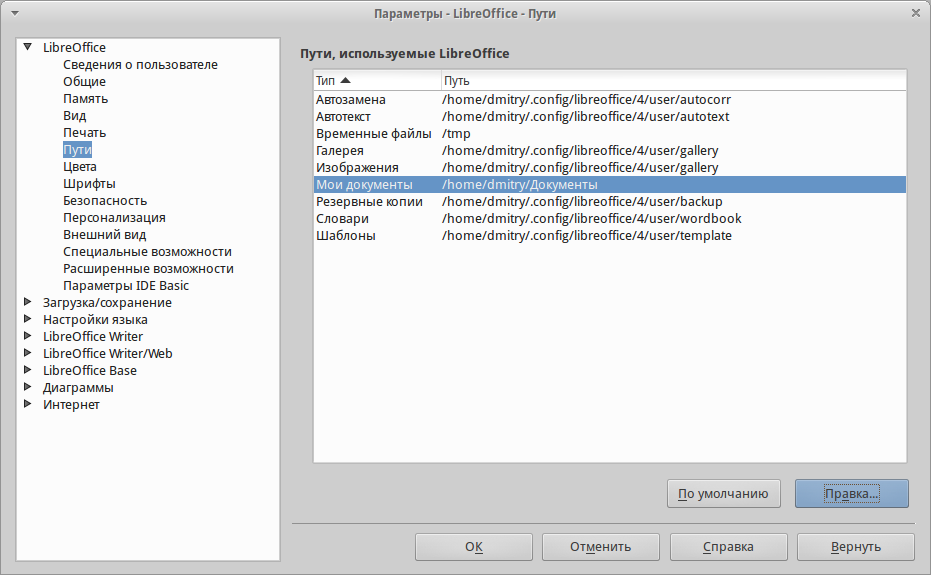

.. meta::
   :description: Краткое руководство по LibreOffice 
   :keywords: LibreOffice, Writer, Impress, Calc, Math, Base, Draw, либреоффис

.. Список автозамен

.. |br| raw:: html

    

Глава 2 – Общие параметры LibreOffice
=====================================

В главе рассматриваются общие параметры, применяемые ко всем компонентам LibreOffice.

Выбор параметров, общих для всех компонентов LibreOffice
---------------------------------------------------------

Выберите в главном меню пункт :menuselection:`С&ервис --> &Параметры`. Список в левой части открывшегося окна :guilabel:`Параметры`  зависит от того, какой компонент LibreOffice открыт. Иллюстрации в этой главе показывают список параметров, доступный если открыт документ Writer.

Нажмите на маркер (``+`` или треугольник) слева от надписи LibreOffice, чтобы раскрыть список категорий. При выборе категории в списке в левой части окна, в правой части окна будут отображаться соответствующие этой категории настройки.

.. _ch2-lo-screen-002:

.. figure:: _static/chapter2/ch2-lo-screen-002.png
    :scale: 40%
    :align: center
    :alt: Параметры LibreOffice. Сведения о пользователе

    Параметры LibreOffice. Сведения о пользователе

.. note:: В правом нижнем углу диалога :guilabel:`Параметры` расположена кнопка :guilabel:`Вернуть`, при нажатии на которую настройки будут возращены в значение, установленное до открытия диалогового окна :guilabel:`Параметры`. 

Сведения о пользователе
~~~~~~~~~~~~~~~~~~~~~~~

LibreOffice использует некоторые данные пользователя (Ф.И.О., инициалы, город, название организации и другие) в различных функциях, например, в полях с данными, примечаниях или в свойствах документа. Задать эти данные можно в разделе настроек LibreOffice – *Сведения о пользователе* (иллюстрация :ref:`ch2-lo-screen-002`).

Вы можете заполнить текстовые поля формы, удалить или изменить любую существующую информацию.

Общие
~~~~~

Ниже приведено описание параметров из категории :menuselection:`LibreOffice --> Общие`.

.. _ch2-lo-screen-003:

.. figure:: _static/chapter2/ch2-lo-screen-003.png
    :scale: 40%
    :align: center
    :alt: Выбор параметров вида для LibreOffice

    Выбор параметров вида для LibreOffice

**Справка**

* *Всплывающие подсказки* — если данная функция активирована, то при наведении курсора мыши на любой элемент интерфейса (значок, кнопку, поле, команду меню), будет появляться короткая всплывающая подсказка, описывающая действие того или иного элемента интерфейса.
* *Подробные всплывающие подсказки* — включает при наведении курсора мыши на любой элемент интерфейса (значок, кнопку, поле, команду меню) более подробные всплывающие подсказки. 

**Диалоги открытия/сохранения файлов**

* *Использовать диалоги LibreOffice* — включение этой функции позволяет использовать встроенные в LibreOffice диалоги открытия/сохранения файлов. Если функция не активна, то используются стандартные диалоги операционной системы. Подробнее о встроенных диалогах LibreOffice смотрите главу :ref:`Chapter-1-Introducing-LibreOffice`.

.. ==== Этот кусок не отображается при генерации ==============
.. В GS 4.3 про диалоги печати отсутствует информация. И сам пункт у меня в ЛО 4.3 отсутствует. Поэтому убираю этот раздел.
 
   Диалоги печати – Использовать диалоги LibreOffice (только для ОС Mac OS X) 
   Для использования стандартных диалогов печати Mac OS X, снимите флажок с опции Использовать диалоги LibreOffice. Если флажок у опции установлен, то будут использоваться диалоги печати, поставляемые с LibreOffice. В этой книге в иллюстрациях используются диалоги печати LibreOffice .

.. ==== Конец комментария =====================================

**Состояние документа**

* *Печать устанавливает состояние «документ изменён»* – если установлен флажок для этой опции, то в следующий раз при печати документа, дата печати будет записана в его свойства. А при попытке закрыть документ, будет выведено уведомление о сохранении документа, даже если с документом кроме печати ничего не происходило.

* *Разрешить сохранение документа даже при отсутствии изменений*  – по умолчанию, если документ не изменялся, пункт меню :menuselection:`&Файл --> Со&хранить` и значок :guilabel:`Сохранить` на стандартной панели инструментов неактивны. Также ничего не происходит и при нажатии сочетания клавиш `Ctrl + S`. При активации данной опции, документ  можно будет всегда сохранить, независимо от того изменялся ли он или нет.

.. note:: Функция :menuselection:`&Файл --> Сохранить &как` активна в любом случае.

**Год (двузначное число)**

* Определяет, как интерпретировать введенное двузначное число года. Например, если значение в поле установлено 1930 и пользователь вводит в документе дату ``1/1/30`` или более позднюю, то дата автоматически преобразовывается в ``1/1/1930``. Если задать дату ``1/1/20``, то она будет преобразована в ``1/1/2020``.

.. note:: Преобразование дат зависит от настроек языка. Например, в Российской Федерации числа в датах принято разделять точкой, а не косой чертой. В компонентах Calc и Base распознавание дат зависит от формата ячейки.

Память
~~~~~~

В категории :menuselection:`LibreOffice --> Память` настраивается потребление программой LibreOffice оперативной памяти компьютера.

При настройке параметров данной категории, следует учитывать, что увеличение количества доступной оперативной памяти сделает работу в LibreOffice более комфортной. Однако результатом этого может стать уменьшение доступной оперативной памяти для других приложений, что в общем итоге приведет к замедлению работы всего компьютера. Увеличивайте параметры потребления оперативной памяти только в том случае, если уверены, что у вашего компьютера хватит ресурсов.

Если документ содержит много объектов (например, изображений), то производительность может быть улучшена путем выделения большей памяти всей программе (параметр *использовать для LibreOffice*) или каждому объекту (параметр *Памяти на объект*). 

При нехватке оперативной памяти, может возникать ситуация, при которой некоторые объекты начинают исчезать. Это лишь визуальный эффект, объект просто не отображается, но остается в документе.

.. Если вам кажется, что объекты исчезают из документа, в котором их много, то необходимо перекреститься ;) 

.. _ch2-lo-screen-004:

    Настройка параметров потребления оперативной памяти

Для включения функции *Быстрый запуск*  необходимо установить галочку, напротив пункта *Использовать быстрый запуск*. Подробнее о быстром запуске смотрите главу :ref:`Chapter-1-Introducing-LibreOffice`.

Вид
~~~

Настройки из раздела :menuselection:`LibreOffice --> Вид` влияют на отображение окна документа и его поведение. Некоторые из этих настроек описаны ниже.

.. _ch2-lo-screen-001:

.. figure:: _static/chapter2/ch2-lo-screen-001.png
    :scale: 40%
    :align: center
    :alt: Выбор параметров вида для LibreOffice

    Выбор параметров вида для LibreOffice

**Пользовательский интерфейс**

* *Масштаб* — если текст в файлах справки или меню интерфейса LibreOffice слишком маленький или слишком большой, то можно изменить его размер, задав коэффициент масштаба (считая, что 100% — это нормально, меньше 100% — уменьшение, больше 100% увеличение). Иногда изменение этого параметра может иметь неожиданные последствия в зависимости от шрифтов, установленных в вашей системе. Но этот параметр не влияет на размер текста в вашем документе.

* *Размер и стиль значков* — первый параметр определяет размер значков на панелях инструментов (Автоматически, Маленькие или Большие). Значение *Автоматически* использует размер значков, установленный в настройках вашей операционной системы.

Второй параметр определяет набор (тему) значков. Здесь значение *Автоматически* использует набор значков, установленный по умолчанию операционной системой и настройками рабочего стола, например KDE или Gnome в Linux.

* *Системный шрифт для интерфейса* — в интерфейсе LibreOffice можно использовать шрифты, используемые по умолчанию операционной системой, вместо шрифтов, предлагаемых LibreOffice. Этот параметр не влияет на внешний вид документов.

* *Сглаживание экранных шрифтов* — активируйте этот пункт для сглаживания начертания шрифтов. Введите наименьший размер шрифта, начиная с которого шрифты будут сглаживаться. Данная настройка недоступна в ОС Windows.

.. ---------------------------

**Мышь**

* *Позиционирование мыши* — настраивает автоматическое перемещение курсора мыши в центр вновь открытого диалога, либо перемещение на кнопку по умолчанию вновь открытого диалога.

* *Средняя кнопка мыши*  — определяет действие при нажатии средней кнопки мыши: 
    * *Автоматический скроллинг* – медленная плавная прокрутка страницы документа.
    * *Вставить из буфера обмена* – при нажатии на среднюю кнопку мыши вставляет содержимое буфера обмена на позицию курсора.

Параметр *Вставить из буфера обмена* подразумевает работу со встроенным буфером обмена LibreOffice и не  зависит от системного буфера обмена, который обычно используется из меню :menuselection:`Правка --> Копировать/Вырезать/Вставить` или по соответствующим сочетаниям клавиш. 

Встроенный буфер обмена LibreOffic хранит последний выделенный объект (то есть достаточно просто выделить объект, без каких либо дополнительных действий по копированию). Системный буфер обмена и буфер обмена LibreOffice могут содержать различные объекты в одно и то же время. 

..  ======================================================
    Комментарий для Романа. Я сверялся с GS 4.2, они 
    там чуток изменили это описание. И у меня в настройках
    он тоже зовется просто "буфер обмена", хоть и имеется 
    ввиду внутренний буфер обмена LibreOffice.
    
    Поэтому я позволил себе вольность  и уточнил это
    словосочетанием "Встроенный буфер обмена LibreOffice"
    
..  ======================================================

В таблице ниже показаны различия между ними:

.. csv-table:: 
   :header: "Действие", "Системный буфер обмена", "Буфер обмена LibreOffice"
   :widths: 20, 20, 30
   
   "Копировать содержимое", ":menuselection:`&Правка --> &Копировать` (``Ctrl+C``)", "Выделен (просто выделен без дополнительных действий по копированию) текст, таблица или объект"
   "Вставить что-либо в документ",    ":menuselection:`&Правка --> Вставит&ь` (``Ctrl+V``) вставка на позицию текстового курсора.",    "Нажатие средней кнопки мыши вставляет содержимое внутрннего буфера обмена LibreOffice на позицию курсора"
   "Вставка в другой документ",    "Не влияет на содержимое буфера обмена",   "Последний выделенный фрагмент является содержимым буфера обмена LibreOffice"

.. ---------------------------

**Графический вывод**

* *Использовать аппаратное ускорение* — включает и выключает функцию непосредственного обращения к аппаратным функциям графического адаптера (видеокарты) для улучшения изображения на экране. Поддерживается не во всех операционных системах.
* *Использовать сглаживание* — включает и выключает сглаживание, которое делает отображение большинства графических объектов более гладким и с меньшим количеством артефактов. Поддерживается не во всех операционных системах.

.. tip:: Нажмите ``Shift+Ctrl+R`` для восстановления или обновления вида документа после изменения настроек сглаживания, чтобы увидеть эффект.

.. ---------------------------

**Меню**

* *Значки в меню* — настройка отображения значков в пунктах меню. Может принимать значение *Автоматически*, *Показать* или *Скрыть*.

.. ---------------------------

**Список шрифтов**

* *Предварительный просмотр шрифтов* — если флажок установлен, то список шрифтов выглядит, как на рисунке :ref:`ch2-lo-screen-001a` (слева), каждый шрифт отображается так, как он будет выглядеть в тексте. Если флажок снят, то список шрифтов будет выглядеть, как на рисунке :ref:`ch2-lo-screen-001a` (справа), весь список показан системным шрифтом.

.. _ch2-lo-screen-001a:

    
    Предварительный просмотр шрифтов

    Список шрифтов (слева) с предпросмотром; (справа) без предпросмотра

* *Показывать историю шрифтов* — если флажок установлен, то пять последних шрифтов, использованных в текущем документе, показываются вверху списка шрифтов. Их сортировка производится в алфавитном порядке.

.. ---------------------------

**Выделение**

* *Прозрачность* — определяет внешний вид затенения выбранного текста или рисунка при их выделении. Чтобы сделать фон выделения темнее или светлее, увеличьте или уменьшите значение прозрачности.

Если вы предпочитаете видеть выделенный фрагмент в реверсивных цветах (например, белый текст на чёрном фоне), то отключите эту настройку.

Печать
~~~~~~

В разделе *Печать* устанавливаются параметры печати. Большинство доступных для настройки опций не требует объяснения. 

Опция *Задание печати в формате PDF* не доступна в ОС Windows. Выберите этот параметр, чтобы изменить внутренний формат вывода на печеть из языка описания Postscript на вывод из PDF. Этот формат имеет ряд преимуществ по сравнению с PostScript [#]_.  Отмена выбора этой опции возвращает к Postscript.

.. [#] Для получения дополнительной информации смотрите  http://www.linuxfoundation.org/collaborate/workgroups/openprinting/pdf_as_standard_print_job_format

|br|

.. _ch2-lo-screen-005:

.. figure:: _static/chapter2/ch2-lo-screen-005.png
    :scale: 40%
    :align: center
    :alt: Настройки печати
    
    Настройки печати

Для уменьшения вычислительной нагрузки на принтер или экономии расходных материалов (чернил или тонера), можно воспользоваться опциями *Сократить растровые изображения*, *Преобразовать цвета в оттенки серого*, *Сократить прозрачность* и другие. Вы можете поэкспериментировать с вашим принтером для подбора оптимальных настроек качества печати.

В разделе *Предупреждения принтера* можно выбрать предупреждения, показываемые если некоторые заданные параметры печати не соответствуют доступным параметрам вашего принтера. Включение предупреждений может быть весьма полезным, особенно при работе с документами, созданными людьми из других стран, в которых стандартный размер бумаги может отличаться.

.. tip:: Если напечатанный документ неправильно размещен на странице или обрезан с какой-либо стороны, или принтер отказывается печатать, то наиболее вероятной причиной является несоответствие размера страницы, заданной в документе, размеру бумаги в принтере.

Пути
~~~~

В разделе *Пути* можно просмотреть и настроить расположение файлов из профиля пользователя, используемых  LibreOffice в работе. Например, можно настроить другую папку, в которой будут храниться документы пользователя.

.. _ch2-lo-screen-006:

    
    Просмотр путей к файлам, используемых LibreOffice

Чтобы внести изменение, необходимо выбрать элемент из списка  и нажать кнопку *Правка* под списком. В открывшемся диалоге *Выбрать путь* добавьте или удалите каталоги и нажмите *ОК* для возврата к настройкам. Некоторые элементы могут иметь два пути: один в общем каталоге (который может быть в локальной сети) и еще один для конкретного пользователя (обычно на персональном компьютере пользователя).

.. _ch2-lo-screen-006a:

    
    Добавление или изменение путей

.. tip:: Вы можете использовать данные из категории *Пути*, для создания резервных копий или переноса своих личных настроек на другой компьютер.
 
Цвета
~~~~~

.. _ch2-lo-screen-007:

    
    Настройка цветовой палитры

.. _ch2-lo-screen-008:

.. figure:: _static/chapter2/ch2-lo-screen-008.png
    :scale: 40%
    :align: center
    :alt: Диалог выбора цвета
    
    Диалог выбора цвета

Шрифты
~~~~~~

.. _ch2-lo-screen-009:

    
    Диалог выбора цвета

Безопасность
~~~~~~~~~~~~

Параметры и предупреждения безопасности
~~~~~~~~~~~~~~~~~~~~~~~~~~~~~~~~~~~~~~~

Персонализация
~~~~~~~~~~~~~~

Внешний вид
~~~~~~~~~~~

Специальные возможности
~~~~~~~~~~~~~~~~~~~~~~~

Категория настроек :guilabel:`Специальные возможности` включает в себя специальные опции, предназначенные для людей с ограниченными возможности.  Установите флажки возле необходимых вам функций. Например, можно настроить длительность отображения подсказок или разрешить ли использование анимированной графики.

.. _ch2-lo-screen-013:

.. figure:: _static/chapter2/ch2-lo-screen-013.png
    :scale: 40%
    :align: center
    :alt: Настройка специальных возможностей

    Настройка специальных возможностей

.. note:: В ОС Linux в данной категории отсутствует параметр *Поддержка технических средств реабилитации*, так как они обычно встроены в окружение рабочего стола.

Расширенные возможности
~~~~~~~~~~~~~~~~~~~~~~~~

Параметры IDE Basic
~~~~~~~~~~~~~~~~~~~

Основные параметры IDE  Basic доступны после активации экспериментальных функций в категории `Расширенные возможности`_. Эти параметры нужны пользователям, занимающимся программированием макросов. Данные параметры не обсуждаются в рамках этого руководства.

.. _ch2-lo-screen-015:

    Настройка параметров IDE Basic

Проверка обновлений
~~~~~~~~~~~~~~~~~~~

В категории :menuselection:`LibreOffice --> Проверка обновлений` настраивается частота проверки обновлений программы. Если установить галочку напротив параметра *Проверять обновления автоматически*, то при наличии обновлений в правой части строки меню будет появляться специальная кнопка. Нажатие на данную кнопку открывает диалоговое окно, в котором можно запустить загрузку обновления.

Если установить флажок у пункта *Загружать обновления автоматически*, то загрузка начнется сразу после нажатия на специальную кнопку. Чтобы изменить каталог для сохранения загрузки, нажмите кнопку *Изменить...* и выберите нужный каталог в открывшемся окне.

.. _ch2-lo-screen-016:

.. figure:: _static/chapter2/ch2-lo-screen-016.png
    :scale: 60%
    :align: center
    :alt: Настройка проверки обновлений

    Настройка проверки обновлений

.. note:: В некоторых сборках LibreOffice для ОС Linux данная категория настроек может отсутствовать, так как в ОС Linux обновления проверяются и устанавливаются централизованно, с помощью репозиториев.

----------------------------------------------------

Выбор параметров Загрузка/сохранение
-------------------------------------

Общие
~~~~~

Свойства VBA
~~~~~~~~~~~~~~~~~~~~

Microsoft Office
~~~~~~~~~~~~~~~~~~~~

Совместимость с HTML
~~~~~~~~~~~~~~~~~~~~

-----------------------------------------------------------------

Выбор параметров языка
----------------------

Установка необходимых словарей
~~~~~~~~~~~~~~~~~~~~~~~~~~~~~~~~~~~~

Смена локальных и языковых настроек
~~~~~~~~~~~~~~~~~~~~~~~~~~~~~~~~~~~~

Выбор параметров лингвистики
~~~~~~~~~~~~~~~~~~~~~~~~~~~~~~~~~~~~

Выбор параметров Интернет
~~~~~~~~~~~~~~~~~~~~~~~~~~~~~~~~~~~~

------

Управление функцией Автозамена в LibreOffice
---------------------------------------------
