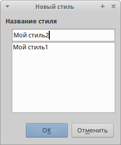

.. meta::
   :description: Краткое руководство по LibreOffice: Глава 3 – Использование Стилей и Шаблонов
   :keywords: LibreOffice, Writer, Impress, Calc, Math, Base, Draw, либреоффис

.. Список автозамен

.. |br| raw:: html

    

.. _using-styles-and-templates

Глава 3 – Использование Стилей и Шаблонов
=========================================

Что такое шаблоны?
------------------

Шаблон - это типовой документ, который используется для создания других документов. Шаблон аналогичен стандартному бланку. Например, можно создать шаблон делового отчета, который будет содержать логотип компании.  Новые документы, созданные из такого шаблона, уже будут содержать логотип компании.

Шаблоны могут содержать в структуре документа текст, таблицы, графику, установленные стили, информацию пользователя, такую, как единицы измерения, язык, принтер по умолчанию, настройки меню и панелей инструментов.

Все компоненты LibreOffice поддерживают шаблоны. Можно создать отдельные шаблоны для любых типов документов (текст, электронные таблицы, рисунки, презентации). Если при создании нового документа не выбрать какой-либо специальный шаблон, то он будет основан на стандартном шаблоне по умолчанию. Если не указан шаблон по умолчанию, то LibreOffice использует чистый лист для этого типа документа LibreOffice. Подробнее смотрите раздел `Установка шаблона по умолчанию`_.

По умолчанию LibreOffice может не содержать стандартных шаблонов. При необходимости можно скачать готовые шаблоны из интернета или  создать собственные шаблоны. Официальный репозиторий шаблонов LibreOffice находится на сайте http://templates.libreoffice.org/. Также подборку русскоязычных шаблонов можно найти на сайте http://myooo.ru/content/blogsection/15/99.

Шаблоны, наряду со стилями, составляют одну из основных концепций LibreOffice.

Что такое стили?
------------------

Стиль ― совокупность правил (настроек) оформления текста, таблиц, врезок и страниц. Стили содержат целую группу настроек форматирования и позволяют быстро применить заданное форматирование к объектам в документе. 

Большинство пользователей форматируют абзацы, слова, таблицы, разметку страниц и другие части документа без использования стилей. Таким образом, они создают документы в соответствии с физическими атрибутами. Например, заголовки выделяются полужирным начертанием.

Стили являются логическими атрибутами. Это означает, что необходимо перестать мыслить категориями: размер шрифта 14pt, Times New Roman, жирный, расположение по центру и др. Необходимо перейти на структурное мышление и начать воспринимать текст как совокупность заголовков (1-го, 2-го, n-го уровня), абзацев основного текста и т.д. Другими словами, надо отвлечься от внешнего оформления и сосредоточиться на структуре текста. Так, например, к заголовку необходимо применять стиль *Заголовок*, которому присвоены различные характеристики (начертание, размер шрифта, отступы).

Стили помогают сконцентрироваться на документе. Они также делают значительно проще процесс изменения форматирования. Например, необходимо изменить отступ всех абзацев или шрифт для всех заголовков (или для заголовков определенного уровня) в документе. Для большого документа эта простая задача может стать большой проблемой, если решать ее вручную. Применение стилей делает задачу легко решаемой.

Кроме того, стили используются в LibreOffice для многих других функций, например, Writer создаёт оглавление, опираясь на стили типа «Заголовок». Некоторые общие примеры использования стилей приведены в разделе `Примеры использования стилей`_.

Компоненты LibreOffice поддерживают следующие типы стилей:

**Writer:**

* Стили страницы - задают оформление полей, колонтитулов, обрамление, разбиение на колонки и фон.

* Стили абзаца - содержат настройки абзацев (заголовков): гарнитуру, кегль, междустрочный интервал, отступ первой строки, отступы слева и справа и другие.

* Стили символа - включают в себя настройки отдельных символов внутри абзаца (гарнитура, кегль, эффекты шрифта). Данные стили могут быть применены как к отдельному символу в абзаце, так и к целому слову или группе слов.

* Стили врезок - используются для форматирования графических и текстовых врезок, включая переходы на новую строку, границы, фон и колонки.

* Стили списка - определяют выравнивание, тип нумерации или маркеров и шрифты для нумерованных и ненумерованных списков. Сами по себе они не используются. Стили списка применяются к стилям абзаца в диалоге создания и редактирования стиля абзаца на вкладке «Структура и нумерация». 

**Calc:**

* Стили ячейки - содержат настройки шрифтов, выравнивания, границ, фона, форматов чисел (например, валюта, дата, номер) и защиты ячеек.

* Cтили страницы - содержат параметры вывода листов на печать или экспорта в PDF.

**Impress и Draw:**

* Стили графических объектов - содержат настройки линий, областей, теней, прозрачности, шрифтов, соединителей, размеров и других атрибутов.

* Стили презентации - определяют атрибуты шрифта, отступов, расстояний, выравнивания и табуляции.

Base и Math не имеют собственных стилей, однако к объектам из Base и Math могут применяться стили тех модулей, в которые они вставлены. Например, к формулам могут быть применены стили врезок Writer.

LibreOffice содержит большое количество готовых стилей. Можно использовать стандартные стили, изменять их или создавать новые стили так, как это описано в данной главе.

В различных компонентах доступны различные наборы стилей. 

.. csv-table:: 
    :header: "Тип стиля", "Writer", "Calc", "Impress", "Draw"
    :widths: 5,3,3,3,10
    
    Страница,x,x,,
    Абзац,x,,,
    Символ,x,,,
    Врезка,x,,,
    Нумерованный список,x,,,
    Ячейка,,x,,
    Презентация,,,x,x
    Графика,(включены в стилях врезок),,x,x

Применение стилей
-----------------

LibreOffice предоставляет несколько способов выбора стилей для применения.

Использование диалога Стили и форматирование
~~~~~~~~~~~~~~~~~~~~~~~~~~~~~~~~~~~~~~~~~~~~

1. Нажмите на значок *Стили*, расположенной с левого края панели форматирования или выберите пункт меню :menuselection:`Фо&рмат --> Сти&ли` или нажмите клавишу ``F11`` на клавиатуре. 

.. _ch3-lo-screen-002:

.. figure:: _static/chapter3/ch3-lo-screen-002.png
    :scale: 70%
    :align: center
    :alt: Значок Стили на панели форматирования
    
    Значок *Стили* на панели форматирования

Окно *Стили и форматирование* отображает доступные для использования в текущем компоненте LibreOffice типы стилей. На рисунке ниже показан диалог *Стили и форматирование* для Writer с открытой вкладкой *Стили абзаца*. Данное окно можно передвинуть в любое место на экране или прикрепить к краю экрана.
 
.. _ch3-lo-screen-001:

.. figure:: _static/chapter3/ch3-lo-screen-001.png
    :scale: 70%
    :align: center
    :alt: Окно Стили и форматирование компонента Writer
    
    Окно *Стили и форматирование* компонента Writer

2. Нажмите на один из значков (вкладку) в верхней части окна *Стили и форматирование*, чтобы отобразить список стилей в той или иной категории.

3. Чтобы применить существующий стиль, поместите курсор в абзаце, врезке, странице или слове, а затем дважды нажмите на название стиля в одном из этих списков. Чтобы применить стиль символов для более, чем одного слова, сначала выберите необходимые символы, зажав клавишу ``Ctrl``, затем выберите необходимый стиль символа.

.. note:: В нижней части окна *Стили и форматирование* есть выпадающий список. Он позволяет сортировать списки стилей, отображаемые в окне. Можно выбрать отображение всех стилей или группы стилей, например, только пользовательских стилей. Очень удобен фильтр *По иерархии*.

Использование стилевой заливки
~~~~~~~~~~~~~~~~~~~~~~~~~~~~~~~~~~~~~~~~~~~~

Используйте стилевую заливку, чтобы применить стиль к нескольким различным областям, без необходимости каждый раз возвращаться к окну *Стили и форматирование*. Этот метод весьма полезный, если необходимо отформатировать много разбросанных по тексту абзацев, ячеек или других элементов с единым стилем.

1. Откройте окно *Стили и форматирование* и выберите стиль, который необходимо применить.

2. Нажмите на значок *Стилевая заливка* |ch3-lo-screen-003|.

3. Чтобы применить стиль к абзацу, странице или врезке, установите курсор мыши на абзац, страницу или врезку и нажмите левую кнопку мыши. Чтобы применить стиль символа, удерживайте левую кнопку мыши, выбирая символы. Нажатие кнопкой мыши на слове применяет стиль символа к слову.

4. Чтобы выйти из режима *Стилевая заливка*, нажмите на значок *Стилевая заливка* еще раз или нажмите клавишу ``Esc`` на клавиатуре.

.. warning:: Когда режим *Стилевая заливка* активен, то нажатия на правую кнопку мыши отменяют последние изменения. Будьте осторожны, чтобы случайно не нажать правую кнопку мыши, отменив при этом действия, которые требовалось сохранить.

Использование списка Используемые стили
~~~~~~~~~~~~~~~~~~~~~~~~~~~~~~~~~~~~~~~~~~~~

После того, как стиль хотя бы раз использован в документе, его название появляется в списке *Используемые стили*, расположенном в левой части панели форматирования, рядом со значком *Стили*. Можно открыть данный список и нажать левой кнопкой мыши на одном из стилей. Также можно пролистывать список клавишами со стрелками вверх и вниз, а выбор необходимого стиля осуществлять нажатием клавишей ``Enter``.

.. _ch3-lo-screen-004:

.. figure:: _static/chapter3/ch3-lo-screen-004.png
    :scale: 70%
    :align: center
    :alt: Список Используемые стили на панели форматирования
    
    Список *Используемые стили* на панели форматирования

.. note:: Выберите пункт *Еще...* внизу списка, чтобы открыть окно *Стили и форматирование*.

Использование клавиатурных сочетаний клавиш
~~~~~~~~~~~~~~~~~~~~~~~~~~~~~~~~~~~~~~~~~~~~

Некоторые сочетания клавиш в LibreOffice предопределены для применения стилей. Например, в компоненте Writer сочетание клавиш ``Ctrl+0`` применяет стиль *Основной текст*, ``Ctrl+1`` применяет стиль *Заголовок 1* и ``Ctrl+2`` применяет стиль *Заголовок 2*. Эти сочетания можно изменять, а также настраивать свои. Смотрите раздел :ref:`assigning-shortcut-keys` для получения дополнительной информации.

.. warning:: Форматирование вручную (также называемое прямое форматирование) отменяет стили и от ручного форматирования нельзя избавиться, применяя стиль к элементу.

 Чтобы удалить ручное форматирование, выделите текст, нажмите по нему правой кнопкой мыши и выберите пункт *Очистить форматирование* из контекстного меню или нажмите сочетание клавиш ``Ctrl+M`` после выделения текста.

-------------

Изменение стилей
----------------

В LibreOffice есть несколько возможностей для изменения стилей:

* Изменение стиля с помощью диалога *Стили и форматирование*;
* Обновление стиля на основе выделенного;
* Использование функции *Автообновление* (только стили абзаца и врезок);
* Загрузка или копирование стиля из другого документа или шаблона.

.. note:: Все изменения стилей остаются только в текущем документе. Чтобы изменить стили в нескольких документах, необходимо изменить стили в шаблоне или импортировать стили в другие документы так, как это описано в разделе `Копирование стиля из шаблона или документа`_

Изменение стиля с помощью диалога *Стили и форматирование*
~~~~~~~~~~~~~~~~~~~~~~~~~~~~~~~~~~~~~~~~~~~~

Чтобы изменить существующий стиль, откройте диалоговое окно *Стили и форматирование*, используя любой из способов, описанных выше. Нажмите правой кнопкой мыши на нужном стиле и выберите в контекстного меню пункт *Изменить*.

Диалог *Стиль* отображается в зависимости от выбранного типа стиля. Каждый диалог стиля имеет несколько вкладок. Смотрите главы, посвященные стилям, в полных руководствах по соответствующим компонентам LibreOffice.

Обновление стиля на основе выделенного
~~~~~~~~~~~~~~~~~~~~~~~~~~~~~~~~~~~~~~~~~~~~

Чтобы обновить стиль на основе выделенного:

1. Откройте диалоговое окно *Стили и форматирование*.
2. В документе выберите элемент, имеющий необходимое форматирование, которое необходимо принять в качестве стиля.
3. В диалоге *Стили и форматирование* выберите стиль, который необходимо обновить (одним нажатием, не двумя!), затем нажмите на значок рядом со значком *Новый стиль* и выберите пункт *Обновить стиль по образцу*.

.. _ch3-lo-screen-005:

.. figure:: _static/chapter3/ch3-lo-screen-005.png
    :scale: 70%
    :align: center
    :alt: Обновление стиля из выделенного
    
    Обновление стиля на основе выделенного

.. warning:: Убедитесь, что форматирование абзаца не имеет противоречивых параметров. Например, абзац не должен содержать шрифтов с разным размером или гарнитурой, иначе обновление по образцу ни приведет к желаемому результату.

Использование функции *Автообновление*
~~~~~~~~~~~~~~~~~~~~~~~~~~~~~~~~~~~~~~~~~~~~

Автообновление применяется только к стилям абзаца и врезок. Если функция *Автообновление* на вкладке *Управление* в окне настроек выбранного стиля абзаца или врезки (нажмите правой кнопкой мыши по нужному стилю и выберите *Изменить*) активна, то при ручном форматировании этого абзаца или врезки, стиль будет автоматически обновлён.

.. tip:: Если необходимо менять стили в документах вручную, убедитесь, что функция автообновления отключена.

Обновление стилей из документа или шаблона
~~~~~~~~~~~~~~~~~~~~~~~~~~~~~~~~~~~~~~~~~~~~

Можно обновить стили копированием или загрузкой их из шаблона или иного документа. Смотрите раздел `Копирование стиля из шаблона или документа`_.

------------

Создание нового (пользовательского) стиля
------------------------------------------

LibreOffice позволяет создавать новые стили. Сделать это можно двумя способами:

* Создать новый стиль, используя диалог *Стили и форматирование*;
* Создать новый стиль из выделенного фрагмента текста.

Создание нового стиля, используя диалог *Стили и форматирование*
~~~~~~~~~~~~~~~~~~~~~~~~~~~~~~~~~~~~~~~~~~~~~

Чтобы создать новый стиль, используя диалог *Стили и форматирование*, нажмите правой кнопкой мыши в окне *Стили и форматирование* и выберите *Создать...* в контекстном меню.

Если вы хотите, чтобы новый стиль был связан с существующим стилем, то сначала выделите этот стиль (один раз нажмите левой кнопкой мыши на названии стиля), затем нажмите правой кнопкой мыши и выберите пункт *Создать*.

При связывании стилей, изменение базового стиля (например, изменение шрифта DeJaVu на PT Sans) повлечёт за собой изменение всех связанных с ним стилей. В большинстве случаев это удобно, но иногда может создавать проблемы. Стоит подумать об этом заранее.

Диалоги и выбор одинаковы как для создания нового стиля, так и для изменения существующего стиля. Для получения более подробной информации смотрите главы посвященные стилям в соответствующих полных руководствах пользователя.

Создание нового стиля из выделенного фрагмента текста
~~~~~~~~~~~~~~~~~~~~~~~~~~~~~~~~~~~~~~~~~~~~~~~~~~~~~

Можно создавать новые стили на основе уже оформленных фрагментов текста.

1. Откройте диалоговое окно *Стили и форматирование* и выберите тип стиля, который необходимо создать.
2. В документе выделите фрагмент текста или объект (врезка, изображение, рисунок), параметры которого нужно сохранить в стиль.
3. В диалоге *Стили и форматирование* нажмите на значок *Создать стиль из выделенного* в правом верхнем углу.
4. В диалоге *Создать стиль* введите имя для нового стиля. В списке отображаются названия ранее созданных стилей. Нажмите кнопку *OK* для сохранения нового стиля.

.. _ch3-lo-screen-006:

    
    Ввод имени нового стиля, созданного из выделенного фрагмента

Перетаскивание элемента для создания стиля
~~~~~~~~~~~~~~~~~~~~~~~~~~~~~~~~~~~~~~~~~~~~~

Вы можете перетащить выделенный элемент в окно *Стили и форматирование*, чтобы создать новый стиль. Варианты создания стилей таким методом для разных компонентов LibreOffice перечислены ниже:

**Writer**

Выберите часть текста и перетащите его в диалог *Стили и форматирование*. *Тип* создаваемого стиля будет зависеть от активного типа стиля в окне *Стили и форматирование*. Если в окне активен стиль абзаца, то в список будет добавлен новый стиль абзаца. Если активен стиль символов, то добавлен будет новый стиль символов.

**Calc**

Перетащите выбранную ячейку в диалог *Стили и форматирование*, чтобы создать новый стиль ячейки.

**Draw / Impress**

Выберите и перетащите графический объект в диалог *Стили и форматирование*, чтобы создать новый стиль графического объекта.

-------

Копирование стиля из шаблона или документа
-------------------------------------------

Созданные стили остаются в текущем документе. Чтобы использовать ранее созданные стили в новом документе, их можно загрузить  из шаблона или из другого документа:

1. Откройте документ, в который нужно скопировать стиль.
2. В диалоговом окне *Стили и форматирование* нажмите стрелочку рядом со значком *Создать стиль из выделенного* и выберите *Загрузить стили* (смотрите рисунок :ref:`ch3-lo-screen-005`).
3. Выберите категорию стилей для копирования. Выберите опцию *Заменить*, если вы хотите заменить стили с такими же именами в документе, куда копируете стили.
4. В диалоге *Загрузить стили*:

    * Чтобы копировать стили из шаблона, найдите и выберите шаблон. 
    * Чтобы копировать стили из других документов, нажмите кнопку *Из файла...*. Откроется окно, в котором нужно будет найти и выбрать необходимый документ.
5. Нажмите кнопку *OK*, чтобы скопировать стили.

.. _ch3-lo-screen-007:

    
    Копирование стилей из шаблона в открытый документ

.. warning:: Если в вашем документе есть оглавление, созданное на основе пользовательских стилей типа *Заголовок*, связанных со структурой из меню :menuselection:`С&ервис --> &Структура нумерации`, то при загрузке стилей структура вернется к значениям по умолчанию типа *Заголовок 1*, *Заголовок 2* и так далее. После загрузки стилей нужно будет поменять стили заголовков обратно на пользовательские.

.. note:: На рисунке :ref:`ch3-lo-screen-007` показан маркер *Кадр* (может также называться *Фрейм*). В данном случае, это ошибка перевода, так как имеется ввиду стиль врезок. В последующих выпусках LibreOffice данная ошибка должна быть исправлена.

Удаление стилей
-------------------------------------------

Нельзя удалить из документа или шаблона любые предустановленные в LibreOffice стили, даже если они не используются.  Можно удалить любые пользовательские стили, но прежде, чем это сделать, необходимо убедиться, что выбранные стили не используются в текущем документе. Если нежелательный стиль используется, то его нужно будет заменить другим стилем.

Чтобы удалить ненужный стиль, нажмите правой кнопкой мыши на нем в окне *Стили и форматирование* и выберите пункт *Удалить* в контекстном меню.  Если стиль не используется, то он будет удален. Если стиль используется, то будет выведено окно с предупреждением об этом и предложением подтвердить удаление.

.. warning:: Убедитесь перед удалением, что стиль не используется. Иначе все объекты с этим стилем будут возвращены к стилю по умолчанию и форматирование элемента сохранится, как ручное.

---------------

Использование шаблона для создания документа
--------------------------------------------

Чтобы использовать шаблон для создания документа:

1. В главном меню выберите :menuselection:`&Файл --> &Создать --> &Шаблоны`. Откроется диалог *Менеджер шаблонов*.
2. Из вкладок в верхней части диалога выберите категорию (тип документа) шаблона, который вы хотите использовать. Папки, содержащие шаблоны, показаны на каждой странице категорий диалога. Если папки не видны, значит в настоящий момент нет доступных шаблонов.
3. Дважды нажмите левой кнопкой мыши на папку, содержащую нужный шаблон. Все шаблоны, содержащиеся в папке будут показаны на странице.
4. Выберите шаблон, который хотите использовать. 
5. Дважды нажмите на выбранном шаблоне. Новый документ, основанный на выбранном шаблоне откроется в LibreOffice.

.. _ch3-lo-screen-008:

    
    Диалог Менеджера шаблонов

Создание шаблона
--------------------------------------------

Создавать новые шаблоны можно двумя способами:

* Сохранив текущий документ, как шаблон;
* Используя *Мастер*.

Создание шаблона из документа
~~~~~~~~~~~~~~~~~~~~~~~~~~~~~~~~~~~~~~~~~~~~~

Для создания шаблона из документа и сохранения его в папку *Мои шаблоны*:

1. Откройте новый или существующий документ того типа, дял которого нужно создать шаблон (текстовый документ, электронную таблицу, рисунок или презентацию).
2. Добавьте в шаблон необходимое содержимое и нужные стили.
3. Выберите пункт меню :menuselection:`&Файл --> &Шаблоны --> &Сохранить как шаблон`. Откроется диалог *Менеджер шаблонов* на вкладке *Документы*.
4. Если папка *Мои шаблоны* видимая, выберите её. Если нет, то в верхней части окна из вкладок выберите категорию, в которой папка видна и выберите её.

.. note:: Не имеет значения, какая вкладка выбрана в настоящий момент. Необходимо найти и выбрать папку *Мои шаблоны*. Шаблон будет автоматически сохранен в папке *Мои шаблоны* на правильной вкладке в соответствии с метаданными, содержащимися в самом файле.
Чтобы узнать больше о папках шаблонов, смотрите раздел `Управление шаблонами`_.

5. Нажмите кнопку *Сохранить*.
6. Откроется диалог, введите имя шаблона и нажмите *ОК*. Просмотрите папку *Мои шаблоны*, чтобы убедиться, что шаблон расположен на правильной вкладке.
7. Закройте диалог *Менеджер шаблонов*.

.. _ch3-lo-screen-009:

.. figure:: _static/chapter3/ch3-lo-screen-009.png
    :scale: 50%
    :align: center
    :alt: Сохранение нового шаблона
    
    Сохранение нового шаблона

Любые настройки, которые могут быть добавлены или изменены в документе, можно сохранить в шаблоне. Например, ниже показаны некоторые (и это далеко не весь перечень) из настроек, которые могут быть включены в документ Writer и сохранены в шаблоне для дальнейшего использования:

* Настройки печати: принтер, одно- или двухсторонняя печать, размер бумаги, и тому подобное.
* Стили, которые будут использоваться, включая стили символов, страницы, врезки, списков и абзацев.
* Формат и параметры, касающиеся индексов, таблиц, библиографий, оглавления.

Шаблоны могут также содержать заранее введенный текст, избавляя от необходимости вводить его каждый раз при создании нового документа. Например, шаблон письма может содержать уже оформленный официальный бланк организации, с указанием наименования организации, адреса, контактных телефонов, логотипа и любой другой информации.

В шаблоне также можно сохранить настройки меню и панелей инструментов. Смотрите :ref:`Customizing-LibreOffice`, для получения дополнительной информации.

Создание шаблона при помощи *Мастера*
~~~~~~~~~~~~~~~~~~~~~~~~~~~~~~~~~~~~~~~~~~~~~

Для создания шаблонов писем, факсов, повесток дня, презентаций и веб-страниц можно использовать *Мастер*. Например, мастер создания факсов проведёт пользователя через следующие шаги:

* Тип факса (деловой или персональный);
* Элементы документа, такие, как дата, адресат, приветствие и подпись;
* Настройки для отправки и получения (деловой факс);
* Текст, включаемый в нижний колонтитул (деловой факс).

Чтобы создать шаблон, используя мастер:

1. Выберите пункт меню :menuselection:`&Файл --> &Мастер --> [нужный тип шаблона]`.
2. Следуйте инструкциям на страницах мастера. Этот процесс отличается для каждого типа шаблона, но формат очень похож.
3. В последней секции мастера нужно указать имя шаблона, которое будет отображаться в менеджере шаблонов и имя и расположение для сохраняемого файла шаблона. Желательно давать одинаковые имена во избежание путаницы. По умолчанию файлы шаблонов сохраняются в системный каталог шаблонов пользователя, но можно выбрать и любой другой.
4. Нажмите кнопку выбора пути, чтобы установить имя файла и указать путь до файла. Укажите имя файла и нажмите кнопку *Сохранить*, чтобы закрыть диалог.
5. Наконец, есть возможность создать новый документ из подготовленного шаблона или внести изменения в шаблон после нажатия кнопки *Завершить*. Для будущих документов можно пересоздать шаблон с помощью мастера.

Для этого придется открыть менеджер шаблонов и нажать кнопку *Обновить* в *Меню действий*, чтобы отобразить все новые добавленные шаблоны.

.. note:: В этом выпуске LibreOffice, нажатие кнопки *Завершить* заново откроет диалог сохранения файла, который открывался в шаге 4. Нажмите в диалоге кнопку *Сохранить*, файл будет записан на жесткий диск. 

 Нажатие кнопки *Сохранить* в шаге 4 сохраняет данные в оперативной памяти и не сохраняет файл на жесткий диск.

Редактирование шаблона
--------------------------------------------

Можно отредактировать в шаблоне стили и содержимое, а также применить изменённые в шаблоне стили к документам, которые были созданы на его основе. (Обратите внимание, что изменятся только стили, но не содержимое документа).

Чтобы отредактировать шаблон:

1. Выберите в главном меню :menuselection:`Файл --> Создать --> Шаблоны`. Откроется *Менеджер шаблонов*.
2. Найдите шаблон, который необходимо изменить. Нажмите по нему один раз, чтобы выбрать его. В верхней части окна нажмите кнопку *Правка*. Шаблон откроется в LibreOffice.
3. Измените шаблон так же, как и любой другой документ. Чтобы сохранить изменения выберите в главном меню пункт :menuselection:`Файл --> Сохранить`.

Обновление документа из изменённого шаблона
~~~~~~~~~~~~~~~~~~~~~~~~~~~~~~~~~~~~~~~~~~~~~

При новом открытии документа, который был создан на основе измененного шаблоны до его изменения, на экране будет показано следующее сообщение:

.. _ch3-lo-screen-010:

    
    Сообщение об обновлении стилей

Нажмите *Обновить стили*, чтобы применить измененные стили из шаблона к документу.  Нажмите *Сохранить старые стили*, если применять измененные стили из шаблона к документу не нужно.

.. warning:: Если выбрать вариант *Сохранить старые стили* в сообщении, показанном на рисунке выше, то это сообщение больше никогда не будет показываться при открытии этого документа, даже если шаблон, на котором он был основан, снова будет изменён. Также нельзя будет обновить стили из шаблона для этого документа штатными средствами, но при этом можно использовать макрос из примечания ниже для активирования этой возможности.

.. note:: Чтобы вновь получить возможность обновлять стили из шаблона:
 1. Выберите пункт меню :menuselection:`Сервис --> Макросы --> Управление макросами --> LibreOffice Basic`. Выберите документ из списка, нажмите на значке раскрытия списка (+ или треугольник) и выберите *Standard*. Если *Standard* имеет рядом значок раскрытия (+ или треугольник), то нажмите на его и выберите модуль.
 2. Если кнопка *Правка* активна, нажмите её. Если кнопка *Правка* неактивна, то нажмите *Создать*.
 3. В окне Basic введите следующее:
 
 .. code-block:: basic
 
    Sub FixDocV3 
    ' set UpdateFromTemplate 
     oDocSettings = ThisComponent.createInstance( _ 
      "com.sun.star.document.Settings" ) 
     oDocSettings.UpdateFromTemplate = True 
    End Sub 'FixDocV3
    
 4. Нажмите значок *Выполнить BASIC* и закройте окно *Basic IDE*.
 5. Сохраните документ.

 При следующем открытии документа будет показано предупреждение об изменении стилей в шаблоне.

-----------

Добавление шаблонов, полученных из других источников
----------------------------------------------------

Скачать шаблоны для LibreOffice можно из множества источников, включая официальный репозиторий по адресу http://templatesж.libreoffice.org/, и затем можно установить их на компьютер. На дургих сайтах можно найти коллекции шаблонов, запакованных в файлы с расширением ``.OXT``. Они устанавливаются несколько иначе и об этом сказано ниже.

Установка индивидуальных шаблонов
~~~~~~~~~~~~~~~~~~~~~~~~~~~~~~~~~~~~~~~~~~~~~

Чтобы установить индивидуальные шаблоны:

1. Скачайте шаблон и сохраните его на вашем компьютере.
2. Импорт шаблона в папку с шаблонами описан в инструкции в разделе `Импорт шаблонов`_.

.. tip:: (Для продвинутых пользователей) Если расположение папки с шаблонами LibreOffice известно, то можно вручную скопировать новый шаблон в неё. Расположение варьируется в зависимости от операционной системы на компьютере пользователя. Чтобы узнать, где расположены папки с шаблонами на компьютере, посмотрите в меню :menuselection:`С&ервис --> &Параметры --> LibreOffice --> Пути`.

Установка коллекций шаблонов
~~~~~~~~~~~~~~~~~~~~~~~~~~~~~~~~~~~~~~~~~~~~~

Менеджер расширений позволяет легко устанавливать коллекции шаблонов, которые упакованы, как расширения. Выполните следующее:

1. Скачайте расширение (файл ``.oxt``) и сохраните его на жестком диске компьютера.
2. В LibreOffice выберите пункт меню :menuselection:`Сервис --> Управление расширениями`. В диалоге менеджера расширений  нажмите кнопку *Добавить*, чтобы открыть окно обозревателя файлов.
3. Найдите и выберите пакет шаблонов, который нужно установить и нажмите кнопку *Открыть*. Пакет будет установлен. Возможно в процессе установки будет предложено принять лицензию.
4) После завершения установки пакета шаблонов, они будут доступны из меню :menuselection:`Файл --> Создать --> Шаблоны` и, как расширение, в списке менеджера расширений.

Смотрите :ref:`Customizing-LibreOffice` для получения более подробной информации об установке расширений.

Установка шаблона по умолчанию
----------------------------------------------------

Если  документ создаётся путём выбора пункта меню :menuselection:`Файл --> Создать --> Текстовый документ` (или Электронную таблицу, Презентацию или Рисунок), то LibreOffice создаёт документ из шаблона по умолчанию для данного типа документа. Можно изменить стандартный пользовательский шаблон. В дальнейшем можно сбросить эту настройку на значение по умолчанию.

.. note:: Для Windows-пользователей: Microsoft Word использует файл ``normal.dot`` или ``normal.dotx`` в качестве шаблона по умолчанию. LibreOffice не содержит аналогичного файла шаблона по умолчанию. «Заводские настройки» встроены в программу. 

Установка пользовательского шаблона по умолчанию
~~~~~~~~~~~~~~~~~~~~~~~~~~~~~~~~~~~~~~~~~~~~~~~~~~~

Можно установить любой шаблон в качестве шаблона «по умолчанию», если он находится в любой папке в менеджере шаблонов.

Чтобы установить пользовательский шаблон по умолчанию:

1. Выберите пункт меню :menuselection:`Файл --> Создать --> Шаблоны`.
2. В диалоге менеджера шаблонов откройте папку, содержащую тот шаблон, который нужно задать, как шаблон по умолчанию, и выберите его.
3. Нажмите кнопку *Сделать основным* вверху списка шаблонов.

.. _ch3-lo-screen-011:

    
    Установка пользовательского шаблона по умолчанию

В последующем, новый документ будет создан на основе этого шаблона.

Сброс шаблона по умолчанию к «заводским настройкам»
~~~~~~~~~~~~~~~~~~~~~~~~~~~~~~~~~~~~~~~~~~~~~~~~~~~

Чтобы восстановить изначальное значение в LibreOffice шаблона по умолчанию для типов документа:

1. В менеджере шаблонов нажмите значок *Меню действий* в правом верхнем углу.
2. Наведите курсор мыши на пункт *Восстановить шаблон по умолчанию* и нажмите на пункте *Текстовый документ* (или другой тип шаблона).

Эти пункты не доступны в меню, если шаблон по умолчанию не изменялся. В последующем при создании документа из меню :menuselection:`Файл --> Создать`, документ будет создан из шаблона по умолчанию для данного типа документа.

.. _ch3-lo-screen-011a:

    
    Восстановление шаблона по умолчанию для текстового документа

Связывание документа с другим шаблоном
----------------------------------------------------

Документ может быть создан на основе шаблона, а может быть создан на основе импорта стилей и не связан с шаблоном. 
Одним из основных преимуществ шаблонов является возможность обновить стили сразу в более, чем одном документе, как это описано в разделе `Обновление стилей из документа или шаблона`_. Если обновить стили, загрузив их из другого шаблона (как описано в разделе `Копирование стиля из шаблона или документа`_), то документ не будет связан с шаблоном, откуда были загружены стили и поэтому нельзя будет использовать это преимущество. Что нужно сделать, так это связать документ с другим шаблоном.

.. note:: В LibreOffice 3.x, можно было использовать расширение Template Changer для упрощения этого процесса. К сожалению, данное расширение в LibreOffice 4.х не работает.

Для получения наилучших результатов имена стилей должны быть одинаковыми в существующем документе и в новом шаблоне. Если это не так, то необходимо использовать пункт меню :menuselection:`Правка --> Найти и заменить`, чтобы заменить старые стили на новые. Смотрите *Главу 4 – Краткое руководство по Writer*, для получения подробной информации о замене стилей при помощи команды *Найти и заменить*.

1. Выберите пункт меню :menuselection:`Файл --> Создать --> Шаблоны`. В *Менеджере шаблонов* дважды нажмите на  шаблон, который хотите использовать. Откроется новый документ, содержащий текст или графику из этого шаблона. Удалите любую нежелательную информацию из этого документа (текст или графику).

2. Откройте документ, который требуется изменить (он откроется в новом окне). Нажмите сочетание клавиш ``Ctrl+A`` чтобы выбрать всё содержимое в документе. Нажмите на пустом документе, созданном на 1 шаге. Нажмите сочетание клавиш ``Ctrl+V`` чтобы вставить содержимое из старого документа в новый.

3. Обновите оглавление, если оно имеется. Используйте команду *Сохранить как...* чтобы сохранить этот файл с именем файла, из которого было взято содержимое. Закройте старый документ без сохранения.

Управление шаблонами
----------------------------------------------------

В LibreOffice можно использовать шаблоны, которые находятся в папках шаблонов  LibreOffice. Здесь можно создать новые папки шаблонов и использовать их для управления шаблонами. Например, можно иметь папку с шаблонами для писем и папку с шаблонами для отчетов. Также можно импортировать и экспортировать шаблоны.

Для начала выберите пункт меню :menuselection:`Файл --> Создать --> Шаблоны`, чтобы открыть диалог менеджер шаблонов.

.. _ch3-lo-screen-012:

.. figure:: _static/chapter3/ch3-lo-screen-012.png
    :scale: 60%
    :align: center
    :alt: Значки действий с шаблонами
    
    Значки действий с шаблонами

Создание папки шаблонов
~~~~~~~~~~~~~~~~~~~~~~~~~~~~~~~~~~~~~~~~~~~~~~~~~~~

Чтобы создать папку шаблонов:

1. В менеджере шаблонов нажмите на кнопку *Все шаблоны* и затем кнопку *Новая папка* или дважды нажмите на любую папку,  выберите в ней любой шаблон, чтобы открылись значки действий в верхней части диалога. Затем нажмите кнопку *Переместить в папку* и выберите пункт *Новая папка*.
2. В появившемся окне введите имя для новой папки и нажмите *ОК*.

Удаление папки шаблонов
~~~~~~~~~~~~~~~~~~~~~~~~~~~~~~~~~~~~~~~~~~~~~~~~~~~

Нельзя удалить папки шаблонов, которые были установлены с LibreOffice или те, которые были установлены через менеджер расширений. Можно удалять только те папки, которые были созданы пользователем.

Чтобы удалить папку шаблонов:

1. В менеджере шаблонов выберите папку, которую хотите удалить.
2. В строке значков над папками нажмите кнопку *Удалить*. Появится сообщение с запросом подтверждения удаления. Нажмите *Да*.

Перемещение шаблонов
~~~~~~~~~~~~~~~~~~~~~~~~~~~~~~~~~~~~~~~~~~~~~~~~~~~

Чтобы переместить шаблон из одной папки в другую:

1. В менеджере шаблонов дважды нажмите на папку, где находится шаблон, который вы хотите переместить.
2. Выберите нужный шаблон и в появившейся строке значков сверху выберите *Переместить в папку*.

Удаление шаблонов
~~~~~~~~~~~~~~~~~~~~~~~~~~~~~~~~~~~~~~~~~~~~~~~~~~~

Невозможно удалить шаблоны, которые были установлены с LibreOffice или те, которые были установлены через менеджер расширений. Можно удалять только те шаблоны, которые были созданы пользователем вручную или были импортированы. 

Чтобы удалить шаблон:

1. В менеджере шаблонов дважды нажмите на папку, где находится шаблон, который необходимо удалить.
2. Выберите нужный шаблон, который необходимо удалить.
3. В появившейся строке значков сверху выберите *Удалить*. Появится сообщение с запросом подтверждения удаления. Нажмите *Да*.

Импорт шаблонов
~~~~~~~~~~~~~~~~~~~~~~~~~~~~~~~~~~~~~~~~~~~~~~~~~~~

Чтобы использовать шаблон в LibreOffice, то его необходимо поместить в папку шаблонов LibreOffice. Для этого:

1. В менеджере шаблонов выберите папку, в которую хотите поместить шаблон.
2. Нажмите кнопку *Импорт* сверху от списка папок. Откроется стандартное окно обзора файлов.
3. Найдите и выберите нужный шаблон и нажмите *Открыть*. Окно обзора файлов закроется и шаблон добавится в выделенную папку.

Экспорт шаблонов
~~~~~~~~~~~~~~~~~~~~~~~~~~~~~~~~~~~~~~~~~~~~~~~~~~~

Чтобы экспортировать шаблон в другое место из папки шаблонов:

1. В менеджере шаблонов дважды нажмите левой клавишей мыши на папку, где находится шаблон, который нужно экспортировать.
2. Выберите нужный шаблон, который хотите экспортировать.
3. Нажмите кнопку *Экспорт* сверху от списка папок. Откроется стандартное окно *Сохранить как...*.
4. Найдите нужный каталог, в который необходимо экспортировать шаблон, войдите в него и нажмите *Сохранить*.

----------------

Примеры использования стилей
----------------------------------------------------

Следующие примеры использования стилей страниц и абзацев взяты из Writer. Есть много других способов использования стилей. Для получения более подробной информации смотрите полные руководства для соответствующих компонентов LibreOffice.

Назначение отличающейся первой страницы в документе
~~~~~~~~~~~~~~~~~~~~~~~~~~~~~~~~~~~~~~~~~~~~~~~~~~~

Многие документы, такие как письма и отчеты, имеют первую страницу, которая отличается от других страниц документа. Например, первая страница фирменного бланка имеет другой заголовок или первая страница отчета не имеет верхнего колонтитула в отличие от последующих страниц. В LibreOffice можно определить применяемые автоматически стиль для первой страницы и указать стиль для последующих страниц.

Как пример, можно использовать стиль страницы *Первая страница* и стиль страницы *По умолчанию*, встроенные в LibreOffice. На рисунке ниже показано схематично, что необходимо сделать: стиль *Первая страница*, за ней идет страница со стилем *По умолчанию* и все последующие страницы будут иметь стиль *По умолчанию*. Детали изложены в *Главе 4 Форматирование страниц*, в полном руководстве по Writer.

.. _ch3-lo-screen-013:

.. figure:: _static/chapter3/ch3-lo-screen-013.png
    :scale: 70%
    :align: center
    :alt: Порядок следования стилей страниц
    
    Порядок следования стилей страниц

Разделение документа на главы
~~~~~~~~~~~~~~~~~~~~~~~~~~~~~~~~~~~~~~~~~~~~~~~~~~~

Аналогичным образом можно разделить документ на главы. Каждая глава может начинаться со стилем страницы *Первая страница* с последующими стилями для страниц *По умолчанию*, как указано выше. В конце главы вставьте разрыв страницы и задайте следующей странице стиль *Первая страница*, чтобы начать новую главу, как показано на рисунке ниже.

.. _ch3-lo-screen-014:

.. figure:: _static/chapter3/ch3-lo-screen-014.png
    :scale: 70%
    :align: center
    :alt: Разделение документа на главы, используя стили страниц
    
    Разделение документа на главы, используя стили страниц
    
Изменение ориентации страницы в документе
~~~~~~~~~~~~~~~~~~~~~~~~~~~~~~~~~~~~~~~~~~~~~~~~~~~

Документ Writer может содержать страницы в более, чем одной ориентации. Обычно требуется создать страницу в  ландшафтной ориентации посереди страниц в портретной ориентации. Этого также можно добиться, используя разрывы страницы и стили страницы.

Различающиеся заголовки на правой и левой страницах
~~~~~~~~~~~~~~~~~~~~~~~~~~~~~~~~~~~~~~~~~~~~~~~~~~~

Стили страниц можно настроить так, чтобы левая и правая страница были зеркальными друг другу или страницы были только правыми (первые страницы глав обычно только правые) или только левыми. При вставке заголовка в стиль страницы, созданный для зеркальных страниц или правой и левой страниц, можно получить одинаковый заголовок для всех страниц или отличающийся заголовок для правой и левой страницы. Например, можно поместить номер страницы в правом углу для правой страницы и в левом для левой, поставить название документа только на правой странице или внести другие изменения. 

Автоматический контроль разрывов страниц
~~~~~~~~~~~~~~~~~~~~~~~~~~~~~~~~~~~~~~~~~~~~~~~~~~~

Часто в книгах названия глав начинаются с новой страницы. Подобное поведение можно организовать автоматически, задав разрыв страницы перед абзацем в стиле заголовка главы. Разрыв страницы задается в свойствах стиля абзаца на вкладке *Положение на странице* в разделе *Разрывы*.

.. _ch3-lo-screen-015:

.. figure:: _static/chapter3/ch3-lo-screen-015.png
    :scale: 50%
    :align: center
    :alt: Добавление разрыва страницы в свойствах стиля
    
    Добавление разрыва страницы в свойствах стиля

Составление автоматического оглавления
~~~~~~~~~~~~~~~~~~~~~~~~~~~~~~~~~~~~~~~~~~~~~~~~~~~

Чтобы создать автоматическое оглавление, первым делом нужно применить ко всем нужным заголовкам стили типа *Заголовок*, чтобы они могли появиться в оглавлении. А затем использовать пункт меню :menuselection:`Вст&авка --> &Оглавление и указатели --> &Оглавление и указатели...`, чтобы указать Writer, какие стили и уровни нужно использовать для создания оглавления. Смотрите *Главу 4* в данном руководстве для получения более подробной информации.

Определение последовательности стилей
~~~~~~~~~~~~~~~~~~~~~~~~~~~~~~~~~~~~~~~~~~~~~~~~~~~

Стили абзаца можно настраивать так, чтобы при нажатии на клавишу ``Enter`` в конце абзаца, к следующему абзацу автоматически был применен заранее заданный стиль. Например, можно определить стиль абзаца *Заголовок 1*, за которым будет следовать абзац со стилем *Основной текст*. Более сложный пример будет выглядеть так (по стилям): *Название*, за которым следует *Автор*, за которым следует *Аннотация*, за которым следует *Заголовок 1*, за которым следует *Основной текст*. Установив такие последовательности, можно в большинстве случаев избежать применения стилей вручную.
