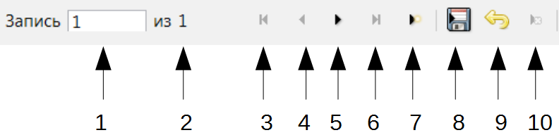
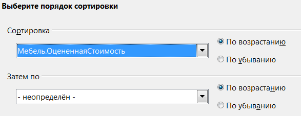

.. meta::
   :description: Краткое руководство по LibreOffice: Глава 8 – Краткое руководство по Base
   :keywords: LibreOffice, Writer, Impress, Calc, Math, Base, Draw, либреоффис

.. Список автозамен

.. |br| raw:: html

    
   
    
Глава 8 – Интерфейс работы с базами данных Base
===============================================

Base – это компонент LibreOffice, предназначенный для создания баз данных. Источники данных или база данных – это массив информации, организованный особым образом для обеспечения более легкого доступа, управления и обновления. Например, список имён и адресов – это источник данных, используя который можно подготовить стандартные письма для почтовой рассылки. Список складских запасов может быть источником данных, управляемым при помощи LibreOffice.

Если у вас есть информация, которую вы хотели бы упорядочить, Base поможет вам это сделать. Конечно, для организации информации можно использовать электронную таблицу, но поддержание в актуальном состоянии таблицы Calc часто может быть более сложным и трудоемким, чем использование базы данных Base.

Эта глава предназначена для людей, которые никогда не использовали Base или для тех, кто хочет ознакомиться с основами создания и использования баз данных. Терминология сведена к минимуму. В этой главе рассматриваются мастера, необходимые для создания частей базы данных и принципы, которые используют мастера. Глава также содержит ссылки на дополнительную информацию в *Base Handbook* или в *Руководстве по Base* (англоязычные версии которых находится в процессе написания).

Base Handbook и Руководство по Base предназначены для людей, которые уже понимают основы работы в Base и хотят изучить принципы работы программы более глубоко.

.. note:: Чтобы использовать Base, необходимо установить Java Runtime Environment (JRE). Используйте меню :menuselection:`Сервис --> Параметры --> LibreOffice --> Расширенные возможности`, чтобы выбрать нужный JRE из уже установленных на компьютере версий.

 Если JRE не установлен, то необходимо скачать и установить его. Для  Windows посетите сайт www.java.com. Для Linux, скачайте JRE с указанного сайта, либо используйте ``openjdk-7-jre``, доступный в репозитории вашего дистрибутива Linux. Пользователи Mac OS X могут установить JRE от Apple Inc. 

Одна из вещей, которая иногда смущает людей – это терминология. В частности, что за разница между понятиями база данных и источник данных? Base использует эти термины, как синонимы. Это потому, что база данных – это набор данных, которые могут существовать в различных формах. Они включают в себя текстовые файлы, электронные таблицы или файл, созданный программой управления базами данных.

Данные бесполезны, если мы не можем использовать информацию, которая в них содержится. Необходимо создать структуру для использования данных. Формулы и ссылки на ячейки в электронной таблице Calc используются для получения информации из данных, содержащихся в ячейках. Программы управления базами данных могут делать то же самое.

При работе в Base создаётся файл базы данных. Этот файл содержит данные и все структуры для получения информации из данных, созданные вами. Поскольку всё включено в один файл, то он называется встроенная база данных.

Base также может быть использован для подключения к другим базам данных. В этом случае Base создает отдельный файл для создания соединения. Он не является частью базы данных, так как существует вне файла базы. Для получения дополнительной информации обратитесь к *Base Handbook* или *Руководству по Base*.

Типы баз данных
---------------

Base может создавать и работать c двумя типами баз данных: плоскими и реляционными. В этой главе рассматриваются плоские базы данных. Реляционные базы данных подробно описаны в *Base Handbook* и в *Руководстве по Base*.

*Плоская база данных* содержит одну или несколько таблиц, каждая из которых содержит одно или несколько полей. Каждая таблица является полностью независимой от всех других таблиц в базе данных. Например, у вас есть база данных адресов с несколькими таблицами в ней. В них можно хранить ваши личные контакты, ваши деловые контакты и контакты вашего супруга. Некоторые контакты могут находиться в более чем одной таблице, при этом в разных таблицах информация об одном и том же человеке может отличаться.

*Реляционная база данных* содержит одну или несколько таблиц с одной или более связей, образованных между этими таблицами. Каждая связь определяется парой полей. Одно поле каждой пары относится к одной таблице, а второе поле принадлежит другой таблице. Хотя плоская база данных и может быть использована при множестве таблиц, но в ней отсутствует механизм для определения отношений между таблицами. В такой базе данных одинаковые данные должны быть введены по отдельности в одинаковых полях разных таблиц, при этом не должно быть ошибок при вводе данных. Хорошо разработанная реляционная база данных позволяет вводить данные только один раз, уменьшая возможные ошибки.

Плоская база данных
~~~~~~~~~~~~~~~~~~~

Рассмотрим адресную книгу. Как правило, данные в адресной книге, могут быть разделены на группы в зависимости от отношений между данными. Например, все имена помещены в одну группу. Другие группы могут включать фамилии, адреса, номера телефонов, дни рождения и так далее. Вероятно можно также разделить на отдельные группы номера телефонов по их местонахождению (дома, на работе, мобильный). Если эта информация находилась в электронной таблице, то вы скорее всего использовали отдельный столбец для каждой из этих групп. В базе данных этот столбец называется **поле**.

Другие отношения между данными могут быть использованы для дальнейшего определения структуры этих данных. В адресной книге одно значение в каждой из этих групп описывает конкретное лицо. В таблице будут столбцы, как описано выше. Мы переставим строки так, чтобы каждая из них содержала информацию о человеке. 

Распределим данные в таблице. Каждый столбец содержит данные с одинаковыми свойствами. Каждая строка содержит данные, описывающие конкретную организацию или человека и называется **записью**. Структура строк и столбцов называется **таблицей**.

Обработка данных без какой-либо структуры, как мы уже упоминали выше – это не самое лучшее решение. Теперь, после создания таблицы, у нас есть плоская база данных и мы можем воспользоваться ей, чтобы получать информацию.

Мы будем использовать **запросы** для получения информации из базы данных. Запрос – это  такой способ задавать вопросы базе данных и получить на них ответы. Если мы хотим передать информацию из базы данных кому-то другому, то мы передадим им **отчёт**, основанный на запросе, который мы создали (Отчёт также может быть создан прямо из таблицы). 

Таким образом, плоская база данных состоит из **таблицы**, столбцы которой называются **полями**, а строки называются **записи**. Мы используем структуру таблицы, чтобы задавать вопросы и получать ответы, при помощи **запросов**. Для предоставления информации, полученной из запроса, другим людям, мы создадим **отчет**. Это термины, которые мы используем в базе данных: таблица, с ее полями и записями, запросы и отчеты.

Планирование базы данных
------------------------

.. tip:: Перед созданием базы данных, спланируйте свои действия: подумайте, что вы хотите делать и почему. От планирования зависят результаты, которые вы получите при использовании базы данных.

Вы должны чётко представлять себе, что вы будете делать с данными, которые у вас есть. Это представление включает в себя знание о том, как вы будете делить данные по столбцам, полям, строкам и записям. Этим вы определите, какой будет ваша таблица. *Какую информацию вы хотите получать из данных?* Этим вы определите, какие вопросы надо будет задавать базе данных. *Какую информацию вы хотите увидеть в отчете?* Итак, потребуется некоторое время, чтобы обдумать, какой результат вы хотите получить, прежде чем начать создавать базу данных.

В *Руководстве по Base* в *Главе 2. Планирование и проектирование баз данных* подробно освещается эта тема.

Мастер таблиц (смотрите раздел `Таблицы: использование мастера для создания таблиц`_) содержит список  предварительно настроенных таблиц для деловых и для личных целей. Мастер также содержит список полей для каждой из таких таблиц. Каждому из полей также уже заданы необходимые свойства. 

В результате мастер выполняет большую часть планирования за вас. Тем не менее, необходимо будет изучить готовую таблицу и подумать, например, следует ли использовать все предлагаемые поля? Будут ли использоваться дополнительные поля, которых нет в готовой таблице из мастера? Какие свойства должны иметь эти поля? 

Таким образом, нужно понимать, что вы делаете, как и зачем. Попрактикуйтесь в создании объектов базы данных, прежде чем создавать их в реальной базе. Узнайте сначала на примере, как создаётся база данных. При необходимости делайте для себя заметки о принципах работы Base.

Создание нового файла базы данных
---------------------------------

После планирования вашей базы данных, создайте новый файл базы данных. Чтобы это сделать, откройте Мастер баз данных одним из следующих способов:

* Выберите пункт меню :menuselection:`Файл --> Создать --> Базу данных`.
* Нажмите на треугольник справа от значка *Создать* на* Стандартной панели инструментов* и выберите из списка *Базу данных*.
* Нажмите на значке *Новая база* данных на стартовом экране после запуска LibreOffice.

Первый шаг мастера баз данных  состоит из трех вариантов. Используйте верхний вариант, чтобы *Создать новую базу данных*. Средний и нижний варианты используются для открытия существующей базы данных (смотрите `Открытие существующей базы данных`_). 

.. _ch4-lo-screen-001:

.. figure:: _static/chapter8/ch8-lo-screen-001.png
    :scale: 50%
    :align: center
    :alt: Создание новой базы данных, используя мастер
    
    Создание новой базы данных, используя мастер

Создание базы данных в мастере баз выполняется в два шага:

1) На первом шаге Выбор базы данных:

 a) Под вопросом «Что вы хотите сделать?», выберите вариант *Создать новую базу данных* (он выбран по умолчанию).
 b) Нажмите кнопку *Далее* внизу окна мастера.

.. note:: Начиная с версии 4.2.0, первая страница мастера баз данных получила новый вариант в выпадающем списке выбора типа встроенной базы данных. В момент написания этого текста вариант базы данных «Firebird встроенная» относится к экспериментальным возможностям, поэтому он не будет обсуждаться здесь.

.. note:: При создании новой базы данных вы должны зарегистрировать её. Регистрация указывает расположение базы данных в одном из конфигурационных файлов LibreOffice. После этого вы сможете получить доступ к базе данных из Writer или Calc.

2) На втором шаге *Сохранить и выполнить*:

 a) Выберите вариант *Да*, зарегистрировать базу данных (установлен по умолчанию).
 b) Выберите, что сделать после сохранения базы данных. В этом примере мы выберем вариант *Открыть базу для редактирования*.

.. _ch4-lo-screen-002:

.. figure:: _static/chapter8/ch8-lo-screen-002.png
    :scale: 50%
    :align: center
    :alt: Регистрация и открытие базы данных
    
    Регистрация и открытие базы данных

.. note:: Если вы хотите создать таблицу с помощью мастера сразу после создания новой базы данных, то отметьте галочкой пункт *Создать таблицы с помощью мастера таблиц* в дополнение к пункту *Открыть базу для редактирования*. Если вы сделаете это, то откроется главное окно базы данных с открытым окном мастера таблиц.

 Мы рассмотрим главное окно базы данных перед разделом по использованию мастера таблиц.

3) Нажмите кнопку *Готово* внизу окна мастера. Откроется стандартное окно *Сохранить как*. Задайте имя вашей базе данных и сохраните файл.

Таким образом мы создали и сохранили новый файл базы данных, который открылся в главном окне программы Base. Если хотите, то можете закрыть его сейчас и открыть свой файл позже.

Открытие существующей базы данных
---------------------------------

Файл с новой базой данных можно открыть заново несколькими способами. Например,  откройте каталог, где сохранили базу данных, в любом файловом браузере и дважды нажмите по файлу с базой мышкой. Или нажмите правой кнопкой мыши на файле и выберите пункт *Открыть* в контекстном меню. Также для открытия файла можно использовать мастер создания баз данных, как описано ниже.

Использование мастера баз данных для открытия существующей базы данных
~~~~~~~~~~~~~~~~~~~~~~~~~~~~~~~~~~~~~~~~~~~~~~~~~~~~~~~~~~~~~~~~~~~~~~~~~~~~~~~~

Под вариантом *Открыть файл существующей базы данных* на первой странице мастера баз данных, в раскрывающемся списке прописаны все базы, использованные в программе Base ранее. После создания первой базы данных, её имя появится в качестве значения по умолчанию в этом списке. После того, как вы создадите или откроете другую базу данных, в этом списке появятся другие соответствующие имена баз. Вы можете использовать этот список для открытия существующей базы данных.

1) Откройте мастер создания базы данных так, как вы это делали, когда создавали первую базу данных.

2) Выберите вариант *Открыть файл существующей базы данных*:

 * Из раскрывающегося списка *Последние* выберите имя ранее использованной базы данных.
 
 или

 * Нажмите кнопку *Открыть* ниже, найдите вашу базу данных и выберите её.
 
3) Нажмите кнопку *Готово*.

Третий вариант на первом шаге мастера баз данных используется для подключения к базам данных, которые были созданы в иных СУБД. Это текстовые базы данных, электронные таблицы, базы данных MySQL, PostgreSQL, Oracle или Access.

.. tip:: Такие базы данных и метод подключения к ним с помощью Base обсуждаются в *Главах 2 и 8 Руководства по Base*.

Главное окно Base и его части
-----------------------------

Всё, что вы делаете с базой данных, начинается с главного окна программы Base. Для выполнения некоторых задач необходимо будет возвращаться к этому окну, поэтому его нужно хорошо изучить.

Главное окно открывается после того, как вы создали новую базу данных и сохранили её. Оно также открывается при открытии файла существующей базы данных.

Главное окно Base содержит три секции: *База данных*, *Задачи* и *Список*. Названия заголовков секций *База данных* и *Задачи* отображаются всегда. Название секции *Список* всегда будет отображаться иначе, в зависимости от того, какой значок выбран в разделе *База данных*.

.. _ch4-lo-screen-003:

    
    Главное окно базы данных

Секция База данных
~~~~~~~~~~~~~~~~~~

Эта секция состоит из колонки значков с левой стороны главного окна. Там находятся значки для каждой части базы данных. Первым шагом после открытия базы данных должен быть выбор, с какой частью базы данных вы будете работать. Ваш выбор повлияет на то, что будет отображаться в других секциях главного окна.

Секция Задачи
~~~~~~~~~~~~~~~~~~

Эта секция главного окна содержит список задач, связанных с выбранным значком в секции *База данных*, которые могут быть выполнены. Когда в секции База данных выбран значок *Таблицы*, в секции *Задачи* появятся три пункта. Два из них помогут вам создать таблицу и один поможет вам создать представление. При выборе значка *Запросы*, в секции *Задачи* появятся три пункта, которые помогут вам создать запрос. При выборе значка *Формы*, в секции *Задачи* появятся два пункта, которые помогут вам создать форму. При выборе значка *Отчёты*, в секции *Задачи* появятся два пункта, которые помогут вам создать отчет .

Правая сторона секции *Задачи* называется *Описание*. Эта область покажет вам информацию о каждой из задач. Нажмите любую из задач, чтобы увидеть её описание.

.. note:: В этой главе мы используем только мастера для создания таблиц, запросов, форм и отчетов. В *Руководстве по Base* подробно описаны остальные задачи и принципы работы Base.

Секция Список
~~~~~~~~~~~~~~~~~~

Эта секция содержит список объектов для значка, выбранного в секции *База данных*. Нажмите на значок *Таблицы*, *Запросы*, *Формы* или *Отчеты* и в секции *Список* будет показан список таблиц, запросов, форм или отчетов соответственно. При этом названием для этой секции будет служить имя выбранного значка.

Множество разных операций может быть сделано над любым видимым пунктом списка, если нажать на нём правой кнопкой мыши и выбрать действие из появившегося контекстного меню. Например, стандартные действия *Копировать*, *Удалить*, *Переименовать*, *Изменить* и *Открыть*. Также контекстное меню содержит различные дополнительные команды, которые зависят от типа списка.

Справа от списка есть небольшая область с названием *Просмотр*, в котором показывается подробная информация о конкретном документе (таблица, запрос, форма или отчет), выбранном в списке. Тип просмотра задается из выпадающего списка, содержащего три  варианта: *Выключен*, *Информация о документе* и *Документ*.

Если в секции *База данных* выбраны значки *Таблица* или *Запросы*, то в области *Просмотр* доступны только два варианта: *Нет* или *Документ*. Когда выбраны *Формы* или *Отчеты*, то доступны все три варианта. При варианте *Выключен* в области *Просмотр* ничего не отображается.

Выберите вариант *Информация о документе* для списка форм, чтобы увидеть, кто последним изменил форму, и когда она была изменена. Если форма никогда не изменялась, то никакой информации показано не будет.

Выберите вариант *Документ* для любого элемента списка и вы увидите снимок того, что вы выбрали. В большинстве случаев вы увидите только верхнюю левую часть элемента из-за ограничений по размеру. Для таблицы или запроса вы увидите только первые несколько столбцов и строк вместе с данными. Для формы вы увидите её верхний левый угол (Если форма небольшая, то вы увидите её всю).

.. tip:: Просмотр документа не работает для отчетов. Вы увидите все три варианта в раскрывающемся списке, но вы не увидите ничего, если вы выберете вариант *Документ*.

Представления
~~~~~~~~~~~~~~~~~~

*Представление* – это виртуальная таблица или встроенный в базу данных запрос, который вы можете создать, используя поля одной или более таблиц, уже созданных ранее. Представление позволит вам установить отношения между таблицами, используя выделенные поля, и увидеть результат. Структура представления записывается в специальный файл в одном каталоге с файлом базы данных. Запросы записываются в другом файле в другом месте.

Нажмите на значок *Таблицы* в секции *База данных*. Затем выберите в секции *Задачи* вариант *Создать представление*, откроется *Конструктор представлений*. Это диалоговое окно похоже на диалог *Конструктор запросов*. Обсуждение этих диалогов выходит за рамки данной главы. Оба они подробно обсуждаются в *Руководстве по Base. Глава 5 – Запросы*. 

-----

Объекты базы данных
-------------------

Объектами базы данных являются таблицы, запросы, формы и отчеты. Чтобы сделать данные в базе данных полезными, при создании новой базы данных такие объекты также должны быть созданы.

В этой главе рассматривается использование мастеров для создания объектов. В качестве примера базы данных будет база «Мебель».

Таблицы: использование мастера для создания таблиц
~~~~~~~~~~~~~~~~~~~~~~~~~~~~~~~~~~~~~~~~~~~~~~~~~~

Чтобы открыть мастер создания таблиц нажмите на значок *Таблицы* в секции *База данных*. В секции *Задачи* будут показаны три пункта. Выберите *Использовать мастер* для создания таблицы. Откроется первая страница мастера.

Мастер создания таблиц разделён на несколько шагов. Каждый шаг отображается на отдельной странице. В каждом шаге необходимо выполнить несколько действий. Основные шаги:

1) Выбор полей.
2) Выбор типа и формата полей.
3) Выбор первичного ключа.
4) Создание таблицы.

.. note:: На `Шаг 2: Выбор типа и формата полей`_ вы можете выбрать один из возможных типов поля, создать новые поля и установить их тип и формат, а также переименовывать поля.

Шаг 1: Выбор полей для вашей таблицы
~~~~~~~~~~~~~~~~~~~~~~~~~~~~~~~~~~~~~~~~~~~~~~~~~~

**Категория** – две больших категории, которые определяют тип таблиц, которые вы можете использовать: *Деловые* и *Персональные*. Названия говорят сами за себя, выберите ту категорию, которая необходима для ваших целей. 

**Примеры таблиц** – это выпадающий список таблиц, для каждой категории свой. Выберите таблицу из этого списка и её поля появятся в списке *Доступные поля*. 

Используйте стрелки между списками полей, чтобы перемещать поля из списка *Доступные поля* в список *Выбранные поля* и обратно. Кнопка с одной стрелкой перемещает одно поле; кнопка с двойной стрелкой – все поля одновременно. Если вы хотите перемещать одновременно более одного поля (но не все поля), выделите нужные поля (нажимайте по ним мышкой с зажатой клавишей ``Ctrl``), а затем нажмите кнопку с одной стрелкой.

Стрелки справа от списка *Выбранные поля* нужны для изменения порядка следования полей в списке *Выбранные поля*. Нажмите на поле, чтобы выделить его. Нажмите стрелку вверх, чтобы переместить его выше или нажмите стрелку вниз, чтобы переместить его вниз.

.. _ch4-lo-screen-004:

    
    Мастер создания таблиц. Шаг 1. Выбор полей

     **1** – Категории; **2** – Перемещение выбранных полей справа налево; **3** – Перемещение выбранных полей слева направо; **4** – Изменение порядка следования полей

Нажмите кнопку *Далее*, для перехода к *Шагу 2*.

Практическое упражнение: Создание таблицы «Мебель»
""""""""""""""""""""""""""""""""""""""""""""""""""""

Откройте файл базы данных, в главном окне слева нажмите на значок *Таблицы*. В секции *Задачи* выберите пункт *Использовать мастер для создания таблицы*, чтобы открыть мастер.

Мастер содержит много предварительно настроенных вариантов таблиц, которые вы можете использовать в своей базе данных. Часть из них предназначены для коммерческих целей, а часть для личных. Первое, что нужно сделать, это просмотреть названия этих таблиц. Для этого вам необходимо выбрать вариант *Деловые* или *Персональные* и просмотреть выпадающий список таблиц под надписью *Примеры таблиц*. Отметьте для себя любые таблицы, которые покажутся вам полезными. Таким образом, если вы захотите использовать образец таблицы в своей базе данных, вы будете знать, где её искать.

Найдите в списке *Примеры таблиц* из категории *Персональные таблицы* с именем *ДомашнийИнвентарь* и выберите её.

Для этой таблицы доступны шестнадцать полей. Вы можете выбрать их все или только некоторые из них, в зависимости от информации, необходимой для базы данных.

Выбор используемых полей является частью планирования базы данных. Имеет смысл просмотреть доступные поля, чтобы увидеть, должны ли конкретные поля быть частью таблицы. Если вы считаете, что какое-либо из полей не нужно в базе данных, то не выбирайте его.

Что делать, если поле, которое нужно иметь в таблице, отсутствует в списке? Вы сможете создать его на следующем шаге мастера (шаг 2). Также можно выбрать похожее поле в шаге 1 и изменить его тип и формат в шаге 2.

Например: вы хотите включить в таблицу названия комнат, в которых есть мебель. Одно из 16 полей называется *КодКомнаты*. Вы можете выбрать это поле на 1 шаге. Тогда на странице шага 2 вы измените имя поля с *КодКомнаты* на *Комната*. Кроме того, вы можете изменить тип поля и его формат.

Для выполнения этого упражнения, выберите следующие поля: *ОцененнаяСтоимость*, *ДатаЗаказа*, *Описание*, *Застраховано*, *Элемент*, *Производитель*, *Модель*, *Примечания*, *МестоЗаказа*, *ПокупнаяЦена*, *КодКомнаты* и *КодИнвентаря*.

С помощью кнопок со стрелками переместите эти поля из списка *Доступные поля* в список *Выбранные поля*. Вы можете перемещать поля по одному или щелкать по нужным полям мышкой с зажатой клавишей ``Ctrl``, чтобы выделить несколько полей и одновременно переместить их.

Сейчас начнётся следующая часть планирования. Подумайте о том, как вы хотите вводить данные в таблицу. Поля в настоящее время размещены в произвольном порядке. В таком же порядке нужно будет вводить данные. Вас это устраивает? Скорее всего, ответ будет отрицательным. Тогда какой порядок вас устроит? Возможно такой, какой показан на рисунке :ref:`ch4-lo-screen-005`. Такой порядок полей будет использоваться в нашем примере в остальных шагах мастера. 

Чтобы завершить эту часть практического задания, нажмите кнопку *Дальше*. Упражнение будет продолжено в конце шага 2.

Шаг 2: Выбор типа и формата полей
~~~~~~~~~~~~~~~~~~~~~~~~~~~~~~~~~~~~~~~~~~~~~~~~~~

Эта страница состоит из двух частей: список *Выбранные поля* и *Информация о поле*. Первая часть содержит тот же список полей, который был создан в предыдущем шаге мастера, включая заданный им там порядок. При выборе одного из полей в этом списке, информация о нём появится во второй части.

.. _ch4-lo-screen-005:

.. figure:: _static/chapter8/ch8-lo-screen-005.png
    :scale: 50%
    :align: center
    :alt: Отсортированный список выбранных полей и информация о поле «Элемент»
    
    Отсортированный список выбранных полей и информация о поле *«Элемент»*

Список Выбранные поля
"""""""""""""""""""""

Есть несколько вещей, которые вы можете делать со списком *Выбранные поля*. В правом нижнем углу списка расположены две кнопки со стрелками. Ими можно изменять порядок полей в этом списке так же, как в первом шаге мастера.

Под списком расположены кнопка плюс (``+``) и кнопка минус (``-``). Используйте их, чтобы создать (``+``) новое поле или удалить (``-``) существующее поле.

Будьте осторожны при удалении поля. Если вы случайно удалите поле, которое не надо было удалять, вам придется использовать кнопку (``+``) плюс, чтобы добавить поле обратно в список. При этом вы должны будете заново задать информацию о поле вручную.

Информация о поле
"""""""""""""""""

Большинство типов полей, используемых в Base, аналогичны тем, которые используются в иных программах управления базами данных. Тем не менее, различные программы, скорее всего, имеют различные типы полей, которые не доступны в Base. Например, тип поля ``MEDIUMINT``, который используется в MySQL. Его длина меньше, чем у типа ``Целое (Integer)`` и больше, чем у типа ``Короткое целое (Smallint)``, которые используются в Base.

.. tip:: Новичок ли вы в создании баз данных или уже знакомы с принципами использования Base для их создания, вам всё равно придётся задавать *Информацию о поле* для всех ваших полей. По этой причине, все параметры полей, которые используются в Base описаны в *Руководстве по Base* в *Приложение I – Информация о полях Base*.

Параметр *Имя поля* позволяет вам изменить имя поля. Параметр *Тип поля* определяет основные характеристики поля, такие, как: текст, число, дата, время, логическое значение (например: да/нет, верно/неверно или мужчина/женщина) и «очень большие поля», включая изображения.

Используйте значение *Да* для параметра *Обязательное*, для любого поля, которое обязательно должно иметь значение. Проверьте заранее, что запись действительно должна всегда иметь некое значение, прежде, чем выбрать вариант *Да*.

.. warning:: Если у вас в таблице есть поле, которое требует обязательную запись, то вы получите сообщение об ошибке, если не введёте туда значение. После появления ошибки вы не сможете вводить значения в другие поля, пока  не введете значение в то поле, которое требует обязательную запись.

Параметр *Длина* определяет размер записи, который может поместиться в поле. Каждый из типов полей имеет конкретную максимальную длину. Крайне желательно проверять, какого максимального размера данные, которые будут заноситься в это поле, и задавать значение длины поля исходя из этого. При этом, возможно, потребуется изменить тип поля на позволяющий ввести больший размер данных, чем предустановленный тип. Опять же, тип поля, который имеет меньшую длину, может быть более подходящим.

Текстовые поля включают в себя типы ``Текст (фикс.) [CHAR]``, ``Текст [VARCHAR]``, ``Текст [VARCHAR_IGNORECASE]`` и ``Памятка [LONGVARCHAR]``.

Тип поля ``Текст (фикс.) [CHAR]`` сохраняет записи фиксированной длины. Например, выбрана длина 10 и введённые значения были «кошка», «мышь» и «собака». Внутри программы они будут храниться в виде «кошка00000», «мышь000000» и «собака0000». Нули были добавлены программой, чтобы сделать длину каждого значения равной 10. Впоследствии, при чтении этого поля, нули игнорируются. 

Тип поля ``Текст [VARCHAR]`` – является типом поля с переменной длиной. Сохраняются только реально введенные символы, длиной не больше заданного. Если этот тип поля будет иметь длину, равную 10, то приведённые выше примеры будут храниться в программе в виде «кошка», «мышь» и «собака» без всяких дополнительных символов. При использовании типа ``VARCHAR`` вместо ``CHAR`` используется меньше места для хранения данных. Это особенно полезно, когда значения поля могут значительно изменяться по длине. Таким образом, значение длины, равное 50, может быть использовано для типа ``VARCHAR`` до тех пор, пока самое длинное вводимое значение меньше или равно 50. С длиной, равной 50, при типе поля VARCHAR, вышеприведенные примеры будут храниться,  все ещё как, «кошка», «мышь» и «собака».

Выполните следующие действия, чтобы установить поля и их свойства для таблицы :

1) Чтобы проверить или изменить *Информацию о поле* для выделенного поля:
    
    a) Нажмите по названию поля в списке *Выбранные поля*.
    b) Сравните *Информацию о поле* с желаемой для этого поля.
    c) Измените параметры, если это необходимо.
    d) Повторите шаги 1a-1c для остальных полей.
    
2) Чтобы создать новое поле:

    a) Нажмите на кнопку плюс (``+``). 
    b) Измените *Имя поля* на нужное вам.
    c) Измените иную информацию в разделе *Информация о поле* на нужную.
    d) Повторите шаги 2a-2c для добавляемых полей.
    
3) Чтобы удалить ненужные поля:

    a) Нажмите по названию удаляемого поля в списке *Выбранные поля*.
    b) Нажмите кнопку минус (``-``) внизу списка.
    c) Повторите шаги 3a-3b, чтобы удалить все ненужные поля.

Практическое упражнение
"""""""""""""""""""""""
В нашей таблице у поля *КодКомнаты* необходимо изменить имя, тип поля и длину. У полей *МестоЗаказа*, *ПокупнаяЦена*, *ДатаЗаказа* – изменить имя поля. Поля *ОцененнаяСтоимость* и *ПокупнаяЦена* требуют изменения числа десятичных знаков. Выполните изменения в следующем порядке: нажмите на поле в списке *Выбранные поля*, а затем измените часть *Информации о поле* так, как было сказано выше. Наконец, для поля *КодИнвентаря*, параметр *Автозначение* установите в значение *Да*. После внесения изменений используйте клавишу ``Tab`` или нажмите на одно из других полей в списке. Таким образом изменения будут сохранены.

Сначала нажмите на поле *КодКомнаты*. Измените *Имя поля* на *Комната*. Используйте клавишу ``Tab``, чтобы переместится на элемент *Тип поля*. Нажмите на выпадающий список, чтобы открыть его. Выберите тип ``Текст [VARCHAR]``. И, наконец, задайте длину поля равной 50, если конечно у вас нет комнаты с именем длиннее, чем 50 символов. Нажмите клавишу ``Tab`` или нажмите на одну из других областей, чтобы сохранить изменения.

Нажмите на поле *МестоЗаказа*. Измените *Имя поля* на *МестоПокупки*.

Нажмите на поле *ПокупнаяЦена*. Измените *Имя поля* на *ЦенаПокупки*.

Нажмите на поле *ДатаЗаказа*. Измените *Имя поля* на *ДатаПокупки*.

Нажмите по полю *ОцененнаяСтоимость*. Измените значение параметра *Знаков после запятой* с 0 на 2. Теперь мы можем хранить значения в рублях и копейках. Для поля *ЦенаПокупки* аналогично измените значение параметра *Знаков после запятой* с 0 на 2.

Нажмите по полю *КодИнвентаря*. Измените значение параметра *Автозначение* с *Нет* на *Да*. Это делается для того, чтобы поле использовалось в качестве первичного ключа таблицы. (Смотрите *Шаг 3* ниже для получения дополнительной информации о первичных ключах).
 
Нажмите клавишу ``Tab`` или нажмите по другому полю для сохранения изменений.

Нажмите кнопку *Дальше*, чтобы перейти к шагу 3.

.. note:: При использовании мастера таблиц для создания таблицы, вам очень редко придется вносить какие-либо изменения в информацию о полях, так как предлагаемые значения, как правило соответствуют ожиданиям. Тем не менее, следует проверять значение элемента *Знаков после запятой* для полей, в которых будут храниться денежные суммы, так как мастер предлагает использовать по умолчанию значение 0 (то есть вы не сможете вводить копейки в суммах).

Шаг 3: Выбор первичного ключа
~~~~~~~~~~~~~~~~~~~~~~~~~~~~~

Прежде всего, что такое *первичный ключ* и зачем он нужен в таблице? Ключ состоит из одного или нескольких полей, которые имеют одну особенность: никакие два значения первичного ключа не являются одинаковыми. Целью первичного ключа является однозначная идентификация строк в таблице.

Для начинающих: любой первичный ключ используется в одном поле. Лучше, если это поле имеет тип ``Целое [Integer]``, и параметр *Автозначение* для него установлен в значение *Да*. Если создать первичный ключ таким образом, то база данных будет автоматически присваивать значения этому полю, начиная с 0. Каждым новым значением для этого поля будет число, которое больше на какое-то значение (например на 1), чем предыдущее. Этим гарантируется уникальное значение в каждом поле.

Таблица состоит из строк и столбцов с данными. Если таблица содержит первичный ключ, то мы можем выбрать заданную строку, задав при поиске значение первичного ключа для этой строки. Каждый столбец таблицы содержит значения в конкретном поле. Поэтому, когда мы одновременно указываем значение первичного ключа и имя поля, мы можем выбрать конкретную ячейку таблицы. Это то, что нам нужно, если мы хотим найти конкретную информацию, которая содержится в таблице: путь с указанием строки и столбца для нашего поиска (адресация).

Первичные ключи, содержащиеся в более, чем одном поле, требуют более бдительного отношения: две строки не должны совместно для пары полей иметь одинаковые значения. Рассмотрим таблицу ниже: две строки не идентичны, хотя *Поле1* имеет повторяющиеся значения, так же как и *Поле2*. Тем не менее, если рассматривать два поля совместно, то  дублирования значений нет.

Некоторые типы таблиц не требуют наличия первичного ключа, но это может привести к потенциальным проблемам в случае, если вы что-то не учтёте. Вообще же, лучше всего иметь первичный ключ для каждой таблицы во избежание лишних проблем, тем более, что это не так сложно делается.

.. csv-table:: Пример значения первичного ключа из двух полей
    :header: "Поле1", "Поле2"
    :widths: 3, 3
    
    1,0
    0,1
    0,0
    1,1

.. warning:: Если таблица создана без первичного ключа, вы не сможете вводить данные в таблицу. Это может быть неприятно. Прежде, чем вы сможете исправить эту ошибку, вы должны научиться использовать диалог *Конструктор таблиц*. (смотрите *Руководство по Base. Глава 3*). Поэтому при использовании мастера таблиц всегда проверяйте наличие первичного ключа в шаге 3: Выбрать первичный ключ.

После выбора опции *Создать* первичный ключ становятся доступны три варианта создания первичного ключа. Опция активна по умолчанию. У вас будет выбор из следующих вариантов: *Автоматически добавить первичный ключ*, *Использовать существующее поле как первичный ключ* и *Задать первичный ключ, как комбинацию нескольких полей*.

Первый вариант добавляет дополнительное поле *«ID»* в качестве первичного ключа таблицы с типом поля ``Целое [Integer]``. Однако опция *Автомат.значение* установлена в значение *Нет*. Это означает, что необходимо будет вручную вводить каждое новое значение в поле *«ID»*. Активируйте опцию, чтобы позволить Base самостоятельно задавать значения для первичного ключа.

Выбор второго варианта показан на рисунке ниже. *Имя поля* было выбрано из выпадающего списка с именами полей. Активируйте опцию *Автомат.значение*, чтобы Base задавал значения для этого поля автоматически .

.. _ch4-lo-screen-006:

.. figure:: _static/chapter8/ch8-lo-screen-006.png
    :scale: 50%
    :align: center
    :alt: Мастер таблиц. Шаг 3
    
    Мастер таблиц. Шаг 3

Третий вариант позволяет выбрать два или более полей в качестве полей первичного ключа. Если его выбрать, то можно будет выбрать поля из списка *Доступные поля* и переместить их в список *Поля первичного ключа*, используя стрелку направо между списками. Также  можно будет изменять порядок полей в списке *Поля первичного ключа*, используя стрелки вверх или вниз справа от этого списка.

Если вы хотите поэкспериментировать с множественными полями первичного ключа, то выберите на первом шаге мастера таблиц категорию *Персональные* и образец таблицы *Адреса*. Выберите поля *Имя*, *Фамилия*, а также любые другие поля, которые вам нужны. После этого на третьем шаге выберите третий вариант *Задать первичный ключ*, как комбинацию нескольких полей. Переместите поля *Имя* и *Фамилия* из списка *Доступные поля* в список *Поля первичного ключа*. После добавления данных в эту таблицу убедитесь, что вы не используете одинаковую комбинацию имени и фамилии более одного раза.

Практическое упражнение
"""""""""""""""""""""""

Выберите поле *КодИнвентаря* в качестве первичного ключа таблицы и активируйте опцию *Автомат.значение*. Нажмите кнопку *Дальше*, чтобы перейти к шагу 4.

Шаг 4: Создание таблицы
~~~~~~~~~~~~~~~~~~~~~~~

.. tip:: Обычная практика присваивания имён полям или таблицам состоит в том, чтобы объединить два или несколько слов в одно слово (каждое слово при этом начинается с заглавной буквы). *ДомашнийИнвентарь* и *КодИнвентаря* – это два типичных примера. Использовать пробелы в именах, используемых в базе данных, можно, но такие имена могут потребовать в дальнейшем использования двойных кавычек при использовании языка SQL для создания, удаления или изменения таблиц или полей. (Для получения более подробной информации смотрите *Руководство по Base, Главу 3*)

.. _ch4-lo-screen-006:

.. figure:: _static/chapter8/ch8-lo-screen-006.png
    :scale: 50%
    :align: center
    :alt: Мастер таблиц. Шаг 4
    
    Мастер таблиц. Шаг 4

Используйте эту страницу, чтобы задать название созданной таблице. Можно использовать предложенное мастером название, изменить его или придумать таблице своё название. Затем нужно выбрать из трёх вариантов того, что делать дальше: *Немедленно вставить данные*, *Модифицировать дизайн таблицы* или *Создать форму* на основе данной таблицы. После изменения названия таблицы выберите нужный вариант дальнейших действий и нажмите кнопку *Готово*, которая закроет мастер таблиц.

Если выбран первый вариант, то после нажатия на кнопку *Готово* откроется окно *Данные таблицы*. В нём можно добавлять данные в эту таблицу.

Если выбран второй вариант, то после нажатия на кнопку *Готово* откроется *Конструктор таблиц*. В нём можно изменить, удалить или добавить поля таблицы и их параметры. (Смотрите *Главу 3 – Таблицы в Руководстве по Base*)

Если выбран третий вариант, то после нажатия на кнопку *Готово* откроется мастер создания форм. В нём вы сможете создать форму для вашей таблицы *Мебель* (смотрите раздел `Формы: использование Мастера создания форм`_).

Практическое упражнение
"""""""""""""""""""""""

Измените название вашей таблицы на *Мебель*. Затем выберите первый вариант действий из списка ниже *Немедленно вставить данные*. Нажмите кнопку *Готово*, чтобы закрыть мастер таблиц. Откроется окно *Данные таблицы* (рисунок :ref:`ch4-lo-screen-007`).

Ввод и удаление данных, используя окно Данные таблицы
~~~~~~~~~~~~~~~~~~~~~~~~~~~~~~~~~~~~~~~~~~~~~~~~~~~~~

Данные могут быть введены в таблицу, используя окно *Данные таблицы*, или через форму, основанную на таблице. Здесь будут даны инструкции о вводе данных с помощью окна *Данные таблицы*. Ниже, в разделе `Формы: использование Мастера создания форм`_, будут даны инструкции, как вставить, изменить или удалить данные, используя форму.

.. note:: Этот раздел содержит базовые инструкции по добавлению и удалению данных в таблице. *Главы 3 и 4 Руководства по Base* описывают этот вопрос более подробно.

Чтобы иметь возможность вставлять или удалять данные в окне *Данные таблицы*, оно должно быть открыто. Это происходит автоматически при выборе варианта *Немедленно вставить данные* в мастере на последнем шаге создания таблицы. Или вы можете открыть любую таблицу в любой момент из главного окна базы данных, дважды нажав на нужной таблице в списке, чтобы отредактировать данные.

1) Нажмите по значку *Таблицы* в секции *База данных* главного окна программы.
2) Нажмите правой кнопкой мыши по имени нужной таблицы в списке таблиц.
3) Нажмите в контекстном меню пункт *Открыть*. Откроется окно *Данные таблицы*.

.. _ch4-lo-screen-007:

    Окно *Данные таблицы*

Ввод данных в таблицу
"""""""""""""""""""""

Если таблица только создана, то она не содержит никаких данных, как это показано на рисунке выше. Она состоит из одной строки и нескольких столбцов, по одному для каждого поля, содержащегося в таблице (Таблица на рисунке разделена на две части из-за ширины таблицы). Заголовок каждого столбца – это имя поля.

Перед вводом данных в ячейки вспомним несколько фактов о строках и столбцах таблицы. Все данные, содержащиеся в одной строке относятся к одному элементу. Все данные, содержащиеся в одном столбце относятся к области, название которой вынесено в заголовок этого столбца.

Например, каждая строка на рисунке выше, содержит данные об отдельной единице, скажем, диване, который находится в гостиной. Данными о диване, вводимые в эту строку являются: его имя – поле *Элемент*; его местонахождение – поле *Комната*; информация о нём – поле *Описание*; кто его изготовил – поле *Производитель*; его модель – поле *Модель*; где он куплен – поле *МестоПокупки*; когда он куплен – *ДатаПокупки*; его цена при покупке – поле *ЦенаПокупки*; его стоимость в настоящее время – поле *ОцененнаяСтоимость*; факт страхования – поле *Застраховано*; другая информация – поле *Примечания*; значение первичного ключа – *КодИнвентаря*.

В качестве ещё одного примера возьмём ещё один диван. Это старый диван, который находится в другой комнате. Строка данных, которая относится к этому дивану будет иметь ряд отличий от строки, которая относится к первому дивану (данные в поле *ДатаПокупки* будут являться одним из таких различий).

Из-за этих различий, необходимо позаботиться при вводе данных о том, чтобы все данные, вводимые в данной строке относились к одному элементу. В противном случае, данные,  получаемые при запросе из таблицы будут содержать ошибки.

Теперь рассмотрим столбцы наших двух примеров о диванах. Столбец *Элемент* содержит в себе названия предметов. Столбец *Комната* содержит название места расположения предмета. Столбец *Описание* содержит некоторую информацию о них ... столбец *КодИнвентаря* содержит уникальные идентификационные номера.

Все эти нюансы должны быть учтены при заполнении таблицы данными. Данные, введенные в таблицу, должны быть размещены в правильных столбцах. В противном случае в результате обработки данных вы получите ошибки (не ошибки программы, а ошибки, связанные с неверным вводом данных!).

При открытии окна *Данные таблицы* курсор находится в первой ячейке строки. Окно готово для ввода данных в эту ячейку. После того, как вы ввели данные в ячейку, можете переместить курсор в другие ячейки, для ввода других данных.

Ввод данных в этом окне похож на ввод данных в ячейки электронной таблицы Calc. Курсор можно перемещать из одной ячейки в другую, используя клавиши курсора (в электронных таблицах, иногда нужно использовать клавишу ``Enter``). Ввод данных только помещает его в ячейку, в которой находится курсор.

Есть важные различия. Ввод данных в ячейки таблицы базы данных не вводит данные в таблицу, как это происходит в электронной таблице Calc. Данные только отображаются в ячейке. Чтобы ввести их в ячейку, курсор должен быть перемещен нажатием на клавишу ``Enter``, либо с помощью клавиш курсора. Наконец, использование клавиши ``Enter``, когда курсор находится в последнем столбце строки, переместит курсор в первый столбец следующей строки.

Ввод данных в пустую таблицу: (курсор расположен в первом столбце первой строки) 

1) Первая строка:

    a) Введите данные в первую ячейку.
    b) Переместите курсор в следующую ячейку. (Используйте клавишу ``Enter`` или клавишу курсора со стрелкой вправо)
    c) Повторите шаги a) и b) пока курсор не окажется в последней ячейке строки.
    d) Введите данные в последнюю ячейку.
    e) Переместите курсор в первую ячейку второй строки, нажав клавишу ``Enter``.

2) Последующие строки: Повторяйте шаги a) – e) пункта 1).

3) Закройте окно *Данные таблицы*, появится диалог подтверждения сохранения изменений, подтвердите сохранение данных.

Ввод данных в любую пустую ячейку таблицы очень похож на описанные выше действия.

1) Используйте мышь, чтобы поместить курсор в пустую ячейку.
2) Введите в неё данные.
3) Переместите курсор в следующую ячейку (Используйте клавишу ``Enter`` или клавишу курсора со стрелкой вправо)
4) Закройте окно *Данные таблицы*, появится диалог подтверждения сохранения изменений, подтвердите сохранение данных.

При создании списков данных, которые вы хотите ввести в таблицу, вы должны рассмотреть формат списка. Рассмотрим, какие из следующих двух списков проще в использовании:

Это список данных, разделенных запятыми и точками с запятой: 

    Элемент;Комната;Описание;СерийныйНомер;Производитель;НомерМодели
    Клавиатура;Бухгалтерия;;1426894123;Cisao;CTK-720
    HP Plavilion;Компьютерная;Компьютер;KQ946AA#AB;Heplett Wackard;a6503f
    
Приведенная ниже таблица показывает те же данные в табличном формате:

.. csv-table:: 
    :header: Элемент,Комната,Описание,СерийныйНомер,Производитель,НомерМодели
    :widths: 5, 5, 5, 5, 5, 5
    
    Клавиатура,Бухгалтерия,,1426894123,Cisao,CTK-720
    HP Plavilion,Компьютерная,Компьютер,KQ946AA#AB,Heplett Wackard,a6503f

Практическое упражнение
"""""""""""""""""""""""

Введите эти данные в таблицу *Мебель*:

.. csv-table:: Пример данных (первые 5 полей)
    :header: Элемент,Комната,Описание,Производитель,Модель
    :widths: 5, 5, 5, 5, 5

    Диван,Гостиная,Зелёный диван,ООО «Суровый диванчег»,«Челябинск»
    Диван,Детская,Бежевый диван-книжка,ООО «Милая мебель»,«Толстая хрюшка»
    Стол,Кухня,Кухонный стол круглый,ООО «Кухни и спальни»,«Классика»
    Шкаф,Детская,Платяной шкаф с полками,ИП Обдиралов,«Зайка»
    Шкаф,Прихожая,Шкаф с зеркалами,ООО «Мебельщик-3»,«Красота-24»

|br|

.. csv-table:: Пример данных (последние 7 полей)
    :header: МестоПокупки,ДатаПокупки,ОценённаяСтоимость,ЦенаПокупки,Застраховано,Примечание,КодИнвентаря
    :widths: 20, 5, 5, 5, 5, 5, 3

    "Магазин «Сифон и Борода»","12.01.2012","4500,00","6500,00",Нет,Ещё вполне годный диван,0
    "Магазин «Пушистики»","30.10.2013","6700,00","7900,00",Нет,Диван-няшка,1
    "ИП Обдиралов","18.05.2010","6900,00","10000,00",Нет,,2
    "ИП Обдиралов","30.10.2013","9000,00","12000,00",Нет,Куча места,3
    "Магазин «Сифон и Борода»","23.04.2011","7850,00","9500,00",Нет,Ляпота,4
    
    
    
Изменение данных в ячейке таблицы
"""""""""""""""""""""""""""""""""

Изменение данных производится в пять шагов:

1) Откройте таблицу.
2) Нажмите мышкой по нужной ячейке.
3) Измените данные на нужные (так же, как вы редактируете обычный текст).
4) Сохраните таблицу.
5) Закройте таблицу.

Удаление данных из таблицы
"""""""""""""""""""""""""""

Удаление данных может быть двух типов: удаление данных только из одной ячейки или удаление данных из всех ячеек строки. Удаление данных из одной ячейки выполняется так же, как изменения данных в одной ячейке. 

Удаление всех данных в строке таблицы выполняется в несколько шагов:

1) Откройте таблицу.
2) Нажмите по серому полю слева от строки с ненужными данными, которые нужно удалить.
3) Нажмите правой кнопкой мыши по серому полю и выберите в контекстном меню пункт *Удалить строку*. У вас запросят подтверждение удаления.
4) Нажмите *Да*, если вы действительно хотите удалить эту строку с данными. Нажмите *Нет*, если не хотите удалять.
5) Сохраните таблицу.
6) Закройте таблицу.

.. warning:: Будьте очень внимательны при удалении строк с данными!

 Если удалить не ту строку, то придется повторно вводить данные. Это займет какое-то время и будет не очень страшно, если есть где-нибудь копия данных.
 
 Если копии данных нигде нет и нельзя получить данные где-то еще, данные будут навсегда утеряны!

--------

Формы: использование Мастера создания форм
------------------------------------------

Если бы нам пришлось вводить все наши данные непосредственно в таблицу, то это было бы очень утомительно и заняло бы много времени, так как, когда мы смотрим на таблицу, то  видим одновременно очень много строк с данными, в которых можно успешно запутаться. Создание формы на основе созданной нами таблицы позволит нам вводить данные более практичным способом. Форма позволяет нам видеть только одну строку (одну запись) за раз, это намного удобнее!

Создание простой формы с помощью мастера форм
~~~~~~~~~~~~~~~~~~~~~~~~~~~~~~~~~~~~~~~~~~~~~

Мастер проведёт нас через некоторые довольно простые шаги при создании формы на основе уже созданной нами таблицы. Мастер задаст расположение элементов формы (поля таблицы и их названия) на основе нашего выбора.

После того, как форма будет создана, она может быть изменена. Из-за различных сложностей редактирование форм обсуждается в *Руководстве по Base. Глава 3*.

Есть два способа открытия мастера создания формы. Используйте 1-й или 2-й. Не используйте оба одновременно!

1) Щелкните по значку *Таблицы* в секции *База данных* главного окна программы.

    a) Нажмите правой кнопкой мыши по нужной таблице в списке.
    b) Выберите в контекстном меню пункт *Мастер форм*.

Или

2) Нажмите по значку *Формы* в секции *База данных* главного окна программы и щелкните по пункту *Использовать мастер* для создания формы.

**Шаг 1: Выбор поля**

1) Выберите таблицу *Мебель* в выпадающем списке под надписью *Таблицы* или запросы. Если вы запускали мастер форм при помощи контекстного меню талицы *Хозяйственный инвентарь*, то она будет уже выбрана.

2) Выберите поля таблицы для использования их в форме.

 * Так как мы хотим использовать все поля таблицы, нажмите кнопку с двойной стрелкой вправо, чтобы переместить все поля, представленные в списке *Существующие поля* в список *Поля в форме*.

 ИЛИ,

 * Если вы хотите перенести только часть полей, щелкните по нужному полю и нажмите кнопку с одной стрелкой вправо, чтобы переместить только это поле. Повторите это действие для остальных нужных вам полей.

3) Нажмите *Дальше*.

.. _ch4-lo-screen-009:

    
    Мастер форм. Шаг 1

    **1** – Переместить выделенные поля направо; **2** – Переместить все поля направо; **3** – Переместить все поля налево; **4** – Переместить выделенные поля налево; **5** – Переместить выделенное поле выше; **6** – Переместить выделенное поле ниже

.. tip:: Обратите внимание, что раскрывающийся список, который мы использовали, чтобы выбрать таблицу *Мебель*, озаглавлен *Таблицы или запросы*. Это потому, что форма может быть создана из запроса так же, как из таблицы.

**Шаг 2: Установка субформы.**

1) Мы не будем использовать другую таблицу вместе с нашей таблицей *Мебель*. Таким образом, мы не будем использовать субформу.
2) Нажмите *Дальше*.

**Шаг 3: Добавить поля субформы и Шаг 4: Получить объединённые поля.**

Оба этих шага активны только тогда, когда вы используете второй шаг, чтобы создать субформу. Так как мы ничего не делали на шаге 2, то 3-й и 4-й шаги отображаются серым цветом (они неактивны).

**Шаг 5: Расположить элементы управления**

.. _ch4-lo-screen-010:

    
    Организация элементов управления на форме 

**Элементы управления**

Элементы управления состоят из подписи и поля. Подпись – это имя элемента управления, а поле содержит данные, вводимые в форму. 

У вас есть четыре варианта для организации элементов в форме, как показано на рисунке выше, слева направо это: *Столбцы – подписи слева*, *Столбцы – подписи сверху*, *Как лист данных* и *Блоки – подписи сверху*. Каждый вариант предлагает свою схему организации вида формы.

Оба варианта *Столбцы* создадут элементы управления в виде столбцов, начиная с первого элемента в верхнем левом углу и далее вниз по левому краю. Если нужны дополнительные столбцы, то сначала заполняется первый столбец сверху вниз, а затем появляется дополнительный столбец справа и так далее. Первый элемент управления – верхний в левом столбце. Последний элемент – нижний в крайнем правом столбце.

Расположение *Как лист* данных выглядит похожим на электронную таблицу с подписями по верхнему краю. Этот вариант лучше всего использовать для субформы, а не для главной формы. Но никто вам не запрещает выбрать этот вариант.

Вариант *Блоки – подписи сверху* размещает элементы управления в строках слева направо. После заполнения строки следующий элемент помещается с левого края ниже первой строки. Таким образом, первый элемент находится на левом краю верхней строки, а последний – на правом краю самой нижней строки.

Мы будем использовать вариант *Столбцы – подписи слева* для нашей таблицы *Мебель*.

1) *Расположение подписи*: Выберите с какой стороны будут подписи к полям: слева или справа.
2) *Расположение головной формы*: нажмите по крайнему левому рисунку. 
3) *Расположение субформы*: мы используем одну таблицу в этой форме, поэтому данный пункт неактивный.
4) Нажмите *Дальше*.

**Шаг 6: Установка источника данных.**

Выбор по умолчанию соответствует нашим потребностям. Нажмите кнопку *Дальше*. 

.. tip:: Мы настоятельно советуем вам посмотреть на доступный выбор источников данных и подумать о том, как каждый из этих вариантов может удовлетворить ваши будущие потребности. Для получения инструкций о назначении каждого из этих вариантов обратитесь к *Главе 3 Руководства по Base*. 

**Шаг 7: Применить стили**

1) *Применить стили*: цвет страницы:

    a) Выберите один из цветов в списке. Цвет по умолчанию так же хорош, как и любой другой (Этот цвет может быть изменен в процессе изменения формы вручную).
    b) Вы можете создать свой собственный цвет, используя меню  :menuselection:`Сервис --> Параметры --> LibreOffice --> Цвета`. Вы можете использовать значения RGB или CMYK в этом диалоге. После создания нужного цвета, вы можете выбрать цвет без изменения формы. 

2) *Обрамление поля*:

    a) Попробуйте все три варианта. 
    b) Используйте мышь, чтобы перемещать окно формы так, чтобы увидеть каждый из трех вариантов в форме. 
    c) Используйте значение по умолчанию (Выбор может быть изменён при редактировании формы вручную. Обрамление подписей также может быть изменено). 

3) Нажмите *Дальше*.

**Шаг 8: Задать имя.**

1) По умолчанию название для формы такое же, как название таблицы, которая использовалась для создания формы: *Мебель*. В этот раз используйте предложенное имя, но помните, что вы можете выбрать любое другое название. Вы можете переименовать форму, если хотите.

2) Действия после заполнения формы:
    * Если вы хотите добавить данные в базу сразу после создания формы, то используйте вариант Работа с формой. Выберите этот вариант для нашего примера.

3) Нажмите *Готово*.

    a) Так как мы выбрали *Работа с формой*, форма *Мебель* откроется в режиме *только для чтения*, как показано на рисунке :ref:`ch4-lo-screen-011`. Вы можете начать ввод данных в таблицу.
    b) Если бы вы выбрали *Модифицировать форму*, то форма *Мебель* была бы открыта в режиме редактирования (изменение формы рассматривается в *Главе 4 Руководства по Base*). 

.. tip:: Режим «Только для чтения» сбивает с толку многих людей. В режиме редактирования можно изменить всё, что было создано ранее: элементы управления, фон и текст. В этом режиме, вы не можете ни добавлять, ни удалять любые данные, ранее введенные в любое из полей, если вы не нажмете в режиме конструктора переключатель для включения режима разработки. В режиме «Только для чтения», ни один из элементов управления, ни один стиль формы не может быть изменен. Тем не менее, вы можете добавлять, удалять или изменять данные в любом поле.

Эта форма, которая на самом деле создается во Writer, может быть изменена разными способами, которые описаны в *Главе 4 Руководства по Base*.

Ввод и удаление данных из форм
~~~~~~~~~~~~~~~~~~~~~~~~~~~~~~

Данные в любом из полей конкретной записи могут быть введены, удалены или изменены. Есть некоторые сходства и различия между добавлением данных в таблицу и в форму. Этот раздел включает в себя две части: работа с отдельными элементами управления и удаление всей записи из базы данных. Последнее похоже на удаление всей строки таблицы с теми же возможными последствиями.

.. _ch4-lo-screen-011:

    Созданная форма *Мебель*

Ввод и удаление данных из отдельных элементов управления
"""""""""""""""""""""""""""""""""""""""""""""""""""""""""""""""""""""

Форма содержит элементы управления для каждого из полей таблицы. Каждый элемент управления содержит подпись, которая идентифицирует ячейку таблицы и поле, в которое вводят данные.

Перед вводом или удалением данных из отдельных элементов управления, необходимо ознакомиться с вновь созданной формой и левой стороной панели инструментов Навигация формы, которая показана на рисунке ниже (остальные инструменты на этой панели обсуждаются в *Главе 4 – Формы. Руководства по Base*)

.. _ch4-lo-screen-012:

    
    Панель инструментов *Навигация формы* (левая часть)

    **1** – Номер записи; **2** – Всего записей; **3** – К первой записи; **4** – К предыдущей записи; **5** – Следующая запись; **6** – К последней записи; **7** – Новая запись; **8** – Сохранить запись; **9** – Отменить: ввод данных; **10** – Удалить запись

* *Номер записи*: Номера строк таблицы, на основе которой создана форма, считая сверху вниз. Номер записи – это номер строки, отображаемой в настоящий момент в форме. 

* *Всего записей*: Показывает общее количество записей в таблице, если количество строк мало. При больших таблицах показывает только часть общего количества. 

* *К первой записи*: Нажмите эту стрелку, чтобы перейти к первой записи (Номер записи  становится равным 1 или наименьшему значению. Если отображаемая запись – это первая запись, то эта стрелка отображается серым цветом и не активна).

* *К предыдущей записи*: Нажмите эту стрелку, чтобы перейти к предыдущей записи. (Номер записи становится меньше на 1, чем было Если отображаемая запись – это первая запись, то эта стрелка отображается серым цветом и не активна).

* *Следующая запись*: Нажмите эту стрелку, чтобы перейти к следующей записи (Номер записи станет на один больше, чем было. Никаких данных в этой записи нет за одним исключением: если форма содержит первичный ключ таблицы, а его свойство поля *Автозначение* установлено в значение *Да*, то в этом случае значение в поле первичного ключа будет установлено автоматически) 

* *К последней записи*: Нажмите эту стрелку, чтобы перейти к последней записи (Номер записи станет равным количеству записей. Если отображаемая запись последняя, то эта стрелка отображается серым цветом и не активна).

* *Новая запись: Нажмите этот значок, если вы хотите создать новую запись, которая станет последней записью (Номер записи станет на один больше, чем было. Никаких данных в этой записи нет за одним исключением: если форма содержит первичный ключ таблицы, а его свойство поля *Автозначение* установлено в значение *Да*, то в этом случае значение в поле первичного ключа будет установлено автоматически).

* *Сохранить запись*: Нажмите эту кнопку, чтобы сохранить данные, которые были введены в один или несколько полей формы. Введенные данные сохранятся в таблице.

* *Отменить ввод данных*: Если вы сделали несколько записей, но не сохранили их, вы можете нажать на этот значок, чтобы удалить все записи, которые вы сделали в записи, с момента последнего сохранения. 

* *Удалить запись*: Нажмите этот значок, если вы хотите удалить данные из всех полей текущей записи. Это позволит удалить данные, которые вы только что ввели, а также данные, которые были сохранены ранее (Появится окно, требующее подтверждение удаления всех данных из данной записи).

.. warning:: Будьте очень осторожны при нажатии на значок *Удалить запись*. Это эквивалентно удалению строки из таблицы. Делайте это, только если абсолютно уверены, что удаляемые данные больше не нужны.  Запись навсегда удалится из формы и соответствующая строка в соответствующей таблице также перестает существовать. 

.. tip:: При нажатии на панели инструментов *Навигация формы* на кнопки со стрелками, а также на кнопку *Новая запись* вы автоматически сохраняете данные, введённые в текущей записи.

.. warning:: Когда записи, введённые в форме сохраняются, они записываются в таблицу. Но это будет сделано **только** в оперативной памяти компьютера. Данные будут фактически сохранены в базе данных только тогда, когда база данных будет сохранена (или перезаписана) в файл BASE (.odb). Если вы не вводите большое количество данных в базу между перезаписями файла базы данных, у вас не должно быть проблем с этим. 

Ввод данных в новой записи производится следующим образом:

1) Нажмите на кнопку *Новая запись*, чтобы создать её (Курсор будет помещен в первый управляющий элемент).
2) Введите данные в первый элемент.
3) Чтобы перейти к следующему элементу:

* Используйте клавиши ``Tab`` или ``Enter``, чтобы перейти к следующему элементу.
* Используйте сочетание клавиш ``Shift+Tab``, чтобы перейти к предыдущему элементу.

4) Введите данные в элемент, в который Вы переместили курсор. 
5) Повторите шаги 1-4, чтобы ввести данные в запись.
6) После ввода данных в последний элемент, используйте клавиши ``Tab`` или ``Enter``, чтобы сохранить данные и создать новую запись.

Удаление или изменение данных для отдельного элемента:

1) Перейдите к записи, содержащей данные, которые нужно удалить или изменить, при помощи кнопок со стрелками на панели инструментов *Навигация формы*.
2) Нажмите по полю с нужными данными.
3) Удалите или измените данные.
4) Сохраните запись.

Удаление записи в форме
""""""""""""""""""""""""

Удаление записи может быть сделано достаточно быстро, как только вы перейдёте к конкретной записи. Нажмите на значок *Удалить запись* на панели инструментов *Навигация формы*, а затем подтвердите удаление в появившемся окне. Если нажать кнопку *Да*, то вы не сможете отменить эту операцию.

----------

Запросы: использование Мастера создания запросов
------------------------------------------------

Запрос используется для получения информации из базы данных и отображает результат в удобном для пользователя виде. Условия поиска задаются для данных в базе, чтобы ограничить результат запроса только необходимыми нам данными. Это можно сделать с помощью мастера запросов для простых запросов, использующих одну таблицу. Диалог *Конструктор запросов* предназначен для более сложных запросов с использованием нескольких таблиц. Он описывается в *Главе 5 – Запросы Руководства по Base*.

**Запрос**

Запрос – это поиск некой конкретной информации в базе данных, соответствующей заданным параметрам. Частью этой информации могут быть уже введённые данные. Например, из нашей таблицы *Мебель* мы можем захотеть узнать оценочную стоимость предметов в детской. Ответ нам даст запрос, в выводе которого будет подробный перечень предметов и их оценочная стоимость. Запрос может также обрабатывать данные, чтобы получить желаемую информацию. Например: на основании оценочной стоимости отдельных предметов посчитать общую оценочную стоимость всей мебели? Ответом будет единственное поле, содержащее общую оценочную стоимость предметов.

**Детальный запрос**
Запрос, который позволяет сформировать на выходе детальный список. Данные в этом списке являются частью данных, уже содержащихся в базе данных. Список состоит из одной или нескольких строк.

**Итоговый запрос**
Запрос, который манипулирует данными базы данных для получения промежуточного результата. Если запрос не групповой, то его вывод будет содержать только одну строку и каждый столбец будет содержать итоговые данные.

.. tip:: Есть три инструмента, которые помогут вам работать с вашими данными для получения необходимой информации. Одним из них является *Просмотр*, расположенный справа в секции *Список* при выбранном значке *Таблицы* в секции *База данных* в главном окне Base. Этот инструмент позволяет просматривать данные. Другой – это *Запрос*, который позволяет просматривать и управлять выбранными данными. И, наконец, вы можете использовать *Отчет*, чтобы создать текстовый документ, который использует таблицу, представление или запрос из базы данных для просмотра информации. 

Планирование запроса
~~~~~~~~~~~~~~~~~~~~

Как и при создании таблицы, сначала нужно немного подумать о целях запроса при его создании. Нужно задать себе вопросы, основанные на восьми шагах, которые использует мастер. Лучше всего сначала задать вопросы, а потом уже использовать мастер. В этом случае у вас будут ответы, ориентируясь на которые, вы сможете сделать выбор на каждом из этапов. 

.. note:: Шаги 5 и 6 предназначены для кратких запросов по группировке информации, которую вы ищете. Хотя пример одного такого запроса дается здесь, но более подробное описание их есть в *Главе 5 Руководства по Base*. 

.. _ch4-lo-screen-013:

    
    Мастер запросов. Шаг 1

Задавайте себе следующие вопросы:

Шаг 1. Выбор поля:

* Какие таблицы или запросы содержат поля необходимые для запроса? 
* Какие поля нам нужны?

Шаг 2. Порядок сортировки:

* Какие поля я буду использовать для сортировки вывода в запросе? 
* Сортировка полей будет по возрастанию или по убыванию? 

Шаг 3. Условие поиска:

* Какие поля должны содержать условия для отбора? 
* Каковы конкретные условия?

Шаг 4. Полное или общее:

* Что вы хотите видеть в результате запроса? Некий подробный список или суммирование отдельных данных? 

Шаг 5. Группировка:

* (Этот шаг не доступен). 

Шаг 6. Условия группировки:

* (Этот шаг не доступен).

Шаг 7. Альтернативные названия:

* Какие поля нужно переименовать? 

Шаг 8. Обзор:

* Что в окне обзора не соответствует вашим представлениям? 
* Как должен называться запрос? (название по умолчанию уже присвоено) 
* В дальнейшем нужно отобразить или изменить запрос? (Последнее рассматривается в *Главе 5 – Запросы, Руководства по Base*). 

Важность этих вопросов прояснится, когда вы создадите два примера запросов, используя базу данных *Мебель* (*Детальный* и *Итоговый*). Сначала мы объясним, что нужно сделать в каждом из этих восьми шагов.

Создание запроса
~~~~~~~~~~~~~~~~

Чтобы создать запрос, сначала откроем главное окно базы данных.

1) Нажмите по значку *Запросы* в секции *База данных*.
2) В секции *Задачи* выберите пункт *Использовать мастер для создания запроса*. Откроется мастер.

.. _ch4-lo-screen-014:

    Выбор полей в запросе

    **1** – Переместить выделенные поля вправо; **2** – Переместить все поля вправо; **3** – Переместить все поля влево; **4** – Переместить выделенные поля влево; **5** – Переместить выделенное поле вверх; **6** – Переместить выделенное поле вниз

Шаг 1: Выбор поля
""""""""""""""""""

1) В выпадающем списке *Таблицы* выберите таблицу, поля которой будут использоваться в запросе.
2) Выделите поля таблицы *Мебель*, которые будут использованы в запросе.
3) Нажмите стрелку вправо, чтобы переместить их в список *Поля в запросе*. 
4) Измените порядок полей в списке, выбирая нужные поля, и, нажимая на кнопки вверх и вниз справа от списка.
5) Нажмите кнопку *Дальше*.

Шаг 2: Порядок сортировки
"""""""""""""""""""""""""

Выберите поле, которое будет использоваться для сортировки нужной информации. 

1) Откройте выпадающий список *Сортировка*, нажав по нему мышкой.
2) Нажмите в списке по нужному полю.
3) Выберите порядок сортировки *По возрастанию* или *По убыванию*.
4) Нажмите кнопку *Дальше*.

.. _ch4-lo-screen-015:

    Выбор порядка сортировки

Шаг 3: Условие поиска
"""""""""""""""""""""

Определите условия поиска, которые будут применяться при обработке запроса. 

1) Выберите поле из выпадающего списка *Поля* в верхней строке.
2) Выберите первое условие в выпадающем списке *Условие*.
3) Введите необходимое значение в поле *Значение*.
4) Если нужны дополнительные условия, то выполните шаги 1-3, в ниже расположенных строках для пунктов *Поля*, *Условие* и *Значение*. 
5) Если вы выбрали несколько условий,

    * Если вы хотите, чтобы данные соответствовали всем установленным условиям, то выберите вариант *Соответствие всем из следующих*. 
    * Если вы хотите, чтобы данные соответствовали любому из условий, то выберите вариант *Совпадение по любому из следующих*. 
    
6) Нажмите кнопку *Дальше*.

.. _ch4-lo-screen-016:

    
    Выбор условия поиска

Шаг 4: Полное или общее
"""""""""""""""""""""""

В этом шаге вы должны определить, будет итог запроса подробным списком элементов (*Детальный запрос*) или будет результатом математических операций над данными (*Итоговый запрос*).

* Нажмите кнопку *Дальше*.

.. _ch4-lo-screen-017:

    Выбор типа запроса

Шаги 5 и 6: Группировка и Условия группировки
""""""""""""""""""""""""""""""""""""""""""""""

Группировка используется только при *Итоговых запросах*. Из-за крайне ограниченного применения этих двух шагов, они будут приведены только в качестве примера *Итоговые запросы с группировкой*. *Глава 5 – Запросы, в Руководстве по Base* содержит примеры и подробные инструкции об итоговых запросах с группировкой. 

* Нажмите кнопку *Дальше*.

Шаг 7: Альтернативные названия (Aliases)
"""""""""""""""""""""""""""""""""""""""""

Alias (псевдоним) здесь – это альтернативное название для поля, таблицы или выражения, которое может быть использовано вместо уже имеющегося названия. 

Как пример из повседневной жизни: люди в сети Интернет представляются не своим именем и фамилией, а ником. Иногда это просто более короткая версия имени человека, а иногда нечто совершенно иное. Скажем, человек с именем *Вера Жилябова* в сети может быть известна, как *RoZeTTa*.

Алиас похож на ник. Например, названия полей, предложенные мастером таблиц, часто состоят из двух или нескольких слов, объединённых в одно слово. Здесь вы можете создать алиасы, которые могут быть исходными словами или могут быть заменены на что-то более понятное. 

В итоговых запросах рекомендуется использовать алиасы. Например, мы хотим знать общую оценочную стоимость нашей мебели. Название поля для этой информации, если его не менять, будет «ОценённаяСтоимость». Мы могли бы использовать альтернативное название «Общая оценённая стоимость». Более сложные итоговые запросы могут иметь достаточно сложные названия полей, и применение альтернативных названий крайне рекомендуется. 

* Нажмите кнопку *Дальше*.

Шаг 8: Обзор
""""""""""""

Рисунок ниже показывает *Обзор запроса*. Он содержит три части: *Название запроса*, *Действия после создания запроса* и *Обзор выбранных с помощью мастера опций*. 

Вы должны ввести название запроса в соответствующее поле, если вас не устраивает предложенное мастером. По умолчанию мастер предлагает название, которое выглядит, как *Запрос_ИмяТаблицы*.

Не используйте название таблицы в качестве названия запроса. В последующем это будет вызывать сообщение об ошибке. Так как и таблицы, и запросы могут быть использованы при создании запросов, форм и отчетов, то название таблицы или запроса можно использовать только один раз, повторяющиеся названия не допускается. 

.. _ch4-lo-screen-018:

    
    Обзор запроса

У вас есть два варианта действий после закрытия мастера запросов: *Показать запрос* или *Изменить запрос*. Первый вариант выполняет запрос и отображает его результат. Второй вариант открывает диалоговое окно *Конструктор запросов*. Так как описание второго варианта находится за рамками этой главы, не изменяйте настройки по умолчанию (оставьте вариант *Показать запрос*).

Как и название запроса, текст в поле *Обзор* является весьма важным. Он содержит три порции информации, которые необходимо проверить на соответствие изначальным требованиям. 

Пример детального запроса
~~~~~~~~~~~~~~~~~~~~~~~~~~

Мы хотим получить список нашей мебели, содержащий следующую информацию о каждом элементе: название каждого элемента, его оценённую стоимость, дату покупки и место приобретения изделия. Кроме того, мы хотим, чтобы список содержал только те элементы, оценённая стоимость которых превышает 6700 рублей. Мы также хотим, чтобы информация была отсортирована по оценочной стоимости. 

Создайте запрос с помощью мастера, следуя инструкциям из восьми шагов, указанным выше. Имя запроса: *Запрос_Мебель*. Когда вы придёте к 8 шагу мастера, страница должна выглядеть, как на рисунке ниже. Попробуйте выполнить все восемь шагов, и сравните ваш результат с нашим. 

При нажатии на кнопку *Готово*, мастер запросов закроется и откроется результат выполнения запроса *Запрос_Мебель*. Все элементы имеют оценочную стоимость более чем 6700 рублей. Если элемент в инвентаре был с оценочной стоимостью равной 6700 рублей, он тоже не попал бы в результат запроса.

.. _ch4-lo-screen-019:

    
    Просмотр результата выполнения запроса
    
Пример итогового запроса
~~~~~~~~~~~~~~~~~~~~~~~~

В этом примере итогового запроса мы хотим узнать следующее: Какова общая цена покупки и оценочная стоимость мебели каждой комнаты? Вывод результата запроса должен быть отсортирован в алфавитном порядке по комнате. Наконец, мы хотим увидеть только те итоговые данные, которые превышают 9000 рублей в данной комнате.

Для этого требуется сгруппировать значения этих полей по комнате. Тогда функция ``SUM`` (суммирование) будет применена к значениям этих двух полей для каждой группы. 

**Шаг 1: Выбор поля.**

1) Выберите таблицу *Мебель*.
2) Выберите поля этой таблицы: *Комната*, *ЦенаПокупки* и *ОценённаяСтоимость*.
3) Нажмите *Дальше*.

**Шаг 2: Порядок сортировки.**

1) Выберите поле *Комната*, в первой строке *Сортировка*.
2) Выберите вариант сортировки *По возрастанию*.
3) Нажмите *Дальше*.

.. _ch4-lo-screen-020:

    
    Порядок сортировки

**Шаг 3: Условие поиска.**

1) Выберите *Комната* в списке *Поле*.
2) Выберите *Больше* в списке *Условие*.
3) Введите значение 9000 в поле Значение.
4) Поскольку мы задаем только одно условие, то вариант *Соответствие всем из следующих* (который выбран по умолчанию) нас устраивает.
5) Нажмите *Дальше*.

.. _ch4-lo-screen-021:

    
    Условие поиска

**Шаг 4: Полное или общее.**

1) Выберите вариант *Итоговый запрос* (показывать только записи агрегатных функций)
2) Выбор итоговых операций

    a) Нажмите по стрелкам справа, чтобы открыть выпадающий список.
    b) Из списка *Агрегатные функции* выберите вариант получить сумму.
    c) В выпадающем списке Поля выберите *Мебель.ОцененнаяСтоимость*.
    d) Нажмите кнопку плюс (``+``) внизу окна, чтобы добавить вторую строку с выпадающими списками.
    e) Из списка *Агрегатные функции* выберите вариант получить сумму.
    f) В выпадающем списке *Поля* выберите *Мебель.ЦенаПокупки*.
    
3) Нажмите *Дальше*.

.. _ch4-lo-screen-022:

    
    Выбор типа запроса

**Шаги 5 и 6.** (Они не используются мастером, если использовались шаги 2 и 3.)

Нажмите *Дальше* в Шаге 5 и затем в Шаге 6.

**Шаг 7: Альтернативные названия (aliases).**

1) Измените *ЦенаПокупки* на *Цена покупки*.
2) Измените *ОцененнаяСтоимость* на *Оцененная стоимость*.
3) Нажмите *Дальше*.

.. _ch4-lo-screen-023:

    
    Альтернативные названия (aliases)
    
**Шаг 8: Обзор.**

1) Задайте имя запросу *Мебель. Итоги.*
2) Действия после создания запроса: *Показать запрос* (выбрано по умолчанию).
3) Проверьте ваши установки в поле *Обзор*:

    a) Используемая таблица – *Мебель. (Верно)*
    b) Используемые поля – *Комната*, *ЦенаПокупки*, *ОцененнаяСтоимость (Верно)*
    c) Порядок сортировки – *Комната*. (Это действительно поле, по которому будут сгруппированы данные, потому что мы создали итоговый запрос)
    d) Условие поиска – *Комната больше 9000 (Верно)* (Это действительно условие группировки в связи с ограничениями мастера)

Чтобы закрыть мастер и открыть результат выполнения запроса, нажмите *Готово*.

.. _ch4-lo-screen-024:

    
    Обзор

---------

Отчёты: использование мастера для создания отчёта
-------------------------------------------------

В отчёте приводится информация, содержащаяся в базе данных, в удобным для просмотра виде. Отчёты создаются из таблиц или запросов базы данных. Они могут содержать все поля таблицы или запроса, или только выбранную группу полей. Так как данные, которые нас интересуют, содержатся в запросе, то мы будем использовать его при создании отчёта. 

Отчёты могут быть статическими или динамическими. Статические отчеты содержат данные из выбранных полей на момент создания отчёта. Динамические отчеты могут быть обновлены, чтобы показать вам самые последние данные. Если есть уверенность, что данные в отчёте не менялись со временем, то можно создать статический отчёт. Отчёт об общей оценочной стоимости вашей мебели за 2012 год – пример статического отчета (маловероятно, что данные за 2012 год будут меняться). Но аналогичный отчёт для вашего страхового агента при обновлении вашей страховки должен быть динамическим. Этот отчёт должен содержать любые покупки, сделанные с момента последнего формирования отчёта. Динамический отчёт может сказать, нужно ли связываться со страховым агентом или нет после покупки или замены предмета.

Отчёт, который мы будем создавать, основан на запросе Мебель. Мы будем искать все пункты, перечисленные в этом запросе. 

Выполните следующие действия для создания отчета:

Откройте мастер отчётов. 

1) В главном окне базы данных нажмите по значку *Отчёты* в секции *База данных*.
2) В секции Задачи выберите пункт *Использовать мастер для создания отчёта* (Откроется Мастер отчётов).

.. tip:: Когда вы выполняете действия в мастере отчётов, вы можете использовать мышь, чтобы переместить его так, чтобы можно было увидеть, что изменилось в макете отчёта. 

Под строкой *Таблицы или запросы* находится выпадающий список, содержащий таблицы и запросы, которые вы уже создали. 

.. _ch4-lo-screen-025:

    
    Мастер отчётов. Шаг 1. Выбор поля
    
    **1** – Переместить существующие поля вправо; **2** – Переместить поля в отчёте влево; **3** – Изменить порядок полей в отчёте.

**Шаг 1: Выбор таблицы и её полей для отчёта.**

1) Выберите из выпадающего списка *Запрос_Мебель*.
2) Переместите все поля из списка *Существующие поля* в список *Поля в отчёте*, используя двойную стрелку вправо между списками.
3) Если вы хотите изменить порядок полей в списке *Поля в отчёте*, нажмите мышкой на нужное поле. Затем нажимайте на одну из стрелок (помечены цифрой 3 на рисунке выше) для перемещения поля вверх или вниз до нужной позиции. 

Поля в отчете должны соответствовать показанным на рисунке ниже. Нажмите *Дальше*.

.. _ch4-lo-screen-026:

    
    Выбор таблицы и её полей для отчёта

**Шаг 2: Поля меток.**

Здесь можно поменять названия одного или нескольких полей. В отчёте используются названия полей из запроса. Если в запросе уже изменялись названия полей, то никаких изменений на этом шаге вносить не придется. Однако, если всё же необходимо что-то изменить в названиях, то теперь самое время сделать это. 

1) Ознакомьтесь с предложенными подписями для полей. Измените их, если это необходимо. 
2) Используйте вертикальную полосу прокрутки, если не все поля видны, и просмотрите оставшиеся подписи.

    Мы уже изменяли ранее в запросе названия для следующих полей: *ОценённаяСтоимость*, *ДатаПокупки* и *ЦенаПокупки*. Таким образом, отчет будет использовать следующие названия полей из запроса: *Оценённая стоимость*, *Дата покупки* и *Цена покупки* соответственно. 
    
3) Нажмите *Дальше*.

**Шаг 3: Группировка.**

.. _ch4-lo-screen-027:

    
    Группировка

1) Нажмите по полю *Дата покупки* в списке *Поля*.
2) Нажмите по кнопке со стрелкой вправо, чтобы переместить поле в список *Группировка*.
3) Убедитесь, что ваши списки совпадают с рисунком выше. Если поле находится не в том списке, то выберите его и используйте кнопки со стрелками вправо или влево, чтобы поместить поле в нужный список. 

**Шаг 4: Параметры сортировки.**

.. _ch4-lo-screen-028:

    
    Параметры сортировки

При выборе порядка сортировки отчёта мы выбрали поле Дата покупки в качестве первого варианта сортировки, а порядок сортировки – По возрастанию. Другие поля не будут использоваться в качестве параметров сортировки.

1) Если вы хотите сортировать по нескольким полям отчёта, то сделайте это сейчас. 

    a) Щелкните по выпадающему списку под надписью *Затем по*, чтобы раскрыть список.
    b) Выберите поле, по которому будет выполняться сортировка. Эта сортировка будет выполняться в дополнение к сортировке по полю *Дата покупки*.

2) Нажмите *Дальше*.

**Шаг 5: Выбор стиля.**

.. _ch4-lo-screen-029:

    
    Внешний вид отчета

Ориентация страницы может быть альбомная или книжная. Использование того или иного варианта зависит от количества полей, содержащихся в отчёте. Для большого числа полей в отчете, используйте альбомную ориентацию. Для меньшего числа полей – книжную. 

Чтобы увидеть каждый из вариантов компоновки данных, переместите мастер отчетов так,  чтобы увидеть под ним макет в Конструкторе отчетов. Затем выбирайте ориентации по одной, наблюдая, что происходит в Конструкторе отчетов. 

1) Выберите *Разметку данных*, которая будет отвечать вашим потребностям. Для этого примера выберите вариант *Колоночный, три колонки*. 
2) Выберите *Ориентацию* для отчёта. Например, вариант *Книжная*.
3) Нажмите *Дальше*.

.. _ch4-lo-screen-030:

    
    Конструктор отчётов. Макет для вышеуказанных настроек
    
**Шаг 6: Создать отчёт.**

.. _ch4-lo-screen-031:

    
    Заголовок и тип отчета

Заголовок отчёта. По умолчанию предлагается название *Запрос_Мебель*. Это же название запроса мы использовали для создания этого отчёта. Измените название *Запрос_Мебель* на *Отчёт_Мебель*. 

Можно создать два типа отчетов – статический или динамический: 

*Статический отчет* является документом Writer, который можно изменить, как и любой текстовый документ, но какие-либо изменения данных в основном запросе в базе данных не повлияют на отчёт. 

*Динамический отчет* является гораздо более гибким. Изменения данных в базе данных будут отражаться во вновь сформированных отчетах.

Конструктор отчётов также может быть использован для модификации полей отчёта. Например, формат даты для поля *Дата закупки* может быть изменён и сохранён в отчете. В следующий раз, при запуске отчёта, данные в этом поле будут иметь изменённый формат. В статическом отчёте придется вручную менять формат даты для каждой даты, отображаемой в отчёте. 

Последний выбор, который нужно сделать – Что вы собираетесь делать после создания отчёта? При выборе варианта *Модифицировать шаблон отчёта* будет открыт *Конструктор отчетов*, в котором отчёт может быть отредактирован. Это выходит за рамки данной главы (Смотрите *Руководство по Base, Глава 6* о том, как использовать *Конструктор отчетов*). Таким образом, используя выбор по умолчанию, создайте отчет прямо сейчас. 

Нажмите *Готово*.

    
    Верхняя часть отчёта
    
На рисунке показано, что иногда необходимо модифицировать отчёты после создания. Например, недостаточно места для описания *Места покупки «Магазин Сифон и Борода»* и есть много лишнего свободного пространства слева и справа от названий *Элементов*. Поля, содержащие денежные суммы, должны быть изменены для отображения используемой валюты.

----------

Совмещение Base с остальными компонентами LibreOffice
-----------------------------------------------------

Base может быть использован, как отдельный самодостаточный продукт или его можно использовать с другими компонентами LibreOffice. Выбор зависит от того, что необходимо сделать с информацией из базы данных. 

В этом разделе упоминается несколько примеров, в которых Base может быть использован с другими компонентами LibreOffice. *Глава 7 – Обмен данными* в *Руководстве по Base*, а также отдельные руководства для других компонентов LibreOffice содержат инструкции, как это сделать. 

Writer
~~~~~~

Очень часто у пользователей есть база данных «Адресная книга». Используя Writer вместе с Base, можно распечатывать конверты, используя почтовые адреса из адресной книги, можно одновременно отправлять нескольким людям из адресной книги письма по электронной почте. Этот процесс называется *Рассылка писем*. Данная процедура объясняется в *Главе 11 – Рассылка писем* в *Руководстве по Writer*. 

Можно включать в документ Writer данные, которые находятся в одной из ваших баз данных. Конечно, можно просто посмотреть данные и вручную перенести их в документ, но при этом есть вероятность появления ошибок при вводе. При помощи связки Base с Writer можно разместить в документе поле, связанное с нужными данными. Поступая таким образом,  можно гарантировать соответствие данных в текстовом документе данным в базе данных. Данный метод объясняется в *Главе 14 – Работа с полями* в *Руководстве по Writer*.

.. note:: Также смотрите статью `LibreOffice Writer: Связанные поля  <http://librerussia.blogspot.ru/2014/12/libreoffice-writer-base.html>`_

Таблицы из текстовых документов могут быть скопированы в виде таблицы в базу данных. Новая таблица может быть создана в базе данных, включая данные из таблицы текстового документа. Или новая таблица может быть создана в базе данных без каких-либо данных. Или, если данные в таблице текстового документа расположены должным образом, эти данные могут быть добавлены в существующую таблицу базы данных. Как это сделать, описано в *Главе 7 Руководства по Base*.

Calc
~~~~

Base и Calc хорошо работают вместе. С помощью клавиши ``F4`` или меню :menuselection:`Вид --> Источники данных` в Calc открывается окно с зарегистрированными файлами – источниками данных. Данные и названия столбцов могут быть скопированы из источника данных в таблицу, которая открыта в Calc. Данные также могут быть скопированы из таблицы Calc в источник данных. Эти вопросы обсуждаются в *Руководстве по Calc* и в *Главе 7 Руководства по Base*. 

После того, как данные были скопированы из источника данных в таблицу, можно применить к ним все доступные функции Calc, в том числе создать диаграмму из данных. Это также обсуждается в *Руководстве по Calc* и в *Главе 7 Руководства по Base*.

Есть различные способы использования данных в электронной таблице в качестве источника данных. Один из способов заключается в создании файла Base для подключения к электронной таблице. Второй способ заключается в сохранении файла электронной таблицы в формате .dbf. Это формат, используемый Dbase. Base открывает такой формат файла. Всё это описано в *Главе 7 Руководства по Base*.

Impress
~~~~~~~

Base и Impress непосредственно вместе не используются, но могут быть сопряжены косвенным образом. Таблицы Calc могут быть вставлены в слайды. Таким образом, когда вы хотите использовать данные из базы данных на слайде, можно сначала скопировать данные в таблицу Calc, а затем вставить эту таблицу в слайд. Как именно это сделать, описано в *Главе 7 – Вставка электронных таблиц, диаграмм и других объектов* в *Руководстве по Impress*. 

Использование Base с другими источниками данных
------------------------------------------------

Base может быть использован с различными источниками данных, такими как: базы данных Oracle, GroupWise, Evolution (по LDAP и локально), адресная книга KDE, адресная книга Thunderbird/Icedove, электронные таблицы, базы данных Dbase, текст, базы данных MySQL и PostgreSQL. Кроме того, возможно подключение к источникам данных с помощью JDBC. 

Можно подключить Base непосредственно к некоторым из этих источников данных (текстовые файлы и электронные таблицы), сделав соответствующий выбор в мастере создания баз данных Base. *Глава 7 Руководства по Base* содержит инструкции о том, как работать с этими источниками данных.

Base требуется специальный драйвер для подключения к некоторым источникам данных. Примерами таких источников являются: PostgreSQL, MySQL, JDBC и Oracle JDBC. *Глава 7 Руководства по Base* описывает, как подключаться к таким источникам данных, а также о том, как с ними работать.

------------

.. note:: Также смотрите статьи по работе с Base: 

 * `LibreOffice Writer: Связанные поля  <http://librerussia.blogspot.ru/2014/12/libreoffice-writer-base.html>`_
 * `Краткое руководство пользователя OpenOffice.org Base (часть I) <http://myooo.ru/content/view/146/97/>`_
 * `Краткое руководство пользователя OpenOffice.org Base (часть II) <http://myooo.ru/content/view/147/97/>`_
 * `Создаём хранитель паролей с помощью OOo Base <http://myooo.ru/content/view/143/97/>`_
 * `База данных за пять минут. Возможность экспорта картинок <http://myooo.ru/content/view/111/97/>`_
 * `База данных за пять минут. Разнесение данных и форм <http://myooo.ru/content/view/101/97/>`_
 * `База данных за пять минут. Проверка повторного ввода данных <http://myooo.ru/content/view/100/97/>`_
 * `База данных за пять минут. Создание <http://myooo.ru/content/view/99/97/>`_
 * `Выпадающий список в форме или как связать таблицы <http://myooo.ru/content/view/73/97/>`_

