.. meta::
   :description: Краткое руководство по LibreOffice: Глава 5 – Табличный процессор Calc
   :keywords: LibreOffice, Writer, Impress, Calc, Math, Base, Draw, либреоффис

.. Список автозамен

.. |br| raw:: html

    
   
Глава 5 – Табличный процессор Calc
==================================

Что такое Calc?
---------------

Calc – это компонент для работы с электронными таблицами из состава LibreOffice. В электронную таблицу можно вводить данные (обычно числа) и манипулировать этими данными для получения определённого результата.

Кроме того, можно ввести данные, а затем изменить только некоторые из этих данных и наблюдать результат без необходимости полного повторного ввода таблиц или листа.

Другие возможности, представленные в Calc, включают в себя:

* Функции, которые могут быть использованы при создании формул, для выполнения сложных вычислений на основе данных.
* Функции баз данных, чтобы организовывать, хранить и фильтровать данные.
* Динамические диаграммы; широкий спектр 2D и 3D диаграмм.
* Макросы для записи и исполнения повторяющихся задач. В поставку включена поддержка для языков программирования Basic, Python, BeanShell и JavaScript.
* Возможность открывать, редактировать и сохранять файлы в формате Microsoft Excel.
* Импорт и экспорт электронных таблиц во множество форматов, включая HTML, CSV, PDF и PostScript.

.. note:: При необходимости использовать макросы в LibreOffice, написанные в Microsoft Excel с помощью VBA, сначала нужно изменить код макроса в редакторе LibreOffice Basic IDE. Смотрите Главу 13 данного руководства, Приступая к работе с макросами, и Главу 12 Руководства по Calc, Макросы Calc.

Таблицы, листы и ячейки
-----------------------

Calc работает с элементами, называемыми таблицами. Таблицы состоят из ряда отдельных листов, каждый лист содержит ячейки, расположенные в строках и столбцах. Конкретная ячейка определяется буквой столбца и номером её строки. 

Ячейки содержат отдельные элементы – текст, числа, формулы и так далее, которые являются данными для отображения и манипулирования.

В каждой таблице может быть несколько листов, и каждый лист имеет максимум 1048576 строк и максимум 1024 столбца.

Главное окно Calc
-----------------

При запуске Calc становится доступным главное окно программы (рисунок 1). Различные части этого окна будут описаны ниже.

Заголовок окна
~~~~~~~~~~~~~~

Заголовок окна расположен в верхней части окна и показывает название текущей таблицы  (документа). Если открыта новая таблица, то название её будет *Без имени Х*, где *Х* — это номер по порядку. Если таблица сохраняется в первый раз, то необходимо будет задать ей имя.

Панель меню
~~~~~~~~~~~

*Панель меню* содержит выпадающие меню, в которых сгруппированы все функции для работе в Calc. Панель может быть дополнительно настроены, смотрите Главу 14, Настройка LibreOffice, в данном руководстве для получения более подробной информации.

.. _ch5-lo-screen-001:

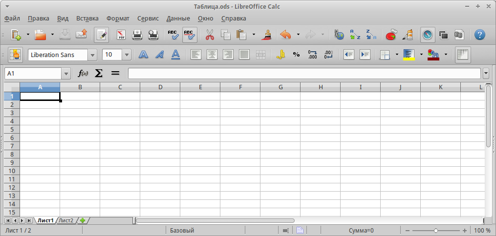

    Главное окно Calc

* **Файл** – содержит команды, применяемые ко всему документу. Например, *Открыть*, *Сохранить*, *Мастер*, *Экспорт в PDF*, *Печать*, *Цифровая подпись* и другие.

* **Правка** – содержит команды для редактирования документа. Например, *Отменить*, *Копировать*, *Изменения*, *Подключаемый модуль* и другие.

* **Вид** – содержит команды для изменения интерфейса Calc. Например, *Панели инструментов*, *Заголовки столбцов и строк*, *Во весь экран*, *Масштаб* и другие.

* **Вставка** – содержит команды для вставки элементов в таблицу. Например, *Ячейки*, *Строки*, *Столбцы*, *Лист*, *Изображение* и другие.

* **Формат** – содержит команды для изменения разметки таблицы. Например, *Ячейка*, *Страница*, *Стили и форматирование*, *Выравнивание* и другие.

* **Сервис** – содержит различные функции для проверки и настройки таблицы. Например, *Параметры*, *Проверка орфографии*, *Совместно использовать документ*, *Галерея*, *Макросы* и другие.

* **Данные** – содержит команды для манипулирования данными в вашей таблице. Например, *Задать диапазон*, Сортировка, Объединить и другие.

* **Окно** – содержит команды для отображения окон. Например, *Новое окно*, *Разбить* и другие.

* **Справка** – содержит ссылки на справочную систему встроенную в программу и другие разнообразные функции. Например, *Справка*, *Лицензия*, *Проверка обновлений* и другие.

Панели инструментов
~~~~~~~~~~~~~~~~~~~

По умолчанию Calc запускается со Стандартной панелью и панелью Форматирование, расположенными в верхней части главного окна (рисунок :ref:`ch5-lo-screen-001`).

Панели инструментов Calc могут быть прикрепленными или  плавающими, позволяя перемещать панель в удобное для вас место. 

Стандартный набор значков (иногда называемых кнопками) на панели инструментов предоставляет широкий спектр общих команд и функций. Значки на панелях служат для быстрого доступа к командам, которые также доступны через выпадающие меню. Можно удалять или добавлять значки на панели инструментов, смотрите *Главу 14 -- Настройка LibreOffice* данного руководства, чтобы получить дополнительные сведения.

Панель формул
~~~~~~~~~~~~~

*Панель формул* расположена в верхней части рабочего окна Calc прямо над рабочей областью с ячейками. Эта панель всегда расположена на этом месте и не может быть плавающей. Если *Панель формул* не видна, то зайдите в меню :menuselection:`&Вид --> &Панели инструментов --> Панель формул` и отметьте её флажком.

.. _ch5-lo-screen-002:

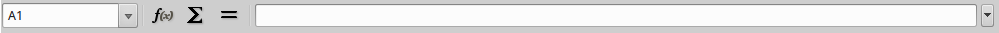

    Панель формул

Панель формул состоит из следующих элементов (слева направо на рисунке :ref:`ch5-lo-screen-002`):

* Поле **Имя** |ch5-lo-screen-004| – указывает ссылку на ячейку, используя комбинацию букв и цифр, например А1. Буква указывает столбец, а цифра – номер строки выбранной ячейки. Также можно задать собственное название ячейки.

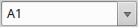

* **Мастер функций** |ch5-lo-screen-003| – открывает диалог, в котором можно просмотреть список всех доступных функций. Каждая функция содержит подробное описание с указанием всех возможных параметров.

* **Сумма** |ch5-lo-screen-005| – нажмите на значок *Сумма*, чтобы посчитать сумму в заранее выделенных ячейках. Сумма будет вставлена в ячейку ниже выделенного диапазона.

* **Функция** |ch5-lo-screen-006| – нажатие на значок *Функция* вставит знак равенства (=) в выбранную ячейку и в *Строку ввода*, что позволит начать ввод формулы.

* **Строка ввода** – отображает и позволяет редактировать содержимое выбранной ячейки (данные, формулы или функции).

Также можно изменять содержимое ячейки прямо в ячейке, дважды нажав на неё левой кнопкой мыши. При вводе новых данных в ячейку, значки *Сумма* |ch5-lo-screen-005| и *Функция* |ch5-lo-screen-006| в строке ввода изменятся на значки *Отменить* |ch5-lo-screen-008| и *Принять* |ch5-lo-screen-009|.

.. _ch5-lo-screen-007:

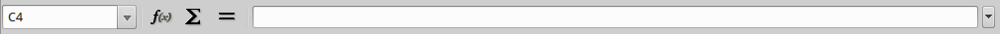

    Панель формул при изменении содержимого ячейки

.. tip:: Ввод формул вручную всегда начинается с ввода знака равно ``=``.

.. note:: В электронной таблице термин «функция» охватывает гораздо больше, чем просто математические функции, смотрите *Руководство по Calc, Глава 7, Использование формул и функций*, для получения дополнительных сведений.

Разметка таблицы
~~~~~~~~~~~~~~~~

Индивидуальные ячейки
"""""""""""""""""""""

Основная часть рабочей области в Calc отображается ячейками в виде сетки. Каждая ячейка образована пересечением столбцов и строк в электронной таблице.

Верхняя часть столбцов и левый край строк представляют собой ряд заголовков, содержащих буквы и цифры. Заголовки столбцов используют буквы латинского алфавита, начиная с А и далее по алфавиту направо. Заголовки строк используют числа, начиная с 1 и далее по порядку вниз.

Эти заголовки столбцов и строк образуют ссылки на ячейки, которые появляются в поле *Имя* в строке формул (рисунок :ref:`ch5-lo-screen-002`). Если заголовки не видны в электронной таблице, перейдите в меню *Вид* и выберите пункт *Заголовки столбцов/строк*.

Ярлыки листов
"""""""""""""

В одном файле Calc может содержаться более, чем один *Лист*. В нижней части рабочей области в электронной таблице находятся ярлыки листов с указанием номера и названия каждого листа в таблице. Нажатие левой кнопкой мыши на ярлык позволяет получить доступ к каждому отдельному листу и отображает этот лист. Активный лист обозначается белым цветом (согласно настройкам по умолчанию для Calc). Также можно выбрать несколько листов, удерживая нажатой клавишу ``Ctrl``, и нажимая на ярлыки листов.

.. _ch5-lo-screen-010.png:

.. figure:: _static/chapter5/ch5-lo-screen-010.png
    :scale: 60%
    :align: center
    :alt: Ярлыки листов

    Ярлыки листов

Чтобы изменить имя листа  (по умолчанию им присваиваются имена *Лист1*, *Лист2* и так далее), нажмите правой кнопкой мыши на ярлыке листа и выберите пункт *Переименовать лист* из контекстного меню. Откроется диалоговое окно, в котором можно ввести новое название для листа. Нажмите *OK*, чтобы закрыть диалоговое окно.

Чтобы изменить цвет ярлыка листа, также нажмите на него правой кнопкой мыши и выберите  пункт *Цвет ярлыка* из контекстного меню, чтобы открыть диалог выбора цвета (рисунок :ref:`ch5-lo-screen-011.png`). Выберите цвет и нажмите кнопку *ОК*, чтобы закрыть диалоговое окно. Для добавления новых цветов к цветовой палитре смотрите *Главу 14, Настройка LibreOffice* данного руководства.

.. _ch5-lo-screen-011.png:

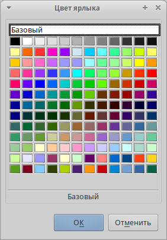

    Диалог выбора цвета ярлыка листа

Строка состояния
""""""""""""""""

Строка состояния Calc содержит информацию о таблице и позволяет осуществить быстрый доступ к некоторым действиям. Большинство областей строки состояния повторяются в других компонентах LibreOffice. Смотрите раздел :ref:`statusbar` и *Главу 1 – Введение в Calc* полного руководства по Calc для получения более подробной информации.

.. _ch5-lo-screen-012.png:

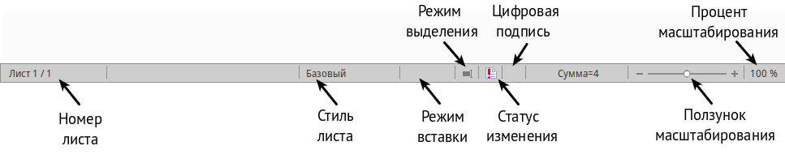

    Строка состояния

Боковая панель
""""""""""""""

Начиная с версии 4.0 в LibreOffice появилась прикрепляемая боковая панель элементов, которая упрощает доступ ко многим функциям. Боковая панель удобна, прежде всего, на широких мониторах и позволяет сэкономить вертикальное пространство на экране.
Если боковая панель не отображается по умолчанию, включить её можно через :menuselection:`Вид --> Боковая панель`.

*Боковая панель* доступна во всех компонентах LibreOffice. В некоторых компонентах она имеет дополнительные вкладки. В Calc она содержит следующий набор вкладок:

* Меню конфигурации боковой панели;
* Свойства;
* Стили и форматирование;
* Галерея;
* Навигатор;
* Функции (только в Calc).

.. _ch5-lo-screen-013.png:

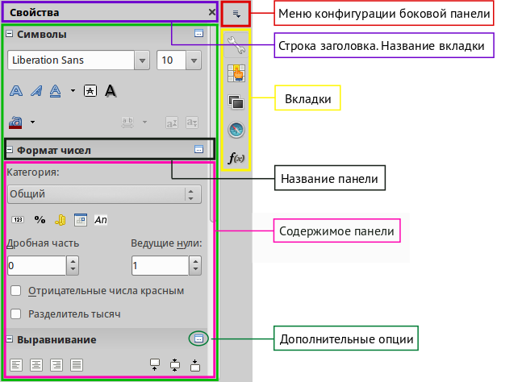

    Боковая панель

* **Меню конфигурации боковой панели** – содержит настройки самой боковой панели. При необходимости позволяет включать/выключать отображение тех или иных вкладок.

* Вкладка **Свойства** содержит четыре области:

    * **Символы** – позволяет настроить параметры шрифта (гарнитуру, кегль, начертание). Некоторые кнопки (например, верхний и нижний индексы) становятся активны, когда ячейка находится в режиме редактирования.
    * **Формат чисел** – задает формат отображения данных в ячейках (денежный, дата и т.д.).
    * **Выравнивание** – управляет выравниванием содержимого в ячейках.
    * **Внешний вид ячеек** – управляет внешним видом ячеек позволяя задать цвет фона, обрамление и т.д.

* Вкладка **Стили и форматирование** – аналогична диалогу *Стили и форматирование* (:menuselection:`Фо&мат --> С&тили` или ``F11``).
* Вкладка **Галерея** – аналогична диалогу *Галерея* (:menuselection:`С&ервис --> Га&лерея` )
* Вкладка **Навигатор** – аналогична диалогу *Навигатор* (:menuselection:`&Вид --> &Навигатор` или ``F5``)
* Вкладка **Функции** – содержит набор функций, доступных также в диалоге :menuselection:`Вст&авка --> Ф&ункция`.

Нажатие на крестик ``x`` рядом с заголовком каждой вкладки, сворачивает боковую панель. Чтобы снова открыть ту или иную вкладку нажмите на её значок на боковой панели.

---------------------

Открытие файлов в формате CSV
-----------------------------

Файлы в формате (:abbr:`CSV (Comma-Separated Values — значения, разделённые запятыми)`) [#]_ представляют собой таблицы в текстовом формате, где содержимое ячеек разделяется, например, запятыми, точками с запятой и иными разделителями.  Каждая строка в файле CSV представляет собой строку в таблице. Текст вводится в кавычках, числа вводятся без кавычек.

.. [#] Подробнее о CSV-данных смотрите статью: https://ru.wikipedia.org/wiki/CSV

Чтобы открыть файл CSV в Calc:

1. Выберите пункт меню :menuselection:`Файл --> Открыть` и найдите файл в формате CSV, который нужно открыть.
2. Выберите файл и нажмите кнопку *Открыть*. По умолчанию файл CSV имеет расширение .csv. Также файл CSV может быть с расширением .txt или не иметь его вообще.
3. Откроется диалог *Импорт текста* (рисунок нижк), в котором можно выбрать несколько настроек, доступных при импорте файлов CSV в таблицы Calc.
4. Нажмите кнопку *OK*, чтобы открыть и импортировать файл.

.. _ch5-lo-screen-014.png:

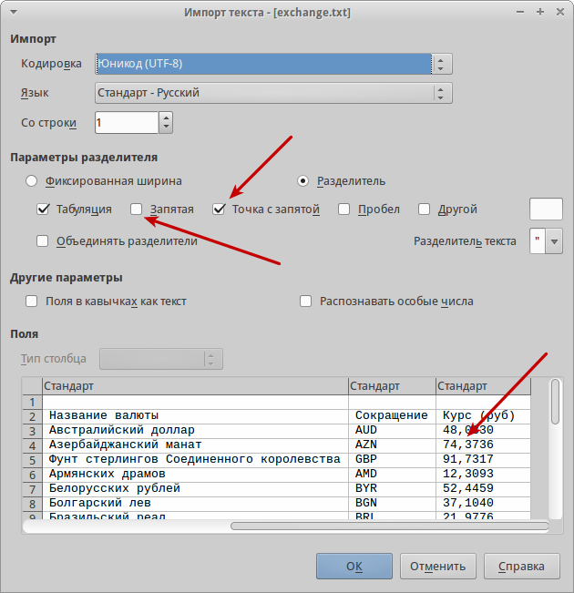

    Диалог *Импорт текста*

Различные опции для импорта файлов CSV в электронную таблицу Calc описаны ниже:

**Импорт**

* **Кодировка** [#]_ – определяет набор символов, который будет использоваться в импортируемом файле.

.. [#] Подробнее о кодировках смотрите статью: `https://ru.wikipedia.org/wiki/Набор_символов <https://ru.wikipedia.org/wiki/Набор_символов>`_

* **Язык** – определяет, как импортируются цифровые строки. Если язык для импорта CSV установлен в значение *По умолчанию*, Calc будет использовать язык, установленный в общих настройках. Если язык установлен конкретно (например «английский», при значении по умолчанию «русский»), этот язык будет использоваться при импорте цифр.

* **Со строки** – определяет строку, с которой начнётся импорт. Строки видны в окне предварительного просмотра в нижней части диалогового окна. 

**Параметры разделителя** – указывает какой символ используется в качестве разделителя значений. 

* **Фиксированная ширина** – разделяет данные с фиксированной шириной (равное количество символов) на столбцы. Нажмите на линейке в окне предварительного просмотра, чтобы установить нужную ширину. 

* **Разделитель** – выберите разделитель, используемый в данных, чтобы разграничить данные на столбцы. При выборе *Другой*, укажите вручную символ, используемый для разделения данных на столбцы. Такой пользовательский разделитель должен содержаться в данных. 

.. note:: Имейте ввиду, что в Российской Федерации запятой (``,``) принято отделять десятичную часть числа. Выбор в качетсве разделителя запятой может привести к некорректному импорту CSV.

* **Объединять разделители** – сочетает в себе последовательные разделители и удаляет пустые поля данных.

* **Разделитель текста** – задаёт символ для разграничения текстовых данных. 

**Другие параметры**

* **Поля в кавычках как текст** – если эта опция активна, поля или ячейки, значения которых ограничены символами, заданными в поле **Разделитель текста** (по умолчанию используются двойные англоязычные кавычки ``"`` в начале и конце текстового блока, но можно задать свой символ разделения), импортируются в виде текста.

* **Распознавать особые числа** – если эта опция активна, Calc автоматически обнаружит все числовые форматы, в том числе специальные числовые форматы такие, как дата, время и экспоненциальное представление. 

  Выбранный язык также влияет на то, как такие специальные числа обнаруживаются, так как разные языки используют различное написание таких специальных чисел. 

  Если эта опция отключена, Calc будет обнаруживать и конвертировать только десятичные числа. Остальные, в том числе числа, представленные в экспоненциальном представлении, будут импортированы в виде текста. Десятичное число может содержать цифры от 0 до 9, разделители тысяч и десятичные разделители. Разделители тысяч и десятичные разделители могут изменяться в зависимости от выбранного языка и региона.

**Поля** – показывает, как будут выглядеть данные после разделения на столбцы. 

* **Тип столбца** – выберите столбец в окне предварительного просмотра и выберите тип данных, который будет применяться к импортируемым данным. 
* **Стандарт** – Calc определяет тип данных.
* **Текст** – импортирует данные, как текст.
* **Английский США** – числа, отформатированные на языке *Английский США* ищутся и включаются независимо от языка системы. Формат числа не применяется. Если нет записей c настройкой *Английский США*, то применяется стандартный формат.
* **Скрыть** – данные в указанных столбцах не будут импортированы.
* **Дата (ДМГ)/(МДГ)/(ГМД)** – определяет формат вывода дат: Д – День; М – Месяц; Г – Год.

Сохранение электронных таблиц
-----------------------------

Смотрите раздел :ref:`saving documents` для ознакомления с основами сохранения документов в LibreOffice. Также Calc может сохранять таблицы в различных форматах и экспортировать таблицы в форматы PDF, HTML и XHTML. Для получения подробной информации смотрите *Главу 6 – Печать, Экспорт и Рассылка электронной почтой* руководства по Calc.

Сохранение электронных таблиц в других форматах 
~~~~~~~~~~~~~~~~~~~~~~~~~~~~~~~~~~~~~~~~~~~~~~~

По умолчанию LibreOffice сохраняет электронные таблицы в формате ``*.ods`` (входит в состав формата :abbr:`ODF (Open Document Format)`). Для сохранения электронных таблиц в других форматах необходимо:

1. Открыть меню :menuselection:`&Файл --> Сохранить &как`.
#. В поле *Имя файла* ввести название документа.
#. В поле *Тип файла* выбрать из выпадающего списка необходимый формат.
#. Нажать кнопку *Сохранить*.

.. _ch5-lo-screen-015.png:

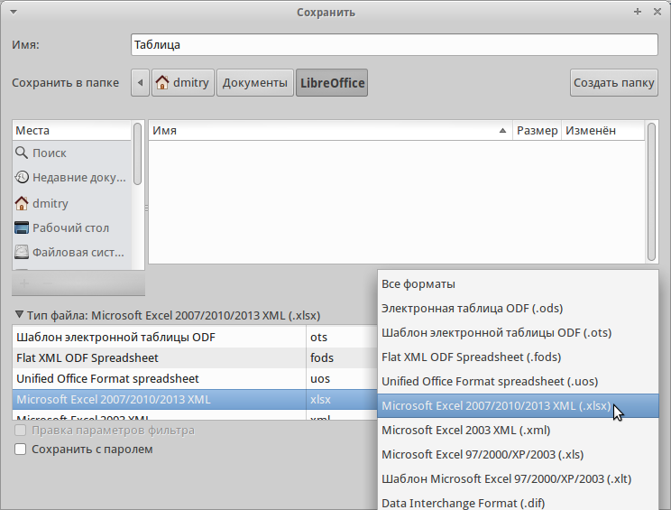

    Выбор формата сохранения

При сохранении в форматах отличных от ``*.ods`` будет выведен диалог подтверждения формата сохранения. Чтобы этот диалог больше не появлялся, необходимо снять галочку напротив *Спрашивать при сохранении не в ODF формат*.

.. _ch5-lo-screen-016.png:

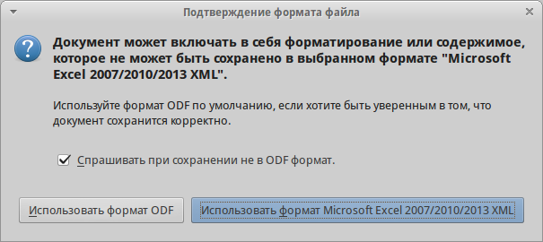

    Подтверждение сохранения не в ODF формат

Если выбрать для таблицы формат сохранения *Текст CSV* (``*.csv``), откроется диалог *Экспорт в текстовый файл*, в котором можно выбрать кодировку, разделитель полей, разделитель текста и прочие настройки.

.. _ch5-lo-screen-017.png:

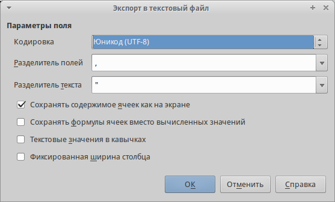

    Экспорт в текстовый файл

Чтобы Calc сохранял документы по умолчанию в формате, отличном от формата ODF, откройте меню :menuselection:`С&ервис --> &Параметры --> Загрузка/Сохранение --> Общие`. В разделе *Формат файла по умолчанию и настройки ODF* выберите *Тип документа* – *Электронная таблица* и ниже выберите в выпадающем списке *Всегда сохранять как* требуемый формат файла.

.. _ch5-lo-screen-018.png:

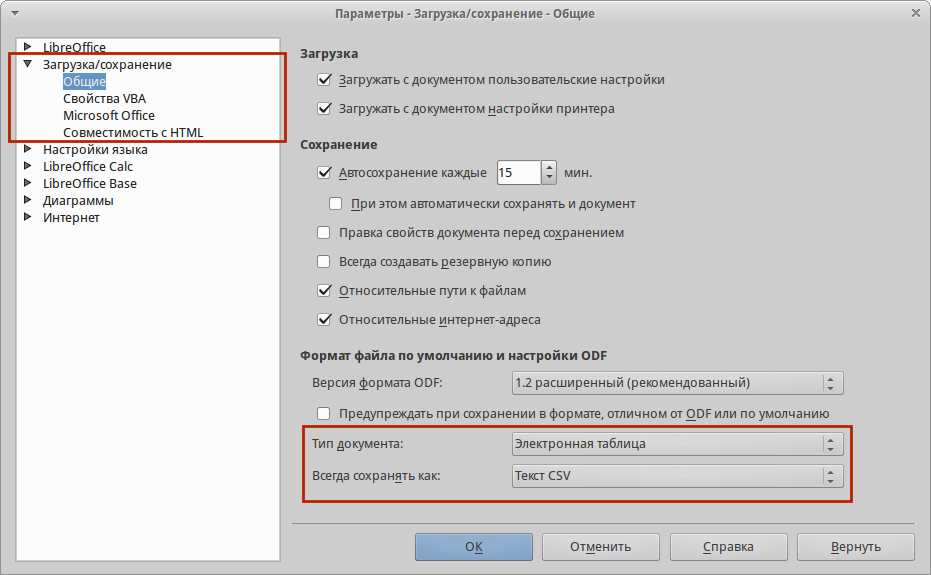

    Изменение формата сохранения по умолчанию

Навигация в электронных таблицах
--------------------------------

Calc предоставляет множество способов навигации по электронной таблице от ячейке к ячейке и с одного листа на другой лист. Можно использовать любой метод.

Навигация по ячейкам
~~~~~~~~~~~~~~~~~~~~

Когда ячейка выделена, то её границы обводятся жирной линией. Если выбрана группа ячеек, то все выделенные ячейки будут окрашены некоторым цветом. Цвет выделения границы ячейки и цвет выделения группы ячеек зависит от используемой операционной системы и настроек LibreOffice.

* **Использование мыши** – поместите курсор мыши на ячейку и нажмите левой кнопкой мыши. Для перемещения фокуса в другую ячейку с помощью мыши, просто переместите указатель мыши к нужной ячейке и нажмите левую кнопку мыши. 

* **Использование ссылок на ячейки** – выделение или удаление существующей ссылки на ячейку в поле *Имя* (смотрите рисунок :ref:`ch5-lo-screen-002`) на панели формул. Введите новую ссылку на нужную вам ячейку и нажмите клавишу ``Enter`` на клавиатуре. Ссылки на ячейки не зависят от регистра, например, при наборе не будет разницы между a3 или A3, фокус будет помещён на ячейку A3. Не забывайте, что в координатах ячеек используются только латинские буквы.

* **Использование Навигатора** – нажмите на значок *Навигатор* |ch5-lo-screen-020| на стандартной панели или нажмите клавишу ``F5`` (:menuselection:`&Вид --> &Навигатор`), чтобы открыть *Навигатор*. Введите ссылку на ячейку в полях *Столбец* и *Строка* и нажмите клавишу ``Enter``.

.. _ch5-lo-screen-019.png:

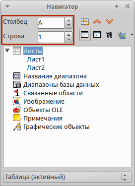

    Изменение формата сохранения по умолчанию

* **Использование клавиши Enter** – нажимайте клавишу ``Enter``, чтобы перемещать выделение ячейки вниз по столбцу на следующую строку. Нажимайте сочетание клавиш ``Shift+Enter``, чтобы перемещать выделение ячейки вверх по столбцу на предыдущую строку.

* **Использование клавиши Tab** – нажимайте клавишу ``Tab``, чтобы перемещать выделение ячейки вправо по строке на следующий столбец. Нажимайте сочетание клавиш ``Shift+Tab``, чтобы перемещать выделение ячейки влево по строке на предыдущий столбец. 

* **Использование клавиш влево/вправо/вверх/вниз** – нажимайте клавиши курсора (со стрелками) на клавиатуре, чтобы перемещать фокус ячейки в направлении нажатой стрелки.

* **Использование клавиш Home, End, Page Up и Page Down**

    * ``Home`` перемещает фокус в начало строки (крайняя левая ячейка строки).
    * ``End`` перемещает фокус вправо по текущей строке, в ячейку на пересечении с крайним правым столбцом, содержащим данные.
    * ``Page Down`` перемещает выделение вниз на высоту экран.
    * ``Page Up`` перемещает выделение вверх на высоту экран.

Навигация по листам
~~~~~~~~~~~~~~~~~~~

Каждый лист в электронной таблице не зависит от других листов, при этом они могут быть связаны между собой ссылками. Есть три способа навигации между листами электронной таблицы.

* **Использование Навигатора** – если Навигатор открыт (рисунок :ref:`ch5-lo-screen-021.png`), дважды щелкните по любому листу в списке, чтобы перейти к нему.

.. _ch5-lo-screen-021.png:

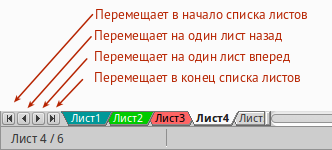

    Навигация по листам таблицы

* **Использование клавиатуры** – используйте сочетания клавиш ``Ctrl+Page Down``, чтобы перейти к листу, расположенному справа от текущего и ``Ctrl+Page Up`` – к листу слева от текущего.

* **Использование мыши** – нажмите на один из ярлыков листа, расположенным внизу таблицы, чтобы перейти к нему, либо нажмите правой кнопкой мыши по стрелкам слева от ярлыков листов и из контекстного меню выберите нужный лист.

Если в электронной таблице много листов, то некоторые из ярлыков листов могут быть скрыты за горизонтальной полосой прокрутки в нижней части экрана. Если это так, то с помощью четырех кнопок, расположенных слева от ярлыков листов, вы можете продвигать нужные ярлыки в поле зрения (рисунок :ref:`ch5-lo-screen-021.png`).

Навигация при помощи клавиатуры
~~~~~~~~~~~~~~~~~~~~~~~~~~~~~~~

Нажатие некоторых клавиш или сочетаний клавиш позволяет перемещаться по таблице с помощью клавиатуры. Сочетания клавиш – это нажатие одновременно более одной клавиши, например используйте комбинацию клавиш ``Ctrl + Home``, чтобы перейти к ячейке A1. В таблице ниже представлены клавиши и сочетания клавиш, которые используются для навигации в таблицах Calc. Подробнее об общих сочетаниях клавиш смотрите :ref:`_KeyboardShortcuts`.

.. csv-table:: 
    :header: "Клавиши и сочетания клавиш", "Результат"
    :widths: 10, 40
   
    Стрелка вправо ``→``,"Перемещает фокус на ячейку вправо"
    Стрелка влево ``←``,"Перемещает фокус на ячейку влево"
    Стрелка вверх ``↑``,"Перемещает фокус на ячейку вверх"
    Стрелка вниз ``↓``,"Перемещает фокус на ячейку вниз"
    ``Ctrl+→``,"Перемещение фокуса на первую ячейку с данными в строке справа от текущей, если текущая ячейка пустая.
    
    Перемещение фокуса на следующую ячейку с данными справа от текущей, если текущая ячейка содержит данные.
    
    Перемещение фокуса на последнюю справа ячейку в строке, если текущая ячейка содержит данные и справа от нее в строке нет ячеек с данными."
    ``Ctrl+←``,"Перемещение фокуса на первую ячейку с данными в строке слева от текущей, если текущая ячейка пустая.
    
    Перемещение фокуса на следующую ячейку с данными слева от текущей, если текущая ячейка содержит данные.
    
    Перемещение фокуса на первую слева ячейку в строке, если текущая ячейка содержит данные и слева от нее в строке нет ячеек с данными."
    ``Ctrl+↑``,"Перемещение фокуса от пустой ячейки вверх по текущему столбцу до первой ячейки с данными.
    
    Перемещение фокуса на следующую ячейку с данными сверху от текущей, если текущая ячейка содержит данные.
    
    Перемещение фокуса из ячейки с данными в первую строку текущего столбца, если все ячейки, расположенные выше текущей пустые."
    ``Ctrl+↓``,"Перемещение фокуса из пустой ячейки вниз по текущему столбцу на первую ячейку с данными.
    
    Перемещение фокуса на следующую ячейку с данными снизу от текущей, если текущая ячейка содержит данные.
    
    Перемещение фокуса из ячейки с данными в последнюю строку текущего столбца, если все ячейки, расположенные ниже текущей пустые."
    ``Ctrl+Home``,"Перемещение фокуса на ячейку А1 текущего листа"
    ``Ctrl+End``,"Перемещает фокус из любой ячейки листа на крайнюю нижнюю правую ячейку листа с данными."
    ``Alt+Page Down``,"Перемещает фокус на один экран вправо (если возможно)."
    ``Alt+Page Up``,"Перемещает фокус на один экран влево (если возможно)."
    ``Ctrl+Page Down``,"Перемещает фокус на следующий лист справа от текущего, если таблица имеет более одного листа."
    ``Ctrl+Page Up``,"Перемещает фокус на следующий лист слева от текущего, если таблица имеет более одного листа."
    ``Tab``,"Перемещает фокус на следующую ячейку справа от текущей"
    ``Shift+Tab``,"Перемещает фокус на следующую ячейку слева от текущей"
    ``Enter``,"Вниз на одну ячейку (если не изменено в настройках пользователем)"
    ``Shift+Enter``,"Вверх на одну ячейку (если не изменено в настройках пользователем)"

Настройка действия при нажатии клавиши Enter
~~~~~~~~~~~~~~~~~~~~~~~~~~~~~~~~~~~~~~~~~~~~

Вы можете изменить направление перемещения выделения при нажатии клавиши ``Enter`` в меню :menuselection:`С&ервис --> &Параметры --> LibreOffice Calc --> Общие`. Выберите направление перемещения выделения из выпадающего списка. В зависимости от файла или типа данных, установка иного направления перемещения выделения может быть полезна. Клавишу ``Enter`` также можно использовать для переключения в режим правки. Используйте первые два пункта в разделе ``Настройки ввода``, чтобы изменить настройки для клавиши ``Enter``.

.. _ch5-lo-screen-022.png:

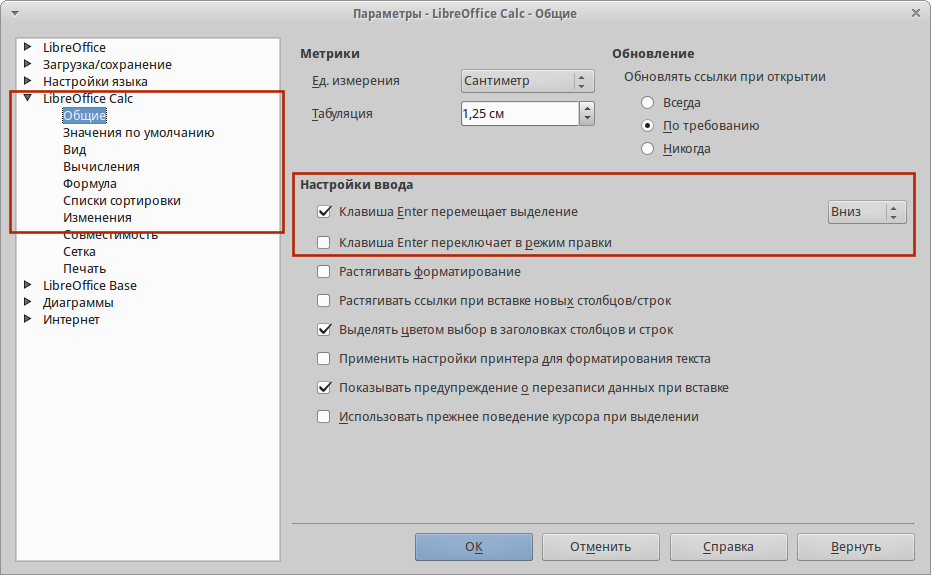

    Настройка действия при нажатии клавиши ``Enter``
    
-----------------

Выбор элементов в таблице
-------------------------

Выбор ячеек
~~~~~~~~~~~

Одна ячейка
"""""""""""

Диапазон смежных ячеек
""""""""""""""""""""""

Диапазон не смежных ячеек
"""""""""""""""""""""""""

Выделение столбцов и строк
~~~~~~~~~~~~~~~~~~~~~~~~~~

Один столбец или одна строка
""""""""""""""""""""""""""""

Несколько столбцов или строк
""""""""""""""""""""""""""""

Весь лист
"""""""""

Выделение листов
~~~~~~~~~~~~~~~~

Один лист
"""""""""

Несколько смежных листов
""""""""""""""""""""""""

Несколько не смежных листов
"""""""""""""""""""""""""""

Все листы
"""""""""

Нажмите правой кнопкой мыши на строке ярлыков листов и выберите в контекстном меню пункт *Выделить все листы*.

---------------

Работа со столбцами и строками
------------------------------

Вставка столбцов и строк
~~~~~~~~~~~~~~~~~~~~~~~~

Один столбец или строка
"""""""""""""""""""""""

Несколько столбцов или строк
""""""""""""""""""""""""""""

Удаление столбцов и строк
~~~~~~~~~~~~~~~~~~~~~~~~~

Один столбец или строка
"""""""""""""""""""""""

Несколько строк или столбцов
""""""""""""""""""""""""""""

-------------

Работа с листами
----------------

Вставка новых листов
~~~~~~~~~~~~~~~~~~~~

Перемещение и копирование листов
~~~~~~~~~~~~~~~~~~~~~~~~~~~~~~~~

Перетаскивание
""""""""""""""

Использование диалога
"""""""""""""""""""""

Удаление листов
~~~~~~~~~~~~~~~

Переименование листов
~~~~~~~~~~~~~~~~~~~~~

---------------

Внешний вид Calc
----------------

Настройка вида документа
~~~~~~~~~~~~~~~~~~~~~~~~

Фиксирование строк и столбцов
~~~~~~~~~~~~~~~~~~~~~~~~~~~~~

Фиксирование строк или столбцов
"""""""""""""""""""""""""""""""

Фиксирование строк и столбцов
"""""""""""""""""""""""""""""

Отмена фиксирования
"""""""""""""""""""

Разделение экрана
~~~~~~~~~~~~~~~~~~

Горизонтальное или вертикальное разделение
""""""""""""""""""""""""""""""""""""""""""

Горизонтальное и вертикальное разделение
""""""""""""""""""""""""""""""""""""""""""

Отмена разделения экрана
""""""""""""""""""""""""""""""""""""""""""

--------------

Использование клавиатуры
------------------------

Числа
~~~~~

Отрицательные числа
""""""""""""""""""""""""""""""""""""""""""

Ведущие нули
""""""""""""""""""""""""""""""""""""""""""

Число, как текст
""""""""""""""""""""""""""""""""""""""""""

Текст
~~~~~

Дата и время
~~~~~~~~~~~~

Параметры автозамены
~~~~~~~~~~~~~~~~~~~~

Замена
""""""

Исключения
""""""""""

Параметры
""""""""""

Выберите параметры для автоматической замены ошибок во введённых вами данных и нажмите кнопку OK.
Национальные параметры

Укажите параметры автозамены кавычек и параметры, которые являются специфическими для языка текста.

Восстановить
""""""""""""

Сброс измененных значений к значениям LibreOffice по умолчанию.

Отключение автоматических изменений
"""""""""""""""""""""""""""""""""""

Некоторые параметры автозамены применяются при нажатии пробела после ввода данных. Чтобы выключить или включить автозамену Calc, перейдите в меню Сервис > Содержимое ячейки и снимите флажок с пункта Автоввод.

--------------

