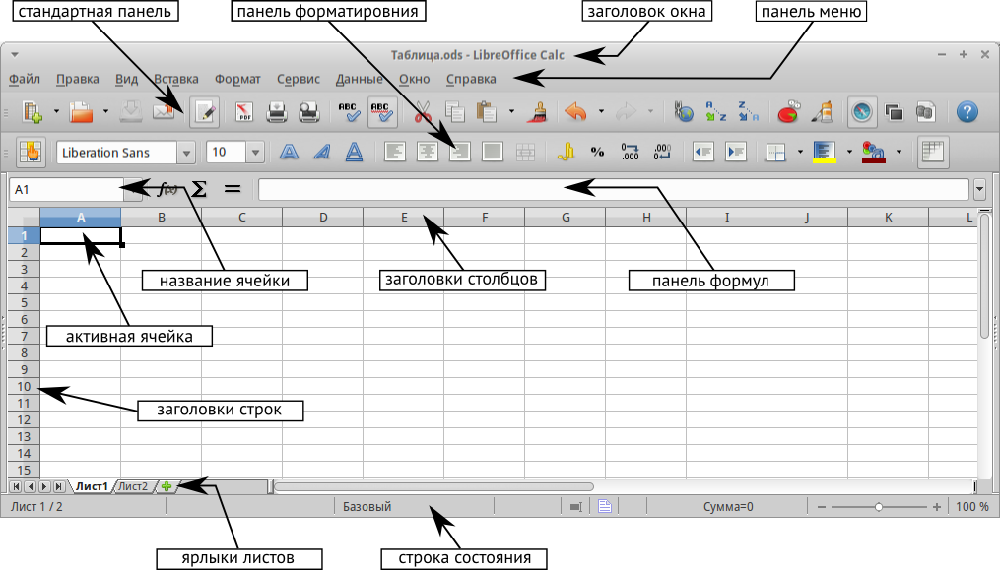

.. meta::
   :description: Краткое руководство по LibreOffice: Глава 5 – Табличный процессор Calc
   :keywords: LibreOffice, Writer, Impress, Calc, Math, Base, Draw, либреоффис

.. Список автозамен

.. |br| raw:: html

    
   
Глава 5 – Табличный процессор Calc
==================================

Что такое Calc?
---------------

Calc – это компонент для работы с электронными таблицами из состава LibreOffice. В электронную таблицу можно вводить данные (обычно числа) и манипулировать этими данными для получения определённого результата.

Кроме того, можно ввести данные, а затем изменить только некоторые из этих данных и наблюдать результат без необходимости полного повторного ввода таблиц или листа.

Другие возможности, представленные в Calc, включают в себя:

* Функции, которые могут быть использованы при создании формул, для выполнения сложных вычислений на основе данных.
* Функции баз данных, чтобы организовывать, хранить и фильтровать данные.
* Динамические диаграммы; широкий спектр 2D и 3D диаграмм.
* Макросы для записи и исполнения повторяющихся задач. В поставку включена поддержка для языков программирования Basic, Python, BeanShell и JavaScript.
* Возможность открывать, редактировать и сохранять файлы в формате Microsoft Excel.
* Импорт и экспорт электронных таблиц во множество форматов, включая HTML, CSV, PDF и PostScript.

.. note:: При необходимости использовать макросы в LibreOffice, написанные в Microsoft Excel с помощью VBA, сначала нужно изменить код макроса в редакторе LibreOffice Basic IDE. Смотрите Главу 13 данного руководства, Приступая к работе с макросами, и Главу 12 Руководства по Calc, Макросы Calc.

Таблицы, листы и ячейки
-----------------------

Calc работает с элементами, называемыми таблицами. Таблицы состоят из ряда отдельных листов, каждый лист содержит ячейки, расположенные в строках и столбцах. Конкретная ячейка определяется буквой столбца и номером её строки. 

Ячейки содержат отдельные элементы – текст, числа, формулы и так далее, которые являются данными для отображения и манипулирования.

В каждой таблице может быть несколько листов, и каждый лист имеет максимум 1048576 строк и максимум 1024 столбца.

Главное окно Calc
-----------------

При запуске Calc становится доступным главное окно программы (рисунок 1). Различные части этого окна будут описаны ниже.

Заголовок окна
~~~~~~~~~~~~~~

Заголовок окна расположен в верхней части окна и показывает название текущей таблицы  (документа). Если открыта новая таблица, то название её будет *Без имени Х*, где *Х* — это номер по порядку. Если таблица сохраняется в первый раз, то необходимо будет задать ей имя.

Панель меню
~~~~~~~~~~~

*Панель меню* содержит выпадающие меню, в которых сгруппированы все функции для работе в Calc. Панель может быть дополнительно настроены, смотрите Главу 14, Настройка LibreOffice, в данном руководстве для получения более подробной информации.

.. _ch5-lo-screen-001:

    Главное окно Calc

* **Файл** – содержит команды, применяемые ко всему документу. Например, *Открыть*, *Сохранить*, *Мастер*, *Экспорт в PDF*, *Печать*, *Цифровая подпись* и другие.

* **Правка** – содержит команды для редактирования документа. Например, *Отменить*, *Копировать*, *Изменения*, *Подключаемый модуль* и другие.

* **Вид** – содержит команды для изменения интерфейса Calc. Например, *Панели инструментов*, *Заголовки столбцов и строк*, *Во весь экран*, *Масштаб* и другие.

* **Вставка** – содержит команды для вставки элементов в таблицу. Например, *Ячейки*, *Строки*, *Столбцы*, *Лист*, *Изображение* и другие.

* **Формат** – содержит команды для изменения разметки таблицы. Например, *Ячейка*, *Страница*, *Стили и форматирование*, *Выравнивание* и другие.

* **Сервис** – содержит различные функции для проверки и настройки таблицы. Например, *Параметры*, *Проверка орфографии*, *Совместно использовать документ*, *Галерея*, *Макросы* и другие.

* **Данные** – содержит команды для манипулирования данными в вашей таблице. Например, *Задать диапазон*, Сортировка, Объединить и другие.

* **Окно** – содержит команды для отображения окон. Например, *Новое окно*, *Разбить* и другие.

* **Справка** – содержит ссылки на справочную систему встроенную в программу и другие разнообразные функции. Например, *Справка*, *Лицензия*, *Проверка обновлений* и другие.

Панели инструментов
~~~~~~~~~~~~~~~~~~~

По умолчанию Calc запускается со Стандартной панелью и панелью Форматирование, расположенными в верхней части главного окна (рисунок :ref:`ch5-lo-screen-001`).

Панели инструментов Calc могут быть прикрепленными или  плавающими, позволяя перемещать панель в удобное для вас место. 

Стандартный набор значков (иногда называемых кнопками) на панели инструментов предоставляет широкий спектр общих команд и функций. Значки на панелях служат для быстрого доступа к командам, которые также доступны через выпадающие меню. Можно удалять или добавлять значки на панели инструментов, смотрите *Главу 14 -- Настройка LibreOffice* данного руководства, чтобы получить дополнительные сведения.

Панель формул
~~~~~~~~~~~~~

*Панель формул* расположена в верхней части рабочего окна Calc прямо над рабочей областью с ячейками. Эта панель всегда расположена на этом месте и не может быть плавающей. Если *Панель формул* не видна, то зайдите в меню :menuselection:`&Вид --> &Панели инструментов --> Панель формул` и отметьте её флажком.

.. _ch5-lo-screen-002:

.. figure:: _static/chapter5/ch5-lo-screen-002.png
    :scale: 70%
    :align: center
    :alt: Панель формул

    Панель формул

Панель формул состоит из следующих элементов (слева направо на рисунке :ref:`ch5-lo-screen-002`):

* Поле **Имя** |ch5-lo-screen-004| – указывает ссылку на ячейку, используя комбинацию букв и цифр, например А1. Буква указывает столбец, а цифра – номер строки выбранной ячейки. Также можно задать собственное название ячейки.

.. |ch5-lo-screen-004| image:: _static/chapter5/ch5-lo-screen-004.png
              :scale: 60%

* **Мастер функций** |ch5-lo-screen-003| – открывает диалог, в котором можно просмотреть список всех доступных функций. Каждая функция содержит подробное описание с указанием всех возможных параметров.

* **Сумма** |ch5-lo-screen-005| – нажмите на значок *Сумма*, чтобы посчитать сумму в заранее выделенных ячейках. Сумма будет вставлена в ячейку ниже выделенного диапазона.

.. |ch5-lo-screen-005| image:: _static/chapter5/ch5-lo-screen-005.png
              :scale: 80%

* **Функция** |ch5-lo-screen-006| – нажатие на значок *Функция* вставит знак равенства (=) в выбранную ячейку и в *Строку ввода*, что позволит начать ввод формулы.

.. |ch5-lo-screen-006| image:: _static/chapter5/ch5-lo-screen-006.png
              :scale: 80%

* **Строка ввода** – отображает и позволяет редактировать содержимое выбранной ячейки (данные, формулы или функции).

Также можно изменять содержимое ячейки прямо в ячейке, дважды нажав на неё левой кнопкой мыши. При вводе новых данных в ячейку, значки *Сумма* |ch5-lo-screen-005| и *Функция* |ch5-lo-screen-006| в строке ввода изменятся на значки *Отменить* |ch5-lo-screen-008| и *Принять* |ch5-lo-screen-009|.

.. |ch5-lo-screen-008| image:: _static/chapter5/ch5-lo-screen-008.png
              :scale: 80%

.. |ch5-lo-screen-009| image:: _static/chapter5/ch5-lo-screen-009.png
              :scale: 80%

.. _ch5-lo-screen-007:

    Панель формул при изменении содержимого ячейки

.. tip:: Ввод формул вручную всегда начинается с ввода знака равно ``=``.

.. note:: В электронной таблице термин «функция» охватывает гораздо больше, чем просто математические функции, смотрите *Руководство по Calc, Глава 7, Использование формул и функций*, для получения дополнительных сведений.

Разметка таблицы
~~~~~~~~~~~~~~~~

Индивидуальные ячейки
"""""""""""""""""""""

Основная часть рабочей области в Calc отображается ячейками в виде сетки. Каждая ячейка образована пересечением столбцов и строк в электронной таблице.

Верхняя часть столбцов и левый край строк представляют собой ряд заголовков, содержащих буквы и цифры. Заголовки столбцов используют буквы латинского алфавита, начиная с А и далее по алфавиту направо. Заголовки строк используют числа, начиная с 1 и далее по порядку вниз.

Эти заголовки столбцов и строк образуют ссылки на ячейки, которые появляются в поле *Имя* в строке формул (рисунок :ref:`ch5-lo-screen-002`). Если заголовки не видны в электронной таблице, перейдите в меню *Вид* и выберите пункт *Заголовки столбцов/строк*.

Ярлыки листов
"""""""""""""

В одном файле Calc может содержаться более, чем один *Лист*. В нижней части рабочей области в электронной таблице находятся ярлыки листов с указанием номера и названия каждого листа в таблице. Нажатие левой кнопкой мыши на ярлык позволяет получить доступ к каждому отдельному листу и отображает этот лист. Активный лист обозначается белым цветом (согласно настройкам по умолчанию для Calc). Также можно выбрать несколько листов, удерживая нажатой клавишу ``Ctrl``, и нажимая на ярлыки листов.

.. _ch5-lo-screen-010.png:

.. figure:: _static/chapter5/ch5-lo-screen-010.png
    :scale: 60%
    :align: center
    :alt: Ярлыки листов

    Ярлыки листов

Чтобы изменить имя листа  (по умолчанию им присваиваются имена *Лист1*, *Лист2* и так далее), нажмите правой кнопкой мыши на ярлыке листа и выберите пункт *Переименовать лист* из контекстного меню. Откроется диалоговое окно, в котором можно ввести новое название для листа. Нажмите *OK*, чтобы закрыть диалоговое окно.

Чтобы изменить цвет ярлыка листа, также нажмите на него правой кнопкой мыши и выберите  пункт *Цвет ярлыка* из контекстного меню, чтобы открыть диалог выбора цвета (рисунок :ref:`ch5-lo-screen-011.png`). Выберите цвет и нажмите кнопку *ОК*, чтобы закрыть диалоговое окно. Для добавления новых цветов к цветовой палитре смотрите *Главу 14, Настройка LibreOffice* данного руководства.

.. _ch5-lo-screen-011.png:

.. figure:: _static/chapter5/ch5-lo-screen-011.png
    :scale: 60%
    :align: center
    :alt: Диалог выбора цвета ярлыка листа

    Диалог выбора цвета ярлыка листа

Строка состояния
""""""""""""""""

Строка состояния Calc содержит информацию о таблице и позволяет осуществить быстрый доступ к некоторым действиям. Большинство областей строки состояния повторяются в других компонентах LibreOffice. Смотрите раздел :ref:`statusbar` и *Главу 1 – Введение в Calc* полного руководства по Calc для получения более подробной информации.

.. _ch5-lo-screen-012.png:

.. figure:: _static/chapter5/ch5-lo-screen-012.png
    :scale: 60%
    :align: center
    :alt: Строка состояния

    Строка состояния

Боковая панель
""""""""""""""

Начиная с версии 4.0 в LibreOffice появилась прикрепляемая боковая панель элементов, которая упрощает доступ ко многим функциям. Боковая панель удобна, прежде всего, на широких мониторах и позволяет сэкономить вертикальное пространство на экране.
Если боковая панель не отображается по умолчанию, включить её можно через :menuselection:`Вид --> Боковая панель`.

*Боковая панель* доступна во всех компонентах LibreOffice. В некоторых компонентах она имеет дополнительные вкладки. В Calc она содержит следующий набор вкладок:

* Меню конфигурации боковой панели;
* Свойства;
* Стили и форматирование;
* Галерея;
* Навигатор;
* Функции (только в Calc).

.. _ch5-lo-screen-013.png:

.. figure:: _static/chapter5/ch5-lo-screen-013.png
    :scale: 60%
    :align: center
    :alt: Боковая панель

    Боковая панель

* **Меню конфигурации боковой панели** – содержит настройки самой боковой панели. При необходимости позволяет включать/выключать отображение тех или иных вкладок.

* Вкладка **Свойства** содержит четыре области:

    * **Символы** – позволяет настроить параметры шрифта (гарнитуру, кегль, начертание). Некоторые кнопки (например, верхний и нижний индексы) становятся активны, когда ячейка находится в режиме редактирования.
    * **Формат чисел** – задает формат отображения данных в ячейках (денежный, дата и т.д.).
    * **Выравнивание** – управляет выравниванием содержимого в ячейках.
    * **Внешний вид ячеек** – управляет внешним видом ячеек позволяя задать цвет фона, обрамление и т.д.

* Вкладка **Стили и форматирование** – аналогична диалогу *Стили и форматирование* (:menuselection:`Фо&мат --> С&тили` или ``F11``).
* Вкладка **Галерея** – аналогична диалогу *Галерея* (:menuselection:`С&ервис --> Га&лерея` )
* Вкладка **Навигатор** – аналогична диалогу *Навигатор* (:menuselection:`&Вид --> &Навигатор` или ``F5``)
* Вкладка **Функции** – содержит набор функций, доступных также в диалоге :menuselection:`Вст&авка --> Ф&ункция`.

Нажатие на крестик ``x`` рядом с заголовком каждой вкладки, сворачивает боковую панель. Чтобы снова открыть ту или иную вкладку нажмите на её значок на боковой панели.

---------------------

Открытие файлов в формате CSV
-----------------------------

Файлы в формате (:abbr:`CSV (Comma-Separated Values — значения, разделённые запятыми)`) [#]_ представляют собой таблицы в текстовом формате, где содержимое ячеек разделяется, например, запятыми, точками с запятой и иными разделителями.  Каждая строка в файле CSV представляет собой строку в таблице. Текст вводится в кавычках, числа вводятся без кавычек.

.. [#] Подробнее о CSV-данных смотрите статью: https://ru.wikipedia.org/wiki/CSV

Чтобы открыть файл CSV в Calc:

1. Выберите пункт меню :menuselection:`Файл --> Открыть` и найдите файл в формате CSV, который нужно открыть.
2. Выберите файл и нажмите кнопку *Открыть*. По умолчанию файл CSV имеет расширение .csv. Также файл CSV может быть с расширением .txt или не иметь его вообще.
3. Откроется диалог *Импорт текста* (рисунок нижк), в котором можно выбрать несколько настроек, доступных при импорте файлов CSV в таблицы Calc.
4. Нажмите кнопку *OK*, чтобы открыть и импортировать файл.

.. _ch5-lo-screen-014.png:

    Диалог *Импорт текста*

Различные опции для импорта файлов CSV в электронную таблицу Calc описаны ниже:

**Импорт**

* **Кодировка** [#]_ – определяет набор символов, который будет использоваться в импортируемом файле.

.. [#] Подробнее о кодировках смотрите статью: `https://ru.wikipedia.org/wiki/Набор_символов <https://ru.wikipedia.org/wiki/Набор_символов>`_

* **Язык** – определяет, как импортируются цифровые строки. Если язык для импорта CSV установлен в значение *По умолчанию*, Calc будет использовать язык, установленный в общих настройках. Если язык установлен конкретно (например «английский», при значении по умолчанию «русский»), этот язык будет использоваться при импорте цифр.

* **Со строки** – определяет строку, с которой начнётся импорт. Строки видны в окне предварительного просмотра в нижней части диалогового окна. 

**Параметры разделителя** – указывает какой символ используется в качестве разделителя значений. 

* **Фиксированная ширина** – разделяет данные с фиксированной шириной (равное количество символов) на столбцы. Нажмите на линейке в окне предварительного просмотра, чтобы установить нужную ширину. 

* **Разделитель** – выберите разделитель, используемый в данных, чтобы разграничить данные на столбцы. При выборе *Другой*, укажите вручную символ, используемый для разделения данных на столбцы. Такой пользовательский разделитель должен содержаться в данных. 

.. note:: Имейте ввиду, что в Российской Федерации запятой (``,``) принято отделять десятичную часть числа. Выбор в качетсве разделителя запятой может привести к некорректному импорту CSV.

* **Объединять разделители** – сочетает в себе последовательные разделители и удаляет пустые поля данных.

* **Разделитель текста** – задаёт символ для разграничения текстовых данных. 

**Другие параметры**

* **Поля в кавычках как текст** – если эта опция активна, поля или ячейки, значения которых ограничены символами, заданными в поле **Разделитель текста** (по умолчанию используются двойные англоязычные кавычки ``"`` в начале и конце текстового блока, но можно задать свой символ разделения), импортируются в виде текста.

* **Распознавать особые числа** – если эта опция активна, Calc автоматически обнаружит все числовые форматы, в том числе специальные числовые форматы такие, как дата, время и экспоненциальное представление. 

  Выбранный язык также влияет на то, как такие специальные числа обнаруживаются, так как разные языки используют различное написание таких специальных чисел. 

  Если эта опция отключена, Calc будет обнаруживать и конвертировать только десятичные числа. Остальные, в том числе числа, представленные в экспоненциальном представлении, будут импортированы в виде текста. Десятичное число может содержать цифры от 0 до 9, разделители тысяч и десятичные разделители. Разделители тысяч и десятичные разделители могут изменяться в зависимости от выбранного языка и региона.

**Поля** – показывает, как будут выглядеть данные после разделения на столбцы. 

* **Тип столбца** – выберите столбец в окне предварительного просмотра и выберите тип данных, который будет применяться к импортируемым данным. 
* **Стандарт** – Calc определяет тип данных.
* **Текст** – импортирует данные, как текст.
* **Английский США** – числа, отформатированные на языке *Английский США* ищутся и включаются независимо от языка системы. Формат числа не применяется. Если нет записей c настройкой *Английский США*, то применяется стандартный формат.
* **Скрыть** – данные в указанных столбцах не будут импортированы.
* **Дата (ДМГ)/(МДГ)/(ГМД)** – определяет формат вывода дат: Д – День; М – Месяц; Г – Год.

Сохранение электронных таблиц
-----------------------------

Смотрите раздел :ref:`saving documents` для ознакомления с основами сохранения документов в LibreOffice. Также Calc может сохранять таблицы в различных форматах и экспортировать таблицы в форматы PDF, HTML и XHTML. Для получения подробной информации смотрите *Главу 6 – Печать, Экспорт и Рассылка электронной почтой* руководства по Calc.

Сохранение электронных таблиц в других форматах 
~~~~~~~~~~~~~~~~~~~~~~~~~~~~~~~~~~~~~~~~~~~~~~~

По умолчанию LibreOffice сохраняет электронные таблицы в формате ``*.ods`` (входит в состав формата :abbr:`ODF (Open Document Format)`). Для сохранения электронных таблиц в других форматах необходимо:

1. Открыть меню :menuselection:`&Файл --> Сохранить &как`.
#. В поле *Имя файла* ввести название документа.
#. В поле *Тип файла* выбрать из выпадающего списка необходимый формат.
#. Нажать кнопку *Сохранить*.

.. _ch5-lo-screen-015.png:

.. figure:: _static/chapter5/ch5-lo-screen-015.png
    :scale: 40%
    :align: center
    :alt: Выбор формата сохранения

    Выбор формата сохранения

При сохранении в форматах отличных от ``*.ods`` будет выведен диалог подтверждения формата сохранения. Чтобы этот диалог больше не появлялся, необходимо снять галочку напротив *Спрашивать при сохранении не в ODF формат*.

.. _ch5-lo-screen-016.png:

.. figure:: _static/chapter5/ch5-lo-screen-016.png
    :scale: 60%
    :align: center
    :alt: Подтверждение сохранения не в ODF формат

    Подтверждение сохранения не в ODF формат

Если выбрать для таблицы формат сохранения *Текст CSV* (``*.csv``), откроется диалог *Экспорт в текстовый файл*, в котором можно выбрать кодировку, разделитель полей, разделитель текста и прочие настройки.

.. _ch5-lo-screen-017.png:

.. figure:: _static/chapter5/ch5-lo-screen-017.png
    :scale: 60%
    :align: center
    :alt: Экспорт в текстовый файл

    Экспорт в текстовый файл

Чтобы Calc сохранял документы по умолчанию в формате, отличном от формата ODF, откройте меню :menuselection:`С&ервис --> &Параметры --> Загрузка/Сохранение --> Общие`. В разделе *Формат файла по умолчанию и настройки ODF* выберите *Тип документа* – *Электронная таблица* и ниже выберите в выпадающем списке *Всегда сохранять как* требуемый формат файла.

.. _ch5-lo-screen-018.png:

.. figure:: _static/chapter5/ch5-lo-screen-018.png
    :scale: 40%
    :align: center
    :alt: Изменение формата сохранения по умолчанию

    Изменение формата сохранения по умолчанию

Навигация в электронных таблицах
--------------------------------

Calc предоставляет множество способов навигации по электронной таблице от ячейке к ячейке и с одного листа на другой лист. Можно использовать любой метод.

Навигация по ячейкам
~~~~~~~~~~~~~~~~~~~~

Когда ячейка выделена, то её границы обводятся жирной линией. Если выбрана группа ячеек, то все выделенные ячейки будут окрашены некоторым цветом. Цвет выделения границы ячейки и цвет выделения группы ячеек зависит от используемой операционной системы и настроек LibreOffice.

* **Использование мыши** – поместите курсор мыши на ячейку и нажмите левой кнопкой мыши. Для перемещения фокуса в другую ячейку с помощью мыши, просто переместите указатель мыши к нужной ячейке и нажмите левую кнопку мыши. 

* **Использование ссылок на ячейки** – выделение или удаление существующей ссылки на ячейку в поле *Имя* (смотрите рисунок :ref:`ch5-lo-screen-002`) на панели формул. Введите новую ссылку на нужную вам ячейку и нажмите клавишу ``Enter`` на клавиатуре. Ссылки на ячейки не зависят от регистра, например, при наборе не будет разницы между a3 или A3, фокус будет помещён на ячейку A3. Не забывайте, что в координатах ячеек используются только латинские буквы.

.. |ch5-lo-screen-020| image:: _static/chapter5/ch5-lo-screen-020.png
              :scale: 70%

* **Использование Навигатора** – нажмите на значок *Навигатор* |ch5-lo-screen-020| на стандартной панели или нажмите клавишу ``F5`` (:menuselection:`&Вид --> &Навигатор`), чтобы открыть *Навигатор*. Введите ссылку на ячейку в полях *Столбец* и *Строка* и нажмите клавишу ``Enter``.

.. _ch5-lo-screen-019.png:

.. figure:: _static/chapter5/ch5-lo-screen-019.png
    :scale: 60%
    :align: center
    :alt: Изменение формата сохранения по умолчанию

    Изменение формата сохранения по умолчанию

* **Использование клавиши Enter** – нажимайте клавишу ``Enter``, чтобы перемещать выделение ячейки вниз по столбцу на следующую строку. Нажимайте сочетание клавиш ``Shift+Enter``, чтобы перемещать выделение ячейки вверх по столбцу на предыдущую строку.

* **Использование клавиши Tab** – нажимайте клавишу ``Tab``, чтобы перемещать выделение ячейки вправо по строке на следующий столбец. Нажимайте сочетание клавиш ``Shift+Tab``, чтобы перемещать выделение ячейки влево по строке на предыдущий столбец. 

* **Использование клавиш влево/вправо/вверх/вниз** – нажимайте клавиши курсора (со стрелками) на клавиатуре, чтобы перемещать фокус ячейки в направлении нажатой стрелки.

* **Использование клавиш Home, End, Page Up и Page Down**

    * ``Home`` перемещает фокус в начало строки (крайняя левая ячейка строки).
    * ``End`` перемещает фокус вправо по текущей строке, в ячейку на пересечении с крайним правым столбцом, содержащим данные.
    * ``Page Down`` перемещает выделение вниз на высоту экран.
    * ``Page Up`` перемещает выделение вверх на высоту экран.

Навигация по листам
~~~~~~~~~~~~~~~~~~~

Каждый лист в электронной таблице не зависит от других листов, при этом они могут быть связаны между собой ссылками. Есть три способа навигации между листами электронной таблицы.

* **Использование Навигатора** – если Навигатор открыт (рисунок :ref:`ch5-lo-screen-021.png`), дважды щелкните по любому листу в списке, чтобы перейти к нему.

.. _ch5-lo-screen-021.png:

.. figure:: _static/chapter5/ch5-lo-screen-021.png
    :scale: 80%
    :align: center
    :alt: Навигация по листам таблицы

    Навигация по листам таблицы

* **Использование клавиатуры** – используйте сочетания клавиш ``Ctrl+Page Down``, чтобы перейти к листу, расположенному справа от текущего и ``Ctrl+Page Up`` – к листу слева от текущего.

* **Использование мыши** – нажмите на один из ярлыков листа, расположенным внизу таблицы, чтобы перейти к нему, либо нажмите правой кнопкой мыши по стрелкам слева от ярлыков листов и из контекстного меню выберите нужный лист.

Если в электронной таблице много листов, то некоторые из ярлыков листов могут быть скрыты за горизонтальной полосой прокрутки в нижней части экрана. Если это так, то с помощью четырех кнопок, расположенных слева от ярлыков листов, вы можете продвигать нужные ярлыки в поле зрения (рисунок :ref:`ch5-lo-screen-021.png`).

Навигация при помощи клавиатуры
~~~~~~~~~~~~~~~~~~~~~~~~~~~~~~~

Нажатие некоторых клавиш или сочетаний клавиш позволяет перемещаться по таблице с помощью клавиатуры. Сочетания клавиш – это нажатие одновременно более одной клавиши, например используйте комбинацию клавиш ``Ctrl + Home``, чтобы перейти к ячейке A1. В таблице ниже представлены клавиши и сочетания клавиш, которые используются для навигации в таблицах Calc. Подробнее об общих сочетаниях клавиш смотрите :ref:`_KeyboardShortcuts`.

.. csv-table:: 
    :header: "Клавиши и сочетания клавиш", "Результат"
    :widths: 10, 40
   
    Стрелка вправо ``→``,"Перемещает фокус на ячейку вправо"
    Стрелка влево ``←``,"Перемещает фокус на ячейку влево"
    Стрелка вверх ``↑``,"Перемещает фокус на ячейку вверх"
    Стрелка вниз ``↓``,"Перемещает фокус на ячейку вниз"
    ``Ctrl+→``,"Перемещение фокуса на первую ячейку с данными в строке справа от текущей, если текущая ячейка пустая.
    
    Перемещение фокуса на следующую ячейку с данными справа от текущей, если текущая ячейка содержит данные.
    
    Перемещение фокуса на последнюю справа ячейку в строке, если текущая ячейка содержит данные и справа от нее в строке нет ячеек с данными."
    ``Ctrl+←``,"Перемещение фокуса на первую ячейку с данными в строке слева от текущей, если текущая ячейка пустая.
    
    Перемещение фокуса на следующую ячейку с данными слева от текущей, если текущая ячейка содержит данные.
    
    Перемещение фокуса на первую слева ячейку в строке, если текущая ячейка содержит данные и слева от нее в строке нет ячеек с данными."
    ``Ctrl+↑``,"Перемещение фокуса от пустой ячейки вверх по текущему столбцу до первой ячейки с данными.
    
    Перемещение фокуса на следующую ячейку с данными сверху от текущей, если текущая ячейка содержит данные.
    
    Перемещение фокуса из ячейки с данными в первую строку текущего столбца, если все ячейки, расположенные выше текущей пустые."
    ``Ctrl+↓``,"Перемещение фокуса из пустой ячейки вниз по текущему столбцу на первую ячейку с данными.
    
    Перемещение фокуса на следующую ячейку с данными снизу от текущей, если текущая ячейка содержит данные.
    
    Перемещение фокуса из ячейки с данными в последнюю строку текущего столбца, если все ячейки, расположенные ниже текущей пустые."
    ``Ctrl+Home``,"Перемещение фокуса на ячейку А1 текущего листа"
    ``Ctrl+End``,"Перемещает фокус из любой ячейки листа на крайнюю нижнюю правую ячейку листа с данными."
    ``Alt+Page Down``,"Перемещает фокус на один экран вправо (если возможно)."
    ``Alt+Page Up``,"Перемещает фокус на один экран влево (если возможно)."
    ``Ctrl+Page Down``,"Перемещает фокус на следующий лист справа от текущего, если таблица имеет более одного листа."
    ``Ctrl+Page Up``,"Перемещает фокус на следующий лист слева от текущего, если таблица имеет более одного листа."
    ``Tab``,"Перемещает фокус на следующую ячейку справа от текущей"
    ``Shift+Tab``,"Перемещает фокус на следующую ячейку слева от текущей"
    ``Enter``,"Вниз на одну ячейку (если не изменено в настройках пользователем)"
    ``Shift+Enter``,"Вверх на одну ячейку (если не изменено в настройках пользователем)"

Настройка действия при нажатии клавиши Enter
~~~~~~~~~~~~~~~~~~~~~~~~~~~~~~~~~~~~~~~~~~~~

Вы можете изменить направление перемещения выделения при нажатии клавиши ``Enter`` в меню :menuselection:`С&ервис --> &Параметры --> LibreOffice Calc --> Общие`. Выберите направление перемещения выделения из выпадающего списка. В зависимости от файла или типа данных, установка иного направления перемещения выделения может быть полезна. Клавишу ``Enter`` также можно использовать для переключения в режим правки. Используйте первые два пункта в разделе ``Настройки ввода``, чтобы изменить настройки для клавиши ``Enter``.

.. _ch5-lo-screen-022.png:

.. figure:: _static/chapter5/ch5-lo-screen-022.png
    :scale: 40%
    :align: center
    :alt: Настройка действия при нажатии клавиши Enter

    Настройка действия при нажатии клавиши ``Enter``
    
-----------------

Выбор элементов в таблице
-------------------------

Выбор ячеек
~~~~~~~~~~~

Одна ячейка
"""""""""""

Нажмите левой кнопкой мыши на ячейке. Вы можете проверить правильность выбора, посмотрев в поле *Имя* в *Строке формул* (рисунок :ref:`ch5-lo-screen-002`).

Диапазон смежных ячеек
""""""""""""""""""""""

Диапазон ячеек можно выбрать с помощью клавиатуры или мыши.

Выбор диапазона ячеек перетаскиванием курсор мыши:

1. Нажмите на ячейке.
2. Нажмите и удерживайте нажатой левую клавишу мыши.
3. Перемещайте мышь.
4. Как только желаемый диапазон ячеек будет выделен, отпустите левую кнопку мыши.

Выбор диапазона ячеек без перетаскивания мышью:

1. Нажмите на ячейку, которая является одним из углов диапазона ячеек.
2. Наведите указатель мыши на противоположный угол диапазона ячеек.
3. Удерживая нажатой клавишу ``Shift`` нажмите мышью.

.. _ch5-lo-screen-023.png:

.. figure:: _static/chapter5/ch5-lo-screen-023.png
    :scale: 60%
    :align: center
    :alt: Выбор диапазона ячеек

    Выбор диапазона ячеек

.. tip:: Также можно выбирать диапазон ячеек, нажав сначала на первую ячейку диапазона и выбрав в области *Режим выбора* в строке состояния (рисунок :ref:`ch5-lo-screen-012`) режима *Расширяемое выделение*. Затем достаточно просто нажать на последнюю ячейку диапазона. Чтобы вернуться к обычному режиму выделения, снова выберите в строке состояния режим *Обычное выделение*.

Чтобы выбрать диапазон ячеек без помощи мыши:

1. Выберите ячейку, которая будет одним из углов диапазона.
2. Удерживая клавишу ``Shift``, используя клавиши курсора выберите нужный диапазон.

.. tip:: Также можно выделить диапазон ячеек, используя поле *Имя* на панели формул (рисунок :ref:`ch5-lo-screen-002`). Чтобы выбрать диапазон ячеек, введите ссылку на верхнюю левую ячейку диапазона, вставьте двоеточие (``:``) и введите ссылку на нижнюю правую ячейку диапазона. Например, чтобы выбрать диапазон ячеек от A3 до C6, нужно ввести ``A3:C6``.

Диапазон не смежных ячеек
"""""""""""""""""""""""""

Чтобы выделить несколько диапазонов выполните следующие шаги:

1. Выберите ячейку или диапазон ячеек одним из методов, описанных выше.
2. Переместите курсор мыши к началу следующего диапазона или одной ячейке.
3. Нажмите и удерживайте клавишу ``Ctrl``, нажмите на ячейку или выделите другой диапазон.
4. Повторите пункт 3 столько раз, сколько необходимо.

.. _ch5-lo-screen-024.png:

    Выбор нескольких диапазонов

Выделение столбцов и строк
~~~~~~~~~~~~~~~~~~~~~~~~~~

Один столбец или одна строка
""""""""""""""""""""""""""""

* Чтобы выделить один столбец, нажмите на его заголовок.
* Чтобы выделить одну строку, нажмите на её заголовок.

Несколько столбцов или строк
""""""""""""""""""""""""""""

Чтобы выделить несколько столбцов или строк, которые являются смежными:

1. Нажмите на первый столбец или строку из группы.
2. Нажмите и удерживайте клавишу ``Shift``.
3. Нажмите на последний столбец или строку из группы.

.. _ch5-lo-screen-025.png:

.. figure:: _static/chapter5/ch5-lo-screen-025.png
    :scale: 50%
    :align: center
    :alt: Выделение нескольких столбцов

    Выделение нескольких столбцов

Чтобы выделить несколько столбцов или строк, которые не являются смежными:

1. Нажмите на первый столбец или строку из группы.
2. Нажмите и удерживайте клавишу ``Ctrl``.
3. Нажмите на все необходимые столбцы и строки по очереди.

Весь лист
"""""""""

Чтобы выделить весь лист, нажмите на поле между заголовками столбцов и строк или используйте комбинацию клавиш ``Ctrl+A``, также можно воспользоваться пунктом меню :menuselection:`&Правка --> В&ыделить всё`.

.. _ch5-lo-screen-026.png:

.. figure:: _static/chapter5/ch5-lo-screen-026.png
    :scale: 70%
    :align: center
    :alt: Поле Выделить всё

    Поле *Выделить всё*

Выбор листов
~~~~~~~~~~~~

Вы можете выбрать один или несколько листов в Calc. Это может быть удобно, если требуется внести изменения в несколько листов сразу .

Один лист
"""""""""

Нажмите на ярлык листа для его выбора. Ярлык выбранного листа окрашен в белый цвет (настройки Calc по умолчанию).

Несколько смежных листов
""""""""""""""""""""""""

Чтобы выбрать несколько смежных листов:

1. Нажмите на ярлык первого листа из желаемых.
2. Переместите курсор мыши на ярлык последнего из желаемых листов.
3. Нажмите и удерживайте клавишу ``Shift`` и нажмите на ярлык последнего листа.
4. Все ярлыки между этими двумя ярлыками выделятся и станут белого цвета (настройки Calc по умолчанию). Любые действия, которые вы будете выполнять, повлияют на все выделенные листы.

Несколько не смежных листов
"""""""""""""""""""""""""""

Чтобы выделить несколько не смежных листов:

1. Нажмите на ярлык первого листа из желаемых.
2. Переместите курсор мыши на ярлык следующего из желаемых листов.
3. Нажмите и удерживайте клавишу ``Ctrl`` и нажмите на ярлык листа.
4. Повторить пункты 2 и 3 для каждого требуемого листа.
5. Выделенные ярлыки листов будут белого цвета (настройки Calc по умолчанию). Любые действия, которые будут выполняться в таблице, повлияют на все выделенные листы.

Все листы
"""""""""

Нажмите правой кнопкой мыши на строке ярлыков листов и выберите в контекстном меню пункт *Выделить все листы*.

---------------

Работа со столбцами и строками
------------------------------

Вставка столбцов и строк
~~~~~~~~~~~~~~~~~~~~~~~~

.. note::
    При вставке столбца, он вставляется слева от текущего столбца. При вставке строки, она вставляется выше текущей строки.

    Ячейки вставляемых столбца или строки будут отформатированы так, как соответствующие ячейки из столбца слева и из строки выше вставленных.

Один столбец или строка
"""""""""""""""""""""""

С использованием меню *Вставка*:

1. Выделите ячейку, столбец или строку, где вы хотите вставить новую строку или столбец.
2. Выберите нужный пункт из меню :menuselection:`Вст&авка --> Стол&бцы` или :menuselection:`Вст&вка --> &Строки`.

С использованием мыши:

1. Выделите столбец или строку, где необходимо вставить столбец или строку.
2. Нажмите правой кнопкой мыши на заголовок столбца или строки.
3. Выберите пункт *Вставить столбцы* или *Вставить строки* из контекстного меню.

Несколько столбцов или строк
""""""""""""""""""""""""""""

Несколько столбцов или строк можно вставить сразу, а не вставлять их по одному.

1. Выделите требуемое число столбцов или строк, удерживая левую кнопку мыши на заголовке первого столбца или строки и, перетаскивая курсор на требуемое число заголовков.
2. Чтобы вставить столбцы или строки, действуйте так же, как при вставке одного столбца или строки, как было описано выше.

Удаление столбцов и строк
~~~~~~~~~~~~~~~~~~~~~~~~~

Один столбец или строка
"""""""""""""""""""""""

Чтобы удалить один столбец или строку:

1. Выделите ячейку в столбце или строке, которые хотите удалить.
2. В меню *Правка* выберите пункт *Удалить ячейки* или нажмите правой кнопкой мыши на ячейке и выберите пункт контекстного меню *Удалить ячейки*.
3. Выберите нужный пункт из диалога *Удалить ячейки* (рисунок :ref:`Диалог *Удалить ячейки*`).

.. _ch5-lo-screen-027.png:

.. figure:: _static/chapter5/ch5-lo-screen-027.png
    :scale: 70%
    :align: center
    :alt: Диалог Удалить ячейки

    Диалог *Удалить ячейки*

Можно сделать иначе:

1. Нажмите левой кнопкой мыши на заголовок строки или столбца, чтобы выделить весь столбец или строку.
2. В меню *Правка* выберите пункт *Удалить ячейки* или нажмите правой кнопкой мыши и выберите пункт *Удалить столбец* или *Удалить строку* из контекстного меню.

Несколько строк или столбцов
""""""""""""""""""""""""""""

Чтобы удалить несколько строк или столбцов:

1. Выделите столбцы или строки, как описано в разделе `Выделение столбцов и строк`_.
2. В меню *Правка* выберите пункт *Удалить ячейки* или нажмите правой кнопкой мыши и выберите пункт *Удалить столбец* или *Удалить строку* из контекстного меню.

-------------

Работа с листами
----------------

Вставка новых листов
~~~~~~~~~~~~~~~~~~~~

В строке ярлыков листов нажмите на значок *Добавить лист* |ch5-lo-screen-028|, чтобы вставить новый лист после последнего листа. Другой метод – это открытие диалога *Вставить лист*, где можно выбрать позицию для нового листа, создать более одного нового листа, задать имя нового листа или выбрать лист из файла:

.. _ch5-lo-screen-029:

.. figure:: _static/chapter5/ch5-lo-screen-029.png
    :scale: 60%
    :align: center
    :alt: Диалог Вставить лист

    Диалог Вставить лист

* Выделите лист, рядом с которым хотите вставить новый, и выберите пункт меню :menuselection:`Вст&авка --> &Лист`.
* Нажмите правой кнопкой мыши на ярлыке листа, рядом с которым хотите вставить новый лист, и выберите пункт *Добавить листы* в контекстном меню.
* Нажмите левой кнопкой мыши на свободном пространстве справа от ярлыков листов, откроется диалог *Вставить лист*.

Перемещение и копирование листов
~~~~~~~~~~~~~~~~~~~~~~~~~~~~~~~~

Перемещать или копировать листы в пределах одного документа можно с помощью перетаскивания или с помощью диалогового окна *Переместить/скопировать лист*. Для перемещения или копирования листа в другой документ необходимо использовать диалог *Переместить/скопировать лист*.

Перетаскивание
""""""""""""""

Чтобы переместить лист на новую позицию в пределах одного файла, нажмите на ярлык листа и, не отпуская левой кнопки мыши, потяните его в новое место, теперь отпустите кнопку мыши.

Чтобы скопировать лист в пределах одного файла, удерживая клавишу ``Ctrl`` (клавиша ``Option`` в MacOS X), нажмите на ярлык листа, перетащите лист на новое место и отпустите клавишу мыши. Курсор мыши может измениться на знак плюс в зависимости от настроек вашей операционной системы.

Использование диалога
"""""""""""""""""""""

Диалог *Переместить/скопировать лист* (рисунок 3) позволяет точно указать, куда  поместить лист: в этот же или в другой документ; его позицию в документе; имя листа при перемещении или копировании листа:

1. В текущем документе нажмите правой кнопкой мыши по ярлыку листа, который требуется переместить или скопировать и выберите из контекстного меню пункт *Переместить/копировать* или откройте пункт меню :menuselection:`&Правка --> Лис&т --> &Переместить/копировать`.
2. Выберите *Переместить* или *Копировать* для совершения соответствующих действий.
3. Выберите документ, в который нужно переместить или скопировать лист, из выпадающего списка в разделе *В документ*. Там можно выбрать текущий документ, любой открытый в настоящий момент документ или создать новый документ.
4. Выберите позицию для перемещаемого или копируемого листа из списка *Вставить перед*.
5. Введите имя для перемещаемого или копируемого листа в поле *Новое имя*, если его нужно изменить. Если имя не ввести, то Calc создаст имя по умолчанию (Лист 1, Лист 2 и так далее).
6. Нажмите кнопку *OK*, чтобы подтвердить перемещение или копирование листа и закрыть диалог.

.. _ch5-lo-screen-030:

.. figure:: _static/chapter5/ch5-lo-screen-030.png
    :scale: 60%
    :align: center
    :alt: Диалог Переместить/скопировать лист 

    Диалог *Переместить/скопировать лист* 

.. warning:: При перемещении или копировании листа в другой документ или в новый документ, может возникнуть конфликт с формулами, связанных с другими листами из перемещаемого или копируемого листа.

Удаление листов
~~~~~~~~~~~~~~~

Чтобы удалить один лист, нажмите на его ярлык правой кнопкой мыши и выберите пункт контекстного меню *Удалить* или выберите пункт меню :menuselection:`&Правка --> Лис&т --> &Удалить`. Нажмите *Да* для подтверждения в появившемся запросе.

Чтобы удалить несколько листов, выделите их (смотрите раздел `Выбор листов`_), нажмите на любой из выбранных ярлыков правой кнопкой мыши и выберите пункт контекстного меню *Удалить* или выберите пункт меню :menuselection:`&Правка --> Лис&т --> &Удалить`. В появившемся диалоге нажмите *Да* для подтверждения.

Переименование листов
~~~~~~~~~~~~~~~~~~~~~

По умолчанию листам присваиваются имена вида *ЛистХ*, где *Х* — это номер по порядку. Можно переименовать лист, используя один из следующих методов:

* При создании листа, используя диалог *Вставить лист* (рисунок :ref:`ch5-lo-screen-029`), введите имя в текстовом поле *Имя*.
* нажмите правой кнопкой мыши на ярлыке листа и выберите пункт *Переименовать* в контекстном меню, чтобы заменить существующее имя на иное.
* Дважды нажмите на ярлык листа, чтобы открыть диалог *Переименовать лист*.

.. note:: Имена листов должны начинаться с буквы или цифры; другие символы, включая пробелы, не допускаются. Кроме первого символа в имени листа, в имени разрешаются следующие символы: буквы, цифры, пробелы и символ подчеркивания. При попытке переименовать лист, используя недопустимые символы, появится сообщения об ошибке.

---------------

Внешний вид Calc
----------------

Настройка вида документа
~~~~~~~~~~~~~~~~~~~~~~~~

Используйте функцию масштабирования, чтобы показать больше или меньше ячеек в окне при работе с таблицей. Более подробную информацию о масштабировании смотрите в главе :ref:`Chapter-1-Introducing-LibreOffice` данного руководства.

Фиксирование строк и столбцов
~~~~~~~~~~~~~~~~~~~~~~~~~~~~~

Фиксирование оставляет всегда видимыми некоторые строки в верхней части таблицы или некоторые столбцы в левой части таблицы или и те и другие одновременно. То есть, при перемещении по таблице в пределах листа, ячейки в зафиксированных строках и столбцах всегда остаются в поле зрения.

На рисунке :ref:`ch5-lo-screen-031` показаны несколько фиксированных строк и столбцов. Более жирная горизонтальная линия между строками 3 и 23 и более жирная вертикальная линия между столбцами F и Q указывают, что строки с 1 по 3 и столбцы от A до F зафиксированы. Строки с 3 до 23 и столбцы между F и Q были прокручены.

.. _ch5-lo-screen-031:

    Фиксированные строки и столбцы

Фиксирование строк или столбцов
"""""""""""""""""""""""""""""""

1. Нажмите на заголовок строки ниже строк, которые вы хотите зафиксировать, или щелкните на заголовке столбца справа от столбцов, которые вы хотите зафиксировать.

2. Откройте меню *Окно* и выберите пункт *Фиксировать*. Между строками или столбцами появится жирная линия, указывающая, в каком месте было создано фиксирование.

Фиксирование строк и столбцов
"""""""""""""""""""""""""""""

1. Нажмите на ячейку, которая находится непосредственно под строками и сразу справа от столбцов, которые вы хотите зафиксировать.

2. Откройте меню *Окно* и выберите пункт *Фиксировать*. Между строками и столбцами появятся две перпендикулярных жирных линии, указывающие, в каком месте было создано фиксирование.

Отмена фиксирования
"""""""""""""""""""

Чтобы отменить фиксирование строк и столбцов, в меню *Окно* снимите флажок с пункта *Фиксировать*. Жирные линии, показывающие границы фиксирования, исчезнут.

Разделение экрана
~~~~~~~~~~~~~~~~~~

Еще один способ изменить внешний вид Calc заключается в разделении (разбитии) экрана электронной таблицы (также известный как разделение окна). Экран может быть разделен по горизонтали, вертикали или в обоих направлениях, что даст вам отображение до четырех частей таблицы в любой момент времени. Пример разделения экрана показан на рисунке ниже, где разделение обозначается серой линией.

.. _ch5-lo-screen-032:

    Разделение окна документа на 4 области

Зачем это делать? Например, если есть большая таблица, в которой одна ячейка имеет значение,  которое используется в трёх формулах в других ячейках. Используя разделение экрана, можно расположить ячейку, содержащую число, в одном разделе и каждую из ячеек с формулами в других разделах. Этот метод позволяет, изменяя число в одной ячейке, наблюдать, как изменение влияет на каждую из формул.

Горизонтальное или вертикальное разделение
""""""""""""""""""""""""""""""""""""""""""

1. нажмите на заголовке строки, которая ниже строк в месте разделения экрана по горизонтали или нажмите на заголовке столбца справа от столбцов в месте разделения экрана по вертикали.

2. Откройте меню *Окно* и выберите пункт *Разбить*. Жирная линия появится между строками или столбцами, указывающая, в каком месте было создано разделение.

После добавления разделения можно перетащить линии разбиения на нужную позицию, для этого:

1. Наведите курсор мыши на разделительную линию и зажмите левую кнопку мыши.

2. Потяните разделительную линию на нужную позицию, не отпуская левой кнопки мыши.

3. Отпустите левую кнопку мыши, чтобы зафиксировать разделительную линию на новой позиции.

Горизонтальное и вертикальное разделение
""""""""""""""""""""""""""""""""""""""""""

1. Нажмите на ячейку, которая находится непосредственно под строками и сразу справа от столбцов, в месте где вы хотите разделить таблицу.

2. Откройте меню *Окно* и выберите пункт *Разбить*. Две перпендикулярные жирные линия появятся между строками или столбцами, указывающие, в каком месте было создано разделение.

Отмена разделения экрана
""""""""""""""""""""""""""""""""""""""""""

Чтобы убрать разделение таблицы, выполните одно из следующих действий:  

* Дважды нажмите левой кнопкой мыши на каждой линии разделения.
* Нажмите и перетащите линии разделения к верхнему и правому краю таблицы.
* В меню *Окно* снимите флажок с пункта *Разбить*.

--------------

Вводы данных
------------

Большинство данных вводятся в Calc с помощью клавиатуры.

Числа
~~~~~

Нажмите на ячейку и введите число с помощью цифровых клавиш на основной клавиатуре или с помощью цифровой клавиатуры справа. По умолчанию числа в ячейке выровнены по правому краю.

Отрицательные числа
""""""""""""""""""""""""""""""""""""""""""

Чтобы ввести отрицательное число, либо введите символ знака минуса (``-``) перед числом, либо заключите число в скобки ``()``, например, ``(1234)``. Результат для обоих способов записи будет одинаков, например, ``-1234``.

Ведущие нули
""""""""""""""""""""""""""""""""""""""""""

Чтобы сохранить минимальное количество символов в ячейке при вводе числа и сохранить формат ячейки, как числовой, например, ``1234`` и ``0012``, к числу должны быть добавлены ведущие нули следующим образом: 

1. Если ячейка выбрана, нажмите правой кнопкой мыши на ней, выберите пункт *Формат ячеек* из контекстного меню или выберите пункт меню :menuselection:`Фо&рмат --> &Ячейки`, или воспользуйтесь сочетанием клавиш ``Ctrl+1`` (цифра), чтобы открыть диалог *Формат ячеек* (рисунок :ref:`ch5-lo-screen-033`).
2. Откройте вкладку *Числа* и выберите формат *Числовой* в списке *Категория*.
3. Ниже, в разделе :menuselection:`Параметры --> Ведущие нули` введите минимальное число символов в числе. Например, для четырёх символов введите ``4``. Теперь любое число длиной менее четырех символов будет иметь добавочные нули в начале, например, число ``12`` станет ``0012``.
4. Нажмите кнопку *OK*. Введенное число сохраняет свой числовой формат и любая формула, используемая в электронной таблице, будет относиться к значению из такой ячейки, как к числу, и выполнять все возможные для числа действия.

.. _ch5-lo-screen-033:

    Диалог *Формат ячейки* – вкладка *Числа*

Если число введено с ведущими нулями, например 01481, то по умолчанию Calc автоматически отбрасывает ведущий 0. Чтобы сохранить ведущие нули в числе:

1. Введите апостроф (``'``) перед числом, например ``'01481``.
2. Переместите выделение на другую ячейку. Апостроф автоматически удаляется, ведущие нули сохраняются, а число преобразуется в текст, выровненный по левому краю.

.. note:: Формат ячеек действует только для ячейки или группы ячеек, для которых он задан. Разные ячейки могут иметь разный формат ячеек.

Число, как текст
""""""""""""""""""""""""""""""""""""""""""

Числа также могут быть преобразованы в текст следующим способом:

1. Если ячейка выбрана, нажмите правой кнопкой мыши на неё, выберите *Формат ячеек* из контекстного меню или выберите пункт меню :menuselection:`Формат --> Ячейки`, или воспользуйтесь сочетанием клавиш ``Ctrl+1``, чтобы открыть диалог *Формат ячеек* (рисунок :ref:`ch5-lo-screen-033`).

2. Откройте вкладку *Числа* и выберите формат *Текст* в списке *Категория*.

3. Нажмите кнопку *OK* и число преобразуется в текст, и, по умолчанию, будет выровнено по левому краю.

.. note:: Любые числа, отформатированные как текст, в электронной таблице будут рассматриваться любыми формулами, как ноль. Функции в формуле будут игнорировать текстовые записи.

Текст
~~~~~

Нажмите левой кнопкой мыши на ячейке и введите текст. По умолчанию текст выравнивается по левому краю ячейки.

Дата и время
~~~~~~~~~~~~

Выделите ячейку и введите дату или время.

Вы можете разделить элементы даты косой чертой ``/`` (слэшем) или дефисом (``–``), или использовать текст, например ``10 Октября 2012``. Формат даты автоматически переключится на нужный формат, используемый Calc.

.. note:: Распознавание формата даты зависит от языковых настроек LibreOffice. Например, при русскоязычных настройках LibreOffice, числа, разделенные символом точки (``.``), также автоматичсеки распознаются как даты.

При вводе времени отдельные элементы времени разделяют двоеточиями, например ``10:43:45``. Формат времени автоматически переключится на нужный формат, используемый Calc.

Чтобы изменить формат времени или даты, используемый Calc:

1. Если ячейка выбрана, нажмите правой кнопкой мыши на неё, выберите *Формат ячеек* из контекстного меню или выберите пункт меню :menuselection:`Фо&рмат --> &Ячейки`, или воспользуйтесь сочетанием клавиш ``Ctrl+1``, чтобы открыть диалог *Формат ячеек* (рисунок :ref:`ch5-lo-screen-033`).
2. Откройте вкладку Числа и выберите формат Дата или Время в списке Категория.
3. Выделите формат даты или времени, который вы хотите использовать, в списке *Формат*.
4. Нажмите кнопку *OK*.

Параметры автозамены
~~~~~~~~~~~~~~~~~~~~

Calc автоматически применяет множество изменений во время ввода данных с использованием автозамены, если эта функция не отключена. Можно отменить любые изменения с помощью клавиш ``Ctrl + Z`` или вручную, возвращаясь к моменту до изменения.

Чтобы изменить параметры автозамены выберите в меню *Сервис* одноименный пункт, чтобы открыть диалог *Автозамена*.

.. _ch5-lo-screen-034:

    Диалог *Автозамена*

Замена
""""""

Редактируйте таблицу замен для автоматического исправления или замены слов и сокращений в документе.

Исключения
""""""""""

Укажите сокращения или сочетания букв, которые LibreOffice должен игнорировать при автоматической коррекции.

Параметры
""""""""""

Выберите параметры для автоматической замены ошибок во введённых вами данных и нажмите кнопку *OK*.
Национальные параметры

Национальные параметры
""""""""""""""""""""""

Укажите параметры автозамены кавычек и параметры, которые являются специфическими для языка текста.

Восстановить
""""""""""""

Сброс измененных значений к значениям LibreOffice по умолчанию.

Отключение автоматических изменений
"""""""""""""""""""""""""""""""""""

Некоторые параметры автозамены применяются при нажатии пробела после ввода данных. Чтобы выключить или включить автозамену Calc, перейдите в меню :menuselection:`С&ервис --> Содер&жимое ячейки` и снимите флажок с пункта *Автоввод*.

---------------

Ускорение ввода данных
----------------------

Ввод данных в электронную таблицу может быть очень трудоемким, но Calc предоставляет несколько инструментов для ускорения работы по вводу.

Самая основная возможность – это перетаскивание содержимого одной ячейки в другую с помощью мыши. Многие люди также находят полезным *Автоввод*. Calc включает в себя несколько других инструментов для автоматизации ввода, особенно состоящего из повторяющегося материала. Они включают в себя инструмент заполнения, списки выбора, а также возможность вводить информацию в нескольких листах того же документа.

Использование инструмента Заполнить
~~~~~~~~~~~~~~~~~~~~~~~~~~~~~~~~~~~

Инструмент Calc *Заполнить* используется для дублирования существующего контента или создания серии данных в диапазоне ячеек в электронной таблице:

1. Выделите ячейку, содержащую данные, подлежащие копированию, или являющуюся начальной для серии.
2. Выделите мышкой диапазон ячеек или, используя зажатую клавишу ``Shift``, щелкните по последней ячейке в диапазоне.
3. Выберите пункт меню :menuselection:`&Правка --> Запо&лнить` и  выберите направление, в котором вы хотите скопировать или создать данные (вверх, вниз, влево или вправо) или ряды из контекстного меню.

.. _ch5-lo-screen-035:

.. figure:: _static/chapter5/ch5-lo-screen-035.png
    :scale: 46%
    :align: center
    :alt: Использование инструмента Заполнить

    Использование инструмента *Заполнить*

Кроме того, вы можете использовать иной путь, чтобы заполнить ячейки.

1. Выделите ячейку, содержащую данные для копирования, или начальную ячейку для рядов.
2. Поместите курсор на маленький квадрат в правом нижнем углу выделенной ячейки. Курсор изменит форму на крестик.
3. Нажмите и перетащите его в нужном вам направлении заполнения. Если исходная ячейка содержит текст, то текст будет автоматически скопирован. Если исходная ячейка содержала ряд, то будет создан ряд.

Использование заполнения рядов
""""""""""""""""""""""""""""""

Если вы выбрали в меню пункт :menuselection:`&Правка --> Запо&лнить --> &Ряды`, откроется диалог *Заполнить ряды*, в котором можно выбрать тип ряда.

.. _ch5-lo-screen-036:

.. figure:: _static/chapter5/ch5-lo-screen-036.png
    :scale: 50%
    :align: center
    :alt: Диалог Заполнить ряды

    Диалог *Заполнить ряды*

* **Направление** – определяет направление создания рядов.

    * **Вниз** – создает нисходящую серию в выбранном диапазоне ячеек для колонки с использованием определенного приращения до конечного значения .
    * **Вправо** – создает ряды слева направо в пределах выбранного диапазона ячеек с использованием определенного приращения до конечного значения.
    * **Вверх** – создает восходящую серию в диапазоне ячеек колонки с использованием определенного приращения до конечного значения.
    * **Влево** – создает ряды справа налево в выбранном диапазоне ячеек с использованием определенного приращения до конечного значения.

* **Тип рядов** – определяет тип рядов.

    * **Линейный** – создает линейный числовой ряд с использованием определенного приращения и конечного значения и указания единиц измерения.
    * **Геометрический** – создает геометрический ряд с использованием определенного приращения (множителя) и конечного значения.
    * **Дата** – создает ряд дат с использованием определенного приращения, даты окончания и указания единиц измерения (день, месяц, год) . 
    * **Автозаполнение** – образует ряд непосредственно на листе. Функция автозаполнения использует настроенные списки. Например, при вводе в первой ячейке слова *Январь*, серия завершится, используя список, определенный в настройках LibreOffice в меню :menuselection:`Сервис --> Параметры --> LibreOffice Calc --> Списки сортировки`. Автозаполнение пытается завершить ряд значениями с помощью заданного шаблона. Например, числовой ряд 1,3,5 автоматически завершится числами 7,9,11,13. 

* **Единица времени** – в этой области можно указать нужную единицу измерения времени. Эта область активна только при выборе типа ряда *Дата*. 

    * **День** – используйте тип рядов *Дата* и этот параметр для создания ряда с приращением по дням (без ограничений). 
    * **День недели** – используйте тип рядов *Дата* и этот параметр для создания ряда из с приращением по дням (по пятидневкам). 
    * **Месяц** – используйте тип рядов *Дата* и этот параметр, чтобы сформировать ряды с приращением по месяцам.
    * **Год** – используйте тип рядов *Дата* и этот параметр, чтобы создать ряды с приращением по годам.

* **Начальное значение** – определяет начальное значение ряда. Используется число, дата или время.
* **Конечно значение** – определяет конечное значение ряда. Используется число, дата или время.
* **Приращение** – определяет значение, на которое ряд выбранного типа увеличивается с каждым шагом (для типа *Геометрический* — это значение будет множителем). Записи могут быть сделаны только тогда, когда выбран тип ряда линейный, геометрический или дата. 

Определение заполнения рядов
""""""""""""""""""""""""""""

Чтобы определить свой собственный ряд заполнения:

1. Выберите пункт меню :menuselection:`С&ервис --> &Параметры --> LibreOffice Calc --> Списки сортировки`, чтобы открыть одноименный диалог. Этот диалог показывает ранее определенные ряды в поле *Списки* и содержание выделенного списка в поле *Элементы*. 
2. Нажмите кнопку *Создать*. Поле *Элементы* очистится.
3. Введите ряд для нового списка в поле *Элементы* (одно значение на строку).
4. Нажмите кнопку *Добавить* и новый список появится в поле *Списки*.
5. Нажмите *OK*, чтобы сохранить новый список.

.. _ch5-lo-screen-037:

    Диалог *Списки сортировки*

Использование списков выбора
~~~~~~~~~~~~~~~~~~~~~~~~~~~~

Списки выбора доступны только для текста и ограничены только текстом уже введённым в столбце.

1. Выберите пустую ячейку в столбце, который содержит ячейку с текстом.
2. Нажмите правой кнопкой мыши и выберите пункт *Список выбора* из контекстного меню. Выпадающий список покажет все варианты текста из ячеек в столбце или содержимое ячеек, отформатированных как текст.
3. Нажмите на нужный вариант и он вставится в выделенную ячейку.

---------------------

Обмен содержимым между листами
------------------------------

Если требуется ввести одинаковую информацию в одних и тех же ячейках на нескольких листах, например создать стандартные списки для группы лиц или организаций. Вместо ввода списка на каждом листе отдельно, можно ввести информацию в нескольких листах одновременно.

1. Откройте диалог *Выбрать листы* в меню :menuselection:`Правка --> Лист --> Выбрать`.
2. Выберите отдельные листы, на которых должна повторяться информация.
3. Нажмите кнопку *OK*, чтобы выбрать листы и ярлычки листов изменят цвет.
4. Введите информацию в ячейках на первом листе и она будет продублирована на выбранных листах.

.. _ch5-lo-screen-038:

    Диалог *Выбрать листы*

.. warning:: Этот метод автоматически переписывает без всякого предупреждения любую информацию, которая уже была в ячейках на выбранных листах. Убедитесь, что отменили выбор дополнительных листов после окончания ввода информации, которую хотели продублировать, прежде чем продолжить ввод данных в электронную таблицу.

Проверка содержимого ячеек
--------------------------

При создании таблицы для использования другими людьми, проверка содержимого ячеек гарантирует, что они будут вводить верные данные, которые подходят для ячейки. Также можно использовать проверку в своей работе в качестве помощи при вводе данных.

Заполнение рядов и списки выбора могут обрабатывать некоторые типы данных, но они ограничены предопределенным набором 
информации. Для проверки новых данных, введенных пользователем, выделите ячейку и перейдите к меню :menuselection:`Данные --> Проверка`, чтобы определить тип данных, который можно ввести в эту ячейку. Например, ячейка может потребовать дату или целое число без каких-либо букв или знаков после запятой, или ячейки не могут быть оставлены пустыми.

В зависимости от того, как будет настроена проверка, она может определить диапазон значений, которые можно ввести, обеспечивает справочные сообщения, объясняющие установленные правила для содержимого ячейки, и что пользователи должны делать, если они вводят недопустимое значение. Также можно установить для ячейки такие настройки, как отказ от недопустимого контента, принять его с предупреждением, или выполнить макрос при вводе ошибочного значения. Смотрите *Руководство по Calc, Глава 2, Ввод, редактирование и форматирование данных*, для получения дополнительной информации о проверке содержимого ячеек.

Редактирование данных
---------------------

Удаление данных
~~~~~~~~~~~~~~~

Удаление только данных
""""""""""""""""""""""

Данные могут быть удалены из ячеек без удаления форматирования ячеек. Выделите любым методом нужные ячейки и нажмите клавишу ``Delete`` на клавиатуре.

Удаление данных и форматирования
""""""""""""""""""""""""""""""""

Данные и форматирование ячейки могут быть удалены из ячейки одновременно.

1. Нажмите на ячейку, что выбрать её.
2. Нажмите клавишу ``Backspace`` или нажмите правой кнопкой мыши и выберите пункт *Удалить содержимое* из контекстного меню, или выберите пункт меню :menuselection:`Правка --> Удалить содержимое`, чтобы открыть одноимённый диалог. Этот диалог позволяет удалить различные варианты данных в ячейке или удалить все содержимое в ячейке.

.. _ch5-lo-screen-039:

.. figure:: _static/chapter5/ch5-lo-screen-039.png
    :scale: 60%
    :align: center
    :alt: Диалог Удалить содержимое

    Диалог *Удалить содержимое*

Замена данных
~~~~~~~~~~~~~

Чтобы полностью заменить данные в ячейке и вставить новые данные, выберите ячейку и введите новые данные. Новые данные заменят данные, уже содержащиеся в ячейке, при этом ячейка сохранит исходное форматирование.

Кроме того, можно нажать дважды в поле для ввода на панели формул и ввести новые данные.

Редактирование данных
~~~~~~~~~~~~~~~~~~~~~

Иногда необходимо изменить содержимое ячейки без удаления всех данных из ячейки. Например, изменение фразы «Продажи во 2м квартале» на фразу «Продажи выросли во 2м квартале» может быть сделано следующим образом:

Используя клавиатуру
""""""""""""""""""""

1. Нажмите на ячейку, чтобы выбрать её.
2. Нажмите клавишу ``F2`` и курсор появится в конце введенного текста в ячейке.
3. Используя клавиши курсора на клавиатуре подведите курсор к тому месту, где необходимо ввести новые данные.
4. Когда закончите ввод новых данных, нажмите клавишу ``Enter`` и изменения будут сохранены.

Используя мышь
""""""""""""""

1. Дважды нажмите на ячейку, чтобы выбрать её и поместить курсор в ячейку для редактирования.
2. Переместите курсор в место начала ввода новых данных в ячейку.

Другой вариант:

1. Нажмите один раз на ячейку, чтобы выбрать её.
2. Подведите курсор к полю для ввода на панели формул и нажмите на позицию, где необходимо ввести новые данные в ячейку.

Когда закончите ввод данных, нажмите рядом с ячейкой, чтобы снять выделение и сохранить ваши изменения.

--------------

Форматирование данных
---------------------

Несколько строк текста
~~~~~~~~~~~~~~~~~~~~~~

Автоматическое размещение
"""""""""""""""""""""""""

Разрывы строк вручную
"""""""""""""""""""""

Уменьшение текста для полного размещения его в ячейке
~~~~~~~~~~~~~~~~~~~~~~~~~~~~~~~~~~~~~~~~~~~~~~~~~~~~~

Форматирование чисел
~~~~~~~~~~~~~~~~~~~~

Форматирование шрифта
~~~~~~~~~~~~~~~~~~~~~

Форматирование границ ячеек
~~~~~~~~~~~~~~~~~~~~~~~~~~~

Форматирование фона ячейки
~~~~~~~~~~~~~~~~~~~~~~~~~~

------------

Автоформат ячейки
-----------------

