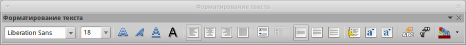

.. meta::
   :description: Глава 7 – Редактор векторной графики Draw
   :keywords: LibreOffice, Writer, Impress, Calc, Math, Base, Draw, либреоффис

.. Список автозамен

.. |br| raw:: html

    

.. _impress:

Глава 7 – Редактор векторной графики Draw
=========================================

Что такое Draw?
-----------------------------------
LibreOffice Draw – это векторный графический редактор, хотя он также может выполнять некоторые операции и с растровой графикой. Используя Draw, можно быстро создавать большое разнообразие графических изображений.

Векторная графика хранит и отображает изображения в виде простых геометрических элементов, таких как линии, окружности и многоугольники, а не как наборы пикселей (точек на экране), как растровая. 

Векторная графика позволяет облегчить хранение и масштабирование изображения.

Draw полностью интегрирован в пакет LibreOffice и это упрощает обмен рисунками между любыми компонентами пакета. Например, если создать изображение в Draw, то повторное использование его в документе Writer будет таким же простым, как копирование и вставка изображения. Также можно работать с такой графикой непосредственно в Writer или в Impress, используя подмножество функций и инструментов из Draw.

Функциональность LibreOffice Draw обширна и, хотя он не был предназначен для конкуренции с лучшими графическими редакторами, он обладает более обширной функциональностью, чем инструменты рисования, интегрированные в большинство иных офисных пакетов.

Вот несколько примеров функций рисования в Draw: управление слоями, система привязок, отображение размеров, соединители для создания диаграмм, 3D функции, которые позволяют создавать небольшие трехмерные рисунки (с текстурированием и световыми эффектами), рисование и интеграция в стиль страницы, кривые Безье.

В этой главе рассматриваются только некоторые особенности Draw. Для получения дополнительной информации смотрите полное *Руководство по Draw* и встроенную справку в приложении.

Главное окно Draw
-------------------------------------------------

Основные компоненты главного окна Draw показаны на рисунке :ref:`ch7-lo-screen-001` и перечислены ниже:

* Строка меню
* Стандартная панель инструментов
* Панель инструментов Линии и Заливки
* Панель страниц
* Рабочая область
* Строка состояния
* Панель инструментов Рисование
* Боковая панель

Рабочая область
~~~~~~~~~~~~~~~~~~~~~~~~~

Рабочая область – это большая область в центре окна программы, где пользователи создают свои рисунки, она может быть окружена панелями инструментов и информационными зонами. Количество и расположение видимых инструментов меняются в зависимости от поставленной задачи и пользовательских предпочтений, поэтому внешний вид программы на компьютере читателя может отличаться от показанного на рисунке :ref:`ch7-lo-screen-001`. В LibreOffice Draw максимальный размер рисунка – 300х300 сантиметров.

.. _ch7-lo-screen-001:

       Окно программы LibreOffice Draw

Панель страниц
~~~~~~~~~~~~~~~~~~~~~

Рисунки в Draw можно разделить на несколько страниц. Многостраничные рисунки используются в основном для презентаций. На панели страниц показываются все страницы, которые были созданы в текущем документе Draw. Если панель страниц не отображается, выберите пункт меню :menuselection:`Вид --> Панель страниц`. Чтобы внести изменения в порядок страниц, просто перетащите одну или несколько страниц на новое место.

Боковая панель
~~~~~~~~~~~~~~~~~~~~~~~~~

Боковая панель содержит 4 больших раздела. Чтобы развернуть раздел, который нужно использовать, нажмите на его значок или нажмите на маленький треугольник в верхней части панели и выберите раздел из выпадающего списка. Единовременно показывается только один раздел. Если боковая панель не видна, выберите пункт главного меню :menuselection:`Вид --> Боковая панель`. Ниже описаны разделы боковой панели:

* **Свойства** – cодержит подразделы для свойств объекта, которые можно изменить в соответствии с  требованиями пользователя. Это подразделы *Символы*, *Абзац*, *Область*, *Линия* и *Положение и размер*.
* **Стили и форматирование** – здесь можно редактировать и применять стили изображения к объектам в рисунке. При изменении стиля, они (изменения) автоматически применятся ко всем элементам, отформатированным с этим стилем, в рисунке.
* **Галерея** – открывает *Галерею* Draw, откуда можно вставить объект в рисунок в виде копии или в виде связи. Копия объекта в рисунке не зависит от исходного объекта в *Галерее*. Изменения в исходном объекте в *Галерее* не имеют никакого влияния на их копии. Объект, вставленный в рисунок, как связь, остается зависимым от исходного объекта в *Галерее*. Изменения в оригинале отражаются во вставленном, как связь, объекте.
* **Навигатор** – открывает *Навигатор* Draw, в котором можно быстро перемещаться между страницами в документе Draw или выбрать объект на рисунке. Рекомендуется давать страницам и объектам в документе осмысленные имена, что позволит легко идентифицировать их при использовании *Навигатора*.

Линейки
~~~~~~~~~~~~~~~~~~~~

Сверху и с левой стороны от рабочей области показаны линейки (полоски с числами). Если они не видны, их можно включить, выбрав пункт меню :menuselection:`Вид --> Линейка`. Линейки показывают размер выбранного объекта на странице, используя двойные линии (выделены на рисунке :ref:`ch7-lo-screen-002`). Если не выбран ни один объект, то эти линии показывают местоположение курсора мыши, что позволяет позиционировать графические объекты более точно.

Также можно использовать линейки для управления объектами, двигая сдвоенные линии, упростив позиционирование объектов.

Поля страницы в области рисования также показаны на линейках. Размеры полей можно изменять непосредственно в линейках, перетаскивая их границы с помощью мыши. Область полей обозначается на линейках серым цветом, как показано на рисунке :ref:`ch7-lo-screen-002`.

Для изменения единиц измерения линейки, которые можно задать самостоятельно, щелкните правой кнопкой мыши на линейке и выберите единицы измерения из выпадающего списка, как показано на рисунке :ref:`ch7-lo-screen-003`.

.. _ch7-lo-screen-002:

       На линейках отмечен размер выделенного объекта

.. _ch7-lo-screen-003:

       Единицы измерения линейки

Строка состояния
~~~~~~~~~~~~~~~~~~~~~~~~

Строка состояния расположена в нижней части экрана Draw, как и во всех компонентах LibreOffice; она включает в себя некоторые специфичные для Draw поля. Для уточнения деталей по содержимому и использованию этих полей, смотрите :ref:`Introducing-LibreOffice` в этом руководстве и *Главу 1. Введение в Draw* в полном *Руководстве по Draw*.

.. _ch7-lo-screen-004:

       Строка состояния Draw

.. note:: Размеры объекта даны в текущих единицах измерения, их не следует путать с единицами измерения на линейках. Единицы измерения в строке состояния определяются в меню :menuselection:`Сервис --> Параметры --> LibreOffice Draw --> Общие`, где также можно изменить масштаб страницы. 

Панели инструментов
~~~~~~~~~~~~~~~~~~~~~~~~~

Чтобы показать или скрыть различные панели инструментов Draw, выберите их в меню :menuselection:`Вид --> Панели инструментов`. В появившемся меню выберите, какие панели нужно отображать. Для получения более подробной информации о работе с панелями инструментов обратитесь к :ref:`Introducing-LibreOffice` в этом руководстве.

Инструменты, имеющиеся в панели инструментов Draw описаны в последующих разделах. Внешний вид панелей инструментов может различаться в зависимости от операционной системы и выбора размера и стиля значков в меню :menuselection:`Сервис --> Параметры --> LibreOffice --> Вид`.

Стандартная панель инструментов
"""""""""""""""""""""""""""""""""""""""""""""""""""""""""""

Стандартная панель инструментов является одинаковой для всех компонентов LibreOffice и не будет подробно описываться в этой главе . 

.. _ch7-lo-screen-005:

       Стандартная панель инструментов

Панель инструментов Рисование
""""""""""""""""""""""""""""""""""""""""""""""""""""""""""""

Панель инструментов *Рисование* является наиболее важным инструментом в Draw. Она содержит все необходимые функции для рисования различных геометрических и произвольных форм и для размещения их на странице.

.. _ch7-lo-screen-006:

       Панель инструментов *Рисование*

Панель инструментов Линии и заливка
"""""""""""""""""""""""""""""""""""""""""""""""""""""""""""""""""

Панель инструментов *Линия и заливка* позволяет изменять основные свойства объекта рисования. Значки и выпадающие списки варьируются, в зависимости от типа выбранного объекта. Например, чтобы изменить стиль линии, раскройте на панели выпадающий список и выберите нужный стиль.

.. _ch7-lo-screen-007:

       Панель инструментов *Линия и заливка*

Панель инструментов Форматирование текста
"""""""""""""""""""""""""""""""""""""""""""""""""""""""""""""""""""""

Если выбранным объектом является текст, то панель *Линия и заливка* заменяется панелью инструментов *Форматирование текста*, которая аналогична такой же панели в Writer. Для получения более подробной информации смотрите :ref:`writer` в этом руководстве.

.. _ch7-lo-screen-008:

       Панель инструментов *Форматирование текста*

Панель инструментов Параметры
"""""""""""""""""""""""""""""""""""""""""""""""""""""""""

Используйте панель инструментов *Параметры* для включения или выключения различных вспомогательных функций. Панель инструментов *Параметры*  по умолчанию не отображается. Для её отображения выберите пункт меню **Вид > Панели инструментов > Параметры**.

.. _ch7-lo-screen-009:

       Панель инструментов *Параметры*

Выбор и определение цвета
-----------------------------------------------------------

Для отображения диалога *Цвета* (рисунок ниже) выберите пункт главного меню :menuselection:`Вид --> Панели инструментов --> Панель цветов`. Эта панель позволяет быстро выбрать цвет различных объектов (линии, замкнутые области и 3D-эффекты). Первый квадратик (в левом верхнем углу, перечеркнут) в панели соответствует отсутствию цвета. 

.. _ch7-lo-screen-010:

       Диалог *Цвета*

Можно также получить доступ к нескольким специализированным цветовым палитрам в Draw, а также изменить отдельные цвета на свой вкус. Это делается с помощью диалогового окна *Область*, доступного после выбора пункта меню :menuselection:`Формат --> Область` или после нажатия на на соответствующий значок *Область* на панели *Линия и заливка*, затем необходимо выбрать вкладку *Цвета* (рисунок ниже).

.. _ch7-lo-screen-011:

.. figure:: _static/chapter7/ch7-lo-screen-011.png
       :scale: 40 %
       :align: center
       :alt: Диалог Область. Вкладка Цвета

       Диалог *Область*. Вкладка *Цвета*

Чтобы загрузить другие палитры нажмите на значок *Загрузить список цветов*. В диалоге выбора файла будет предложено выбрать одну из стандартных палитр LibreOffice  (файлы с расширением ``.soc``). Например, файл цветовой палитры ``web.soc``, которая предназначена для создания рисунков для размещения на веб-страницах. 

Окно выбора цвета также позволяет изменять любой цвет, изменяя числовые значения в соответствующих полях справа от цветовой палитры. Использовать можно известные  цветовые схемы CMYK (Cyan, Magenta, Yellow, Black) или RGB (Red, Green, Blue).

Нажмите на кнопку *Правка*, чтобы открыть диалог *Выбор цвета*, где можно настроить свой индивидуальный цвет. Смотрите раздел *Настройки цвета* в :ref:`Setting-up-LibreOffice` данного руководства.

Более детальное описание цветовых палитр и их настроек содержится в полном *Руководстве по Draw*, в *Главе 10, Дополнительные возможности Draw*.

-----------------------

Рисование основных фигур 
-------------------------------------------------------

В Draw представлен широкий выбор фигур, расположенных в палитрах, доступных из панели инструментов *Рисование* (рисунок :ref:`ch7-lo-screen-006`). 

В этом разделе описываются лишь некоторые из основных фигур, в том числе текст, который в Draw рассматривается в качестве объекта. Смотрите полное *Руководство по Draw* для получения полного описания всех доступных фигур.

Пожалуйста, обратите внимание, что некоторые значки на панели *Рисование* будут изменяться в зависимости от формы, которая была выбрана. Наличие дополнительных значков в палитрах обозначено маленьким треугольником справа от значка на панели инструментов *Рисование*.

.. note:: При рисовании формы или выборе объекта для редактирования, поле информация на левой стороне в строке состояния отражает текущее действие: например, *Линия создана*, *Текстовый объект XXYY выбран* и так далее. 

Рисование прямой линии 
~~~~~~~~~~~~~~~~~~~~~~~~~~~~~~~~~~~~

Нажмите левой кнопкой мыши на значок *Линия* |ch7-lo-screen-012| и поместите курсор в место начала линии. Тащите мышку с зажатой кнопкой в нужном направлении. Отпустите кнопку мыши в точке, где  линия должна закончится. На каждом конце линии будет показан *маркер выделения*  объекта. Они показывают, что объект является выделенным в данный момент. *Маркер выделения* в начальной точке линии по размеру немного больше, чем *маркер* на конце линии. 

Зажмите клавишу ``Shift`` во время рисования линии, чтобы задать угол рисования линии кратный 45 градусам (то есть 0, 45, 90, 135 и так далее).

.. note:: Такое поведение при нажатой клавише *Shift* задано по умолчанию. Однако, если опция *При создании или перемещении объектов* в разделе *Применять привязку* в меню :menuselection:`Сервис --> Параметры --> LibreOffice Draw --> Сетка` будет активна, то поведение клавиши ``Shift`` изменится на противоположное и линия будет автоматически рисоваться с углом кратным 45˚ при **не нажатой** клавише *Shift*.

Держите клавишу ``Ctrl`` нажатой, рисуя линию, для того, чтобы конец линии привязать к ближайшей точке сетки. 

.. _ch7-lo-screen-013:

       Рисование прямой линии

.. note:: Такое поведение при нажатой клавише ``Ctrl`` задано по умолчанию. Однако, если опция *Привязка к сетке* в меню :menuselection:`Вид --> Сетка` активна, то нажатие клавиши ``Ctrl`` временно отключает привязку к сетке.

Удерживайте клавишу ``Alt`` во время рисования линии, чтобы начать рисовать её симметрично в обе стороны от начальной точки. Это позволяет рисовать линии, начиная с середины.

Линия рисуется с атрибутами (такими, как: толщина, стиль и цвет) по умолчанию. Чтобы изменить атрибуты уже нарисованной линии выберите её щелчком мыши, затем нажмите правую кнопку мыши и выберите пункт *Линия* из контекстного меню или выберите пункт меню :menuselection:`Формат --> Линия`, чтобы открыть одноименный диалог. Также можно выбрать раздел *Свойства* на боковой панели и открыть подраздел *Линия*. Стиль, толщину и цвет линии также можно выбрать, используя панель инструментов *Линия и заливка*.

.. _ch7-lo-screen-014:

       Диалог *Линия*

Рисование стрелок
~~~~~~~~~~~~~~~~~~~~~~~~~~~~~

Стрелки рисуются так же, как и линии. Draw классифицирует стрелки, как подвид линий: линии со стрелкой на конце. Информационное поле в строке состояния показывает стрелки только, как линии. Нажмите на значок *Линия со стрелкой на конце*  в панели инструментов *Рисование*, чтобы нарисовать стрелку. Стрелка появится в конечной точке линии после окончания рисования.

Изменение типа окончания линии (стрелки, кружки, квадратики и прочее)
~~~~~~~~~~~~~~~~~~~~~~~~~~~~~~~~~~~~~~~~~~~~~~~~~~~~~~~~~~~~~~~~~~~~~~~~~~~

В Draw доступны несколько типов окончаний линий (стрелки, кружки, квадратики и другие). Нажмите на маленький треугольник справа от значка *Линии и стрелки*  в панели инструментов *Рисование*, чтобы открыть палитру, содержащую инструменты для рисования стрелок и линий. Также можно использовать пункт меню **Вид > Панели инструментов > Стрелки**, чтобы открыть панель *Стрелки* в виде плавающей панели (Рисунок 15).

После того, как линия была нарисована, можно изменить стиль стрелки, нажав на значок *Стиль стрелок*  в панели инструментов *Линия и заливка*, и, выбрав из выпадающего списка вид начала (слева в списке) и конца (справа в списке) линии.

.. _figure_7-15:

.. figure:: _static/figure_7-15.png
       :scale: 100 %
       :align: center
       :alt: Панель инструментов Стрелки и доступные инструменты

       Рисунок 15. Панель инструментов *Стрелки* и доступные инструменты

Рисование прямоугольников или квадратов
~~~~~~~~~~~~~~~~~~~~~~~~~~~~~~~~~~~~~~~~~~~~

Рисование прямоугольников аналогично рисованию прямых линий. Нажмите на значок *Прямоугольник* на панели инструментов *Рисование*. Зажмите кнопку мыши и тяните курсор мыши на листе, за курсором будет вытягиваться закрашенная область прямоугольника, отпустите кнопку мыши, когда достигнете нужного размера прямоугольника.

Квадрат – это прямоугольник, у которого все стороны равны. Чтобы нарисовать квадрат, нажмите на значок *Прямоугольник*  и удерживайте нажатой клавишу *Shift* во время рисования.

.. note:: Если активна опция *При создании или перемещении объектов* в разделе *Применять привязку* в меню **Сервис > Параметры > LibreOffice Draw > Сетка**, то нажатие клавиши *Shift* приведёт к обратному эффекту: при выборе инструмента *Прямоугольник* будет рисоваться квадрат. А чтобы нарисовать прямоугольник, нужно будет зажать клавишу *Shift*. Такая смена поведения клавиши Shift также применяется при рисовании эллипсов и окружностей. 

Чтобы нарисовать прямоугольник или квадрат из его центра, установите курсор на чертеже, нажмите кнопку мыши и, удерживайте нажатой клавишу *Alt* при перетаскивании курсора. Прямоугольник или квадрат используют в качестве центра начальную точку (ту, где впервые нажата кнопка мыши). 

Рисование эллипсов и кругов
~~~~~~~~~~~~~~~~~~~~~~~~~~~~~~~~~~~~~~

Чтобы нарисовать эллипс, нажмите на значок *Эллипс*  на панели инструментов *Рисование*. Круг – это эллипс, у которого все оси равны по длине. Чтобы нарисовать круг, нажмите на значок *Эллипс* и, удерживая нажатой клавишу *Shift*, нажмите клавишу мыши в нужном месте листа и тяните курсор.
Чтобы нарисовать эллипс или круг, начиная из центра, поместите курсор на нужное место на листе, нажмите на клавишу мыши и удерживая нажатой клавишу *Alt*, тащите курсор. Эллипс или круг используют в качестве центра начальную точку (ту, где вы впервые нажали кнопку мыши).

.. note:: Если удерживать нажатой клавишу *Ctrl*, и нажать на один из значков на панели *Рисование*: *Линия*, *Прямоугольник*, *Эллипс* или *Текст*, то на листе будет создан объект стандартного вида: размер, форма и цвет объекта будут иметь стандартное значение. Эти атрибуты могут быть изменены позже, если это потребуется. Смотрите *Руководство по Draw* для получения более подробной информации.

Рисование кривых и многоугольников
~~~~~~~~~~~~~~~~~~~~~~~~~~~~~~~~~~~~~

Чтобы нарисовать кривую или многоугольник нажмите на значок *Кривая*  на панели инструментов *Рисование*. Нажмите на треугольник справа от значка, чтобы открыть палитру  доступных инструментов (рисунок 16). Значок принимает вид последнего использованного инструмента, что упрощает его повторное использование.

Если поместить курсор мыши на один из значков, появится всплывающая подсказка с описанием функции.

.. _figure_7-16:

.. figure:: _static/figure_7-16.png
       :scale: 100 %
       :align: center
       :alt: Панель Кривые (Линии) и доступные инструменты

       Рисунок 16. Панель *Кривые* (Линии) и доступные инструменты

.. note:: Если удерживать нажатой клавишу Shift при рисовании линий (кривой или многоугольника), то инструменты будут ограничены углами рисования в 45 или 90 градусов.

Кривые
"""""""""""""""""""""""""""

Нажмите и удерживайте левую кнопку мыши, чтобы создать начальную точку кривой. Удерживая нажатой левую кнопку мыши, перетащите курсор из начальной точки в нужном направлении, чтобы нарисовать линию. Отпустите левую кнопку мыши и продолжайте двигать курсор, чтобы продолжить рисовать прямую линию в другом направлении. Каждый щелчок мыши устанавливает угловую точку и позволяет продолжить рисование другой прямой линии от угловой точки. Двойной щелчок завершает рисование всей линии.

Кривая с заполнением автоматически соединяет последнюю точку с первой точкой при завершении рисования и производит заливку получившейся фигуры стандартным цветом. Кривая без заполнения не замыкается в фигуру при окончании рисования.

Многоугольники
""""""""""""""""""""""""""""""""""

Нажмите и удерживайте левую кнопку мыши, тащите курсор и таким образом рисуйте первую линию из начальной точки. Как только вы отпустите кнопку мыши, появится линия между первой и второй точками. Переместите курсор, чтобы нарисовать следующую линию. Каждый щелчок мыши устанавливает угловую точку и позволяет рисовать другую линию. Двойной щелчок завершает рисование.

Многоугольник с заполнением автоматически соединит последнюю точку с первой точкой, чтобы закрыть фигуру, и зальёт её текущим стандартным цветом. Многоугольник без заполнения не будет закрыт в конце рисования. 

Многоугольники 45°
"""""""""""""""""""""""""""""""""""""""

Как и обычные многоугольники, они формируются из линий, но углы между линиями ограничены значением в 45 или 90 градусов.

Полилинии
""""""""""""""""""""""""""""""""

Использование инструмента полилиния похоже на рисование карандашом на бумаге. Нажмите и удерживайте левую кнопку мыши и перетащите курсор по требуемой траектории. Завершать рисунок с помощью двойного щелчка мыши необязательно, просто отпустите кнопку мыши и рисунок будет завершен.

Если выбран инструмент *Полилиния с заполнением*, то конечная точка автоматически соединяется с начальной точкой и получившийся объект заполняется соответствующим цветом. 

Добавление текста
~~~~~~~~~~~~~~~~~~~~~~~~~~~~~

Чтобы включить инструмент добавления горизонтального текста, нажмите на значок *Текст*  или для вертикального текста – значок *Вертикальный текст*. Если значок *Вертикальный текст* не виден, активируйте опцию *Азиатские* в меню **Сервис > Параметры > Настройки языка > Языки**. После нажатия на значок *Текст* станет доступна панель инструментов *Форматирование текста* (рисунок 8). На этой панели инструментов можно выбрать вид шрифта, его размер и другие свойства шрифтов перед началом ввода текста.

.. note:: Значок *Вертикальный текст* доступен только на панели инструментов *Рисование*.

После активации инструмента *Текст*, щелкните клавишей мыши в том месте листа, где нужно расположить текст. Появится небольшая текстовая врезка, содержащая только текстовый курсор. Эта врезка может быть перемещена в любое место на листе, как и любой другой графический объект. Текстовая врезка динамическая и изменяет свои размеры при вводе текста. 

Обратите внимание на информационное поле в строке состояния: оно показывает, что в данный момент редактируется текст, а также предоставляет подробную информацию о текущем положении курсора с использованием номеров абзаца, строк и столбцов  (рисунок 17).

.. _figure_7-17:

.. figure:: _static/figure_7-17.png
       :scale: 100 %
       :align: center
       :alt: Информация о тексте в строке состояния

       Рисунок 17. Информация о тексте в строке состояния

Можно вставить разрыв строки, используя комбинацию клавиш *Shift+Enter*, или начать новый абзац, нажав клавишу *Enter*. Вставка разрывов строк или новых абзацев не прекращает редактирование текста и не удаляет текстовую врезку. После окончания набора текста щелкните мышью за пределами текстовой врезки, чтобы завершить добавление или редактирование текста. 

Для редактирования существующего текста, щелкните дважды мышью по тексту, чтобы открыть панель *Форматирование текста* и приступить к редактированию.

Атрибуты текста (вид, размер, цвет и тому подобное) могут быть изменены прямо во время ввода текста. Новые атрибуты вступят в силу для текста, введенного после изменений. Чтобы изменить атрибуты для всего текста в текстовой врезке, нужно сначала выделить весь текст во врезке.

Можно создавать стили, которые будут использоваться для других текстовых врезок. Выберите пункт меню **Формат > Стили** или нажмите клавишу *F11*, чтобы открыть диалог *Стили и форматирование*. Стиль влияет на весь текст в текстовой врезке. Для форматирования только части текста используйте прямое форматирование с помощью панели *Форматирование текста* или подразделов *Символы* и *Абзацы* в боковой панели.

Текстовые врезки могут также иметь цвет заполнения, тени и другие атрибуты, как и любой другой объект Draw. Врезку можно вращать и писать текст под любым углом. Эти опции доступны по щелчку правой кнопкой мыши на самой текстовой врезке.

Если дважды щелкнуть кнопкой мыши по графическому объекту или нажать клавишу *F2* или нажать значок *Текст*, когда какой-либо объект выделен, то можно будет добавить текст на графический объект. Этот текст становится частью графического объекта.

Графические объекты не являются динамическими и не ведут себя, как текстовые врезки. Чтобы вписать текст в рамки объекта, нужно использовать абзацы, разрывы строк или меньший размер текста, увеличить размер объекта или использовать все четыре метода одновременно. 

Для получения более подробной информации по работе с текстом смотрите *Руководство по Draw. Глава 2. Рисование основных фигур* и *Глава 9. Добавление и форматирование текста* там же.

Точки соединений и соединительные линии
------------------------------------------------------------------------------------

Точки соединений
~~~~~~~~~~~~~~~~~~~~~~~

Все объекты Draw имеют *точки соединений*, которые в нормальном состоянии не отображаются. Они становятся видимыми только, если нажат значок *Соединительные линии* на панели инструментов *Рисование*. Большинство объектов имеет четыре соединительных точки (рисунок 18). Можете добавлять свои *точки соединений* или изменять существующие, используя панель инструментов *Точки соединений* (рисунок 19). Используйте пункт меню *Вид > Панели инструментов > Точки соединений*, чтобы открыть эту панель.

Точки соединений – это не то же самое, что точки, появляющиеся при выборе объекта. Те точки используются для перемещения или изменения формы объекта (и называются *маркеры выделения*). Точки соединений используются, чтобы прикрепить соединительную линию к графическому объекту таким образом, чтобы, при перемещении объекта соединительная линия осталась «приклеенной» к объекту и перемещалась вместе с ним. Для получения более подробных инструкций по использованию точек соединения прочитайте в *Руководстве по Draw* *Главу 3. Работа с объектами и точками объекта*, а также *Главу 8. Соединения, блок-схемы и организационные диаграммы*.

.. _figure_7-18:

.. figure:: _static/figure_7-18.png
       :scale: 100 %
       :align: center
       :alt: Точки соединений

       Рисунок 18. Точки соединений

.. _figure_7-19:

.. figure:: _static/figure_7-19.png
       :scale: 100 %
       :align: center
       :alt: Панель инструментов Точки соединений и доступные инструменты

       Рисунок 19. Панель инструментов *Точки соединений* и доступные инструменты

Соединительные линии
~~~~~~~~~~~~~~~~~~~~~~~~~~~~~~~

Соединительные линии – это линии или стрелки, концы которых автоматически присоединяются к *точке соединения* объекта. Соединительные линии особенно полезны при разработке организационных диаграмм и блок-схем. Когда объекты передвигаются относительно друг друга, то соединительные линии остаются прикрепленными к точке соединения. На рисунке 20 показаны для примера два объекта и соединительная линия между ними.

Draw предлагает широкий выбор различных соединительных линий и их вариантов. На панели инструментов *Рисование* щелкните треугольник справа от значка *Соединительные линии*, чтобы открыть палитру доступных инструментов типа *Соединительная линия* (рисунок 21). Для получения более подробных инструкций по использованию соединительных линий смотрите в *Руководстве по Draw* *Главу 8. Соединительные линии, блок-схемы и организационные диаграммы*.

.. _figure_7-20:

.. figure:: _static/figure_7-20.png
       :scale: 100 %
       :align: center
       :alt: Соединительная линия между двух объектов

       Рисунок 20. Соединительная линия между двух объектов

.. _figure_7-21:

.. figure:: _static/figure_7-21.png
       :scale: 100 %
       :align: center
       :alt: Панель инструментов Соединительные линии и доступные варианты линий

       Рисунок 21. Панель инструментов *Соединительные линии* и доступные варианты линий

Рисование геометрических фигур
---------------------------------------------------------------------

Значки для рисования геометрических фигур расположены на панели инструментов *Рисование* и каждая геометрическая фигура описывается в последующих разделах. При нажатии на треугольник справа от значка на панели инструментов *Рисование* открывается палитра инструментов, предоставляющая доступ к инструментам для этой геометрической фигуры.

.. tip:: Использование данных инструментов для рисования геометрических фигур похоже на инструменты, используемые для рисования прямоугольников и квадратов. Для получения более подробной информации смотрите раздел *Рисование основных фигур* в данной главе и *Руководство по Draw. Глава 2. Рисование основных фигур*.

Основные фигуры
~~~~~~~~~~~~~~~~~~~~~~

Щелкните на треугольнике справа от значка *Основные фигуры*, чтобы открыть палитру инструментов *Основные фигуры*. Эта палитра включает в себя инструмент рисования прямоугольника, идентичный тому, который уже отображается на панели инструментов *Рисование*.

.. _figure_7-22:

.. figure:: _static/figure_7-22.png
       :scale: 100 %
       :align: center
       :alt: Панель инструментов Основные фигуры

       Рисунок 22. Панель инструментов *Основные фигуры*

Фигуры-символы
~~~~~~~~~~~~~~~~~~~~~~~~

Щелкните на треугольнике справа от значка *Фигуры-символы*, чтобы открыть одноименную палитру инструментов.

.. _figure_7-23:

.. figure:: _static/figure_7-23.png
       :scale: 100 %
       :align: center
       :alt: Панель инструментов Фигуры-символы

       Рисунок 23. Панель инструментов *Фигуры-символы*

Блочные стрелки
~~~~~~~~~~~~~~~~~~~~~~

Щелкните на треугольнике справа от значка *Блочные стрелки*, чтобы открыть одноименную палитру инструментов.

.. _figure_7-24:

.. figure:: _static/figure_7-24.png
       :scale: 100 %
       :align: center
       :alt: Панель инструментов Блочные стрелки

       Рисунок 24. Панель инструментов *Блочные стрелки*

Блок-схемы
~~~~~~~~~~~~~~~~~~~~~

Щелкните на треугольнике справа от значка *Блок-схемы*, чтобы открыть одноименную палитру инструментов. Создание блок-схем, организационных диаграмм, и аналогичные инструменты планирования описаны в *Руководстве по Draw. Глава 8. Соединения, блок-схемы и организационные диаграммы*.

.. _figure_7-25:

.. figure:: _static/figure_7-25.png
       :scale: 100 %
       :align: center
       :alt: Панель инструментов Блок-схемы

       Рисунок 25. Панель инструментов *Блок-схемы*

Выноски
~~~~~~~~~~~~~~~~~~~~~

Щелкните на треугольнике справа от значка *Выноски*, чтобы открыть одноименную палитру инструментов.

.. _figure_7-26:

.. figure:: _static/figure_7-26.png
       :scale: 100 %
       :align: center
       :alt: Панель инструментов Выноски

       Рисунок 26. Панель инструментов *Выноски*

Звезды и свитки
~~~~~~~~~~~~~~~~~~~~~~~~~

Щелкните на треугольнике справа от значка *Звезды и свитки*, чтобы открыть одноименную палитру инструментов.

.. _figure_7-27:

.. figure:: _static/figure_7-27.png
       :scale: 100 %
       :align: center
       :alt: Панель инструментов Звезды и свитки

       Рисунок 27. Панель инструментов *Звезды и свитки*

.. note:: Добавлять текст можно ко всем этим геометрическим фигурам. Для более подробного описания обратитесь к *Руководству по Draw. Глава 2. Рисование основных фигур* и *Глава 10. Дополнительные возможности Draw*.

Выделение объектов
------------------------------------------------

Прямое выделение
~~~~~~~~~~~~~~~~~~~~~~~~~

Самый простой способ выделить объект, это щелкнуть мышкой прямо на нём. Для выделения объектов без заливки цветом, щелкните по контуру такого объекта. Один щелчок служит для выделения, повторный – для отмены выделения. Чтобы выделить или снять выделение более, чем одного объекта, нажмите и удерживайте кнопку Shift при щелчке мышью.

Выделение рамкой
~~~~~~~~~~~~~~~~~~~~~~~~~~

Можно выбрать сразу несколько объектов, передвигая курсор с зажатой левой клавишей мыши. Во время движения курсора будет отображаться рамка вокруг объектов. Выделены будут только объекты, полностью расположенные внутри рамки.

Для множественного выделения объектов значок *Выделение* на панели инструментов *Рисование* должен быть нажатым.

Выделение скрытых объектов
~~~~~~~~~~~~~~~~~~~~~~~~~~~~~~~~

Даже если объекты расположены за другим объектом и не видны, они всё равно могут быть выделены. Удерживая нажатой клавишу *Alt*, щелкните мышкой по объекту на переднем плане, под которым находится скрытый объект, а затем щелкните снова, чтобы выбрать скрытый объект. Если есть несколько скрытых объектов друг под другом, то удерживайте нажатой клавишу *Alt* и щелкайте по ним, пока не дойдете до объекта, который вам нужен. Для перемещения по объектам в обратном порядке, удерживайте нажатыми клавиши *Alt + Shift* и щелкайте мышкой по объектам. 

При щелчке на выбранном объекте его контур на короткое время проявится через объекты, его скрывающие. 

.. note:: Использование клавиши *Alt* работает на компьютерах с ОС Windows или Mac. На компьютерах под управлением Linux нужно использовать метод с клавишей *Tab*, описанный ниже.

Чтобы выделить объект, который скрыт другим объектом, с помощью клавиатуры, используйте клавишу *Tab* для перемещения по объектам, остановившись на объекте, который вам необходим. Для перемещения по объектам в обратном порядке, нажимайте сочетание клавиш *Shift + Tab*. Это очень быстрый способ достичь поставленной цели, но он может быть не очень удобным, если на рисунке большое количество объектов.

Расположение объектов
~~~~~~~~~~~~~~~~~~~~~~~~~~~~~~~

В сложных рисунках несколько объектов могут быть наложены друг на друга. Чтобы изменить порядок размещения объектов (передний/задний план), выделите объект, выберите пункт главного меню **Изменить > Расположить** и выберите вариант *Переместить вперед* или *Переместить назад*. Также можно щелкнуть правой кнопкой мыши на объекте и выбрать пункт *Расположить* из контекстного меню, а затем вариант *Переместить вперед* или *Переместить назад*.
 
Настройки расположения также доступны при щелчке на треугольнике справа от значка *Расположение* на панели инструментов *Линия и заливка*. Откроется панель инструментов *Положение*, предоставляющая доступ к различным варианам расположения объектов (рисунок 28).

.. _figure_7-28:

.. figure:: _static/figure_7-28.png
       :scale: 100 %
       :align: center
       :alt: Панель инструментов Положение и доступные инструменты

       Рисунок 28. Панель инструментов *Положение* и доступные инструменты

Перемещение и изменение размера объекта 
----------------------------------------------------------------------------------

При перемещении объекта или изменении его размера посмотрите на левую часть строки состояния в нижней части окна Draw (рисунок 29). Область слева в строке состояния  показывает, слева направо: какой объект выбран, его положение на рисунке в виде координат Х и Y, и размеры объекта. Единицы измерения выбираются в меню **Сервис > Параметры > LibreOffice Draw > Общие**.

Для получения более подробной информации о перемещении и о изменении размеров объектов обратитесь к *Руководству по Draw. Глава 3. Работа с объектами и точками объектов*.

.. _figure_7-29:

.. figure:: _static/figure_7-29.png
       :scale: 100 %
       :align: center
       :alt: Левый край строки состояния при перемещении или настройке размеров объекта

       Рисунок 29. Левый край строки состояния при перемещении или настройке размеров объекта

Перемещение объекта
~~~~~~~~~~~~~~~~~~~~~~~~~~~~~~~~

Чтобы переместить объект (или группу объектов), выделите его, а затем зажмите левую кнопку мыши в границах объекта и перемещайте мышь. Во время движения появляется фантомное изображение объекта, чтобы помочь с репозиционированием (рисунок 30). Поместив объект в нужное место на листе отпустите кнопку мыши.

.. _figure_7-30:

.. figure:: _static/figure_7-30.png
       :scale: 100 %
       :align: center
       :alt: Перемещение объекта

       Рисунок 30. Перемещение объекта

Изменение размера объекта
~~~~~~~~~~~~~~~~~~~~~~~~~~~~~~~~~

Чтобы изменить размер выделенного объекта (или группы объектов), переместите курсор к одному из *маркеров выделения* по краям объекта. Курсор мыши изменит свою форму, указывая направление движения для этого *маркера*. Нажмите левой кнопкой мыши на одном из *маркеров* и, не отпускаяя её, тащите курсор в указанном направлении. При изменении размера объекта появится прозрачный контур будущего объекта (рисунок 31). После достижения желаемого размера объекта отпустите кнопку мыши.

Результаты зависят от выбора используемого *маркера выделения*. Чтобы изменять размер объекта вдоль одной оси, используйте *маркер* на одной из сторон. Чтобы изменять размер по обеим осям, используйте угловой *маркер*. 

.. _figure_7-31:

.. figure:: _static/figure_7-31.png
       :scale: 100 %
       :align: center
       :alt: Изменение размера объекта

       Рисунок 31. Изменение размера объекта

.. note:: Если при изменении размера объекта нажать клавишу *Shift*, то изменение размера будет осуществляться симметрично по двум осям, так что соотношение длин сторон объекта остается таким же. Это поведение клавиши *Shift* работает для всех точек.

    Это поведение по умолчанию клавиши *Shift*. Однако, если опция *При создании и перемещении объектов* в меню **Сервис > Параметры > LibreOffice Draw > Сетка** активна, то нажатие на клавишу *Shift* будет иметь обратное действие: соотношение сторон будет сохранено, если **не нажата** клавиша *Shift*.

Вращение и наклон объекта 
----------------------------------------------------------------

Для получения более подробной информации о вращении и наклоне объектов, обратитесь к *Руководству по Draw. Глава 3. Работа с объектами и точками объектов*.

Вращение объекта
~~~~~~~~~~~~~~~~~~~~~~~~~~~~~~

Чтобы вращать объект (или группу объектов), выделите объект, затем перейдите в режим вращения одним из следующих способов:

* Нажмите на треугольник справа от значка *Эффекты*  на панели инструментов *Линия и заливка* и в палитре инструментов нажмите на значок *Повернуть*.
* Выберите пункт меню **Вид > Панели инструментов > Операции** и нажмите значок *Повернуть*.

*Маркеры выделения* изменят форму и цвет: станут круглыми и красными (рисунок 32). Также в центре объекта появится отметка центра вращения. При помещении курсора мыши над *маркерами* курсор меняет форму. Угловые маркеры используются для вращения объекта, а верхний, нижний и боковые маркеры наклоняют объект.

.. _figure_7-32:

.. figure:: _static/figure_7-32.png
       :scale: 100 %
       :align: center
       :alt: Вращение объекта

       Рисунок 32. Вращение объекта

Наведите курсор мыши на один из угловых *маркеров*, вид курсора изменится на дугу со стрелками на каждом конце. Нажмите и удерживайте кнопку мыши, а затем перемещайте курсор, чтобы повернуть объект. Появится фантомное изображение вращающегося объекта и в строке состояния отобразится текущий угол поворота.

.. note:: Для 3D объектов  вращение работает по-другому, потому что оно происходит в нескольких осях, а не в одной. Смотрите *Руководство по Draw. Глава 7. 3D объекты* для получения дополнительной информации .

Точка вращения, как правило, расположена в центре объекта. Чтобы изменить положение точки вращения, зажмите на объекте левую клавишу мыши и перетаскивайте объект, пока точка вращения не будет находится в нужном положении. Точка вращения может быть даже за пределами объекта.

.. note:: Если нажать клавишу *Shift* при вращении объекта, вращение будет производится дискретно с шагом в 15°.
    
    Это поведение по умолчанию клавиши *Shift*. Однако, если опция *При создании и перемещении объектов* в меню **Сервис > Параметры > LibreOffice Draw > Сетка** активна, то нажатие на клавишу *Shift* будет иметь обратное действие: вращение всегда будет происходить с градацией по  15°, пока клавиша *Shift* **не нажата**.

Наклон объекта
~~~~~~~~~~~~~~~~~~~~~~~~~

Чтобы наклонить объект, используйте красные круглые маркеры (см.выше раздел *Вращение объекта*), расположенные по середине верхней, нижней и боковых сторон выделенного объекта. При наведении на любой из таких маркеров курсор мыши изменит вид на на две параллельные разнонаправленные стрелки. Ось, используемая, как основание, для наклона объекта, расположена прямо напротив маркера посередине одной из сторон. Эта ось остается неподвижной, в то время как другие стороны объекта будут наклоняться по отношению к ней на столько, насколько будет перемещён курсор мыши. 

Нажмите на красную точку по середине любой из сторон объекта и, удерживая левую кнопку мыши, перетяните курсор для наклона объекта. Появится фантомное изображение наклонённого объекта (рисунок 33), а текущий угол наклона будет показан в строке состояния.

.. note:: Если нажать клавишу *Shift* во время наклона объекта, то наклон будет осуществляться дискретно на величину 15°. Это поведение клавиши *Shift* по умолчанию. Однако, если опция *При создании и перемещении объектов* в меню **Сервис > Параметры > LibreOffice Draw > Сетка** активна, то нажатие на клавишу *Shift* будет иметь обратное действие: наклон всегда будет происходить дискретно по  15°, пока клавиша *Shift* **не нажата**.

.. _figure_7-33:

.. figure:: _static/figure_7-33.png
       :scale: 100 %
       :align: center
       :alt: Наклон объекта

       Рисунок 33. Наклон объекта

Изменение объекта
----------------------------------------------

Чтобы изменить объект или изменить его атрибуты, такие как цвет или толщина линии обрамления, и так далее, могут быть использованы: инструменты панели *Линия и заливка*, панель *Форматирование текста*, раздел боковой панели *Свойства*, либо контекстное меню. Более подробная информация по изменению объектов и изменению атрибутов объекта изложена в *Руководстве по Draw. Глава 4. Изменение атрибутов объекта*.

Панель инструментов *Линия и заливка*
~~~~~~~~~~~~~~~~~~~~~~~~~~~~~~~~~~~~~~~~~~~~~

По умолчанию панель инструментов Линия и заливка расположена в верхней части окна Draw. Однако, если панель Линия и заливка не отображается, необходимо выбрать пункт меню Вид > Панели инструментов > Линия и заливка, чтобы отобразить панель (рисунок 34). Используя эту панель, можно редактировать наиболее распространённые атрибуты объекта. 

.. _figure_7-34:

.. figure:: _static/figure_7-34.png
       :scale: 100 %
       :align: center
       :alt: Панель инструментов Линия и заливка

       Рисунок 34. Панель инструментов *Линия и заливка*

Панель инструментов Форматирование текста
~~~~~~~~~~~~~~~~~~~~~~~~~~~~~~~~~~~~~~~~~~~~~~~~~~~~~~

Если в Draw выделить текст, то панель *Линия и заливка* автоматически заменится на панель *Форматирование текста* (рисунок 35). Также можно в любой момент открыть эту панель, выбрав пункт меню **Вид > Панели инструментов > Форматирование текста**. Инструменты на этой панели будут неактивными, пока не будет выделен текст.

.. _figure_7-35:

.. figure:: _static/figure_7-35.png
       :scale: 100 %
       :align: center
       :alt: Панель инструментов Форматирование текста

       Рисунок 35. Панель инструментов *Форматирование текста*

Боковая панель. Раздел Свойства
~~~~~~~~~~~~~~~~~~~~~~~~~~~~~~~~~~~~~~~~~~~~

Когда выделен объект на листе, в боковой панели становятся доступны подразделы раздела *Свойства* (рисунок 36). Они позволяют изменять свойства или параметры объекта без необходимости открывать диалоговые окна или использовать любые из доступных инструментов на различных панелях инструментов, доступных в Draw. Чтобы развернуть подраздел, нажмите плюс (+) рядом с подзаголовком раздела.

.. _figure_7-36:

.. figure:: _static/figure_7-36.png
       :scale: 100 %
       :align: center
       :alt: Боковая панель. Раздел Свойства

       Рисунок 36. Боковая панель. Раздел *Свойства*

Контекстное меню
~~~~~~~~~~~~~~~~~~~~~~~~~~~~~~~~

При щелчке правой кнопкой мыши по выделенному объекту, появляется контекстное меню (рисунок 37). Это меню предоставляет доступ к различным настройкам и позволяет изменять атрибуты объекта без необходимости открывать диалоговые окна. Пункты меню с маленькой стрелкой с правой стороны содержат подменю.

.. _figure_7-37:

.. figure:: _static/figure_7-37.png
       :scale: 100 %
       :align: center
       :alt: Пример контекстного меню

       Рисунок 37. Пример контекстного меню

Форматирование линий и обрамлений
~~~~~~~~~~~~~~~~~~~~~~~~~~~~~~~~~~~~~~~~~~~

В LibreOffice термин линия может обозначать, как собственно просто отдельную линию, так и внешний край графического объекта (обрамление), а также стрелку. В большинстве случаев свойства линии, которые можно изменить – это её стиль (сплошная, пунктирная, невидимая и так далее), её толщина и цвет.
Выделите линию, которую нужно отформатировать, а затем используйте элементы управления на панели *Линия и заливка*, чтобы изменить её параметры (выделены на рисунке 38).

.. _figure_7-38:

.. figure:: _static/figure_7-38.png
       :scale: 100 %
       :align: center
       :alt: Общие свойства линий (стиль, цвет, толщина) 

       Рисунок 38. Общие свойства линий (стиль, цвет, толщина) 

Если требуется тонкая настройка внешнего вида линии, выберите пункт меню **Формат > Линия** или щелкните правой кнопкой мыши на линии и выберите пункт *Линия* из контекстного меню, или нажмите на значок *Линия* на панели *Линия и заливка*. Все эти действия открывают диалог *Линия*, в котором можно установить свойства линии. Это диалоговое окно состоит из трех вкладок: линии, стили линий и стили стрелок. Можно также использовать подраздел *Линия* в разделе боковой панели *Свойства*, чтобы изменить вид линии.

Стрелки, наконечники стрелок и концы линий
~~~~~~~~~~~~~~~~~~~~~~~~~~~~~~~~~~~~~~~~~~~~~~~~~~~

Стрелки, наконечники стрелок и другие концы линий, как правило, называют просто стрелками и, при редактировании и изменении атрибутов, их можно рассматривать так же, как линии. Выделите линию и нажмите на значок *Стили стрелок* на панели *Линия и заливка*, чтобы открыть одноимённое меню (рисунок 39).

.. _figure_7-39:

.. figure:: _static/figure_7-39.png
       :scale: 100 %
       :align: center
       :alt: Меню Стили стрелок 

       Рисунок 39. Меню *Стили стрелок* 

Доступны несколько типов стрелок и окончаний для линий. Каждый конец линии может иметь различные стрелки или иной вид. Наконечники применяются только к простым линиям. Не будет никакого эффекта при их назначении на линии обрамления объекта.

Форматирование области заливки
--------------------------------------------------

Термин *область заливки* относится к внутренней части объекта, которая может быть однородного цвета, градиентом, заполнена текстурой или растровым изображением (рисунок 40). Область заливки может быть частично или полностью прозрачной. В большинстве случаев можно выбрать один из стандартных параметров заполнения, которые имеются на панели *Линия и заливка* или в подразделе *Область* в разделе боковой панели *Свойства*. Можно также определить свои собственные области заливки. Для получения дополнительной информации о форматировании заливки обратитесь к *Руководству по Draw. Глава 4. Изменение атрибутов объекта*.

.. _figure_7-40:

.. figure:: _static/figure_7-40.png
       :scale: 100 %
       :align: center
       :alt: Различные типы заливки области

       Рисунок 40. Различные типы заливки области 

Использование стилей
------------------------------------

Предположим, что нужно применить одну и ту же заливку, толщину линии и тип обрамления к нескольким объектам. Этот повторяющийся процесс может быть значительно упрощен за счет использования стилей. Стили позволяют задать шаблон форматирования (собственно стиль), а затем применить этот стиль к нескольким объектам. Для получения дополнительной информации о стилях, смотрите *Главу 3. Использование стилей и шаблонов* в данном руководстве, полное *Руководство по Writer. Глава 6. Введение в стили* и полное *Руководство по Draw. Глава 4. Изменение атрибутов объектов*.

Позиционирование объектов
-------------------------------------

Привязка
~~~~~~~~~~~~~~~~~~~~~~~~~

Объекты в Draw могут быть точно и последовательно расположены на листе с использованием функции привязки. Точки сетки, вспомогательные точки и линии, области объектов, отдельные точки на объектах или края страниц, всё это может использоваться в качестве привязки.

С функцией привязки проще работать при высоких значениях приближения. Две и более различных функции привязки можно использовать одновременно: например, привязку к направляющим линиям и к краям страницы. Рекомендуется, однако, активировать только те виды привязки, которые действительно нужны для работы в настоящее время.

Для получения более подробной информации по функции привязки, смотрите полное *Руководство по Draw. Глава 3. Работа с объектами и точками объектов* и *Глава 10. Дополнительные возможности Draw*.

Привязка к сетке
~~~~~~~~~~~~~~~~~~~~~~~~~~~~~

Привязка к сетке позволяет позиционировать объект относительно точек сетки (рисунок 41). Выберите пункт меню **Вид > Сетка > Привязка к сетке** или щелкните по значку *Привязка к сетке* на панели инструментов *Параметры*, чтобы включить или отключить функцию привязки к сетке. Если панель инструментов *Параметры* не отображается, выберите пункт  меню **Вид > Панели инструментов > Параметры**.

.. _figure_7-41:

.. figure:: _static/figure_7-41.png
       :scale: 100 %
       :align: center
       :alt: Позиционирование с использованием привязки к сетке

       Рисунок 41. Позиционирование с использованием привязки к сетке

Отображение сетки
~~~~~~~~~~~~~~~~~~~~~~~~~~~~~~~

Чтобы отображать (или отключить отображение) сетку на листе Draw, выберите пункт меню  **Вид > Сетка > Показать сетку** или нажмите на значок *Показать сетку* на панели инструментов *Параметры*.

Конфигурация сетки
~~~~~~~~~~~~~~~~~~~~~~~~~~~~~~

Разрешение, привязка и положение точек сетки и другие параметры могут быть настроены в  диалоговом окне, доступном из меню **Сервис > Параметры > LibreOffice Draw > Сетка** (рисунок 42).

.. _figure_7-42:

.. figure:: _static/figure_7-42.png
       :scale: 100 %
       :align: center
       :alt: Конфигурация сетки

       Рисунок 42. Конфигурация сетки

* Вертикальный и горизонтальный промежуток между точками в сетке. Также можно изменить используемые единицы измерения в общих параметрах Draw, перейдя в меню **Сервис > Параметры > LibreOffice Draw > Общие**.
* Разрешение – это размер квадратов или прямоугольников в сетке. Если разрешение составляет 1 см по горизонтали и 2 см по вертикали, то сетка состоит из прямоугольников высотой 2 см и шириной 1 см .
* Дополнительные узлы – это дополнительные точки, которые появляются вдоль сторон каждого прямоугольника или квадрата сетки. Объекты можно привязать к дополнительным узлам, а также к углам сетки .
* Количество пикселей в поле *Область привязки* определяет, насколько близко вы должны приблизить объект к точке или линии привязки, прежде, чем он будет привязываться к ним.

Цвет сетки по умолчанию светло-серый. Чтобы изменить цвет сетки, откройте меню  **Сервис > Параметры > LibreOffice > Внешний вид**, в списке справа найдите пункт *Сетка* и задайте ему новый цвет.

Вспомогательные линии
~~~~~~~~~~~~~~~~~~~~~~~~~~~~~~~~~

В Draw есть вспомогательные линии, которые легко позволяют позиционировать объект с помощью линеек в верхней и левой части рабочей области. Для включения или выключения вспомогательных линий, откройте диалог из меню **Сервис > Параметры > LibreOffice Draw > Вид** и выберите опцию *Направляющие при перемещении*.

Применение специальных эффектов
---------------------------------------------------

Используя Draw, можно применить множество специальных эффектов к объектам и группам объектов. Этот раздел – введение в некоторые из этих эффектов. Для получения более подробной информации о специальных эффектах обратитесь к полному *Руководству по Draw. Глава 4. Изменение атрибутов объектов*.

Для доступа к инструментам специальных эффектов выберите пункт меню **Вид > Панели инструментов > Операции** (рисунок 43). Команды *Повернуть* и *Отразить* можно также найти в меню *Изменить* или, после нажатия правой кнопкой мыши на объекте, в контекстном меню.

.. _figure_7-43:

.. figure:: _static/figure_7-43.png
       :scale: 100 %
       :align: center
       :alt: Панель Операции и доступные инструменты

       Рисунок 43. Панель *Операции* и доступные инструменты

Зеркальное отражение объектов
~~~~~~~~~~~~~~~~~~~~~~~~~~~~~~~~~~~~~~~~~~
 
Самые простые и быстрые способы, чтобы перевернуть объект по горизонтали или по вертикали следующие:

1. Щелкните по графическому объекту, появятся *маркеры выделения*.
2. Щелкните по объекту правой кнопкой мыши и выберите в контекстном меню пункт **Отражение > По вертикали** (или **По горизонтали**), или выберите пункт меню **Изменить > Отражение > По вертикали** (или **По горизонтали**)и выбранный объект будет отражен.

Тем не менее, инструмент *Отразить* на панели инструментов *Операции* может быть использован для большего контроля над процессом отражения. Использование инструмента *Отразить* позволит изменять положение и угол, под которым объект зеркально отразится. Как именно это делается, описано в полном *Руководстве по Draw, в Главе 4. Изменение атрибутов объекта*.

Зеркальная копия
~~~~~~~~~~~~~~~~~~~~~~~~~~~~~~~

В настоящий момент такой команды в Draw нет. Однако, зеркальное отображение объекта можно эмулировать с помощью инструмента *Отразить* так, как это описано в полном *Руководстве по Draw. Глава 4. Изменение атрибутов объекта*.

Искажение объекта 
~~~~~~~~~~~~~~~~~~~~~~~~~~~~~~~

Три инструмента на панели инструментов *Операции* позволяют перетаскивать углы и края объекта, для искажения изображения.

* Искажение – искажает объект в перспективе.
* По кругу (под наклоном) - создает псевдо трехмерный эффект.
* По кругу (в перспективе) - создает псевдо трехмерный эффект.

Во всех трех случаях Draw вначале спросит о преобразовании объекта в кривую. Этот первый шаг необходим, поэтому нажмите *Да*. Затем нужно перемещать *маркеры* объекта для получения желаемого эффекта. Смотрите полное *Руководство по Draw. Глава 4. Изменение атрибутов объекта* для получения дополнительной информации о том, как искажать объект.

Динамическая прозрачность градиентов
~~~~~~~~~~~~~~~~~~~~~~~~~~~~~~~~~~~~~~~~~~~~~~~~

Контролировать прозрачность градиента можно таким же образом, как цвет градиента. Оба типа градиента могут быть использованы вместе. В прозрачности градиента направление и степень цвета заливки объекта измененяется от непрозрачного к прозрачному. В обычном градиенте, заливка изменяется от одного цвета к другому, но степень прозрачности остается той же.

Инструменты *Прозрачность* и *Градиент* на панели инструментов *Операции* динамически управляют прозрачностью и цветом градиентов. Смотрите полное *Руководство по Draw. Глава 4. Изменение атрибутов объекта* для получения дополнительной информации о том, как создаватьть прозрачные и градиентные заливки в объекте.

Дублирование
~~~~~~~~~~~~~~~~~~~~~~~~~~~~~~~

Дублирование создает копии объекта с применением набора изменений, таких как цвет или вращение, к дубликатам, которые создаются.

.. _figure_7-44:

.. figure:: _static/figure_7-44.png
       :scale: 100 %
       :align: center
       :alt: Диалог Дублирование

       Рисунок 44. Диалог *Дублирование*

1. Выделите объект или группу объектов и выберите пункт меню **Правка > Дублировать** или используйте сочетание клавиш *Shift+F3*, чтобы открыть одноименный диалог (рисунок 44).
2. Выберите необходимые параметры из доступных вариантов. Например, когда параметры в диалоговом окне на рисунке 44, применяются к прямоугольнику, они приводят к результату, показанному на рисунке 45.

.. _figure_7-45:

.. figure:: _static/figure_7-45.png
       :scale: 100 %
       :align: center
       :alt: Результат дублирования

       Рисунок 45. Результат дублирования

Морфинг
~~~~~~~~~~~~~~~~~~

Морфинг преобразует объект одной формы к объекту другой формы и работает только тогда, когда выбраны два объекта:

1. Выделите два объекта разной формы.
2. Выберите пункт меню **Правка > Морфинг** (рисунок 46).
3. Задайте количество шагов, чтобы определить количество форм между двумя объектами.
4. Выберите опцию *Атрибуты морфинга*, чтобы применить постепенное изменение свойств линий и заливок между двумя объектами (если таковые разные).
5. Выберите опцию *Такая же ориентация*, чтобы плавно перейти между двумя объектами.
6. Нажмите на кнопку *OK* и в результате будет создан новый объект, начиная с первого объекта, выбранного в качестве начального, и заканчивая вторым объектом, выбранным в качестве конечного. Например, когда параметры в диалоговом окне (рисунок 46) применяются к прямоугольнику и треугольнику с активной опцией *Такая же ориентация*, получается результат, показанный на рисунке 47.

.. _figure_7-46:

.. figure:: _static/figure_7-46.png
       :scale: 100 %
       :align: center
       :alt: Диалог Морфинг

       Рисунок 46. Диалог *Морфинг*

.. _figure_7-47:

.. figure:: _static/figure_7-47.png
       :scale: 100 %
       :align: center
       :alt: Результат морфинга

       Рисунок 47. Результат морфинга

Объединение нескольких объектов 
--------------------------------------------------------

Используя Draw, можно группировать объекты вместе, что позволит рассматривать несколько объектов, как один, или объединять объекты, чтобы сформировать новую фигуру. Для получения дополнительной информации смотрите полное *Руководство по Draw. Глава 5. Объединение нескольких объектов*.

Группировка объектов аналогична вставке объектов в контейнер. Можно перемещать объекты, как единую группу, и применять глобальные изменения ко всем объектам внутри группы одновременно. Группировка всегда может быть отменена и объектами, которые составляют группу, после отмены можно будет манипулировать по отдельности. Также объекты внутри группы сохраняют свои индивидуальные свойства.

Объединение объектов – это слияние объектов, при котором создается новый объект. Оригинальные объекты больше не будут доступны в качестве отдельных элементов и не могут быть изменены, как отдельные объекты. Любое редактирование объединенного объекта влияет на все объекты, которые были использованы при объединении.

Группировка
~~~~~~~~~~~~~~~~~~~~~~~~~~~~~~

Временная группировка
"""""""""""""""""""""""""""""""""

Временная группировка происходит, когда несколько объектов выбираются с помощью  значка *Выделить* на панели инструментов *Рисование* или с помощью рамки выделения. Любые изменения к параметров объекта будут применяться ко всем объектам внутри временной группы. Например, можно повернуть временную группу объектов в полном составе.

Чтобы отменить временную группировку объектов просто нажмите за пределами маркеров выделения, отображаемых вокруг группы объектов.

Постоянная группировка
"""""""""""""""""""""""""""""""""

Постоянная группировка объектов создается после выбора всех необходимых объектов и выбора пункта меню **Изменить > Сгруппировать**, или после щелчка правой кнопкой мыши по выделенным объектам и выбора пункт *Сгруппировать* из контекстного меню, или после выделения объектов можно нажать комбинацию клавиш *Ctrl + Shift + G*. После снятия выделения с объектов, они всё равно останутся сгруппированными.

Когда объекты сгруппированы, любые операции редактирования, произведенные над этой группой, применятся ко всем членам группы. Если нажать на один объект из группы, то будет выбрана вся группа.

Можно редактировать отдельные объекты в группе без разгруппировки. Выберите группу и выберите пункт меню **Изменить > Зайти в группу** или щелкните правой кнопкой мыши и выберите пункт *Зайти в группу* из контекстного меню, или используйте клавишу *F3*, или дважды щелкните по группе.

После окончания изменения отдельного элемента группы выберите пункт меню **Изменить > Выйти из группы**, или щелкните правой кнопкой мыши и выберите пункт контекстного меню  *Выйти из группы*, или используйте сочетание клавиш *Shift+F3*.

Разгруппировка
"""""""""""""""""""""""""""""""""

Чтобы разгруппировать группу объектов, выделите группу, затем выберите пункт меню **Изменить > Разгруппировать** или щелкните правой кнопкой мыши и выберите пункт  *Разгруппировать* из контекстного меню, или используйте комбинацию клавиш *Ctrl + Alt + Shift + G*.

Объединение объектов
~~~~~~~~~~~~~~~~~~~~~~~~~~~~~~~~~

Объединение объектов – это слияние объектов, при котором создается новый объект. Оригинальные объекты больше не будут доступны в качестве отдельных элементов и не могут быть изменены, как отдельные объекты. Любое редактирование объединенного объекта влияет на все объекты, которые были использованы при объединении.

Выберите несколько объектов, а затем выберите пункт меню **Изменить > Объединить** или щелкните правой кнопкой мыши на объекте и выберите пункт *Объединить* из контекстного меню, или используйте сочетание клавиш *Ctrl + Shift + K*.

После выбора объектов станут доступны функции *Сложить*, *Вычесть* и  *Пересечь*, с помощью которых можно создать новый объект из выбранных объектов. Смотрите полное  *Руководство по Draw. Глава 5. Объединение нескольких объектов* для получения более подробной информации об этих функциях.

Упорядочивание, выравнивание и распределение объектов
------------------------------------------------------------------------------

В Draw можно упорядочить, выравнять и распределить выбранные объекты по отношению друг к другу:

* Упорядочить положение объекта, перемещая его вперед или назад по отношению к  объектам .
* Выравнить объекты по отношению к друг другу, используя варианты *По левому краю*, *По центру* или *По правому краю* для горизонтального выравнивания и *По верхнему краю*, *По центру* или *По нижнему краю* для вертикального выравнивания.
* Распределить объекты таким образом, чтобы свободное пространство между ними было одинаковым.

Смотрите полное *Руководство по Draw. Глава 5. Объединение нескольких объектов* для получения более подробной информации по упорядочиванию и выравниванию объектов по отношению друг к другу.

Вставка и редактирование изображений
----------------------------------------------------------------

Draw содержит ряд функций для редактирования изображений или растровой графики (текстуры), например, фотографий и отсканированных изображений. Они включают в себя импорт и экспорт изображений, и преобразование из одного графического формата в другой графический формат.

Draw включает в себя широкий спектр графических фильтров, так что он может читать и отображать несколько форматов графических файлов. Он также включает в себя несколько инструментов для работы с растровой графикой, но в нём отсутствует такая обширная функциональность, как в специализированных графических программах, таких, как Gimp или Adobe Photoshop. Смотрите полное *Руководство по Draw. Глава 6. Редактирование изображений* для получения дополнительной информации.

Добавлять изображения можно из нескольких источников:

* Напрямую со сканера (меню **Вставка > Изображение > Сканировать**)
* Изображение, созданное в другой программе, включая фотографии с цифровой камеры (меню **Вставка > Изображение > Из файла**)
* Из галереи Draw. Смотрите *Главу 11. Графика, Галерея и текстовые эффекты* в этом руководстве для получения более подробной информации.

Работа с 3D объектами
--------------------------------------------------

Хотя Draw и не соответствует по функционалу ведущим программам редактирования графики или изображений, он способен создавать и редактировать неплохие 3D рисунки.

Draw предлагает два типа 3D-объектов: 3D-тела и 3D-фигуры. В зависимости от того, какой тип выбран, существуют различные методы редактирования 3D-объекта (вращение, освещение, перспектива и так далее). 3D-фигуры проще в настройке и редактировании, чем 3D-тела. Тем не менее, 3D-тела в настоящее время имеют больше настроек.

Смотрите полное *Руководство по Draw. Глава 7. Работа с 3D объектами* для получения дополнительной информации.

Экспорт рисунков Draw
---------------------------------------------------

Draw сохраняет рисунки и изображения в формате с открытым исходным кодом и расширением .odg. Для сохранения рисунков или всего файла в другом формате, используйте пункт меню **Файл > Экспорт** и выберите нужный формат в списке. Графические форматы, в которые Draw может экспортировать и сохранять, перечислены в *Приложении B* к настоящему руководству.

Также можно экспортировать файлы Draw в форматы HTML, XHTML, PDF или Flash. Экспорт в PDF для всех компонентов LibreOffice описан в *Главе 10. Печать, экспорт и почтовая рассылка* в этом руководстве.

При экспорте в HTML используется мастер преобразования, который создает столько веб-страниц, сколько страниц в текущем документе Draw. При желании можно выбрать страницы для отображения в навигаторе и настроить страницу index.html. Для получения более подробной информации обратитесь к *Главе 12. Создание веб-страниц* в данном руководстве.

Вставка примечаний в документ Draw
-----------------------------------------------------

Вставить примечания в рисунок можно аналогично тому, как это делается в Writer и Calc:

.. _figure_7-48:

.. figure:: _static/figure_7-48.png
       :scale: 100 %
       :align: center
       :alt: Вставка примечаний

       Рисунок 48. Вставка примечаний

1. Выберите пункт меню **Вставка > Примечание**. Небольшое поле, содержащее  инициалы текущего пользователя, появится в верхнем левом углу рисунка с большим текстовым полем рядом с ним (рисунок 48). Draw автоматически добавит имя пользователя и дату в нижней части текстового поля.
2. Введите или вставьте примечания в текстовое поле. Можно применять базовое форматирование к частям текста, выделив его, нажав правую кнопку мыши и выбрав нужные пункты контекстного меню. Из этого меню также можно удалить текущее примечание, все примечания одного автора или все примечания в документе. 
3. Также можно перемещать небольшие маркеры примечаний в любое место на листе. Обычно их помещают на объекте или вблизи объекта, к которому относится примечание.
4. Чтобы отобразить или скрыть примечания используйте пункт меню Вид > Примечания.
5. Используйте меню **Сервис > Параметры > LibreOffice> Сведения о пользователе**,  чтобы ввести имя, которое будет отображаться в примечании в поле «Автор».
6. Если более, чем один человек редактирует документ, то каждый автор автоматически выделяется другим цветом фона примечаний.
