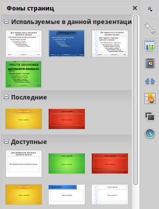
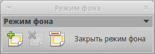
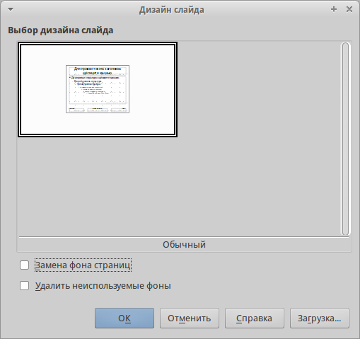
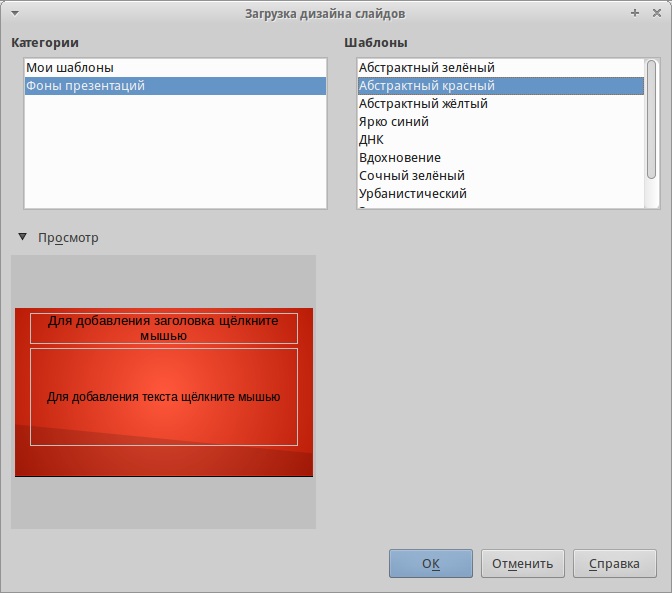
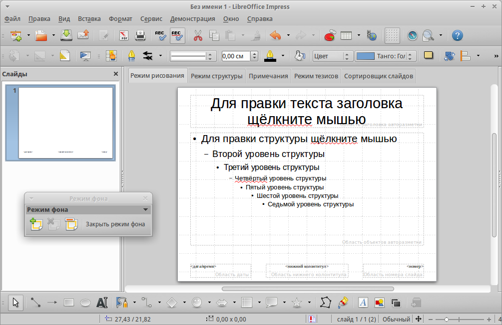
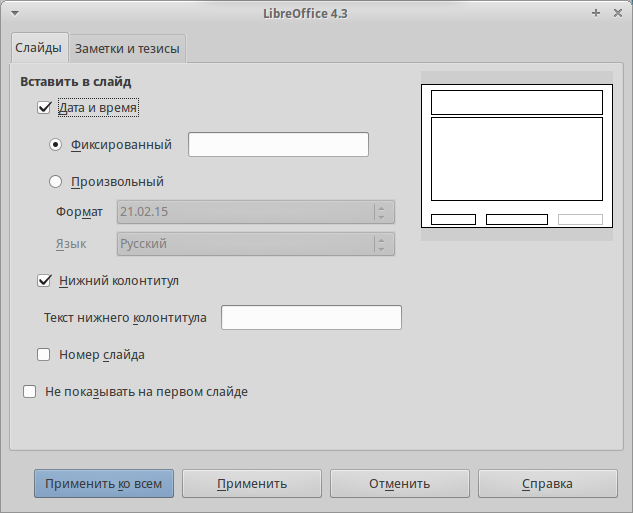
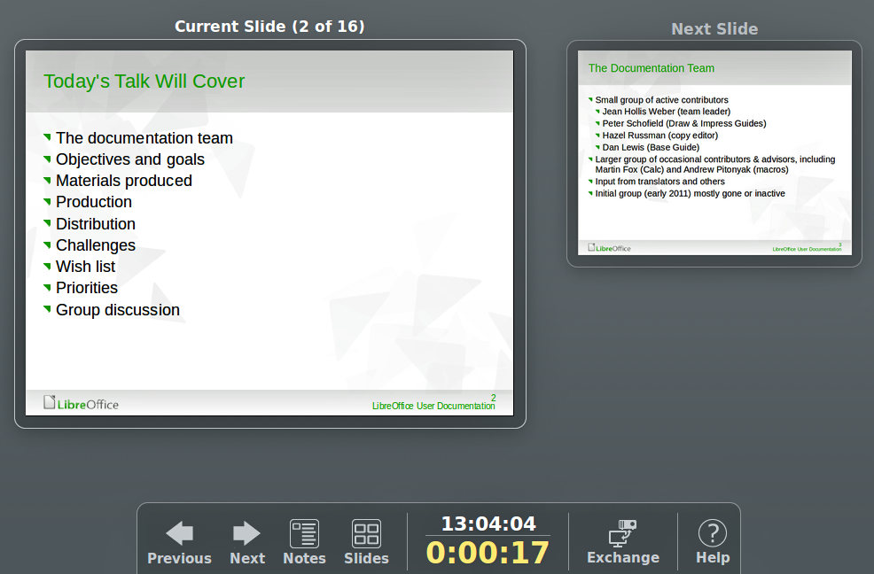

.. meta::
   :description: Глава 6 – Программа подготовки презентаций Impress
   :keywords: LibreOffice, Writer, Impress, Calc, Math, Base, Draw, либреоффис

.. Список автозамен

.. |br| raw:: html

    

.. _impress:

Глава 6 – Программа подготовки презентаций Impress
==================================================

Impress – это программа для создания презентаций из состава LibreOffice. В ней можно создавать слайды, содержащие множество различных элементов, включая текст, маркированные и нумерованные списки, таблицы, диаграммы и широкий спектр графических объектов, таких как изображения, рисунки и фотографии. Impress также включает в себя модуль проверки орфографии, тезаурусы, стили текста и стили фона.

В этой главе содержатся инструкции, иллюстрации и подсказки по работе в Impress при создании презентаций. Хотя сложные конструкции и упоминаются в этой главе, но объяснения по их созданию есть только в полном *Руководстве по Impress*. Если у Вас уже есть практические знания о том, как создавать презентации, мы рекомендуем использовать в качестве источника информации полное *уководство по Impress*.

Использование Impress для создания наиболее простых презентаций требует некоторых знаний по элементам, из которых состоят слайды. Например, создание рисунков или схем в Impress аналогично таковому в программе Draw, включенной в состав LibreOffice. По этой причине, рекомендуется также ознакомиться с :ref:`using-styles-and-templates` и *Главой 7 – Краткое руководство по Draw* в данном руководстве. Также можно обратиться к полному Руководству по Draw для получения более подробной информации о том, как использовать инструменты рисования.

Запуск Impress
--------------

Запустить Impress можно несколькими способами:

* Из стартового экрана LibreOffice. Если ни один из компонентов не запущен, то нажмите по значку Impress в левой части экрана.
* Из системного меню, откуда запускаются большинство приложений. В Windows это меню Пуск. В Gnome – это меню Приложений. В KDE оно обозначено логотипом KDE. В Mac OS X –  это меню Приложений. Детали могут меняться в зависимости от вашей операционной системы (смотрите :ref:`Introducing-LibreOffice`).
* В Windows и Linux выберите пункт Impress в *Быстром запуске LibreOffice*.
* Из любого запущенного компонента LibreOffice. Нажмите треугольник с правой стороны от значка Создать на главной панели инструментов и выберите пункт *Презентацию* из выпадающего списка или выберите пункт меню :menuselection:`Файл --> Создать --> Презентацию`.

.. note:: После установки LibreOffice на компьютер, в большинстве случаев, в системном меню будет создан пункт запуска для каждого компонента. Точное название и расположение этих пунктов меню зависит от операционной системы и графического пользовательского интерфейса.

При запуске Impress в первый раз будет показан Мастер презентаций. Здесь можно выбрать один из следующих вариантов:

* **Пустая презентация** – создаст пустой документ
* **Из шаблона** – разработка презентации на основании шаблона
* **Открыть существующую презентацию**

Для получения более подробной информации об использовании Мастера презентаций обратитесь к разделу `Создание новой презентации`_.

Если использование *Мастера презентаций* в дальнейшем не желательно, то можно выбрать опцию *Больше не показывать этот диалог*. Включить мастер можно в меню :menuselection:`Сервис --> Параметры --> LibreOffice Impress --> Общие` в разделе *Создать документ*, установите флажок у пункта *Использовать мастер*. 

Главное окно Impress
--------------------

Главное окно Impress содержит три области (слева направо): панель слайдов, рабочая область и боковая панель. Кроме того, несколько панелей инструментов могут быть показаны или скрыты при создании презентации.

.. _ch6-lo-screen-001:

.. figure:: _static/chapter6/ch6-lo-screen-001.png
    :scale: 50%
    :align: center
    :alt: Главное окно Impress; овалами показаны маркеры скрытия/отображения панелей
    
    Главное окно Impress
    
    *(овалами показаны маркеры скрытия/отображения панелей)*

.. tip:: Закрыть панель слайдов и боковую панель можно, нажав на крестик ``x`` в верхнем правом углу панелей или отключить их в меню :menuselection:`Вид --> Панель слайдов` или :menuselection:`Вид --> Боковая панель`. Чтобы вновь показать эти панели, активируйте их в меню :menuselection:`Вид --> Панель слайдов` или :menuselection:`Вид --> Боковая панель`.

    Также можно максимизировать рабочую область, нажав на маркеры скрытия/отображения на вертикальных разделительных линиях между областями (выделены овалами на рисунке выше). Используйте маркеры, если не хотите закрывать панели, а хотите их только скрыть. Для открытия панелей нажмите на маркеры мышкой еще раз.

Панель слайдов
~~~~~~~~~~~~~~

Панель слайдов содержит уменьшенные изображения слайдов из текущей презентации в том порядке, в котором они будут показаны во время демонстрации, если его не изменять. Нажатие на слайде в этой панели выделит его и этот слайд будет показан в рабочей области. Когда слайд находится в рабочей области, в него можно вносить изменения.

В панели слайдов можно выполнять несколько дополнительных операций с одним или несколькими слайдами одновременно:

* Добавить новый слайд в презентацию.
* Пометить слайд, как скрытый, чтобы он не показывался во время демонстрации.
* Удалить слайд из презентации, если он уже не нужен.
* Переименовать слайд.
* Дублировать слайд (копировать и вставить) или переместить слайд на новое место в презентации (вырезать и вставить).

Кроме того, можно выполнять следующие операции (хотя существуют более эффективные методы, чем использование панели слайдов):

* Изменение эффекта смены слайда для следующего выбранного слайда или эффекта смены каждого слайда в группе.
* Изменение последовательности слайдов в презентации.
* Изменение дизайна слайда.
* Изменение макетов слайдов одновременно для группы слайдов.

Боковая панель
~~~~~~~~~~~~~~

Боковая панель содержит семь разделов. Для отображения раздела, нажмите левой кнопкой мыши на соответствующий значок в боковой панели. В любой момент времени может быть отображён только какой-то один раздел.

**Свойства**

 В этом разделе можно выбрать макет слайда или, если выделен какой-либо элемент на слайде, можно настроить свойства этого элемента (например размер, тип и положение шрифта).

.. tip:: Нажмите клавишу ``F11``, чтобы открыть диалог *Стили и форматирование*, в котором можно изменить стили, используемые в любом слайде. Это может быть сделано в любое время.

**Фоны страниц**

 В этом разделе показаны доступные встроенные в программу фоны для слайдов. Возможности добавить свой фон в данный раздел нет, но в меню :menuselection:`Формат --> Страница` во вкладке *Фон* можно поэкспериментировать с заливкой фона различными способами.

**Эффекты**

 Здесь можно настроить эффекты появления для всех элементов выделенного слайда, такие как вид эффекта, скорость выполнения эффекта, порядок выполнения эффектов.
 
**Смена слайдов**

 В этом разделе настраивается тип смены слайдов. Можно выбирать из множества вариантов, также можно задать скорость смены, автоматический или ручной старт смены, наличие сопровождающего звука.

**Стили и форматирование**
 
 При нажатии на значок в боковой панели отображается стандартный диалог *Стили и форматирование*.
 
**Галерея**

 При нажатии на значок в боковой панели отображается стандартная галерея изображений, встроенных в LibreOffice. Их можно встраивать в слайды по мере необходимости.

**Навигатор**

 При нажатии на значок в боковой панели отображается стандартный диалог *Навигатор*.

Рабочая область
~~~~~~~~~~~~~~~

Рабочая область (расположена в центральной части экрана программы) содержит пять вкладок: *Режим рисования*, *Режим структуры*, *Примечания*, *Режим тезисов*, *Сортировщик слайдов*. Эти пять вкладок называют кнопками просмотра. Рабочее пространство под строкой кнопок просмотра меняется в зависимости от выбранного вида. `Виды рабочей области`_ подробно описаны далее.

.. _ch6-lo-screen-002:

.. figure:: _static/chapter6/ch6-lo-screen-002.png
    :scale: 70%
    :align: center
    :alt: Вкладки рабочей области
    
    Вкладки рабочей области

Панели инструментов
~~~~~~~~~~~~~~~~~~~

При создании слайдов могут быть использованы различные панели инструментов. Их можно показать или скрыть, используя меню :menuselection:`Вид --> Панели инструментов` или выбрать из контекстного меню. 

Для каждой панели инструментов также можно выбрать отображаемые значки. Для получения дополнительной информации обратитесь к :ref:`Introducing-LibreOffice` в этом руководстве.

Многие из панелей инструментов в Impress похожи на панели инструментов в Draw. Смотрите полное *Руководство по Draw* для получения дополнительной информации о доступных функциях и примерах их использования.

Строка состояния
~~~~~~~~~~~~~~~~

Строка состояния, расположенная в нижней части окна Impress, содержит информацию, которая может оказаться полезной при работе над презентацией. Для получения дополнительной информации о содержании и использовании этих полей, смотрите :ref:`Introducing-LibreOffice` в данном руководстве, и полное *Руководство по Impress, Глава 1 – Введение в Impress*.

.. _ch6-lo-screen-003:

.. figure:: _static/chapter6/ch6-lo-screen-003.png
    :scale: 70%
    :align: center
    :alt: Строка состояния
    
    Строка состояния

Слева направо расположены:

* **Информационное поле** – меняется в зависимости от выделенного элемента. Например:

 .. csv-table:: 
    :header: "Пример выделения", "Пример отображаемой информации"
    :widths: 20, 40
    
    "Текст","Изменить текст: Абзац x, Строка y, Столбец z"
    "Диаграммы, электронные таблицы","Имя выделенного (OLE) объекта, встроенного в слайд"
    "Рисунки","Растровый с прозрачным выделением"

* **Позиция курсора** – положение курсора или левый верхний угол выделенного объекта, измеренный от верхнего левого угла слайда; ширина и высота рамки выделения.

* **Не сохранённые изменения** – индикатор наличия не сохранённых изменений в файле. При двойном нажатии левой кнопкой мыши по значку откроется диалог сохранения файла.

* **Цифровая подпись** – индикатор наличия в документе цифровой подписи. После сохранения документа двойное нажатие левой кнопкой мыши на значке откроет диалог Цифровая подпись.

* **Номер слайда** – отображает номер текущего слайда в рабочей области и общее количество слайдов в презентации.

* **Стиль страницы (слайда)** – стиль, связанный со слайдом, раздаточным материалом или страницей заметок, отображаемых в это время в рабочей области. Двойное нажатие левой кнопкой мыши на имени стиля откроет диалог *Дизайн слайда*.

* **Ползунок масштабирования** – регулирует процент масштабирования в рабочей области.

* **Процент масштабирования** – отображает цифровое значение масштабирования в процентах. Двойное нажатие левой кнопкой мыши на процентах откроет диалог Масштабирование и режимы просмотра.

* **Строку состояния** и эту информацию можно скрыть, убрав флажок с пункта *Строка состояния* в меню *Вид*.

-------

Виды рабочей области
---------------------

Каждый из видов рабочей области предназначен для облегчения выполнения определенных задач, поэтому будет полезно ознакомиться с ними для того, чтобы быстро выполнять эти задачи.

.. note:: Для каждого вида рабочей области отображается различный набор панелей инструментов. Эти панели инструментов можно настроить, выбрав меню :menuselection:`Вид --> Панели инструментов` и установив или сняв флажок у нужной панели инструментов.

Режим рисования
~~~~~~~~~~~~~~~

*Режим рисования* – это главный вид для работы со слайдами. Используйте этот вид, чтобы задать формат и выбрать дизайн слайда, добавить текст, рисунки и эффекты анимации.

Чтобы поместить нужный слайд в рабочую область, нажмите левой кнопкой мыши на его уменьшенное изображение на панели слайдов или дважды нажмите левой кнопкой мыши по имени слайда в *Навигаторе* (смотрите :ref:`Introducing-LibreOffice` и полное *Руководство по Impress* для получения подробной информации о *Навигаторе*).

Режим структуры
~~~~~~~~~~~~~~~

Режим структуры (рисунок ниже) содержит все слайды презентации пронумерованные последовательно. Здесь показаны заголовки тем, маркированные списки и нумерованные списки для каждого слайда в формате структуры. Показан только текст, содержащийся в текстовых полях по умолчанию в каждом слайде, так что, если слайд включает в себя другие текстовые поля или графические объекты, текст в этих объектах не отображается. Имена слайдов также не показываются.

.. _ch6-lo-screen-004:

.. figure:: _static/chapter6/ch6-lo-screen-004.png
    :scale: 50%
    :align: center
    :alt: Режим структуры
    
    Режим структуры
    
Используйте режим отображения структуры для следующих целей:

1) Внесение изменений в текст слайда:
    a) Добавление и удаление текста в слайде так же, как и в режиме рисования.
    b) Перемещение абзацев в выбранном слайде вверх или вниз, используя кнопки на панели форматирования (выделены на рисунке ниже).

    .. _ch6-lo-screen-005:

    .. figure:: _static/chapter6/ch6-lo-screen-005.png
        :scale: 70%
        :align: center
        :alt: Стрелки перемещения уровней структуры в панели форматирования
        
        Стрелки перемещения уровней структуры в панели форматирования
        
    c) Изменение уровня для любого абзаца в слайде, используя кнопки вправо и влево  на панели форматирования.
    
2) Сравнение слайдов в структуре. Если в структуре стало видно, что слайд необходимо создать по другому, то можно сделать это непосредственно в режиме структуры или можно вернуться в режим рисования.

Режим Примечания
~~~~~~~~~~~~~~~~

Используйте вид *Примечания*, чтобы добавить примечания к слайду. Примечания не отображаются при демонстрации презентации.

.. _ch6-lo-screen-006:

    
    Вид *Примечания*
    
1) Нажмите вкладку *Примечания* в рабочей области.
2) Выберите слайд, к которому хотите добавить примечания в панели слайдов или в *Навигаторе*.
3) Нажмите левой кнопкой мыши в текстовом поле, расположенном ниже слайда, и введите текст примечания.

Можно изменить размер текстового поля *Примечания* с помощью цветных маркеров изменения размера, которые появляются при нажатии на край поля. Также можно переместить окно, поместив указатель на границу, нажав и перетащив его. Чтобы внести изменения в стиль текста, нажмите клавишу ``F11``, чтобы открыть диалог *Стили и форматирование*.

Режим тезисов
~~~~~~~~~~~~~

Вид тезисов предназначен для настройки макетов слайдов для печати раздаточного материала. Перейдите на вкладку *Режим тезисов* в рабочей области, затем откройте боковую панель и выберите свойства, где можно выбрать печать 1, 2, 3, 4, 6 или 9 слайдов на одной странице. 

.. _ch6-lo-screen-007:

    
    Макеты страниц
    
Используйте этот режим для настройки информации, которая будет напечатана на раздаточном материале. Обратитесь к *Руководству по Impress, Глава 10 – Печать, рассылки по электронной почте, экспорт и сохранение слайд-шоу* для получения дополнительной информации по печати слайдов, раздаточных материалов и примечаний.

Используйте пункты меню :menuselection:`Вставка --> Номер страницы` или :menuselection:`Вставка --> Дата и время` для открытия соответствующего диалога. Нажмите по вкладке *Заметки и тезисы* и выберите элементы, которые должны отображаться на каждой странице раздаточного материала, и их содержимое. Подробнее о том, как использовать этот диалог рассказывается в *Руководстве по Impress*. 

.. _ch6-lo-screen-008:

    
    Вкладка *Заметки и тезисы*

Режим сортировки слайдов
~~~~~~~~~~~~~~~~~~~~~~~~

Режим *Сортировщик слайдов* содержит все слайды в уменьшенном виде. Используйте этот режим для работы с группой слайдов или только с одним слайдом.

.. _ch6-lo-screen-009:

.. figure:: _static/chapter6/ch6-lo-screen-009.png
    :scale: 50%
    :align: center
    :alt: Режим Сортировщик слайдов
    
    Режим *Сортировщик слайдов*

Настройка режима Сортировщик слайдов
""""""""""""""""""""""""""""""""""""

Чтобы задать количество слайдов в строке:

1) В меню :menuselection:`Вид --> Панели инструментов` выделите пункты *Слайды* и *Сортировщик слайдов*, чтобы отобразить или скрыть соответствующие панели.
2) Установите количество слайдов (максимум 15).

.. _ch6-lo-screen-010:

.. figure:: _static/chapter6/ch6-lo-screen-010.png
    :scale: 80%
    :align: center
    :alt: Панель инструментов Сортировщик слайдов и Вид слайдов
    
    Панель инструментов *Сортировщик слайдов* и *Вид слайдов*
    
Перемещение слайда при помощи Сортировщика слайдов
""""""""""""""""""""""""""""""""""""""""""""""""""""""""""""""""""""""""""""

Чтобы переместить слайд в презентации в режиме *Сортировщик слайдов*:

1) Нажмите левой кнопкой мыши на слайд для его выделения.
2) Перетащите его в нужное место.

Выделение и перемещение группы слайдов
""""""""""""""""""""""""""""""""""""""

Чтобы выделить группу слайдов, используйте один из следующих способов:

* Используя клавишу ``Ctrl`` – нажмите на первый слайд и, зажимая клавишу ``Ctrl``, нажимайте на другие необходимые слайды.
* Используя клавишу ``Shift`` – нажмите на первый слайд и, зажимая клавишу ``Shift``, нажмите на последний слайд в группе. Таким образом выделятся все слайды между первым и последним в группе.
* Используя мышь –  нажмите и удерживайте левую кнопку мыши немного в стороне от первого слайда. Тяните курсор, пока все слайды, которые вам требуется не будут выделены рамкой.

Чтобы переместить группу слайдов:

1) Выделите группу слайдов.
2) Перетащите всю группу на новое место.

Работа в режиме Сортировщик слайдов
""""""""""""""""""""""""""""""""""""""

В режиме сортировщика слайдов можно работать со слайдами так же, как в панели слайдов. Чтобы внести изменения, нажмите правой кнопкой мыши на слайде и выберите одно из следующих действий из контекстного меню:

* **Новый слайд** – добавляет новый слайд после выделенного слайда (смотри раздел `Новый слайд`_).

* **Дублировать слайд** – создаёт дубликат выделенного слайда и помещает его между выделенным слайдом и следующим (смотри раздел `Дубликат слайда`_).

* **Удалить слайд** – удаляет выделенный слайд.
* **Переименовать слайд** – позволяет переименовать выделенный слайд.
* **Макеты слайдов** – позволяет выбрать макет для выделенного слайда.

* **Смена слайдов** – позволяет изменять вид смены для выделенного слайда:
    
    * Для одного слайда, выберите слайд и добавьте требуемый вид смены.
    * Для более чем одного слайда, выберите группу слайдов и добавьте требуемый вид смены.

* **Скрыть слайд** – любые скрытые слайды не отображаются при демонстрации презентации.
* **Вырезать** – удаляет выделенный слайд и сохраняет его в буфере обмена.
* **Копировать** – копирует выделенный слайд в буфер обмена без его удаления.
* **Вставить** – вставляет слайд из буфера обмена после выделенного слайда.

--------

Создание новой презентации
--------------------------

Этот раздел описывает создание новой презентации с использованием *Мастера*.

.. tip:: Первое, что нужно сделать, это определить цель презентации и спланировать её. Хотя, конечно, можно вносить изменения по ходу дела, но, имея представление о будущей аудитории, заранее составленные структуру, содержание и представление презентации, можно сэкономить много времени с самого начала.

.. _ch6-lo-screen-011:

.. figure:: _static/chapter6/ch6-lo-screen-011.png
    :scale: 50%
    :align: center
    :alt: Выбор типа презентации
    
    Выбор типа презентации
    

Для запуска *Мастер презентаций* выберите :menuselection:`Файл --> Мастер --> Презентации`. Откроется диалоговое окно *Мастер презентаций*:

1) В поле *Тип* выберите один из вариантов. Эти варианты рассматриваются в *Руководстве по Impress*:
    a) *Пустая презентация* – создаст пустую презентацию.
    b) *Из шаблона* –  использует дизайн шаблона, уже созданный в качестве основы для новой презентации. Мастер показывает список доступных шаблонов. Выберите нужный шаблон.
    c) *Открыть существующую презентацию* – продолжить работу с ранее созданной презентацией. Мастер покажет список существующих презентаций. Выберите нужную презентацию.

2) Нажмите *Далее*. На рисунке ниже показан 2-й шаг *Мастера*. Если на 1-м шаге был выбран вариант *Из шаблона*, то в окне просмотра будет показан пример слайда.

.. _ch6-lo-screen-012:

.. figure:: _static/chapter6/ch6-lo-screen-012.png
    :scale: 50%
    :align: center
    :alt: Выбор дизайна слайда
    
    Выбор дизайна слайда
    
3) Выберите нужный дизайн из списка. Секция дизайн слайда предлагает выбрать *Фоны презентаций*. Если хотите использовать один из них, кроме *<Оригинал>*, просто нажмите его для выбора.

    a) Типы *Фонов презентаций* показаны на рисунке выше. При выборе фона презентации будет показана миниатюра слайда в окне предварительного просмотра.
    b) *<Оригинал>* – это дизайн пустой презентации.

4) Выберите *Способ отображения презентации* в соответствующем разделе. Большинство презентаций создаются для отображения на экране компьютера. Рекомендуется выбирать тип *Экран*. Формат страницы можно изменить в любое время.

.. note:: Слайд для типа *Экран* оптимизирован для мониторов с соотношением сторон 4:3 (28см х 21см). Этот вариант не подходит для современных широкоформатных мониторов. Размер слайда можно изменить в любое время путем переключения в *Режим рисования*, а затем в меню выбрать пункт :menuselection:`Формат --> Страница`.

5)  Нажмите *Далее*. Появится шаг 3 Мастера.
    
    a) Выберите тип смены слайда из выпадающего списка справа от пункта Эффект.
    b) Выберите скорость смены слайдов в презентации из выпадающего списка справа от пункта *Скорость*. Значение *Средняя* – это хороший выбор для большинства случаев.
    
.. _ch6-lo-screen-013:

.. figure:: _static/chapter6/ch6-lo-screen-013.png
    :scale: 50%
    :align: center
    :alt: Выбор типа смены слайдов
    
    Выбор типа смены слайдов

.. tip:: Для пунктов *Эффект* и *Скорость* можно принять значения по умолчанию, если отсутствует опыт создания презентаций. Оба эти значения могут быть изменены позже при работе с переходами между слайдами и при настройке анимации. Эти две особенности объясняются более подробно в *Руководстве по Impress, Глава 9 – Демонстрация презентации*.
    
.. warning:: Не забывайте часто сохранять презентацию во время работы над ней, чтобы предотвратить любую потерю информации, если произойдет какой-то сбой. Также можно активировать функцию автосохранения (в меню :menuselection:`Сервис --> Параметры --> Загрузка/Сохранение --> Общие`). Выберите *Автосохранение* каждые и введите количество минут, через которое будет производится автоматическое сохранение.

6) На шаге 4 *Мастера презентаций* задается название презентации и организации.

.. _ch6-lo-screen-014:

.. figure:: _static/chapter6/ch6-lo-screen-014.png
    :scale: 50%
    :align: center
    :alt: Ввод названия презентации и организации 

    Ввод названия презентации и организации 
    
7) На шаге 5 *Мастера презентаций* нажмите *Готово*, будет открыта созданная презентация.

.. _ch6-lo-screen-015:

.. figure:: _static/chapter6/ch6-lo-screen-015.png
    :scale: 50%
    :align: center
    :alt: Заключительный шаг *Мастера презентаций*
    
    Заключительный шаг *Мастера презентаций*
    
-------

Форматирование презентации
--------------------------

Новая презентация содержит один единственный слайд. В этом разделе мы будет добавлять новые слайды и наполнять слайды информацией.

Вставка слайда
~~~~~~~~~~~~~~

Новый слайд
"""""""""""

Новый слайд может быть вставлен в презентацию следующими способами:

1) В меню *Вставка* выберите пункт *Слайд*.
2) Или нажмите правой кнопкой мыши на слайд в рабочей области *Панели слайдов* или в *Сортировщике слайдов* и выберите пункт контекстного меню *Новый слайд* (для Рабочей области :menuselection:`Слайд --> Новый слайд`).

3) Или нажмите на значок *Слайд* |ch6-lo-screen-016| в панели *Презентация*. Если панель *Презентация* не видна, то в меню :menuselection:`Вид --> Панели инструментов` отметьте флажком пункт *Презентация*.

.. |ch6-lo-screen-016| image:: _static/chapter6/ch6-lo-screen-016.png
        :scale: 60% 

Новый слайд будет вставлен после выделенного слайда в презентации.

Дубликат слайда
""""""""""""""""

Иногда, вместо того, чтобы добавлять новый слайд, можно дублировать уже существующий слайд в презентации. Чтобы дублировать слайд:

1) Выделите слайд, который хотите дублировать в *Панели слайдов*.
2) Нажмите правой кнопкой мыши на слайде в *Панели слайдов* и выберите пункт контекстного меню *Дублировать слайд*.

 Или переключитесь в режим *Сортировщик слайдов*, нажмите правой кнопкой мыши на слайде и выберите пункт контекстного меню *Дублировать слайд*.
 
3) Дубликат слайда будет вставлен после выделенного слайда в презентации.

Выбор макета слайда
~~~~~~~~~~~~~~~~~~~

В *Боковой панели* выберите раздел *Свойства*, чтобы отобразить доступные макеты. Макеты, включенные в состав LibreOffice, варьируются от пустого до макета с шестью блоками текста и заголовком.

.. _ch6-lo-screen-017:

.. figure:: _static/chapter6/ch6-lo-screen-017.png
    :scale: 70%
    :align: center
    :alt: Доступные макеты слайдов
    
    Доступные макеты слайдов

Первый слайд в презентации, как правило, титульный слайд. Для него можно использовать любой пустой макет или один из титульных макетов.

Чтобы создать заголовок, в случае если был выбран один из титульных макетов, нажмите на слайде текст «Нажмите, чтобы добавить заголовок» и введите текст заголовка. Для добавления субтитров или текста, в зависимости от выбранного макета слайда, нажмите на текст «Нажмите, чтобы добавить текст» и введите свои субтитры или текст. Для настройки форматирования заголовка, подзаголовка, либо его содержимого, нужно изменить стиль презентации. Смотрите *Руководство по Impress, Глава 2 – Использование образцов слайдов, стилей и шаблонов* для получения дополнительной информации.

.. note:: Текстовые и графические элементы могут быть изменены в любой момент во время подготовки презентации, но изменения макета слайда, который уже содержит в себе некоторое наполнение, может повлиять на формат содержимого. Поэтому рекомендуется обратить особое внимание на макет  для предотвращения любой потери содержимого.

.. tip:: Для просмотра названия макетов используйте функцию *Подсказка*: поместите курсор на макет в *Боковой панели* (или на любой значок на панели инструментов) и его имя отобразится в небольшом прямоугольнике.

    Если *Подсказки* не включены, то выберите меню :menuselection:`Сервис --> Параметры --> LibreOffice --> Общие --> Справка` и отметьте флажком пункт *Всплывающие подсказки*. 

Для выбора или изменения макета слайда, выберите слайд в *Панели слайдов*, чтобы он появился в рабочей области и выберите нужный макет из макетов в *Боковой панели*. Несколько макетов содержат один или более блоков с содержимым. Каждый из этих блоков  может содержать текст, видео, изображение, диаграммы или таблицы.

Можно выбрать тип содержимого нажав на соответствующем значке, отображаемом в центре блока, как показано на рисунке ниже. Если нужно использовать блок под текст, то нажмите левой кнопкой мыши на надпись «Для добавления текста щелкните мышью».

.. _ch6-lo-screen-018:

    
    Выбор типа содержимого слайда

Изменение элементов слайдов
~~~~~~~~~~~~~~~~~~~~~~~~~~~

Слайд содержит элементы, которые были включены в слайд мастером, а также элементы, включенные в выбранный макет слайда. Тем не менее, маловероятно, что предопределенные макеты будут удовлетворять все потребности пользователя при создании презентации. В процессе создания презентации можно удалять не нужные элементы или вставленные объекты, такие как текст и рисунки.

Хотя Impress не имеет функциональных возможностей для создания новых макетов, он позволяет изменять размер и перемещать элементы макета. Кроме того, можно добавлять элементы, не ограничиваясь размером и положением блоков в макете.

Чтобы изменить размер блока с содержимым, нажмите на его рамке так, чтобы отобразились метки-манипуляторы. Чтобы переместить его, поместите курсор мыши на рамке так, чтобы курсор поменял форму на крест со стрелками. Теперь вы можете перетащить блок на новое место в слайде.

Чтобы удалить любые ненужные элементы:

1) Нажмите по элементу для его выделения.
2) Нажмите клавишу ``Delete``, чтобы удалить элемент.

.. warning:: Изменения в любом из макетов, включенных в Impress, можно сделать только с помощью :menuselection:`Вид --> Обычный`, который используется по умолчанию. Попытка изменения макетов слайдов, может привести к непредсказуемым результатам и потребует дополнительных усилий по правке, а также определенного количества проб и ошибок.

Добавление текста
~~~~~~~~~~~~~~~~~~

Чтобы добавить текст на слайд, который содержит текстовый блок, нажмите на надпись «Для добавления текста щелкните мышью» в текстовом блоке, а затем введите текст. Можно изменять уровень структуры каждого абзаца, а также позицию в тексте с помощью кнопок со стрелками на панели инструментов Форматирование текста (смотрите  раздел `Режим структуры`_). Более подробную информацию о тексте смотрите в разделе `Добавление и форматирование текста`_.

Добавление объектов
~~~~~~~~~~~~~~~~~~~

Чтобы добавить объект на слайд, например, изображение, фотографию или электронные таблицы, нажмите в блоке на значок того типа объекта, который требуется. Для получения дополнительной информации смотрите раздел `Добавление изображений, таблиц, диаграмм или медиа-файлов`_.

Изменение внешнего вида всех слайдов
~~~~~~~~~~~~~~~~~~~~~~~~~~~~~~~~~~~~

Чтобы изменить фон или другие характеристики всех слайдов в презентации, необходимо  изменить мастер-слайд или выбрать другой мастер-слайд, как это описано в разделе `Работа с мастер-слайдами и стилями`_.

Мастер-слайд – это слайд с заданным набором характеристик, который используется в качестве отправной точки для создания других слайдов (иначе говоря шаблона). Эти характеристики включают в себя фон слайда, объекты на заднем плане, форматирование любого текста и любого фонового изображения.

.. note:: LibreOffice использует три взаимозаменяемых термина для одной концепции: мастер-слайд, слайд-мастер и мастер-страница. Все эти термины относятся к слайду-шаблону, который используется для создания других слайдов. В этом руководстве, однако, используется только термин мастер-слайд, за исключением тех случаев, когда описывается интерфейс пользователя.

Смотрите *Руководство по Impress, Часть 2 – Использование мастер-слайдов, стилей и шаблонов* для получения более подробной информации по созданию и модифицированию мастер-слайдов.

Если всё, что нужно сделать, это изменить фон презентации, то можно сделать следующее:

1) Выберите пункт меню :menuselection:`Формат --> Страница` и в открывшемся диалоге перейдите на вкладку *Фон*. 
2) Выберите желаемый тип фона между заливкой цветом, градиентом, штриховкой и текстурой. 
3) Выберите желаемый вариант самого фона в появившемся списке.
4) Нажмите *OK*, чтобы сохранить настройки.

После нажатия на кнопку *ОК* появится диалог с вопросом о применении фона для всех страниц. Если нажать *Да*, то Impress автоматически изменит мастер-слайд.

.. note:: Установка и правильное форматирование фона выходит за рамки данной главы, но найти всю необходимую информацию можно в *Руководстве по Draw. Часть 4. Изменение атрибутов объекта* или в *Руководстве по Impress. Часть 6. Форматирование графических объектов*.

Изменение демонстрации слайдов
~~~~~~~~~~~~~~~~~~~~~~~~~~~~~~~

По умолчанию в демонстрации слайдов будут показаны все слайды в том же порядке, как они отображены в режиме слайдов, без автоматической смены слайдов. Вы должны нажимать на клавишу клавиатуры или щелкать мышью, чтобы менять слайды.

Вы можете использовать меню *Демонстрация* на главной панели инструментов, чтобы изменить порядок слайдов, автоматизировать переход от одного слайда к другому и других параметров. Чтобы настроить переход между слайдами, анимировать сами слайды, добавить звуковое сопровождение к презентации или сделать другие улучешния, вам нужно использовать функции в панели задач. Смотрите *Руководство по Impress* для получения подробной информации о том, как использовать все эти возможности.

-------

Добавление и форматирование текста
----------------------------------

Во многих ваших слайдах наверняка содержится некий текст. Этот раздел даст вам краткие рекомендации о методах добавления и изменения внешнего вида текста. Текст, используемый в слайдах, содержится в текстовых полях. Для получения дополнительной информации о добавлении и форматирования текста  смотрите *Руководство по Impress . Часть 3. Добавление и форматирование Текста*.

Есть два типа текстовых полей, которые можно добавить в слайд:

* Выберите готовый макет в соответствующем разделе *Боковой панели* и нажмите левой кнопкой мыши в той части слайда, где хотите ввести текст, не выбирая вставку никаких объектов (типа таблиц, рисунков и прочего). Эти текстовые поля называются автонастроенными (AutoLayout) текстовыми полями.

* Создйте текстовое поле, используя значок *Текст* |ch6-lo-screen-019| (в зависимости от темы значков может быть |ch6-lo-screen-019a|)  на панели инструментов *Рисование* или панели инструментов *Текст*, или используйте клавишу на клавиатуре ``F2``.

Использование автонастроенных (AutoLayout) текстовых полей
~~~~~~~~~~~~~~~~~~~~~~~~~~~~~~~~~~~~~~~~~~~~~~~~~~~~~~~~~~

1) Убедитесь, что выбран *Режим рисования*.
2) Нажмите левой кнопкой мыши на надписи *Для добавления текста щелкните мышью*.
3) Введите или вставьте ваш текст в текстовое поле.

Использование текстовых полей
~~~~~~~~~~~~~~~~~~~~~~~~~~~~~

1) Убедитесь, что выбран *Режим рисования*.

2) Нажмите на значок *Текст* |ch6-lo-screen-019a| на панели инструментов *Рисование* или *Текст* или нажмите клавишу ``F2`` на клавиатуре. Если панели инструментов не видны, используйте пункт меню :menuselection:`Вид --> Панели инструментов`, найдите и отметьте в списке *Рисование* или *Текст*.

        
3) Зажмите левую клавишу мыши в нужном месте на слайде и перемещайте курсор, чтобы нарисовать прямоугольник для ввода текста на слайде. Не беспокойтесь о вертикальном размере, так как текстовое поле будет расширяться по необходимости при вводе текста.

4) Отпустите клавишу мыши, когда закончите. Курсор появится в текстовом поле, которое находится в режиме редактирования (обрамленное границей, показанной на рисунке ниже).

.. _ch6-lo-screen-022:

    
    Создание и правка текстовых полей

5) Введите или вставьте текст в текстовое поле.

6) Нажмите левой кнопкой мыши за границей текстового поля, чтобы завершить редактирование текста.

Текстовые поля можно перемещать, изменять их размеры и удалять. Для получения более подбробной информации смотрите *Руководство по Impress. Часть 3. Добавление и форматирование текста*.

Вертикальный текст
~~~~~~~~~~~~~~~~~~

В дополнение к обычным текстовым полям, где текст ориентирован горизонтально, можно вставить такие текстовые поля, где текст вводится вертикально. Вертикальный текст доступен только при включённой поддержке восточноазиатских языков в  меню :menuselection:`Сервис --> Параметры --> Настройки языка --> Языки`. Нажмите на значок *Вертикальный текст* |ch6-lo-screen-021|  на панели инструментов *Рисование* или *Текст*, чтобы создать текстовое поле для ввода вертикального текста .

.. |ch6-lo-screen-021| image:: _static/chapter6/ch6-lo-screen-021.png
        :scale: 70% 

.. note:: Для поворота любого текста на любой угол читайте статью: `Writer: Как повернуть текст (на любой угол) <http://librerussia.blogspot.ru/2015/01/writer-povorot.html>`_

Быстрое изменение размеров шрифта
~~~~~~~~~~~~~~~~~~~~~~~~~~~~~~~~~

В Impress при выделении текста на боковой панели в разделе *Свойства* есть значки *Увеличить кегль* и *Уменьшить кегль*, предназначенные для увеличения и уменьшения размеров шрифта. 

.. _ch6-lo-screen-023:

    
    Кнопки для быстрого изменения размеров шрифта в боковой панели 

Вставка текста
~~~~~~~~~~~~~~

Скопированный из другого документа текст может быть вставлен в текстовое поле в Impress. Тем не менее, вставленный текст, скорее всего, не соответствует по форматированию окружающему тексту в текущем слайде или тексту в других слайдах презентации. В некоторых случаях такой текст может быть оставлен в изначальном виде. Однако, в большинстве случаев важно, чтобы стиль презентации был единым и чтобы сама презентация по внешнему виду не превращалась в «лоскутное одеяло» из разных стилей абзацев, типов шрифтов, маркеров в списках и так далее. Есть несколько способов, чтобы обеспечить единообразие внешнего вида в презентации.

Вставка текста без форматирования
""""""""""""""""""""""""""""""""""""""""""""""""

Вставить в документ текст без форматирования и позже применить к нему форматирование – это хорошая идея. Чтобы вставить текст без форматирования:

* Используйте сочетание клавиш ``Ctrl+Shift+V`` и выберите вариант *Текст без форматирования* в открывшемся диалоге *Вставить как*.
* Или щелкните маленький треугольник справа от значка *Вставить* на стандартной панели инструментов и также выберите вариант *Текст без форматирования*.

Неотформатированный текст будет отформатирован так же, как окружающий текст или стиль абзаца вокруг места вставки в  автонастроенном (AutoLayout) текстовом поле или в базовом стиле в обычном текстовом поле.

Форматирование вставленного текста
""""""""""""""""""""""""""""""""""""""""""""""""

Если вставить текст в автонастроенное (AutoLayout) текстовое поле, то к нему необходимо применить соответствующий стиль, чтобы получить тот же вид, как в остальной части презентации. 

1) Вставьте текст в нужное место.
2) Выделите вставленный текст.
3) Выберите пункт главного меню :menuselection:`Формат --> Форматирование по умолчанию`.

4) Используйте стрелки на *Панели форматирования* текста (выделены на рисунке :ref:`ch6-lo-screen-005`), чтобы переместить текст в соответствующее положение и дать ему соответствующий уровень структуры.

* Стрелка влево повышает на один уровень (например с уровня 3 на уровень 2).
* Cтрелка вправо понижает запись список на один уровень.
* Стрелка вверх перемещает запись вверх по списку.
* Стрелка вниз перемещает запись вниз по списку.

5) Примените любое необходимое ручное форматирование к тексту, чтобы изменить атрибуты шрифта, табуляцию и так далее.

Если вставить текст в обычное текстовое поле, то можно использовать стили, чтобы быстро форматировать текст. Только один графический стиль может быть применен к вставленному тексту следующим образом:

1) Вставьте текст в желаемое место.
2) Выделите вставленный текст.
3) Выберите необходимый стиль, чтобы форматировать текст .
4) Примените любое необходимое ручное форматирование к тексту, чтобы изменить атрибуты шрифта, табуляцию и т.д.

Создание маркированных и нумерованных списков
~~~~~~~~~~~~~~~~~~~~~~~~~~~~~~~~~~~~~~~~~~~~~

Процедура создания маркированного или нумерованного списка довольно сильно отличаются в зависимости от типа используемого текстового поля, хотя средства для управления списками и настройки внешнего вида одни и те же. В автонастроенных (AutoLayout) текстовых полях доступные по умолчанию стили настроены, как маркированные списки. Для нормальных текстовых полей необходимо выполнить дополнительные действия, чтобы создать маркированный список.

Автонастроенное (AutoLayout) текстовое поле
"""""""""""""""""""""""""""""""""""""""""""

Автонастроенное (AutoLayout) текстовое поле уже отформатировано, как маркированный список. Создание списка в нём выглядит следующим образом:

1) Выберите нужный макет слайда, содержащий текстовое поле, в *Боковой панели*.
2) В текстовом поле щелкните по надписи *Для добавления текста щелкните мышью*.
3) Введите текст и нажмите клавишу ``Enter``, чтобы создать новую маркированную строку.
4) Стиль по умолчанию для списка – маркированный список. Методы для изменения внешнего вида списка описаны в разделе `Изменение вида списка`_

.. tip:: Нажмите сочетание клавиш ``Shift+Enter``, чтобы создать следующую строку в списке без маркера. Новая строка будет иметь такой же отступ, как предыдущая строка. Чтобы выключить маркеры вообще, нажмите значок *Маркированный список* |ch6-lo-screen-024| на панели инструментов *Форматирование текста*. Если эта панель не отображается, то активируйте ее в меню :menuselection:`Вид --> Панели инструментов --> Форматирование текста`.

Текстовые поля
""""""""""""""

Создание маркированного списка в обычном текстовом поле:

1) Нажмите значок *Текст* |ch6-lo-screen-019| на панели инструментов *Рисование* и создайте текстовое поле на слайде.
2) Нажмите значок *Маркированный список* |ch6-lo-screen-024| на панели инструментов форматирование текста.
3) Введите текст и нажмите клавишу ``Enter``, чтобы создать следующую маркированную строку.

Тип списка по умолчанию – маркированный список. Методы для изменения внешнего вида списка описаны в разделе `Изменение вида списка`_ ниже.

Создание нового уровня структуры
""""""""""""""""""""""""""""""""

В автонастроенном (AutoLayout) текстовом поле новый уровень структуры может быть создан следующим образом:

1) Если это необходимо, нажмите клавишу ``Enter``, чтобы начать новую строку в списке.

2) Чтобы «понизить» запись списка (сдвинуть её вправо), нажмите клавишу ``Tab`` или щелкните на значок *Понизить* (стрелка вправо) на панели инструментов *Форматирование текста*, или используйте сочетание клавиш ``Alt+Shift+Right``. Запись в списке переместится вправо с отступом на следующий уровень структуры.

 Нажмите клавишу ``Enter`` снова для создания новой записи в списке с тем же уровнем структуры, что и предыдущий.

3) Чтобы «повысить» запись списка (сдвинуть её влево), нажмите сочетание клавиш ``Shift+Tab`` или щелкните по значку *Повысить* (стрелка влево) на панели инструментов *Форматирование текста*, или используйте сочетание клавиш ``Alt+Shift+Left``. Запись списка переместится влево (если только она уже не находится на 1 уровне!) на предыдущий уровень структуры.

 Нажмите клавишу ``Enter`` снова для создания новой записи в списке с тем же уровнем структуры, что и предыдущий.

В автонастроенных (AutoLayout) текстовых полях, повышение или понижение элементов списка соответствует применению к ним другого стиля типа *Структура*. Второй уровень структуры списка соответствует стилю *Структура 2*, третий уровень – стилю *Структура 3*, и так далее. При изменении уровня структуры и стиля происходят и другие изменения, например: размер шрифта, тип маркера и так далее.

В обычных текстовых полях новый уровень структуры может быть создан только используя клавишу ``Tab``, чтобы понизить уровень записи в списке и сочетание клавиш ``Shift+Tab``, чтобы повысить запись в списке.

.. note:: Не пытайтесь изменить уровень структуры, выделив текст, и нажав нужный стиль так, как если бы вы работали в Writer. Из-за способа работы со стилями презентаций в Impress, это невозможно.

Изменение вида списка
"""""""""""""""""""""

Полностью настраивать внешний вид списка можно, изменяя вид маркеров или нумерацию для всего списка или для отдельной записи в списке. Все изменения могут быть сделаны через диалог Маркеры и нумерация (рисунок ниже), доступный из меню :menuselection:`Формат --> Маркеры и нумерация`.

.. _ch6-lo-screen-025:

    
    Диалог Маркеры и нумерация

Для всего списка:

1) Выделите весь список или нажмите на границе текстового поля так, чтобы отобразились метки-манипуляторы.
2) Выберите пункт меню :menuselection:`Формат --> Маркеры и нумерация`.
3) Диалог *Маркеры и нумерация* содержит пять вкладок: *Маркеры*, *Тип нумерации*, *Изображение*, *Положение* и *Настройка*.

 a) Если требуется маркированный список, то выберите нужный стиль маркеров из стилей по умолчанию, доступных на вкладке *Маркеры*.
 b) Если требуется графический стиль маркеров, то выберите один из доступных на вкладке *Изображение*.
 c) Если требуется нумерованный список, то выберите один из доступных по умолчанию стилей нумерации на вкладке *Тип нумерации*.
 d) На вкладке *Положение* можно установить отступ, расположение нумерации  и выравнивание списка.
 e) На вкладке *Настройка* можно настроить нумерацию, цвет, масштаб и символы, используемые в списке.

Для отдельной записи в списке, нажмите на неё в списке и повторите шаги 2 и 3.

Если список был создан в автонастроенном (AutoLayout) текстовом поле, то альтернативным способом изменить весь список, является изменение стилей типа *Структура*. Изменения, внесенные в стиль типа *Структура*, будут применяться ко всем слайдам в презентации.

-----------

Добавление изображений, таблиц, диаграмм или медиа-файлов
---------------------------------------------------------

Слайд может содержать изображения, таблицы, диаграммы или медиа-файлы, а также текст. Этот раздел кратко расскажет, как работать с этими объектами. Для получения дополнительной информации о добавлении изображений, таблиц, диаграмм или медиа-файлов, пожалуйста, обратитесь к *Руководству по Impress*.

Добавление изображений
~~~~~~~~~~~~~~~~~~~~~~~~~~~

Чтобы добавить изображение на слайд:

1) Выберите пункт главного меню :menuselection:`Вставка --> Изображение` и выберите пункт *Из файла* или *Сканировать*.

 Также, после вставки нового слайда, можно нажать на значок *Вставить изображение* (смотрите рисунок :ref:`ch6-lo-screen-018`) в новом слайде и выбрать файл в открывшемся диалоге.
 
2) Поместите изображение в нужное место на слайде.

У изображения будет автоматически изменён размер, чтобы заполнить всю доступную площадь слайда. Следуйте инструкциям из примечания ниже при необходимости изменить размер графического объекта вручную.

.. note:: Для изменения размера графического объекта щелкните по нему правой кнопкой мыши. Выберите пункт *Положение и размер* из контекстного меню и убедитесь, что отмечен пункт *Пропорционально*. Затем измените высоту или ширину изображения до необходимого размера. Если изменить один параметр, то изменятся оба, для того, чтобы соотношение ширины и высоты осталось неизменным. Невыполнение этого требования может привести к деформированию изображения. Помните также, что изменение размера растрового изображения снизит его качество, лучше создать образец желаемого размера вне Impress в любом графическом редакторе.

Добавление таблиц
~~~~~~~~~~~~~~~~~~~~~~~~~~~

Чтобы добавить основную таблицу на слайд:

1) Выберите пункт главного меню :menuselection:`Вставка --> Таблица` или щелкните по значку *Таблица* |ch6-lo-screen-026| на стандартной панели инструментов.

.. |ch6-lo-screen-026| image:: _static/chapter6/ch6-lo-screen-026.png
        :scale: 80% 

2) Если таблица уже есть на слайде и она выбрана, щелкните значок *Таблица* |ch6-lo-screen-026| на панели инструментов *Таблица*. Панель инструментов *Таблица* видна только после выбора пункта главного меню :menuselection:`Вид --> Панели инструментов --> Таблица` и если таблица выбрана в настоящий момент.

 Также, после вставки нового слайда в презентацию, можно щелкнуть по значку Вставить таблицу (смотрите рисунок :ref:`ch6-lo-screen-018`).

3) Задайте нужное количество строк и столбцов в открывшемся диалоге *Вставка таблицы*.

 Также можно щелкнуть по маленькому треугольнику справа от значка *Таблица* |ch6-lo-screen-026| и задать количество строк и столбцов, перемещая курсор мыши.

4) Нажмите левой кнопкой мыши на таблице, а затем по значку *Свойства* в *Боковой панели* и выберите любой из доступных стилей дизайна таблицы.

 Также можно нажать значок *Дизайн таблицы* |ch6-lo-screen-027| на панели инструментов Таблица, чтобы открыть раздел *Дизайн таблицы* в *Боковой панели*.

.. note:: Выбор любого из стилей в разделе *Дизайн таблицы* на Б*оковой панели* создаст таблицу на основе этого стиля. Если таблица создаётся другим способом, позже все равно можно применить к ней любой стиль на выбор.

Панель инструментов *Таблица* в Impress предлагает те же функции, что и панель инструментов *Таблица* в Writer, за исключением расчета функций *Сортировать* и *Сумма*. Для использования функций *Сумма* и *Сортировать* в презентации необходимо вставить в слайд электронную таблицу Calc. 

После создания таблицы можете изменить её, добавляя и удаляя строки и столбцы,  регулируя ширину и промежутки между ячейками, добавляя границы, цвет фона и тому подобное. Для получения более подробной информации по работе с таблицами смотрите *Руководство по Impress.  Часть 3. Добавление и форматирование текста* и *Руководство по Writer. Часть 9. Работа с таблицами*.

Ввод данных в ячейки таблицы аналогичен работе с любым текстовым объектом. Нажмите левой кнопкой мыши на нужной вам ячейке и начните ввод текста. Для быстрого перемещения по ячейкам используйте следующие клавиши на клавиатуре:

* Нажимайте клавиши курсора, чтобы переместить курсор в необходимую ячейку или к следующему символу, если в ячейке содержится текст.
* Нажимайте клавишу ``Tab``, чтобы переместить курсор в следующую ячейку справа от текущей и нажимайте сочетание клавиш ``Shift+Tab``, чтобы переместить курсор в ячейку слева от текущей.

Добавление диаграмм
~~~~~~~~~~~~~~~~~~~~~~~~~~~

Чтобы вставить диаграмму в слайд:

1) Выберите пункт меню :menuselection:`Вставка --> Диаграмма` или нажмите на значок *Диаграмма* |ch6-lo-screen-028| на *Стандартной панели* инструментов.
Также после вставки нового слайда, можно нажать кнопку *Вставить диаграмму* (смотрите рисунок :ref:`ch6-lo-screen-018`).
2) Impress вставить стандартную диаграмму и откроет диалоговое окно *Диаграмма*. Для получения информации об изменении типа диаграммы, вставке своих данных или изменении форматирования, обратитесь к *Руководству по Impress*.

Добавление медиа-файлов
~~~~~~~~~~~~~~~~~~~~~~~~~~~

Чтобы вставить медиа-файлы, такие, как музыка и видеоклипы, в слайд:
1) Выберите пункт главного меню :menuselection:`Вставка --> Видео и звук`.

 Также, после добавления нового слайда, можно нажать на значок Вставить видео (смотрите рисунок :ref:`ch6-lo-screen-018`).

2) В нижней части экрана откроется медиаплеер, в котором можно будет просмотреть медиа-файл.

3) Если вставляется аудио файл, на слайде будет отображено изображение динамика.

.. warning:: В Linux-based системах, таких, как Ubuntu, медиа-файлы работают не сразу. Сначала необходимо будет скачать Java Media Framework API (JMF) и добавить ``jmf.jar`` в *Путь класса* в меню :menuselection:`Сервис --> Параметры --> LibreOffice --> Расширенные возможности`.

Добавление графических объектов, электронных таблиц и других объектов
~~~~~~~~~~~~~~~~~~~~~~~~~~~~~~~~~~~~~~~~~~~~~~~~~~~~~~~~~~~~~~~~~~~~~

Графикой, такой, как формы, выноски, стрелки и так далее, часто бывает полезно дополнить текст на слайде. Эти объекты обрабатываются так же, как графика в Draw. Для получения более подробной информации смотрите *Руководство по Draw, Часть 7* или *Руководство по Impress, Части 4, 5 и 6*.

Электронные таблицы, встраиваемые в Impress, включают в себя большую часть функциональности таблиц Calc и способны выполнять сложнейшие расчеты и анализ данных. Если необходимо анализировать данные или применять формулы, то эти операции лучше всего проводить в электронной таблице Calc, а результаты отображать во встроенной в Impress таблице Calc.

Также можно использовать пункт меню :menuselection:`Вставка --> Объект --> OLE Объект`, который  открывает таблицу Calc в середине слайда и отображает меню и панели инструментов аналогичные тем, которые используются в Calc. Можно сразу начать добавлять данные, хотя, возможно, придется изменить размер видимой области таблицы на слайде. Также можно вставить в слайд существующую таблицу и использовать область просмотра, чтобы выбрать данные, которые нужно отобразить на слайде.

Impress предлагает также возможность вставки в слайд других различных типов объектов, таких, как документы Writer, математические формулы или другие презентации. Для получения информации по использованию этих объектов смотрите *Руководство по Impress.  Часть 7. Встраивание электронных таблиц, диаграмм и других объектов*.

--------

Работа с мастер-слайдами и стилями
----------------------------------

Мастер-слайд – это слайд, который используется в качестве шаблона, для всех остальных слайдов. Он похож на стиль страницы в Writer и контролирует основное форматирование всех слайдов на его основе. Презентация может содержать более одного мастер-слайда.

.. note:: LibreOffice использует три взаимозаменяемых термина для одной концепции: мастер-слайд, слайд-мастер и мастер-страница. В этом руководстве, однако, используется только термин мастер-слайд, за исключением тех случаев, когда описывается интерфейс пользователя.

Мастер-слайд имеет определённый набор характеристик, включая цвет фона, графику, градиент и другие объекты (такие как логотипы, декоративные линии и тому подобное), верхние и нижние колонтитулы, расположение и размер текстовых полей и форматирование текста.

Стили
~~~~~

Все характеристики слайдов контролируются стилями. Новые слайды, которые создаются с использованием мастер-слайда, используют стили, которые наследуются из мастер-слайда. Изменение стиля в мастер-слайде приведет в результате к изменениям во всех слайдах, основанных на этом мастер-слайде. Однако, можно изменить отдельные слайды, не влияя на сам мастер-слайд.

.. note:: Несмотря на то, что мы настоятельно рекомендуем использовать мастер-слайды при любой возможности, бывают случаи, когда необходимо внести изменения вручную в конкретном слайде. Например, чтобы изменить размер области диаграммы, если одновременно используются текст и диаграмма. 

Мастер-слайд имеет два типа стилей, связанных с ним: стили презентации и графические стили. Встроенные стили презентации могут быть изменены, но при этом невозможно создавать новые стили презентации. Для графических стилей можно изменять встроенные стили, а также создавать новые стили. 

Стили презентации затрагивают три элемента мастер-слайда: фон, фон объекта (таких как значки, декоративные линии и текстовые врезки) и расположение текста на слайде. Текстовые стили подразделяются далее на *Примечания*, *Структура* с 1 по 9, *Подзаголовок*  и *Заголовок*. Стили типа *Структура* используются для различных уровней списков, которым они принадлежат. Например, стиль *Структура 2* используется для подпунктов списка уровня 1, а стиль *Структура 3* используется для подпунктов списка уровня 2, и так далее.

Графические стили так не ограничены и могут влиять на многие элементы слайда. Обратите внимание, что стили текста существуют, как в стилях презентации, так и в наборе графических стилей.

Мастер-слайды
~~~~~~~~~~~~~

Impress содержит встроенный набор мастер-слайдов. Они могут быть просмотрены в разделе Фоны страниц *Боковой панели*, который содержит три подраздела: *Используемые в данной презентации*, *Последние* и *Доступные*. Нажмите на знак ``+`` рядом с названием подраздела, чтобы раскрыть его и показать эскизы слайдов, или нажмите знак ``-``, чтобы свернуть подраздел и скрыть миниатюры. 

.. _ch6-lo-screen-029:

    Раздел мастер-слайдов в боковой панели

Каждый из слайдов, показанных в разделе *Доступные* – это шаблон слайда с таким же названием. Если были созданы собственные шаблоны или добавлены шаблоны из других источников, мастер-слайды таких шаблонов также появятся в этом списке.

Создание мастер-слайда
~~~~~~~~~~~~~~~~~~~~~~

Создание нового мастер-слайда аналогично изменению мастер-слайда с именем «Обычный».

1) Включите режим редактирования мастер-слайда, выбрав пункт меню :menuselection:`Вид --> Фон --> Мастер слайдов`, появится панель инструментов *Режим фона* (рисунок ниже). Если панель инструментов *Режим фона* не отобразится, то активируйте её в меню :menuselection:`Вид --> Панели инструментов`.
Также можно нажать правой кнопкой мыши по мастер-слайду в разделе *Используемые* в боковой панели  и выбрать пункт контекстного меню *Редактировать Мастера*.

.. _ch6-lo-screen-030:

    Панель инструментов *Режим фона*

2) В панели инструментов *Режим фона* нажмите значок *Новый мастер* |ch6-lo-screen-031|.
3) Новый мастер-слайд появится в панели слайдов. Изменяйте этот новый слайд в соответствии с вашими потребностями.
4) Также рекомендуется переименовать этот новый мастер-слайд. Нажмите правой кнопкой мыши на новом слайде в панели слайдов и выберите *Переименовать мастер* из контекстного меню.
5) После завершения создания мастер-слайда нажмите кнопку *Закрыть режим фона* на панели инструментов *Режим фона* и вернитесь в режим простого редактирования слайдов.

Применение мастер-слайда
~~~~~~~~~~~~~~~~~~~~~~~~

Чтобы применить мастер-слайд ко всем слайдам в презентации:

1) В боковой панели откройте раздел *Фоны страниц*.
2) Чтобы применить один мастер-слайд ко всем слайдам в вашей презентации, нажмите на него правой кнопкой мыши и выберите из контекстного меню пункт *Применить ко всем слайдам*.

Чтобы применить различные мастер-слайды к одному или нескольким выделенным слайдам:

1) В панели слайдов выделите слайд или слайды, к которым вы хотите применить ваш новый мастер-слайд.
2) В боковой панели щелкните правой кнопкой мыши по мастер-слайду, который хотите применить к выделенным слайдам, и выберите из контекстного меню пункт *Применить к выделенным слайдам*.

Загрузка дополнительных мастер-слайдов
~~~~~~~~~~~~~~~~~~~~~~~~~~~~~~~~~~~~~~

Иногда, в существующем наборе слайдов, требуется смешать несколько мастер-слайдов, которые могут быть основаны на различных шаблонах. Например, требуется совершенно другой макет для первого слайда презентации, или можно добавить в презентацию слайд из другой презентации (на основе шаблона, доступного на жестком диске).

1) Выберите пункт главного меню :menuselection:`Формат --> Дизайн слайда` или нажмите правой кнопкой мыши на слайде в *Панели слайдов* и выберите пункт контекстного меню Дизайн слайда, чтобы открыть одноименный диалог. Этот диалог показывает уже доступные для использования мастер-слайды.
2) Для добавления мастер-слайда нажмите кнопку *Загрузка*, чтобы открылся диалог *Загрузка дизайна слайдов*.
3) Выберите в диалоге *Загрузка дизайна слайдов* шаблон для загрузки мастер-слайда и нажмите *OK*.
4) Нажмите *OK* ещё раз, чтобы закрыть диалог *Дизайн слайда*.
5) Мастер-слайды из шаблона, который вы выбрали для использования, будут представлены в доступных для использования подразделе главных страниц.

.. _ch6-lo-screen-032:

    
    Диалог *Дизайн слайда*

.. note:: Загруженные мастер-слайды также будут доступны в следующий раз, при открытии этой презентации. Если необходимо удалить неиспользуемые мастер-слайды, установите соответствующую галочку в окне *Дизайн слайдов*. Если мастер-слайд не был использован в презентации, он удалится из списка доступных слайдов.

.. _ch6-lo-screen-033:

    
    Диалог *Загрузка дизайна слайдов*

.. tip:: Чтобы ограничить размер файла презентации, желательно минимизировать количество используемых мастер-слайдов.

Изменение мастер-слайда
~~~~~~~~~~~~~~~~~~~~~~~~

В мастер-слайде могут быть изменены следующие элементы:

* Фон (цвет, градиент, штриховка или текстура)
* Фон объектов (например: логотип или декоративная графика)
* Размер, положение и содержимое верхнего и нижнего колонтитулов слайдов
* Размер и положение областей для заголовков слайдов и содержимого слайда по умолчанию

Перед началом работы в мастер-слайде, убедитесь, что открыт диалог *Стили и форматирование*.

Чтобы выбрать мастер-слайд для изменения: 

1) Выберите пункт главного меню :menuselection:`Вид --> Фон --> Мастер слайдов`. Будут показаны  свойства мастер-слайда, так что можно будет редактировать их.
2) Выберите мастер-слайд в разделе *Фоны страниц* боковой панели.
3) Нажмите правой кнопкой мыши по мастер-слайду, который хотите изменить, и выберите в контекстном меню пункт *Редактирование мастера*
4) Произведите необходимые изменения в мастер-слайде, затем нажмите кнопку *Закрыть режим фона* на панели инструментов *Режим фона* или используйте пункт главного меню :menuselection:`Вид --> Обычный`, чтобы выйти из режима редактирования мастер-слайда.
5) Сохраните презентацию перед тем, как продолжить с ней работать.

Для получения более подробной информации по редактированию мастер-слайдов смотрите *Руководство по Impress, Часть 2, Использование мастер-слайдов, стилей и шаблонов*.

.. warning:: Любые изменения, сделанные в одном слайде, когда активирован режим редактирования мастер-слайда, появятся на всех слайдах, использующих этот слайд, как образец. Убедитесь, что закрыли режим редактирования и вернулись в обычный режим прежде, чем начать работать в любом из слайдов презентации.

.. note:: Изменения, внесенные в один из слайдов в обычном режиме (например, изменения в стиле точки маркера, цвет области заголовка и так далее) не будут отменены при последующих изменениях в мастер-слайде. Однако, есть случаи, когда желательно вернуть измененный вручную элемент слайда к стилю, определенному в мастер-слайде. Чтобы вернуть форматирование по умолчанию, выберите элемент и выберите пункт главного меню :menuselection:`Формат --> Форматирование по умолчанию`.

.. _ch6-lo-screen-034:

    
    Пример просмотра мастер-слайда

Добавление текста, нижнего колонтитула и полей во все слайды
~~~~~~~~~~~~~~~~~~~~~~~~~~~~~~~~~~~~~~~~~~~~~~~~~~~~~~~~~~~~~~~~~~~~~~~~

Мастер-слайд может содержать текст, колонтитулы или поля, добавленные таким образом, что они появляются на каждом слайде в презентации. Из-за расположения слайдов в Impress, верхние колонтитулы обычно к слайдам не добавляют.

Текст
""""""

1) Выберите пункт главного меню :menuselection:`Вид --> Фон --> Мастер слайдов`, чтобы перейти в режим редактирования мастер-слайда.
2) На панели инструментов *Рисование* выберите значок *Текст* или нажмите клавишу ``F2``.
3) В нужном месте слайда зажмите и протащите курсор мыши, чтобы задать область для ввода текста и введите или вставьте в неё нужный текст.
4) Выберите пункт главного меню :menuselection:`Вид --> Обычный` или нажмите на кнопку *Закрыть режим фона* на панели инструментов *Режим фона* после окончания ввода текстовых объектов, которые должны отображаться на каждом слайде презентации.

Нижние колонтитулы
""""""""""""""""""

Чтобы добавить нижний колонтитул к слайдам:

1) Выберите пункт главного меню :menuselection:`Вид --> Фон --> Мастер слайдов`, чтобы перейти в режим редактирования мастер-слайда (рисунок :ref:`ch6-lo-screen-034`).
2) Выберите пункт главного меню :menuselection:`Вставка --> Дата и время` или :menuselection:`Вставка --> Номер страницы`, чтобы открыть диалог *Верхние и нижние колонтитулы*.
3) Выберите нужные вам дату и время, введите текст нижнего колонтитула или отметьте пункт *Номер слайда* из доступных настроек в диалоге.
4) Нажмите кнопку *Применить ко всем*, чтобы применить ваши изменения ко всем слайдам в вашей презентации или нажмите кнопку *Применить*, чтобы применить изменения только к выделенному слайду.

 Кроме того, можно добавить дату/время, текст нижнего колонтитула и номер слайда непосредственно в соответствующих областях, как показано на рисунке :ref:`ch6-lo-screen-034`.

.. _ch6-lo-screen-035:

.. figure:: _static/chapter6/ch6-lo-screen-035.png
    :scale: 50%
    :align: center
    :alt: Диалог Верхние и нижние колонтитулы в Impress
    
    Диалог Верхние и нижние колонтитулы в Impress

.. note:: Обычно на слайде используются только нижние колонтитулы. Чтобы создать верхний колонтитул, можно использовать текстовое поле, как описано в разделе `Текст`_.

Поля
""""

Чтобы добавить на слайде поле в объект или добавить поле, как отдельный объект, выберите пункт главного меню :menuselection:`Вставить --> Поля` и выберите нужное поле из подменю. Если необходимо изменить это поле на слайде, смотрите *Руководство по Impress. Глава 3. Добавление и форматирование текста* для получения дополнительной информации.

Ниже представлен список полей, которые можно использовать в Impress:

* Дата (фиксированная)
* Дата (переменная): обновляется автоматически, при каждом открытии файла
* Время (фиксированное)
* Время (переменное): обновляется автоматически, при каждом открытии файла
* Автор: имя и фамилия берутся из данных пользователя LibreOffice
* Номер страницы: это номер слайда в Impress.
* Количество страниц: это количество слайдов в вашей презентации.
* Имя файла

.. tip:: Для изменения информации об авторе выберите пункт меню :menuselection:`Сервис --> Параметры --> LibreOffice --> Сведения о пользователе`.

 Для изменения формата нумерации (1,2,3 или a,b,c или i,ii,iii, и так далее) для полей выберите пункт меню :menuselection:`Формат --> Страница` и затем выберите формат из списка *Формат* в разделе *Настройка разметки*.

 Чтобы изменить стиль абзаца во всей вашей презентации, откройте диалог *Стили и форматирование* и измените соответствующий стиль презентации.

------

Добавление примечаний к презентации
-----------------------------------

Impress поддерживает добавление примечаний, аналогично Writer и Calc.

В режиме просмотра Обычный выберите пункт главного меню :menuselection:`Вставка --> Примечания`, чтобы открыть пустые примечания. Небольшое окно, содержащее ваши инициалы появится в верхнем левом углу слайда, с большим текстовом полем рядом с ним. Impress автоматически добавляет имя пользователя и текущую дату в нижней части текстового поля. 

.. _ch6-lo-screen-036:

    Вставка примечаний

Введите или вставьте примечания в текстовое поле. При желании можно применить некоторое основное форматирование к примечанию, выделив его, нажав на нём правой кнопкой мыши, и, выбрав соответствующий пункт в контекстном меню. Это меню позволяет применить форматирование к выделенному тексту, удалить текущий комментарий, удалить все комментарии одного автора или удалить все комментарии в презентации.

Можно поместить небольшие маркеры примечаний в любое место на слайде или вблизи объекта, на который ссылается примечание.

Чтобы отобразить или скрыть маркеры примечаний, выберите пункт меню :menuselection:`Вид --> Примечания`.

Выберите пункт меню :menuselection:`Сервис --> Параметры --> LibreOffice --> Сведения о пользователе`, чтобы задать имя, которое будет отображаться в комментарии.

Если более чем один человек редактирует документ, то примечания каждого автора автоматически выделяются другим цветом фона.

Настройки демонстрации слайдов
-------------------------------

Как уже упоминалось в разделе `Изменение демонстрации слайдов`_, Impress назначает разумные настройки по умолчанию для демонстрации слайдов, в то же время, позволяя пользователю настроить множество параметров. В этом разделе рассматриваются только некоторые аспекты, а более продвинутые методы описаны в *Руководстве по Impress, Глава 9, Демонстрация слайдов.*

Большинство задач лучше всего делать в режиме просмотра *Сортировщик слайдов*, где можно увидеть одновременно большую часть слайдов. Выберите пункт меню :menuselection:`Вид --> Сортировщик слайдов` или нажмите на вкладку *Сортировщик слайдов* в верхней части рабочего пространства.

Один набор слайдов - несколько презентаций
~~~~~~~~~~~~~~~~~~~~~~~~~~~~~~~~~~~~~~~~~~

Во многих ситуациях можно обнаружить, что в презентации есть больше слайдов, чем имеется времени, чтобы показывать их, или есть возможность обеспечить только быстрый обзор слайдов, не останавливаясь на деталях. Вместо создания новой презентации можно использовать два инструмента, которые предлагает Impress: скрытие слайдов и настраиваемые демонстрации слайдов.

Скрытие слайдов
"""""""""""""""

1) Выделите слайды, которые нужно скрыть, на *Панели слайдов* или в режиме *Сортировщик слайдов рабочей области*.
2) Выберите пункт меню :menuselection:`Демонстрация --> Скрыть слайд` или нажмите правой кнопкой мыши на выделенных слайдах и выберите пункт контекстного меню *Скрыть слайд*. Скрытые слайды будут отмечены диагональной штриховкой.

Настраиваемая демонстрация слайдов
""""""""""""""""""""""""""""""""""

Если нужно создать собственную демонстрацию слайдов из этой же презентации:

1) Выделите слайды, которые нужно использовать в своей демонстрации.
2) Выберите пункт меню :menuselection:`Демонстрация --> Настраиваемая демонстрация`.
3) Нажмите кнопку *Создать*, чтобы создать новую последовательность слайдов и сохранить её под другим именем. В одной презентации можно иметь неограниченное количество наборов демонстраций.

Переходы между слайдами
~~~~~~~~~~~~~~~~~~~~~~~~~~~

Переходы между слайдами – это анимация, которая показывается при смене слайдов. Переходы между слайдами можно настроить в разделе *Смена слайда* в *Боковой панели*.

1) Выберите нужный переход, скорость анимации и настройте смену слайда по щелчку мыши или автоматически, после определенного количества секунд.
2) Нажмите кнопку *Применить ко всем слайдам*, чтобы установить переход для всех слайдов в презентации или продолжите выбор переходов между каждым слайдом в вашей презентации.

.. tip:: Раздел *Смена слайдов* имеет очень полезную настройку: *Автоматический предварительный просмотр*. Отметьте ее флажком и, при каких-либо изменениях в режиме перехода слайдов, можно просмотреть в области дизайна слайд, в том числе и его эффект перехода.

Смена слайда
~~~~~~~~~~~~~~~~~~~~~~~~~

Настроить презентацию для автоматического перехода к следующему слайду после определенного количества времени можно в разделе *Смена слайдов* в *Боковой панели*.

1) Выберите раздел *Смена слайда* на *Боковой панели* и выберите внизу опцию *Автоматически через*.
2) Введите необходимое количество времени в секундах, через которое будет отображаться каждый следующий слайд.
3) Нажмите кнопку *Применить ко всем слайдам*, чтобы применить настройки времени смены слайда ко всем слайдам.

Чтобы применить различное время смены для каждого слайда в презентации:

1) Выберите пункт меню :menuselection:`Демонстрация --> Показывать таймер` и начнется демонстрация слайд-шоу.
2) Когда Вы будете готовы перейти к следующему слайду, щелкните мышью или нажмите правую стрелку курсора или пробел на клавиатуре.
3) Impress запомнит тайминги для каждого слайда и при следующем запуске слайд-шоу будет переходить к следующему слайду автоматически по таймингам.

Для автоматического перезапуска слайд-шоу после показа последнего слайда:

1) Выберите пункт меню :menuselection:`Демонстрация --> Параметры демонстрации`.
2) Выберите пункт *Автоматически* и выберите время для паузы между слайд-шоу.
3) Нажмите *OK*, когда закончите настройку.

Запуск демонстрации слайдов
~~~~~~~~~~~~~~~~~~~~~~~~~~~

Чтобы начать просмотр демонстрации слайдов, выполните одно из следующих действий:

* Выберите пункт меню :menuselection:`Демонстрация --> Демонстрация с первого слайда`.
* Нажмите на значок *Демонстрация с первого слайда* |ch6-lo-screen-038| на панели инструментов *Презентация*.
* Нажмите клавишу ``F5`` на клавиатуре.

Если переходы между слайдами настроены на автоматическую смену после некоторого количества секунд, то демонстрация будет идти сама.

Если переходы между слайдами были настроены по клику мышью, то для смены слайдов нужно сделать следующее:

* Используйте клавиши курсора на клавиатуре для перехода к следующему слайду или для возврата к предыдущему.
* Щелкайте кнопкой мыши для перехода к следующему слайду.
* Нажимайте пробел на клавиатуре для перехода к следующему слайду.

Щелкните правой кнопкой мыши в любом месте экрана, чтобы открыть контекстное меню, в котором можно получить доступ ко всем слайдам и другим параметрам.

Для выхода из режима демонстрации слайд-шоу в любое время нажмите клавишу ``Esc``.

Использование консоли презентаций
~~~~~~~~~~~~~~~~~~~~~~~~~~~~~~~~~~~

LibreOffice Impress имеет функцию Консоль презентаций, которая может использоваться в случае, если к компьютеру был подключен дополнительный дисплей для отображения презентации. Консоль обеспечивает дополнительный контроль над процессом демонстрации слайдов, используя отображение разной информации на дисплее компьютера и на экране, который видит аудитория. То, что видно на экране компьютера, включает в себя текущий слайд, следующий слайд, либо примечания к слайду, а также таймер презентации.

.. _ch6-lo-screen-039:

    
    Консоль презентации Impress

Для получения дополнительной информации и информации об использовании Консоли презентации, смотрите *Руководство по Impress. Часть 9. Демонстрация слайдов*.

.. note:: Смотрите также статьи:

 * `Дистанционное управление презентациями LibreOffice Impress с помощью Android <http://librerussia.blogspot.ru/2014/10/libreoffice-impress-android.html>`_
 * `Часто задаваемые вопросы - LibreOffice Impress <https://wiki.documentfoundation.org/Faq/Impress/ru>`_
http://librerussia.blogspot.ru/2015/02/libreoffice-impress.html
