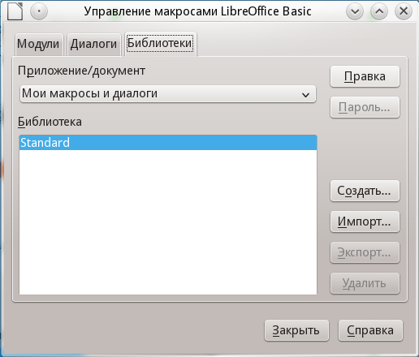
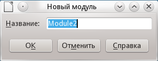
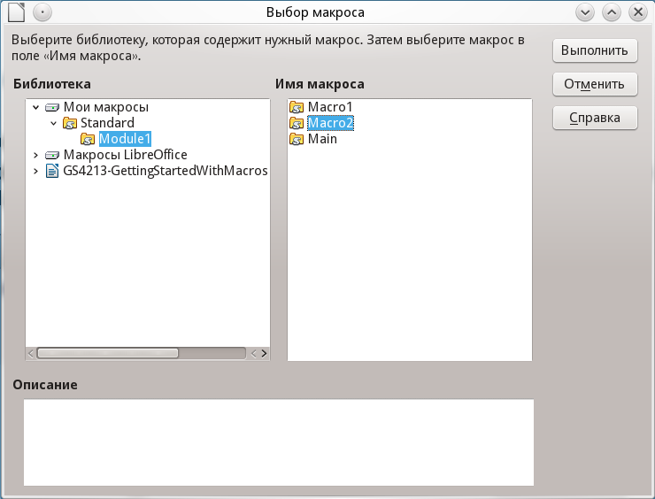

.. meta::
   :description: Глава 13 – Работа с макросами в LibreOffice
   :keywords: LibreOffice, Writer, Impress, Calc, Math, Base, Draw, либреоффис, macros, макрос

.. Список автозамен

.. |br| raw:: html

    

.. _macros:

Глава 13 – Работа с макросами в LibreOffice
==================================================

Введение
-----------

Чаще всего, макрос это сохранённая последовательность команд или нажатий клавиш, предназначенная для последующего использования. Например, можно сохранить и «впечатывать» свой адрес. Язык программирования LibreOffice очень гибок и позволяет автоматизировать как простые, так и сложные задачи. Макросы часто используются, когда мы хотим повторять ещё и ещё раз определённую последовательность действий в схожих условиях.

Макросы в LibreOffice обычно записываются на языке, называемом LibreOffice Basic или просто Basic. Конечно можно долго изучить Basic и наконец начать программировать, но это руководство поможет вам сразу решать простые задачи. Начинающие пользователи часто с успехом применяют макросы, написанные кем-либо другим. Также, можно использовать функцию записи макросов, чтобы сохранить последовательность нажатий клавиш и использовать её ещё раз.

Большинство действий в LibreOffice выполняются путём отправки команды (посылки команды, dispatching a command), которая 
перехватывается и выполняется. Функция записи макросов позволяет записать непосредственные команды, 
которые обрабатываются (смотрите `Платформа диспетчера`_).

Ваш первый макрос
-----------------

Добавление макроса
~~~~~~~~~~~~~~~~~~~

Первый шаг в изучении программирования макросов, это найти и использовать существующие макросы. В этом разделе подразумевается, что у вас уже имеется макрос, который вы хотите использовать. Вы могли найти его в Интернете или в какой-нибудь книге. Рассмотрим пример 1. Чтобы записать этот макрос, вы должны предварительно создать библиотеку и модуль, и уже в модуле написать текст макроса, смотрите `Организация макросов`_.

Пример 1: Простой макрос, который пишет "Hello, World":

.. code-block:: basic
	
	Sub HelloMacro
	  Print "Hello, World"
	End Sub

Чтобы создать библиотеку, необходимо выполнить следующие шаги:

1) Выберете пункты главного меню :menuselection:`Сервис --> Макросы --> Управление макросами --> LibreOffice Basic`, чтобы открыть диалог работы с макросами Libreoffice Basic.

.. _ch13-lo-screen-001:

.. figure:: _static/chapter13/ch13-lo-screen-001.png
    :scale: 50%
    :align: center
    :alt: Диалог работы с  макросами LibreOffice Basic
    
    Диалог работы с  макросами LibreOffice Basic

2) Нажмите *Управление*, чтобы открыть диалог организатора макросов и выберите вкладку *Библиотеки*.
3) Выберите в выпадающем списке *Приложение/Документ* пункт *Мои макросы и диалоги*.

.. _ch13-lo-screen-002:

    
    Диалог организатора макросов LibreOffice Basic
    
4) Нажмите *Создать*, чтобы открыть диалог создания новой библиотеки.
5) Введите имя библиотеки, например, *TestLibrary* и нажмите *OK*.
6) Выберите вкладку *Модули*.
7) В списке модулей раскройте *Мои макросы* и выберите *TestLibrary*. Модуль с именем *Module1* уже существует, он может содержать ваши макросы. Если необходимо, том можно нажать *Создать*, чтобы создать другой модуль в библиотеке.
8) Выберите *Module1* или новый модуль, который вы создали и нажмите *Правка*, чтобы открыть интегрированную среду разработки (IDE). Интегрированная среда разработки это текстовый редактор, включённый в LibreOffice, который позволяет создавать и редактировать макросы.

.. _ch13-lo-screen-003:

.. figure:: _static/chapter13/ch13-lo-screen-003.png
    :scale: 50%
    :align: center
    :alt: Интегрированная среда разработки макросов
    
    Интегрированная среда разработки макросов

9) После создания нового модуля он содержит комментарий и пустой макрос, названный *Main*, который ничего не делает.
10) Добавьте новый макрос или до ``Sub Main`` или после ``End Sub``. В примере ниже приведен новый макрос, который был добавлен до ``Sub Main``.

Пример 2: ``Module1`` после добавления нового макроса:

.. code-block:: basic

	REM  *****  BASIC  *****

	Sub HelloMacro
	  Print "Привет"
	End Sub

	Sub Main

	End Sub

11) Нажмите на значок *Компилировать* |ch13-lo-screen-004| на панели инструментов, чтобы откомпилировать макрос.

12) Поставьте курсор в процедуру ``HelloMacro`` и нажмите на значок *Выполнить BASIC* |ch13-lo-screen-005| на панели инструментов или нажмите клавишу ``F5``, чтобы выполнить ``HelloMacro`` в модуле. Откроется маленький диалог со словом ``Привет``. Если курсор не находится внутри процедуры ``Sub`` или функции ``Function``, откроется диалог выбора макроса для запуска.

13) Нажмите *OK*, чтобы закрыть диалог.
14) Чтобы выбрать и выполнить любой макрос в данном модуле, нажмите значок *Выбрать макрос* |ch13-lo-screen-006| на стандартной панели инструментов или выберите :menuselection:`Сервис --> Макросы --> Управление макросами --> LibreOffice Basic`.

        
15) Выберите макрос и нажмите *Выполнить*.

Запись макросов
~~~~~~~~~~~~~~~~~~~

Если вы хотите многократно ввести одинаковую информацию, вы можете скопировать эту информацию после того, как она введена в первый раз, затем вставлять эту информацию в ваш документ каждый раз по мере необходимости. Однако, если вы скопировали в буфер обмена что-то ещё, содержимое буфера меняется. Это означает, что вы должны заново скопировать вашу повторяющуюся информацию. Чтобы обойти эту проблему, вы можете создать макрос, который в процессе выполнения вводит нужную вам информацию.

.. note:: Для некоторых типов многократно вводимой в документах информации более удобно создать файл автотекста. Описание работы с автотекстом смотрите в справочной системе и в главе :ref:`using-styles-and-templates` данного руководства.

1) Убедитесь, что функция записи макросов активизирована, выбрав :menuselection:`Сервис --> Параметры --> LibreOffice --> Расширенные возможности`. Установите флажок *Включить запись макросов*. По умолчанию эта функция отключена, когда LibreOffice впервые установлен на ваш компьютер.

2) Выберите :menuselection:`Сервис --> Макросы --> Записать макрос` из главного меню, чтобы запустить запись макроса. Появится маленький диалог, подтверждающий, что LibreOffice записывает ваши действия.

.. _ch13-lo-screen-007:

    
    Диалог записи макроса

3) Наберите желаемую информацию или выполните необходимые действия. Например, напечатайте ваше имя.

4) Нажмите *Завершить запись* в маленьком диалоге, чтобы остановить запись, и появится диалог работы с макросами LibreOffice.

5) Откройте библиотечный контейнер *Мои макросы*.

6) Найдите библиотеку с именем ``Standard`` в *Моих макросах*. Обратите внимание, что каждый библиотечный контейнер содержит библиотеку ``Standard``.

7) Выберите библиотеку ``Standard`` и нажмите *Создать модуль*, чтобы создать новый модуль, содержащий макросы. Откроется диалог создания модуля.

.. _ch13-lo-screen-008:

    
    Диалог создания модуля
    
8) Задайте название для нового модуля, например, *Recorded* и нажмите *OK*, чтобы создать модуль. В диалоге работы с макросами теперь виден этот новый модуль в составе библиотеки ``Standard``.

9) В поле *Имя макроса* напечатайте имя для макроса, который вы только что записали, например, ``EnterMyName``.
10) Нажмите *Записать*, чтобы сохранить макрос и закрыть диалог работы с макросами.
11) Если вы верно выполнили все шаги, описанные выше, библиотека ``Standard`` теперь содержит модуль ``Recorded``, и этот модуль содержит макрос ``EnterMyName``.

.. note:: Когда LibreOffice создаёт новый модуль, в этот модуль автоматически добавляется процедура с именем ``Main``.

Запуск макроса
~~~~~~~~~~~~~~~~~~~

1) Выберите :menuselection:`Сервис --> Макросы --> Выполнить макрос`, чтобы открыть диалог выбора макроса.
2) Например, выберите ваш только что созданный макрос ``EnterMyName`` и нажмите *Выполнить*.
3) Можно также вызвать из главного меню :menuselection:`Сервис --> Макросы --> Управление макросами --> LibreOffice Basic`, чтобы открыть диалог работы с макросами, выбрать ваш макрос и нажать *Выполнить*.

.. _ch13-lo-screen-009:

    
    Диалог выбора макроса

Просмотр и редактирование макросов
~~~~~~~~~~~~~~~~~~~~~~~~~~~~~~~~~~~~~~

Чтобы просмотреть или отредактировать созданные вами макросы выполните:

1) :menuselection:`Сервис --> Макросы --> Управление макросами --> LibreOffice Basic`, чтобы открыть диалог работы с макросами.
2) Выберите ваш новый макрос ``EnterMyName`` и нажмите *Правка*, чтобы открыть макрос в интегрированной среде разработки. 

Макрос EnterMyName не так уж сложен, как может показаться. Изучение нескольких вещей существенно поможет в понимании макросов. Начнём сначала и посмотрим на самую первую строку примера.

Макрос ``EnterMyName`` не так уж сложен, как может показаться. Изучение нескольких вещей существенно поможет в понимании макросов. Начнём сначала и посмотрим на самую первую строку примера.

Пример 3: Сгенерированный макрос ``EnterMyname``:

.. code-block:: basic

	REM  *****  BASIC  *****
	Sub Main

	End Sub

	sub EnterMyName
	rem -------------------------------------------------------------
	rem define variables (определение переменных)
	dim document   as object
	dim dispatcher as object
	rem -------------------------------------------------------------
	rem get access to the document (получение доступа к документу)
	document   = ThisComponent.CurrentController.Frame
	dispatcher = createUnoService("com.sun.star.frame.DispatchHelper")

	rem -------------------------------------------------------------
	dim args1(0) as new com.sun.star.beans.PropertyValue
	args1(0).Name = "Text"
	args1(0).Value = "Иван Сидорович Петров"

	dispatcher.executeDispatch(document, ".uno:InsertText", "", 0, args1())
	end sub

Комментарии
""""""""""""""""""""""""""

Подробные комментарии являются необходимой частью программы. Без комментариев и сам программист зачастую забывает, что же он написал несколько недель (а может и месяцев или лет) тому назад.

Все комментарии в макросах начинаются с ключевого слова ``REM``. Весь текст строки после REM игнорируется компьютером при выполнении макроса. Можно также использовать символ одинарной кавычки (``'``), чтобы начать комментарий.

Ключевые слова в LibreOffice Basic могут быть записаны в любом регистре, таким образом ``REM``, ``Rem``, и ``rem`` могут начинать комментарий. Если вы используете символические константы, определяемые в программном интерфейсе приложения (Application Programming Interface, API), безопаснее считать, что имена чувствительны к регистру. Символические константы не описаны в данном руководстве, они не нужны, когда вы используете функцию записи макросов в LibreOffice.

Определение процедур
""""""""""""""""""""""""""

Отдельные макросы сохраняются в процедурах, которые начинаются с ключевого слова ``SUB``. Окончание процедуры обозначается ``END SUB``. Код модуля в примере 3 начинается с определения процедуры, названной Main, в которой нет ничего, и она ничего не делает. Следующая процедура, ``EnterMyName``, содержит сгенерированный код вашего макроса.

.. note:: Когда LibreOffice создаёт новый модуль, в этот модуль всегда автоматически добавляется процедура с именем ``Main``.

Существует много полезной информации, не вошедшей в данное руководство, однако знание о ней весьма интересно:

* Вы можете написать процедуры, которые используют некоторые "входные" величины, называемые аргументами. Однако, функция записи макросов не предоставляет возможности использовать аргументы в процедурах.
* Помимо процедур существуют также функции, которые могут "возвращать" значение. Функции определяются ключевым словом ``FUNCTION`` в начале. Однако, записанные макросы, – это всегда процедуры, а не функции.

Определение переменных
""""""""""""""""""""""""""

Вы можете записать информацию на листе бумаги и позднее воспользоваться этой информацией. Переменные, подобно листу бумаги, содержат информацию, которую можно изменять или читать. Ключевое слово ``Dim`` используется для описания типа переменной и для задания размерности массивов. Оператор ``dim`` в макросе ``EnterMyName`` используется подобно подготовке листа бумаги для записи информации.

В макросе ``EnterMyName`` переменные document и dispatcher определены с типом object (объект). Другие часто используемые типы переменных включают string (строка), integer (целое) и date (дата). Третья переменная с именем args1 – это массив значений свойств. Массивы это переменные, содержащие несколько величин, подобно тому, как в одной книге содержится несколько страниц. Величины в массивах обычно нумеруются начиная с нуля. Число в скобках задаёт максимальный номер, используемый для доступа к элементу массива. В данном примере в массиве содержится только одна величина, и она имеет номер ноль.

Как это работает
""""""""""""""""""""""""""

Разберёмся более подробно с кодом макроса ``EnterMyName``. Может быть вы и не поймёте всех тонкостей, но разбор каждой строки в коде позволит вам осознать то, как работают макросы.

Определение начала макроса:

.. code-block:: basic
	
	sub EnterMyName

Определение переменной:

.. code-block:: basic

	dim document as object

Определение переменной:

.. code-block:: basic

	dim dispatcher as object
	
Объект ThisComponent ссылается на текущий документ.

.. code-block:: basic
	
	document = ThisComponent.CurrentController.Frame

``CurrentController`` – свойство, ссылающиеся на службу, которая управляет документом. Например, когда вы печатаете на клавиатуре, – это текущий процесс, который управляет вводом в документ того, что вы напечатали. ``CurrentController`` затем отправляет изменения в блок данных документа.

``Frame`` – свойство службы, которое возвращает основной блок данных документа. Таким образом, переменная с именем document ссылается на блок данных документа, который получает команды диспетчера.

.. code-block:: basic

	dispatcher = createUnoService("com.sun.star.frame.DispatchHelper")

Большинство задач в LibreOffice выполняется посредством диспетчеризации (отправки) команды (dispatching a command). LibreOffice включает службу ``DispatchHelper``, которая чаще всего применяется при использовании диспетчера в макросах. Метод CreateUnoService получает имя службы и пытается создать экземпляр этой службы. По завершении метода, переменная dispatcher содержит ссылку на службу ``DispatchHelper``.

.. code-block:: basic

	dim args1(0) as new com.sun.star.beans.PropertyValue

Определяет массив свойств. Каждое свойство имеет имя и значение. Другими словами, это пара имя/значение. Созданный массив содержит одно свойства, доступное по номеру ноль.

.. code-block:: basic

	args1(0).Name = "Text"
	args1(0).Value = "Иван Сидорович Петров"
	
Задаём для свойства имя "Text" и значение "Иван Сидорович Петров", это значение и есть тот самый текст, который будет вставлен, когда макрос сработает.

.. code-block:: basic
	
	dispatcher.executeDispatch(document, ".uno:InsertText", "", 0, args1())

Вот тут и случается чудо. Служба ``DispatchHelper`` посылает блоку данных документа (ссылка на который сохранена в переменной document) команду ``.uno:InsertText``. Описание следующих двух аргументов выходят за рамки данного руководства. Последний аргумент – это массив свойств, используемый для выполнения команды ``InsertText``.

.. code-block:: basic

	end sub

Последняя строка кода, конец процедуры.

----------

Создание макроса
----------------

Если вы задумали создать макрос, то перед началом записи очень важно ответить на два вопроса:

1) Ваша задача может быть записана как простая последовательность команд?
2) Могут быть отдельные шаги расположены так, чтобы последняя команда оставляла курсор готовым к следующей команде или вводу текста или данных в документ?

Более сложный пример макроса
~~~~~~~~~~~~~~~~~~~~~~~~~~~~~

Быстрый запуск макросов
~~~~~~~~~~~~~~~~~~~~~~~~~~~~~

---------------

Проблемы с функцией записи макросов
-------------------------------------

Платформа диспетчера
~~~~~~~~~~~~~~~~~~~~

Как при записи макросов работает диспетчер
~~~~~~~~~~~~~~~~~~~~~~~~~~~~~~~~~~~~~~~~~~

Другие средства
~~~~~~~~~~~~~~~

----------

Организация макросов
----------------------------

Где сохраняются макросы?
~~~~~~~~~~~~~~~~~~~~~~~~

Импорт макросов
~~~~~~~~~~~~~~~~~~~~~~~~

Загрузка макросов для импорта
~~~~~~~~~~~~~~~~~~~~~~~~~~~~~

---------

Как запускать макросы
-------------------------------------

Панели инструментов, пункты меню и быстрые клавиши
~~~~~~~~~~~~~~~~~~~~~~~~~~~~~~~~~~~~~~~~~~~~~~~~~~

События
~~~~~~~

Расширения
----------------------------

Самостоятельное программирование 
--------------------------------

Где ещё найти информацию
-------------------------------

Макросы, которые включены в LibreOffice
~~~~~~~~~~~~~~~~~~~~~~~~~~~~~~~~~~~~~~~~

Интернет ресурсы
~~~~~~~~~~~~~~~~~~~~~~~~~~~~~~~~~~~~~~~~

Печатные и электронные материалы
~~~~~~~~~~~~~~~~~~~~~~~~~~~~~~~~~~~~~~~~
