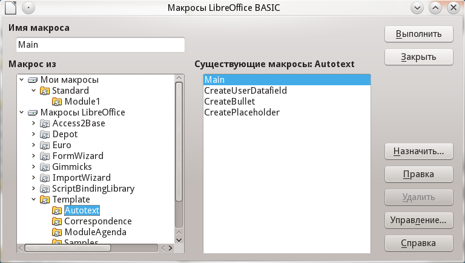
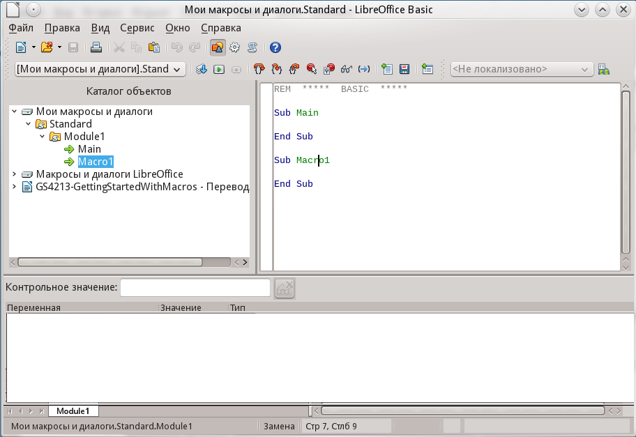
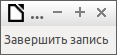

.. meta::
   :description: Глава 13 – Работа с макросами в LibreOffice
   :keywords: LibreOffice, Writer, Impress, Calc, Math, Base, Draw, либреоффис, macros, макрос

.. Список автозамен

.. |br| raw:: html

    

.. _macros:

Глава 13 – Работа с макросами в LibreOffice
==================================================

Введение
-----------

Чаще всего, макрос это сохранённая последовательность команд или нажатий клавиш, предназначенная для последующего использования. Например, можно сохранить и «впечатывать» свой адрес. Язык программирования LibreOffice очень гибок и позволяет автоматизировать как простые, так и сложные задачи. Макросы часто используются, когда мы хотим повторять ещё и ещё раз определённую последовательность действий в схожих условиях.

Макросы в LibreOffice обычно записываются на языке, называемом LibreOffice Basic или просто Basic. Конечно можно долго изучить Basic и наконец начать программировать, но это руководство поможет вам сразу решать простые задачи. Начинающие пользователи часто с успехом применяют макросы, написанные кем-либо другим. Также, можно использовать функцию записи макросов, чтобы сохранить последовательность нажатий клавиш и использовать её ещё раз.

Большинство действий в LibreOffice выполняются путём отправки команды (посылки команды, dispatching a command), которая 
перехватывается и выполняется. Функция записи макросов позволяет записать непосредственные команды, 
которые обрабатываются (смотрите `Платформа диспетчера`_).

Ваш первый макрос
-----------------

Добавление макроса
~~~~~~~~~~~~~~~~~~~

Первый шаг в изучении программирования макросов, это найти и использовать существующие макросы. В этом разделе подразумевается, что у вас уже имеется макрос, который вы хотите использовать. Вы могли найти его в Интернете или в какой-нибудь книге. Рассмотрим пример 1. Чтобы записать этот макрос, вы должны предварительно создать библиотеку и модуль, и уже в модуле написать текст макроса, смотрите `Организация макросов`_.

Пример 1: Простой макрос, который пишет "Hello, World"

.. code-block:: basic
	
	Sub HelloMacro
	  Print "Hello, World"
	End Sub

Чтобы создать библиотеку, необходимо выполнить следующие шаги:

1) Выберете пункты главного меню :menuselection:`Сервис --> Макросы --> Управление макросами --> LibreOffice Basic`, чтобы открыть диалог работы с макросами Libreoffice Basic.

.. _ch13-lo-screen-001:

    
    Диалог работы с  макросами LibreOffice Basic

2) Нажмите *Управление*, чтобы открыть диалог организатора макросов и выберите вкладку *Библиотеки*.
3) Выберите в выпадающем списке *Приложение/Документ* пункт *Мои макросы и диалоги*.

.. _ch13-lo-screen-002:

.. figure:: _static/chapter13/ch13-lo-screen-002.png
    :scale: 50%
    :align: center
    :alt: Диалог организатора макросов LibreOffice Basic
    
    Диалог организатора макросов LibreOffice Basic
    
4) Нажмите *Создать*, чтобы открыть диалог создания новой библиотеки.
5) Введите имя библиотеки, например, *TestLibrary* и нажмите *OK*.
6) Выберите вкладку *Модули*.
7) В списке модулей раскройте *Мои макросы* и выберите *TestLibrary*. Модуль с именем *Module1* уже существует, он может содержать ваши макросы. Если необходимо, том можно нажать *Создать*, чтобы создать другой модуль в библиотеке.
8) Выберите *Module1* или новый модуль, который вы создали и нажмите *Правка*, чтобы открыть интегрированную среду разработки (IDE). Интегрированная среда разработки это текстовый редактор, включённый в LibreOffice, который позволяет создавать и редактировать макросы.

.. _ch13-lo-screen-003:

    
    Интегрированная среда разработки макросов

9) После создания нового модуля он содержит комментарий и пустой макрос, названный *Main*, который ничего не делает.
10) Добавьте новый макрос или до ``Sub Main`` или после ``End Sub``. В примере ниже приведен новый макрос, который был добавлен до ``Sub Main``.

.. code-block:: basic

	REM  *****  BASIC  *****

	Sub HelloMacro
	  Print "Привет"
	End Sub

	Sub Main

	End Sub

11) Нажмите на значок *Компилировать* |ch13-lo-screen-004| на панели инструментов, чтобы откомпилировать макрос.

.. |ch13-lo-screen-004| image:: _static/chapter13/ch13-lo-screen-004.png
        :scale: 80% 

12) Поставьте курсор в процедуру ``HelloMacro`` и нажмите на значок *Выполнить BASIC* |ch13-lo-screen-005| на панели инструментов или нажмите клавишу ``F5``, чтобы выполнить ``HelloMacro`` в модуле. Откроется маленький диалог со словом ``Привет``. Если курсор не находится внутри процедуры ``Sub`` или функции ``Function``, откроется диалог выбора макроса для запуска.

13) Нажмите *OK*, чтобы закрыть диалог.
14) Чтобы выбрать и выполнить любой макрос в данном модуле, нажмите значок *Выбрать макрос* |ch13-lo-screen-006| на стандартной панели инструментов или выберите :menuselection:`Сервис --> Макросы --> Управление макросами --> LibreOffice Basic`.

        
15) Выберите макрос и нажмите *Выполнить*.

Запись макросов
~~~~~~~~~~~~~~~~~~~

Если вы хотите многократно ввести одинаковую информацию, вы можете скопировать эту информацию после того, как она введена в первый раз, затем вставлять эту информацию в ваш документ каждый раз по мере необходимости. Однако, если вы скопировали в буфер обмена что-то ещё, содержимое буфера меняется. Это означает, что вы должны заново скопировать вашу повторяющуюся информацию. Чтобы обойти эту проблему, вы можете создать макрос, который в процессе выполнения вводит нужную вам информацию.

.. note:: Для некоторых типов многократно вводимой в документах информации более удобно создать файл автотекста. Описание работы с автотекстом смотрите в справочной системе и в главе :ref:`using-styles-and-templates` данного руководства.

1) Убедитесь, что функция записи макросов активизирована, выбрав :menuselection:`Сервис --> Параметры --> LibreOffice --> Расширенные возможности`. Установите флажок *Включить запись макросов*. По умолчанию эта функция отключена, когда LibreOffice впервые установлен на ваш компьютер.

2) Выберите :menuselection:`Сервис --> Макросы --> Записать макрос` из главного меню, чтобы запустить запись макроса. Появится маленький диалог, подтверждающий, что LibreOffice записывает ваши действия.

.. _ch13-lo-screen-007:

    
    Диалог записи макроса

3) Наберите желаемую информацию или выполните необходимые действия. Например, напечатайте ваше имя.

4) Нажмите *Завершить запись* в маленьком диалоге, чтобы остановить запись, и появится диалог работы с макросами LibreOffice.

5) Откройте библиотечный контейнер *Мои макросы*.

6) Найдите библиотеку с именем ``Standard`` в *Моих макросах*. Обратите внимание, что каждый библиотечный контейнер содержит библиотеку ``Standard``.

7) Выберите библиотеку ``Standard`` и нажмите *Создать модуль*, чтобы создать новый модуль, содержащий макросы. Откроется диалог создания модуля.

.. _ch13-lo-screen-008:

    
    Диалог создания модуля
    
8) Задайте название для нового модуля, например, *Recorded* и нажмите *OK*, чтобы создать модуль. В диалоге работы с макросами теперь виден этот новый модуль в составе библиотеки ``Standard``.

9) В поле *Имя макроса* напечатайте имя для макроса, который вы только что записали, например, ``EnterMyName``.
10) Нажмите *Записать*, чтобы сохранить макрос и закрыть диалог работы с макросами.
11) Если вы верно выполнили все шаги, описанные выше, библиотека ``Standard`` теперь содержит модуль ``Recorded``, и этот модуль содержит макрос ``EnterMyName``.

.. note:: Когда LibreOffice создаёт новый модуль, в этот модуль автоматически добавляется процедура с именем ``Main``.

Запуск макроса
~~~~~~~~~~~~~~~~~~~

1) Выберите :menuselection:`Сервис --> Макросы --> Выполнить макрос`, чтобы открыть диалог выбора макроса.
2) Например, выберите ваш только что созданный макрос ``EnterMyName`` и нажмите *Выполнить*.
3) Можно также вызвать из главного меню :menuselection:`Сервис --> Макросы --> Управление макросами --> LibreOffice Basic`, чтобы открыть диалог работы с макросами, выбрать ваш макрос и нажать *Выполнить*.

.. _ch13-lo-screen-009:

.. figure:: _static/chapter13/ch13-lo-screen-009.png
    :scale: 50%
    :align: center
    :alt: Диалог выбора макроса
    
    Диалог выбора макроса

Просмотр и редактирование макросов
~~~~~~~~~~~~~~~~~~~~~~~~~~~~~~~~~~~~~~

Комментарии
""""""""""""""""""""""""""

Определение процедур
""""""""""""""""""""""""""

Определение переменных
""""""""""""""""""""""""""

Как это работает
""""""""""""""""""""""""""

----------

Создание макроса
----------------

Более сложный пример макроса
~~~~~~~~~~~~~~~~~~~~~~~~~~~~~

Быстрый запуск макросов
~~~~~~~~~~~~~~~~~~~~~~~~~~~~~

---------------

Проблемы с функцией записи макросов
-------------------------------------

Платформа диспетчера
~~~~~~~~~~~~~~~~~~~~

Как при записи макросов работает диспетчер
~~~~~~~~~~~~~~~~~~~~~~~~~~~~~~~~~~~~~~~~~~

Другие средства
~~~~~~~~~~~~~~~

----------

Организация макросов
----------------------------

Где сохраняются макросы?
~~~~~~~~~~~~~~~~~~~~~~~~

Импорт макросов
~~~~~~~~~~~~~~~~~~~~~~~~

Загрузка макросов для импорта
~~~~~~~~~~~~~~~~~~~~~~~~~~~~~

---------

Как запускать макросы
-------------------------------------

Панели инструментов, пункты меню и быстрые клавиши
~~~~~~~~~~~~~~~~~~~~~~~~~~~~~~~~~~~~~~~~~~~~~~~~~~

События
~~~~~~~

Расширения
----------------------------

Самостоятельное программирование 
--------------------------------

Где ещё найти информацию
-------------------------------

Макросы, которые включены в LibreOffice
~~~~~~~~~~~~~~~~~~~~~~~~~~~~~~~~~~~~~~~~

Интернет ресурсы
~~~~~~~~~~~~~~~~~~~~~~~~~~~~~~~~~~~~~~~~

Печатные и электронные материалы
~~~~~~~~~~~~~~~~~~~~~~~~~~~~~~~~~~~~~~~~
