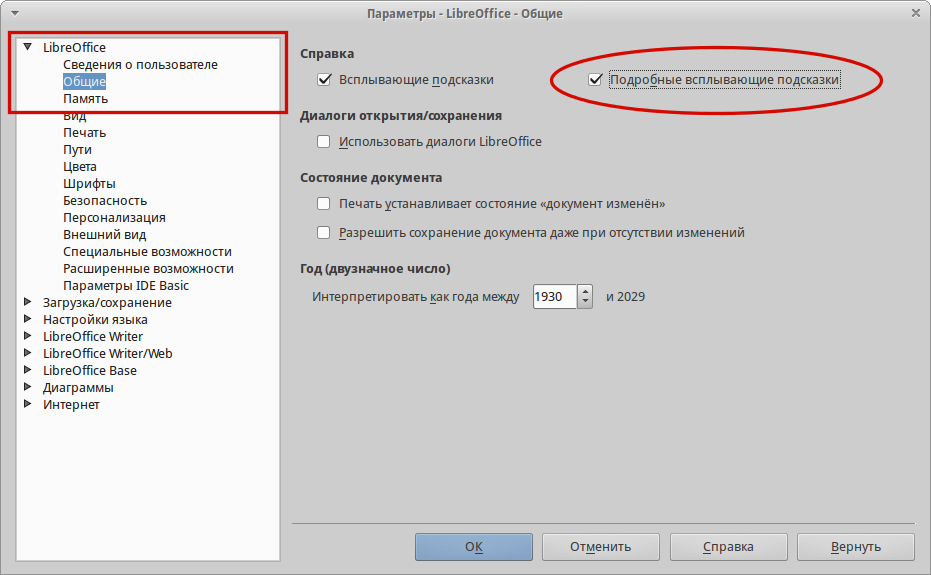

.. meta::
   :description: Краткое руководство по LibreOffice 
   :keywords: LibreOffice, Writer, Impress, Calc, Math, Base, Draw, либреоффис, Предисловие

Предисловие
===========

Данное руководство не является дословным переводом официального англоязычного краткого руководства *Getting Started with LibreOffice 4.2*. Часть разделов была полностью переписана, к некоторым разделам добавлены дополнительные снимки экрана и пояснения.

Для кого эта книга?
-------------------

Книга предназначена для тех, кто не знаком с офисными пакетами или знаком с иными программами данного класса, и желает максимально быстро приступить к работе с LibreOffice. При этом предполагается, что читатель знаком с основами работы на компьютере, такими, как запуск программ, открытие и сохранение файлов и тому подобное.

О чем эта книга?
----------------

В книге рассматриваются основы работы в модулях LibreOffice:

* Writer (текстовый процессор);
* Calc (электронные таблицы);
* Impress (презентации);
* Draw (векторная графика);
* Base (базы данных);
* Math (редактор формул);

Также она охватывает некоторые особенности, общие для всех компонентов такие, как установка и настройка, стили и шаблоны, запись макросов и печать. Более подробную информацию ищите в руководствах по отдельным компонентам [#]_.

.. [#] На данный момент на русском языке доступно только руководство по модулю Math (http://librerussia.blogspot.ru/2014/10/libreoffice-math.html).

Где можно получить дополнительную помощь?
-----------------------------------------

Данное руководство содержит ответы на многие вопросы, как технического, так и юридического характера. LibreOffice имеет встроенную систему справки, доступной в том числе и на русском языке. Также на официальных ресурсах в сети интернет организована онлайн поддержка пользователей.

Справочная система
~~~~~~~~~~~~~~~~~~

LibreOffice поставляется с обширной :guilabel:`Справкой`. Это первая линия технической поддержки при использовании LibreOffice.
Для отображения :guilabel:`Справки` нажмите ``F1`` или выберите пункт :guilabel:`Справка по LibreOffice` в меню :guilabel:`Справка`. Кроме того, вы можете активировать всплывающие подсказки (меню :menuselection:`Сервис --> Параметры --> LibreOffice --> Общие`). 

.. _gs-preface-002:

    Включение подробных всплывающих подсказок

Если подсказки включены, наведите курсор мыши на любой значок на панели инструментов и немного подождите, появится небольшая подсказка с описанием основных функций, выполняемых при нажатии на значок. Для более подробной информации выберите пункт :guilabel:`Что это такое?` из меню :guilabel:`Справка` и наведите курсор на значок.

.. _gs-preface-003:

    Подробные всплывающие подсказки

Бесплатная онлайн поддержка
~~~~~~~~~~~~~~~~~~~~~~~~~~~

Сообщество LibreOffice не только разрабатывает программное обеспечение, но и обеспечивает бесплатную поддержку пользователей на **добровольной** основе. Пользователи могут получить всестороннюю онлайн поддержку через почтовые списки рассылки и различные сайты, основанные пользователями.

Список доступных ресурсов приведен в разделе :ref:`libreoffice-community`. Более подробную информации обо всех ресурсах инфраструктуры LibreOffice смотрите на http://infineconomics.blogspot.ru/2014/12/libreoffice-infra.html.

Платная поддержка и обучение
~~~~~~~~~~~~~~~~~~~~~~~~~~~~

Кроме того, вы можете приобрести платные услуги поддержки. Данные услуги могут быть приобретены у организаций, специализирующихся на установке и поддержке LibreOffice [#]_.

.. [#] На сегодняшний день на территории Российской Федерации нет официально сертифицированных The Document Foundation специалистов и организаций. Подробнее о сертификации, проводимой The Document Foundation, смотрите на http://www.documentfoundation.org/certification/.

Отличия
-------

LibreOffice доступен в операционных системах Linux, Windows и Mac OS X, каждая из которых имеет несколько версий и может быть дополнительно изменена пользователем (шрифты, цвета, темы, оконный менеджер). Окончательная вёрстка этого руководства происходила в операционной системе Xubuntu GNU/Linux, поэтому некоторые элементы могут отличаться от тех, которые есть на вашем компьютере.

Иллюстрации
~~~~~~~~~~~

Некоторые элементы интерфейса, показанные на снимках экрана, могут внешне отличаться от того, что вы видите в своей операционной системе. 

Кроме того, некоторые диалоги могут различаться из-за настроек самого LibreOffice. Вы можете использовать диалоги из вашей операционной системы (по умолчанию), либо диалоги, поставляемые с LibreOffice. Включить использование диалогов LibreOffice можно следующим образом (это не обязательно):

1. В :abbr:`ОС(Операционной Системе)` Linux или Windows откройте меню :menuselection:`Сервис --> Параметры --> LibreOffice --> Общие`;
2. В Mac OS откройте меню :menuselection:`LibreOffice --> Параметры --> Общие`;
3. В разделе :guilabel:`Диалоги открытия/сохранения` выберите вариант :guilabel:`Использовать диалоги LibreOffice`;
4. Нажмите :guilabel:`OK` чтобы сохранить настройки и закрыть окно настроек.

.. _gs-preface-004:

.. figure:: _static/gs-preface-004.png
    :scale: 40%
    :align: center
    :alt: Диалоги LibreOffice

    Диалоги LibreOffice

Значки
~~~~~~

Значки, использованные для обозначения некоторых функций, доступных в LibreOffice, могут отличаться от тех, которые вы видите в данном руководстве. Значки в данном руководстве были взяты из LibreOffice с установленными темами значков *Human*.

По умолчанию в LibreOffice доступны несколько наборов значков, чтобы изменить стандартный набор: 

1. В :abbr:`ОС(Операционной Системе)` Linux или Windows, откройте меню :menuselection:`Сервис --> Параметры --> LibreOffice --> Вид`;
2. В Mac OS, откройте меню :menuselection:`LibreOffice --> Параметры --> Вид`;
3. В разделе :menuselection:`Пользовательский интерфейс --> Размер и стиль значков`` выберите из выпадающего списка один из доступных наборов;
4. Нажмите кнопку :guilabel:`ОК` для сохранения настроек и выхода из меню.

Использование LibreOffice в Mac OS
----------------------------------

Некоторые элементы меню или или сочетания клавиш отличаются в операционной системе Mac OS от операционных систем Linux и Windows. В таблице ниже приведены некоторые соответствия. Для получения более детальной информации об отличиях смотрите :guilabel:`Справку`.

.. list-table:: Таблица соответствий 
   :widths: 15 15 15
   :header-rows: 1

   * - Windows или Linux
     - Эквивалент в MacOS
     - Результат
   * - Меню :menuselection:`Сервис --> Параметры`
     - :menuselection:`LibreOffice --> Параметры`
     - Доступ к настройкам
   * - Щелчок правой кнопкой мыши
     - ``Control + Сlick`` и/или щелчок правой кнопкой мыши в зависимости от настроек :abbr:`ОС(Операционной Системе)`
     - Открывает контекстное меню
   * - Нажатие клавиши ``Ctrl (Control)`` на клавиатуре
     - ``⌘(Command)``
     - Используется с другими клавишами (как модификатор)
   * - Нажатие клавиши ``F5`` на клавиатуре
     - ``Shift + ⌘Command + F5``
     - Открывает окно навигатора (по документу)
   * - Нажатие клавиши ``F11`` на клавиатуре
     - ``⌘Command + T``
     - Открывает окно стилей и форматирования

Элементы управления LibreOffice
---------------------------------

Термины, используемые в LibreOffice для описания большей части пользовательского интерфейса (это та часть программы, которую вы видите на экране и при помощи которой взаимодействуете с программой), такие же, как для большинства других программ.

Диалоговое окно — это особый вид окна. Его целью является получение информации от вас при помощи ввода значений в специальное поле, либо информирование вас о чем-либо, либо и то и другое одновременно. Технические наименования стандартных элементов управления представлены на рисунке :ref:`gs-preface-001`. 

.. _gs-preface-001:

    Элементы интерфейса

1. Вкладки;
2. Радио-кнопка (может быть активирован только один из предлагаемых вариантов);
3. Флажок, галочка или маркер (допускает одновременный выбор нескольких вариантов).
4. Поле счетчика (нажимайте стрелки вверх и вниз чтобы выбрать число указанное в поле рядом или введите число с клавиатуры непосредственно в поле);
5. Миниатюра или предварительный просмотр;
6. Раскрывающийся (выпадающий) список, из которого можно выбрать значение;
7. Кнопки.

В большинстве случаев, если открыто диалоговое окно, работать с документом нельзя до закрытия диалога. После закрытия диалогового окна (используйте кнопку :guilabel:`ОК` или иную  кнопку сохранения ваших изменений и закрытия диалога) можно снова работать непосредственно с документом.

Некоторые диалоги допускают одновременную работу с диалогом и открытым документом. Примером такого диалога является окно :guilabel:`Найти и заменить`.

Кем написано руководство?
-------------------------

Эта книга написана добровольцами из сообщества LibreOffice. Над руководством работали:

* Роман Кузнецов (перевод, адаптация, вычитка)
* Валерий Гончарук (перевод, адаптация, вычитка)
* Дмитрий Мажарцев (адаптация, вычитка, вёрстка) 

.. _copyleft:

Авторские права
~~~~~~~~~~~~~~~

Руководство распространяется на условиях лицензии «Attribution-ShareAlike» («Атрибуция — На тех же условиях») 4.0 Всемирная (CC BY-SA 4.0) [#]_.

.. [#] http://creativecommons.org/licenses/by-sa/4.0/deed.ru.

Версия программного обеспечения
~~~~~~~~~~~~~~~~~~~~~~~~~~~~~~~~~~~~~~~~~~~~~~~~~

Версия программного обеспечения — LibreOffice 4.3.3.2.

Обратная связь
~~~~~~~~~~~~~~

* Связаться с командой авторов: LibreRussia@gmail.com

Часто задаваемые вопросы
------------------------

**Под какой лицензией выпускается LibreOffice?**

Лицензия доступна на сайте LibreOffice: http://www.libreoffice.org/download/license/ 

**Могу ли я сам распространять LibreOffice?**

Да.

**На сколько компьютеров я могу установить LibreOffice?**

На столько, на сколько захотите.

**Могу ли я продавать LibreOffice?**

Да.

**Могу я использовать LibreOffice в моем бизнесе бесплатно?**

Да.

**LibreOffice доступен на моем языке?**

LibreOffice переведен (локализован) на более чем 40 языков, так что ваш язык скорее всего поддерживается (русский язык поддерживается в полном объеме). Кроме того, существует более 70 словарей, тезаурусов и схем переносов для языков и диалектов, на которые не был переведен интерфейс программы. Все они доступны на сайте LibreOffice: http://www.libreoffice.org.

**Каким образом удается выпускать такой продукт бесплатно?**

LibreOffice разрабатывается и поддерживается добровольцами, а также имеет поддержку нескольких организаций.

**Я пишу свое программное обеспечение. Могу я использовать часть кода LibreOffice в своей программе?**

Можете, в пределах и на условиях, оговоренных в лицензии. Ознакомьтесь с лицензией здесь: http://www.libreoffice.org/download/license/ 

**Зачем мне нужен Java для запуска LibreOffice? Он написан на Java?**

LibreOffice написан не на Java. Он написан на языке программирования C++. Java является одним из языков, на которых пишут расширения для LibreOffice. Java JDK/JRE требуется для запуска только некоторых функций. Наиболее заметной из них является движок HSQLDB – встроенной реляционной базы данных.

.. note:: Java доступен на безвозмездной основе. Если вы не хотите использовать Java, то вы все равно сможете использовать почти все функции LibreOffice.

**Как я могу внести свой вклад в развитие LibreOffice?**

Вы можете помочь разными способами в развитии и поддержке пользователей LibreOffice и для этого необязательно быть программистом. Для начала посетите этот сайт: http://www.documentfoundation.org/contribution/

**Могу ли я распространять PDF вариант этой книги или распечатать и продавать копии?**

Да, пока вы действуете в рамках лицензии об авторском праве, указанной в разделе :ref:`copyleft`. Вы не должны спрашивать отдельного разрешения. Также мы просим вас поделиться частью доходов от продаж данной книги, учитывая весь труд, который мы вложили в ее создание.

Новые возможности LibreOffice 4.0 и более поздних версий
--------------------------------------------------------

LibreOffice 4.0 и более поздние версии предлагают большое количество новшеств и улучшений, про которые можно узнать, посетив следующие страницы в сети интернет: 

* https://ru.libreoffice.org/download/4-0-new-features-and-fixes/
* https://ru.libreoffice.org/download/4-1-new-features-and-fixes/
* https://ru.libreoffice.org/download/4-2-new-features-and-fixes/
* https://wiki.documentfoundation.org/ReleaseNotes/4.1/ru
* https://wiki.documentfoundation.org/ReleaseNotes/4.2/ru
* https://wiki.documentfoundation.org/ReleaseNotes/4.3/ru
* https://wiki.documentfoundation.org/ReleaseNotes/4.4/ru
