.. meta::
   :description: Краткое руководство по LibreOffice: Глава 4 – Текстовый процессор Writer
   :keywords: LibreOffice, Writer, Impress, Calc, Math, Base, Draw, либреоффис

.. Список автозамен

.. |br| raw:: html

    
   
Глава 4 – Текстовый процессор Writer
====================================

Что такое Writer?
-----------------

Writer – это текстовый процессор, один из компонентов LibreOffice. В дополнение к обычным возможностям текстовых процессоров (проверка орфографии, тезаурусы, схемы переносов, автозамена, поиск и замена, автоматическое создание оглавлений и указателей и прочее), Writer содержит следующие возможности:

* Шаблоны и стили (смотрите :ref:`using-styles-and-templates`)
* Методы разметки страницы, включая врезки, колонки и таблицы
* Встраиваемая или связанная графика, электронные таблицы и другие объекты
* Встроенные инструменты рисования
* Составные документы, позволяющие соединить несколько отдельных документов в один
* Отслеживание изменений в версиях документов
* Интеграция с базами данных, в том числе с библиографическими
* Экспорт в PDF, включая закладки (смотрите Главу 10)
* И многое другое

Интерфейс Writer
----------------

Главная рабочая область окна Writer показана на рисунке ниже. Меню и панели инструментов были описаны в :ref:`Introducing-LibreOffice`.

Некоторые особенности интерфейса Writer будут описаны в этой главе.

.. _ch4-lo-screen-001:

.. figure:: _static/chapter4/ch4-lo-screen-001.png
    :scale: 50%
    :align: center
    :alt: Главное рабочее окно Writer

    Главное рабочее окно Writer

.. _writer-statusbar:

Строка состояния
~~~~~~~~~~~~~~~~

Во Writer строка состояния содержит информацию о документе и позволяет быстро получить доступ к изменению некоторых настроек.

.. _ch4-lo-screen-007:

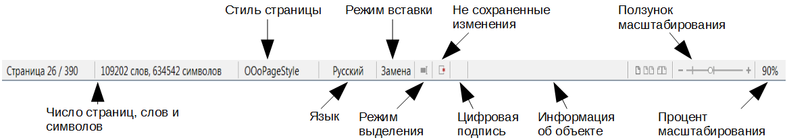

    Строка состояния Writer

**Номер страницы**

Показывает номер текущей страницы, порядковый номер текущей страницы (если они отличаются) и количество страниц всего в документе. Например, если вы начнете заново нумерацию на третьей странице, то номер текущей страницы будет 1, а порядковый номер страницы в документе будет 3.

Если какие-то закладки были определены в документе, то нажмите правой кнокой мыши на этом поле, чтобы вызвать список закладок.

Для  перехода к определённой странице в документе, нажмите дважды по полю. Откроется окно *Навигатор*. Нажмите в поле *Номер страницы* и введите номер необходимой страницы, нажмите клавишу ``Enter`` для перехода.

**Количество слов**

Показывает количество слов в строке состояния и поддерживается в актуальном состоянии во время редактирования. При выборе любого текста в поле отобразится количество выбранных слов и выбранных символов.

Для отображения расширенной статистики такой, как количество символов,  дважды нажмите по полю левой кнопкой мыши или выберите из главного меню :menuselection:`С&ервис --> &Количество слов`.

**Стиль страницы**

Показывает стиль текущей страницы. Чтобы выбрать стиль страницы, нажмите правой кнопкой мыши на это поле. Появится список стилей страниц, выберите необходимый стиль нажатием на него левой кнопкой мыши.

Чтобы отредактировать стиль текущей страницы дважды нажмите на данное поле. Откроется диалог *Стиль страницы*.

**Язык**

Отображает язык для выделенного текста. Нажмите на поле, чтобы открыть меню, где вы сможете выбрать другой язык для выбранного текста или для абзаца, в котором расположен курсор. Вы также можете выбрать пункт *Нет (не проверять орфографию)*, чтобы не проверять орфографию в выделенном тексте или выберите пункт *Ещё...*, чтобы открыть диалог *Символ*.

**Режим вставки**

Показывает режим вставки. Если данная область пустая, то программа находится в режиме вставки. Если нажать клавишу ``Ins`` (Insert) на клавиатуре, то программа перейдет в режим *Замены*. Повторное нажатие на клавишу ``Ins`` (Insert) возвращает режим *Вставка*. Также можно дважды нажать на эту область левой кнопкой мыши, для смены режима вставки.

**Режим выделения**

Нажмите левой кнопкой мыши на поле, чтобы выбрать различные режимы выделения. Значок не меняется, но при наведении курсора мыши на поле показывается всплывающая подсказка с текущим режимом.

.. csv-table:: 
    :header: "Режим", "Выделение"
    :widths: 30, 30
    
    "Обычное выделение","Щелкните в тексте, где хотите установить курсор, щелкните в ячейке, чтобы сделать ячейку активной. Все другие выделения сбрасываются."
    "Расширяемое выделение (``F8``)","Щелчок в тексте увеличивает или уменьшает текущее выделение."
    "Добавляемое выделение (``Shift+F8``)","Новое выделение добавляется к существующему. В результате получается множественное выделение."
    "Блочное выделение (``Ctrl+Shift+F8``)","Блок текста может быть выделен"

В Windows вы можете удерживать клавишу ``Alt`` и выделять текст блоком. В этом случае необязательно переключать режим выделения на блочное.

**Изменение статуса документа**

Значок отображает наличие не сохранённых изменений в документе. Такой значок |ch4-lo-screen-002| , если не сохранённых изменений нет, а такой |ch4-lo-screen-003| , если есть. Двойной щелчок на втором значке сохранит документ.

        

**Цифровая подпись**

Если документ содержит цифровую подпись, то значок |ch4-lo-screen-004| будет отображен, если не содержит, то поле будет пустое. Чтобы посмотреть сведения о сертификате, дважды нажмите на значке.

**Информация о выделенном элементе или объекте**

Если курсор находится в области, заголовке или списке элементов, или когда объект выбран (такой как рисунок или таблица), то информация о таких элементах отображается в этом поле. Двойное нажатие на поле откроет соответствующий диалог. Для более подробной информации смотрите *Справку* или *Руководство по Writer*.

**Режим отображения страниц**

Нажмите на значок, чтобы выбрать между показом одной страницы, страниц в виде бок-о-бок или макетом книги. Видимый эффект зависит от ширины окна и настроек масштабирования. Редактирование документа может осуществляться  в любом режиме.

.. _ch4-lo-screen-005:

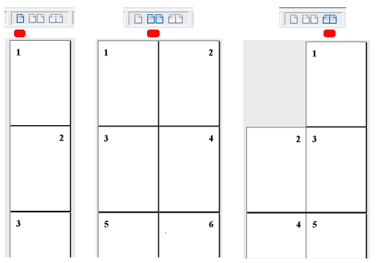

    Режимы отображения: одна, бок-о-бок, книга.

**Масштаб**

Чтобы изменить масштаб отображения страницы документа, перетаскивайте ползунок масштабирования или нажимайте на кнопки ``+`` и ``–``, или нажмите правой кнопкой мыши по числу с процентами и в контекстном меню выберите нужное значение. 

.. _ch4-lo-screen-006:

    Ползунок изменения масштаба

Боковая панель
~~~~~~~~~~~~~~

-----------

Выбор вида документа
--------------------

Во Writer ест несколько способов просмотра документа: *Разметка печати*, *Режим веб-страницы* и *Во весь экран*. Для доступа к этим и другим вариантам, войдите в меню *Вид* и выберите нужный пункт. (Если вы в режиме *Во весь экран*, то нажмите клавишу ``Esc``, чтобы вернуться к режиму *Разметка печати* или *Режим веб-страницы*).

Разметка печати — это вид документа по умолчанию в Writer. В этом виде вы можете использовать ползунок масштабирования и значки режима отображения страниц в строке состояния, чтобы изменить настройки отображения страниц.

Также можно выбрать пункт главного меню :menuselection:`Вид --> Масштаб --> Масштаб...` для отображения диалога *Масштабирование и режимы просмотра*, в котором можно установить те же режимы, что и из строки состояния. В режиме веб-страницы большинство этих вариантов недоступны.

.. _ch4-lo-screen-008:

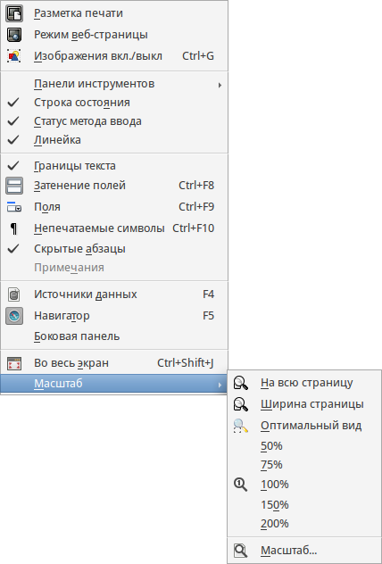

    Выбор вариантов масштабирования

Быстрое перемещение по документу
--------------------------------

В дополнение к навигации из строки состояния (:ref:`writer-statusbar`) вы можете использовать главное окно Навигатора и панель навигации, как описано в :ref:`Introducing-LibreOffice`.

Работа с документом
-------------------

В :ref:`Introducing-LibreOffice` были описаны инструкции по созданию нового документа, открытию существующих документов, сохранению документов и защите документа паролем. В :ref:`using-styles-and-templates` рассказывалось о создании документов с помощью шаблонов.

Сохранение файлов в формате Microsoft Word
~~~~~~~~~~~~~~~~~~~~~~~~~~~~~~~~~~~~~~~~~~

Если вам необходимо обмениваться документами с пользователями Microsoft Word, которые не могут или не хотят работать с файлами  в формате ODT, то вы можете сохранить документ в формате Microsoft Word.

Выберите в меню :menuselection:`Файл --> Сохранить как`. В диалоге *Сохранить как* (рисунок ниже), в раскрывающемся списке *Тип файла*, выберите нужный формат документа Word. Файлы не могут быть сохранены в версии Word 6.0/95. Нажмите *Сохранить*.

.. _ch4-lo-screen-010:

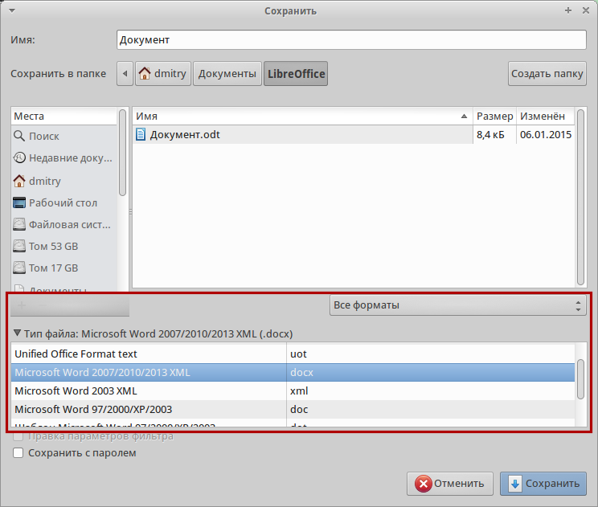

    Сохранение документа в формате Microsoft Word
    
.. tip:: Чтобы Writer сохранял документы по умолчанию в формате Microsoft Word, зайдите в меню :menuselection:`Сервис --> Параметры --> Загрузка/сохранение --> Общие`. В разделе *Формат файла по умолчанию и настройки ODF*, выберите в списке *Тип документа* пункт *Текстовый документ* и под ним в пункте *Всегда сохранять как* выберите нужный вам формат.

Работа с текстом
----------------

Работа с текстом (выделение, копирование, вставка, перемещение) в Writer аналогична работе в любой другой программе. LibreOffice также имеет несколько способов выбора объектов, которые расположены не рядом друг с другом, например, можно выбрать вертикальный блок текста и вставить его, как не форматированный текст.

Выбор объектов, которые идут не по порядку
~~~~~~~~~~~~~~~~~~~~~~~~~~~~~~~~~~~~~~~~~~

Чтобы выбрать разрозненные объекты (как показано на рисунке :ref:`ch4-lo-screen-011`), используйте мышь:

1. Выделите первый кусок текста.
2. Удерживая клавишу ``Ctrl`` на клавиатуре и используйте мышь для выделения следующего куска текста.
3. Повторите столько раз, сколько необходимо.

Теперь вы можете работать с выделенным текстом (копировать его, удалять его, изменять его стиль или что угодно ещё).

.. _ch4-lo-screen-011:

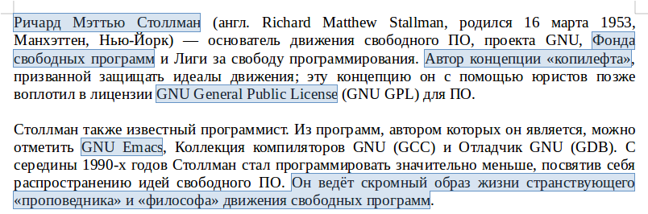

    Выбор разрозненных объектов в документе (на примере текста)

.. note:: Пользователям Mac OS X необходимо использовать клавишу ``Command`` в случаях, когда здесь говорится о клавише ``Ctrl``.

Чтобы выбрать разрозненные объекты, используя клавиатуру:

1. Выделите первый кусок текста. (Для получения информации о выделении текста клавишами клавиатуры посмотрите раздел *Справки* *Перемещение и выделение с помощью клавиатуры*)
2. Нажмите сочетание клавиш ``Shift + F8``. Это переведет Writer в режим *Добавляемое выделение*.
3. Используйте клавиши курсора, чтобы переместиться к началу следующего куска текста для его выделения. Удерживайте клавишу ``Shift`` и клавишами курсора (со стрелками) выделяйте следующий кусок текста.
4. Повторите столько раз, сколько требуется.

Теперь вы можете работать с выделенным текстом. Нажмите клавишу ``Esc``, чтобы выйти из этого режима.

Выделение текста вертикальным блоком
~~~~~~~~~~~~~~~~~~~~~~~~~~~~~~~~~~~~

Вы можете выделять текст вертикальным блоком или «колонкой», используя режим блочного выделения LibreOffice. Чтобы выбрать режим блочного выделения, используйте пункт меню :menuselection:`Правка --> Режим выделения --> Блочная область` или нажмите сочетание клавиш ``Ctrl + F8``, или нажмите на значок *Режим выделения* в строке состояния и выберите из списка *Блочное выделение*.

.. _ch4-lo-screen-012:

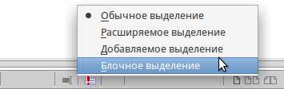

    Режим выделения текста на панели статуса

Теперь выделите текст, используя мышь или клавиатуру, как показано на рисунке ниже.

.. _ch4-lo-screen-013:

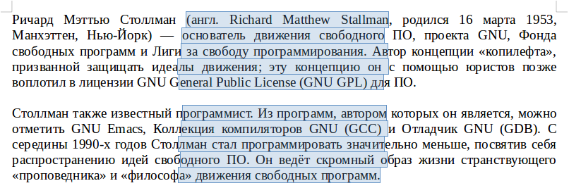

    Выделение текста вертикальным блоком

Вырезание, копирование и вставка текста
~~~~~~~~~~~~~~~~~~~~~~~~~~~~~~~~~~~~~~~

Вырезание и копирование текста в Writer выполняется так же, как и в других приложениях для работы с текстом. Вы можете использовать мышь или клавиатуру для выполнения этих операций. Можно копировать или перемещать текст в документе или между документами методом перетаскивания или, используя пункты меню, значки на панели инструментов или сочетания клавиш клавиатуры. Вы также можете копировать текст из других источников, таких, как веб-страницы, и вставлять его в документ Writer.

Чтобы переместить выделенный текст, можно использовать мышь: перетяните текст на новое место и отпустите кнопку мыши. Чтобы скопировать выделенный текст, тяните его в новое место, удерживая клавишу ``Ctrl``. Скопированный текст сохранит своё форматирование.

Чтобы переместить (вырезать и вставить) выделенный текст, можно использовать клавиатуру: нажмите сочетание клавиш ``Ctrl+X`` для вырезания текста, установите курсор на новое местоположение текста и нажмите ``Ctrl+V`` для вставки. 

Также можно использовать значки на стандартной панели инструментов.

При вставке текста результат зависит от источника текста и от того, как вы вставили его. Если вы нажмете на значок *Вставить*, то любое форматирование текста (выделение жирным или курсив) сохранится. Текст, вставляемый из веб-страниц может быть помещен во врезки или таблицы. Если вам не понравился результат, то нажмите значок *Отменить* на панели инструментов или нажмите сочетание клавиш ``Ctrl+Z``.

Чтобы вставляемый текст принял форматирование окружающего текста:

* Выберите пункт меню :menuselection:`Правка --> Вставить как`, или 
* Нажмите на треугольник справа от значка *Вставить* на панели инструментов, или
* Нажмите на значок *Вставить*, не отпуская левую кнопку мыши.

Затем в появившемся меню выберите *Текст без форматирования*.

Набор вариантов в меню *Вставить как* меняется в зависимости от происхождения и форматирования текста (или другого объекта) для вставки. На рисунке ниже показан пример для текста из буфера обмена.

.. _ch4-lo-screen-014:

.. figure:: _static/chapter4/ch4-lo-screen-014.png
    :scale: 70%
    :align: center
    :alt: Меню Вставить как

    Меню *Вставить как*

Поиск и замена текста и форматирования
~~~~~~~~~~~~~~~~~~~~~~~~~~~~~~~~~~~~~~

Во Writer есть два способа для поиска текста в документе: из панели поиска и из диалога *Найти и заменить*. В диалоге вы можете:

* Искать и заменять слова и фразы
* Использовать специальные символы и регулярные выражения, чтобы облегчить и ускорить поиск
* Искать и заменять определенное форматирование (стили)
* Искать и заменять стили абзаца

Использование панели поиска
"""""""""""""""""""""""""""

Если панель поиска невидима, то для отображения её выберите пункт меню :menuselection:`Вид --> Панели инструментов --> Найти или нажмите` сочетание клавиш ``Ctrl + F``. Панель поиска появится внизу окна LibreOffice (прямо над строкой состояния), смотрите рисунок ниже. Вы можете сделать панель плавающей или прикрепить её в ином месте. Информацию по перемещению панелей смотрите в :ref:`Introducing-LibreOffice`.

.. _ch4-lo-screen-015:

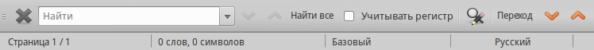

    Панель поиска в позиции по умолчанию

Для использования панели поиска введите в поле для ввода искомый текст и нажмите клавишу ``Enter``, чтобы найти следующее совпадение в текущем документе. Нажимайте кнопки *Следующее* и *Предыдущее* по мере необходимости в поиске. Нажатие на значке бинокля (лупа с карандашом) откроет диалог *Найти и заменить*.

Использование диалога Найти и заменить
""""""""""""""""""""""""""""""""""""""

Чтобы открыть диалог *Найти и заменить* используйте сочетание клавиш ``Ctrl + H`` или выберите пункт меню :menuselection:`Правка --> Найти и заменить`. При необходимости нажмите кнопку *Другие параметры*, чтобы расширить диалог и получить доступ к дополнительным параметрам поиска и замены..

.. _ch4-lo-screen-016:

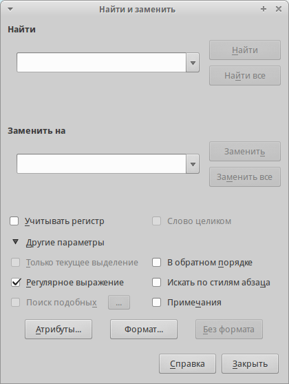

    Расширенный диалог *Найти и заменить*

Для использования диалога *Найти и заменить*:

1. Введите искомый текст в поле *Найти*.
2. Для замены текста на другой введите новый текст в поле *Заменить на*.
3. Вы можете выбрать различные варианты, такие как, искать слово целиком, учитывать регистр и другие.
4. После настройки параметров поиска нажмите кнопку *Найти*. Чтобы заменить найденный текст нажмите *Заменить*.

Для получения более подробной информации смотрите *Руководство пользователя Writer*.

.. tip:: Если вы нажмете кнопку *Найти все*, то LibreOffice выделит все искомые элементы в тексте документа. Аналогично, если нажать кнопку *Заменить все*, то LibreOffice заменит все совпадающие элементы на новые.

.. warning:: Используйте функцию *Заменить все* с осторожностью, иначе вы можете получить массу неверных значений в документе. Исправление такой ошибки может потребовать кропотливой работы по ручному поиску и замене неверного текста слово за словом.

Вставка специальных символов
~~~~~~~~~~~~~~~~~~~~~~~~~~~~

Специальные символы не представлены на стандартной русско-английской клавиатуре. Например, ``© ¾ æ ç ñ ö ø ¢`` — это всё специальные символы. Чтобы вставить специальный символ:

1. Поместите курсор в место вставки символа.
2. Выберите пункт меню :menuselection:`Вставка --> Специальные символы`, чтобы открыть соответствующий диалог.
3. Выберите символы (из любого шрифта или семейства шрифтов), которые вы хотите вставить, в необходимом порядке и нажмите кнопку *OK*. Выбранные для вставки символы отображаются в левом нижнем углу диалога. Каждый выбранный символ показывается справа с указанием его числового кода.

.. _ch4-lo-screen-017:

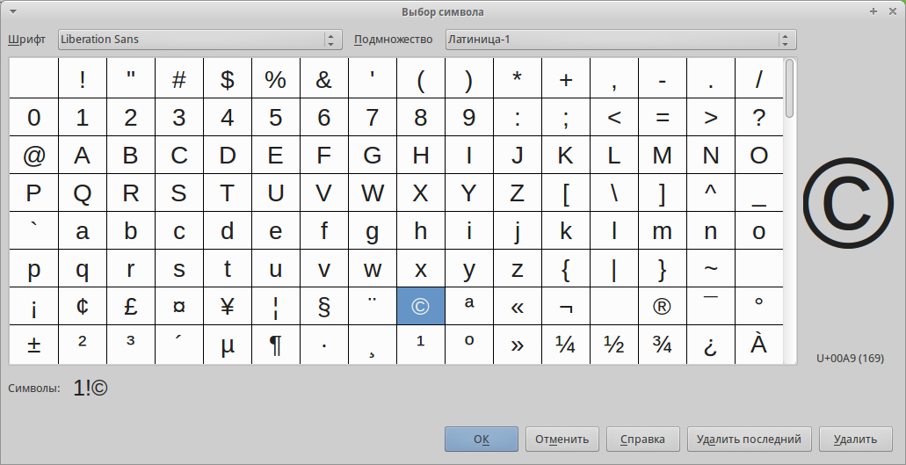

    Диалог *Специальные символы*

.. note:: Различные шрифты включают в себя различные специальные символы. Если вы не можете найти нужный специальный символ, попробуйте изменить шрифт.

Вставка тире, неразрывных пробелов и дефисов
~~~~~~~~~~~~~~~~~~~~~~~~~~~~~~~~~~~~~~~~~~~~

Для предотвращения разделения двух слов в конце строки нажмите клавиши ``Ctrl+Shift`` при вставке пробела между этими словами. Будет поставлен неразрывный пробел. Чтобы слова, содержащие дефис не переносились на новую строку, например, чтобы не разрывать слово Санкт-Петербург, необходимо обыкновенный дефис заменить нажатием клавиш ``Shift+Ctrl+знак минус`` на неразрывный дефис.

Чтобы вставить короткjе и длиннjе тире, вы можете использовать настройку *Заменять дефисы на тире* на вкладке *Параметры* в меню :menuselection:`Сервис --> Параметры автозамены`. Эта настройка заменяет один или два дефиса, при определенных условиях, на одно тире.

* Введите символы, пробел, два дефиса, еще пробел и еще символы. Два дефиса будут заменены на  короткое тире.
* Введите символы, один дефис, еще символы (без пробелов!). Дефис будет заменен на длинное тире. 

Более подробно это описано в *Справке*. Другие методы вставки тире описаны в *Главе 3 Руководства Writer*.

Установка табуляции и отступов
~~~~~~~~~~~~~~~~~~~~~~~~~~~~~~

Выбор параметров по умолчанию для табуляции
~~~~~~~~~~~~~~~~~~~~~~~~~~~~~~~~~~~~~~~~~~~

Проверка орфографии и грамматики
~~~~~~~~~~~~~~~~~~~~~~~~~~~~~~~~

Использование встроенных инструментов настройки языка
~~~~~~~~~~~~~~~~~~~~~~~~~~~~~~~~~~~~~~~~~~~~~~~~~~~~~

Использование функции Автозамена
~~~~~~~~~~~~~~~~~~~~~~~~~~~~~~~~

Использование функции Завершение слов
~~~~~~~~~~~~~~~~~~~~~~~~~~~~~~~~~~~~~

Использование функции Автотекст
~~~~~~~~~~~~~~~~~~~~~~~~~~~~~~~

Создание Автотекста
"""""""""""""""""""

Вставка Автотекста в документ
"""""""""""""""""""""""""""""

------------

Форматирование текста
---------------------

Рекомендуется использовать стили
~~~~~~~~~~~~~~~~~~~~~~~~~~~~~~~~

Форматирование абзацев
~~~~~~~~~~~~~~~~~~~~~~

Форматирование символов
~~~~~~~~~~~~~~~~~~~~~~~

Автоформатирование
~~~~~~~~~~~~~~~~~~

Создание нумерованных и маркированных списков
~~~~~~~~~~~~~~~~~~~~~~~~~~~~~~~~~~~~~~~~~~~~~

Использование панели нумерованных и маркированных списков
"""""""""""""""""""""""""""""""""""""""""""""""""""""""""

Перенос слов
~~~~~~~~~~~~

Автоматический перенос слов
"""""""""""""""""""""""""""

Ручная расстановка переносов
""""""""""""""""""""""""""""

---------

Форматирование страниц
-----------------------

Какой метод разметки страницы выбрать?
~~~~~~~~~~~~~~~~~~~~~~~~~~~~~~~~~~~~~~

Создание колонтитулов
~~~~~~~~~~~~~~~~~~~~~

Вставка верхнего и нижнего колонтитула
""""""""""""""""""""""""""""""""""""""

Вставка содержимого верхнего и нижнего колонтитулов
"""""""""""""""""""""""""""""""""""""""""""""""""""

Нумерация страниц
~~~~~~~~~~~~~~~~~

Отображение номера страницы
""""""""""""""""""""""""""""""""""""""

Включая общее количество страниц
""""""""""""""""""""""""""""""""""""""

Повторная нумерация страниц
"""""""""""""""""""""""""""

Изменение полей страниц
~~~~~~~~~~~~~~~~~~~~~~~

-----------

Добавление комментариев в документ
----------------------------------

Создание оглавления
-------------------

.. note:: Также смотрите статью:
          
          * `LibreOffice: Автоматическое оглавление (дополнено) <librerussia.blogspot.ru/2014/10/libreoffice_16.html>`_

Создание указателей и библиографий
-----------------------------------

Индексы и библиографии создаются так же, как оглавления. *Глава 12 — Создание оглавления, индексов и библиографии* в *Руководстве по Writer* описывает этот процесс более детально.

В дополнение к алфавитным указателям и другим видам указателей, поставляемых с Writer, включая указатели иллюстраций, таблиц и объектов, вы можете создать пользовательский указатель. Например, вы можете создать указатель, содержащий только научные названия видов, упомянутых в тексте, и отдельный указатель, содержащий только общие названия видов. Перед созданием некоторых типов указателей, в первую очередь необходимо создать элементы указателя, встраиваемые в ваш документ.

.. note:: Также смотрите статью:
          
          * `LibreOffice: Автоматическое оглавление (дополнено) <librerussia.blogspot.ru/2014/10/libreoffice_16.html>`_

Работа с графикой
-----------------

Графика в Writer бывает трёх типов:

* Файлы изображений, включая фотографии, рисунки, сканированные изображения и другие
* Диаграммы, созданные с помощью инструментов рисования LibreOffice
* Диаграммы, созданные на основании числовых данных из электронных таблиц LibreOffice Calc

Смотрите *Главу 11 — Графика, Галерея и Артворк* данного руководства и *Главу 8 — Работа с графикой* в *Руководстве Writer*.

Печать
------

Смотрите *Главу 10 — Печать, экспорт, и электронная почта* данного руководства и главу *Электронная почта*  в *Руководстве по Writer* для получения подробной информации о просмотре страниц перед печатью, выборе параметров печати, печати черно-белым на цветном принтере, печать брошюр и других функций печати.

Использование почтовой рассылки
~~~~~~~~~~~~~~~~~~~~~~~~~~~~~~~

Writer обеспечивает очень полезные функции для создания и печати:

* Нескольких копий документа для отправки списку получателей (в форме письма)
* Почтовых наклеек
* Конвертов

Все эти объекты используют зарегистрированный источник данных (таблицы или базы данных, содержащие имя, адрес записи и другую информацию). *Глава 11 — Использование рассылки писем* в *Руководстве по Writer* подробнее описывает процесс.

Отслеживание изменений в документе
----------------------------------

Вы можете использовать несколько методов для отслеживания изменений, внесённых в документ.

1. Внесите изменения в копию документа (хранится в другой папке или под другим именем), а затем используйте Writer для объединения двух файлов и показа различий между ними. Выберите :menuselection:`Правка --> Сравнить документы`. Этот метод особенно полезен, если вы единственный человек, работающий над документом, поскольку позволяет избежать увеличения размера файла и сложностей, вызванных другими методами. 

2. Можно сохранять версии документа в составе оригинального файла. Однако этот метод может вызвать проблемы с документами нетривиального размера и сложности, особенно если вы сохраните много версий. Избегайте этого метода, если можете.

3. Используйте знаки изменения Writer, чтобы показать, где вы добавили или удалили материал, или изменяли форматирование. Выберите :menuselection:`Правка --> Изменения --> Записывать`, прежде чем начать редактировать документ. Позже вы или другой человек можете рассмотреть и принять или отклонить каждое изменение. Выберите :menuselection:`Правка --> Изменения --> Показать`. Нажмите правой кнопкой мыши на каждом изменении и выберите *Принять изменение* или *Отклонить изменение* из выпадающего меню, или выберите :menuselection:`Правка --> Изменения --> Принять или Отклонить`, чтобы просмотреть список изменений и принять или отклонить их. 

Подробности смотрите в *Руководстве по Writer*. 

.. tip:: Не все различия могут быть учтены. Например, изменение позиции табуляцией при выравнивания элемента с левого края на правый край, а также изменения в формулах (уравнениях) или в связанных рисунках не будут отслежены. 

.. note:: Практические примеры по использованию функции отслеживания изменений смотрите в статьях:
          
          * `LibreOffice: Совместная работа над документом. Запись изменений.  <http://librerussia.blogspot.ru/2014/10/libreoffice_77.html>`_
          * `LibreOffice: Контроль версий документа <http://librerussia.blogspot.ru/2014/10/libreoffice_87.html>`_

------------

Использование полей с данными
------------------------------

Поля – чрезвычайно полезная функция Writer. Они используются для вставки изменяемых данных в документ (например, текущая дата или общее количество страниц) и для вставки свойств документа таких, как название, автор и дата последнего обновления. Поля являются основой перекрестных ссылок (смотрите ниже), автоматической нумерации рисунков, таблиц, заголовков и других элементов, а также широкого спектра других функций, которых слишком много, чтобы описать их здесь. Для получения подробной информации смотрите *Главу 14 – Работа с полями* в *Руководстве по Writer*.

.. note:: Практические примеры по использованию полей смотрите в статьях:
          
          * `LibreOffice: Поля с данными <http://librerussia.blogspot.com/2014/10/libreoffice_2.html>`_
          * `LibreOffice Writer: Список значений  <http://librerussia.blogspot.ru/2014/10/lo-writer-spisok-znachenii.html>`_
          * `LibreOffice Writer: Поля ввода (Автоматизируем заполнение бланков) <http://librerussia.blogspot.ru/2014/10/libreoffice-writer-polia-vvoda.html>`_

Ссылки на другие части документа
---------------------------------

Если вы делаете перекрестные ссылки на другие части документа, эти ссылки могут легко устареть, если вы реорганизовали порядок тем, добавили или удалили материал, или изменили заголовок. Writer предоставляет два способа убедиться, что ваши данные находятся в актуальном состоянии, вставив ссылки на другие части документа в этом же документе или в другом документе:

* Гиперссылки
* Перекрестные ссылки

Эти два метода дают одинаковый результат при выполнении (при зажатой клавише ``Ctrl``) нажатия на ссылке в открытом документе Writer: вы перейдёте непосредственно к элементу, на который была ссылка. Тем не менее, они также имеют существенные различия:

* Текст в гиперссылке не обновляется автоматически, если вы изменили текст по ссылке (однако вы можете сделать это вручную), а в перекрестной ссылке обновляется.

* При использовании гиперссылки, у вас нет выбора вида самой ссылки (например текст или номер страницы), а при использовании перекрестной ссылки, у вас есть несколько вариантов, в том числе закладки.

* Гиперссылка, например, на графический объект, имеет название, например, Рисунок 6, и вы должны дать такому объекту уникальное имя (вместо имени по умолчанию, такого, как Рисунок 6), или использовать диалог Гиперссылка для изменения видимого текста. В противоположность этому перекрестные ссылки на элементы с подписями автоматически покажут нужный текст и вы получите выбор из нескольких вариантов названия.

Если вы сохраните документ Writer в формат HTML, то гиперссылки останутся активными, а перекрестные ссылки нет. (Оба вида ссылок будут активными при экспорте документа в формат PDF.) 

.. note:: Перекрестные ссылки используются для создания ссылок на элементы внутри документа (заголовки, рисунки, таблицы и т.д.). Гиперссылки используются для создания ссылок на внешние объекты (другие документы, интернет-страницы и т.д.).

Использование гиперссылок
~~~~~~~~~~~~~~~~~~~~~~~~~

Самым простым путём для вставки гиперссылки в другую часть этого же документа является использование *Навигатора*:

1. Откройте документ, который содержит элемент, на который необходимо сослаться.
2. Откройте *Навигатор*, нажав на значке, выбрав пункт меню :menuselection:`Вид --> Навигатор` или нажав клавишу ``F5``.
3. Нажмите стрелку рядом со значком *Режим перетаскивания* и выберите *Вставить*, как гиперссылку.
4. В списке в нижней части окна *Навигатора* выберите документ, содержащие элемент, на который вы хотите создать ссылку.
5. В списке *Навигатора* выберите элемент, который вы хотите вставить в виде гиперссылки.
6. Перетащите элемент в то место документа, где вы хотите вставить гиперссылку. Название элемента вставится в документ в качестве активной гиперссылки.

Вы также можете использовать диалог *Гиперссылка*, чтобы вставлять и изменять гиперссылки внутри документа и между документами. Смотрите также *Главу 12 — Создание веб-страниц*.

.. _ch4-lo-screen-087:

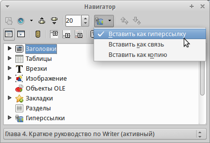

    Вставка гиперссылки, используя *Навигатор*

Использование перекрёстных ссылок
~~~~~~~~~~~~~~~~~~~~~~~~~~~~~~~~~~

При создании ссылки на другие части документа, эти ссылки могут устареть при перефразировании заголовков, добавления или удаления нумерации, или реорганизации документа.

Замените все созданные ссылки на автоматические и, при обновлении поля, все ссылки будут обновляться автоматически, чтобы отобразить текущую формулировку или текущий номер страницы. На вкладке *Перекрестные ссылки* диалога *Поля* перечислены некоторые элементы, такие как заголовки, закладки, рисунки, таблицы и прочие. Вы также можете создавать свои собственные ссылки на элементы, для получения подробных инструкций смотрите раздел *Настройка Ссылок* в *Главе 14 — Работа с полями* в *Руководстве по Writer*.

Чтобы вставить перекрёстную ссылку на заголовок, рисунок, закладку или другой элемент:

1. В вашем документе поместите курсор в место, куда планируете вставить ссылку.
2. Если диалог *Поля* не открыт, выберите пункт меню :menuselection:`Вставка --> Перекрёстная ссылка`. На вкладке *Перекрёстные ссылки* (рисунок ниже), в списке *Тип*, выберите тип элемента, на который будете ссылаться (например, *Заголовок* или *Рисунок*). Вы можете держать диалог открытым, чтобы вставить несколько перекрёстных ссылок.
3. Выберите нужный элемент в списке *Выделенное*, в котором показаны все элементы выбранного типа. В списке *Вставить ссылку на* выберите необходимый формат. Этот список меняется в зависимости от выбранного типа элемента. Наиболее часто используемые опции – *Текст ссылки* (вставить полный текст заголовка или подписи); *Категория и номер* (вставить номер элемента с названием элемента, предшествующим номеру, например «Рисунок 10»); *Нумерация* (вставить только номер рисунка или таблицы, без самого слова «Рисунок» или «Таблица»); *Страница* (вставить номер страницы, на которой находится элемент). Нажмите *Вставить*.

.. _ch4-lo-screen-086:

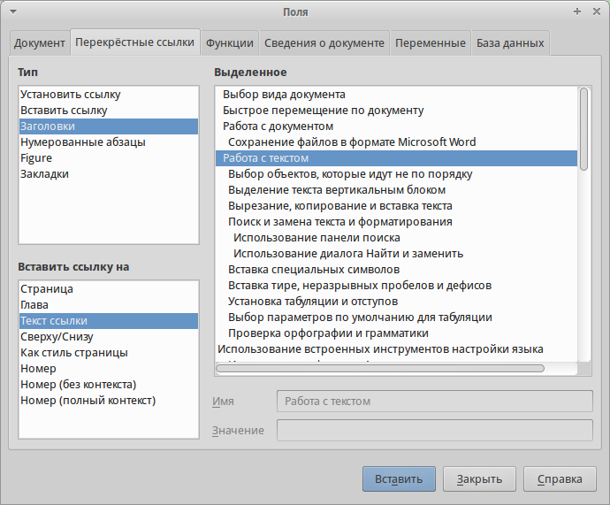

    Вкладка *Перекрестные ссылки* в диалоге *Поля*

Использование закладок
~~~~~~~~~~~~~~~~~~~~~~

Закладки отображаются в *Навигаторе*. Для перехода к закладке необходимо нажать левой кнопкой мыши на название закладки в *Навигаторе*. Можно создавать перекрестные ссылки и гиперссылки, как закладки, как описано выше.

1. Выберите текст, на который вы хотите сделать закладку. Выберите пункт меню :menuselection:`Вставка --> Закладка`.
2. В диалоге *Вставить закладку* список показывает ранее созданные закладки. Введите имя для новой закладки в верхнем поле и нажмите *OK*.

.. _ch4-lo-screen-088:

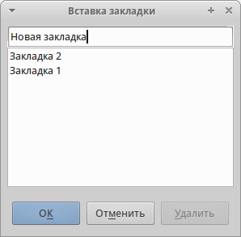

    Вставка закладки

--------

Использование составных документов
----------------------------------

Составные документы обычно используются для создания больших документов, таких как книги, диссертации или большие доклады. Также составные документы применяются для организации совместной работы нескольких авторов, когда разные люди пишут различные главы и другие части одного документа. Таким образом, пропадает необходимость постоянного обмена файлами. 

Составной документ соединяет отдельные документы в один большой документ, объединяя форматирование, оглавление, библиографию, индексы, таблицы и списки.

Для получения более подробной информации о работе с составными документами смотрите *Главу 13 — Работа с составными документами* в *Руководстве по Writer*.

.. note:: Пример использования форм приведен в статье `LibreOffice Writer: Составные документы   <http://librerussia.blogspot.ru/2014/12/libreoffice-writer.html>`_

Создание заполняемых форм
-------------------------

Стандартный текстовый документ обычно отображает информацию в двух режимах — когда пользователь может редактировать весь документ и когда документ открывается в режиме *только для чтения*. Инструмент *Формы* позволяет создавать документы, содержащие неизменяемые части и части, которые могут быть отредактированы пользователем.  Например, вопросник имеет введение вопросы (которые нельзя изменить) и поля для пользователя, чтобы вводить ответы.

Формы используются в трёх случаях:

* Для создания простого законченного документа для конечного получателя, такого как вопросник, разосланный группе людей, которые его заполнят и вернут автору.
* Для связи с базой данных или источником данных, позволяет пользователю вводить информацию. Например, пользователь, принимающий заказы, может ввести информацию для каждого заказа в базу данных с помощью формы.
* Для возможности просматривать информацию, содержащуюся в базе данных или источнике данных. Например, библиотекарь может вызывать информацию о книгах.

Writer предлагает несколько способов заполнения информации в форме, в том числе флажки, переключатели, текстовые поля, выпадающие списки и счетчики. Для получения более подробной информации смотрите *Главу 15 — Использование форм Writer* в *Руководстве по Writer*.

.. note:: Пример использования форм приведен в статье `Создание PDF с формами для заполнения  <http://librerussia.blogspot.ru/2014/09/libreoffice-pdf.html>`_

