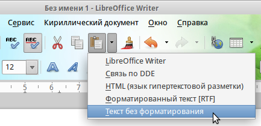
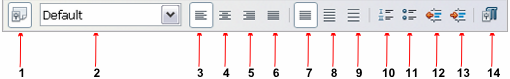
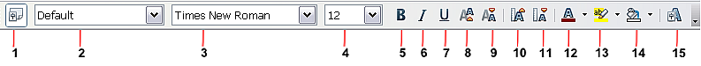
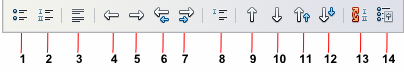
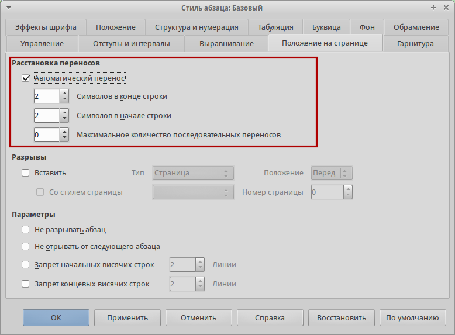

.. meta::
   :description: Краткое руководство по LibreOffice: Глава 4 – Текстовый процессор Writer
   :keywords: LibreOffice, Writer, Impress, Calc, Math, Base, Draw, либреоффис

.. Список автозамен

.. |br| raw:: html

    
   
Глава 4 – Текстовый процессор Writer
====================================

Что такое Writer?
-----------------

Writer – это текстовый процессор, один из компонентов LibreOffice. В дополнение к обычным возможностям текстовых процессоров (проверка орфографии, тезаурусы, схемы переносов, автозамена, поиск и замена, автоматическое создание оглавлений и указателей и прочее), Writer содержит следующие возможности:

* Шаблоны и стили (смотрите :ref:`using-styles-and-templates`)
* Методы разметки страницы, включая врезки, колонки и таблицы
* Встраиваемая или связанная графика, электронные таблицы и другие объекты
* Встроенные инструменты рисования
* Составные документы, позволяющие соединить несколько отдельных документов в один
* Отслеживание изменений в версиях документов
* Интеграция с базами данных, в том числе с библиографическими
* Экспорт в PDF, включая закладки (смотрите Главу 10)
* И многое другое

Интерфейс Writer
----------------

Главная рабочая область окна Writer показана на рисунке ниже. Меню и панели инструментов были описаны в :ref:`Introducing-LibreOffice`.

В этой главе будет описаны некоторые особенности интерфейса Writer.

.. _ch4-lo-screen-001:

.. figure:: _static/chapter4/ch4-lo-screen-001.png
    :scale: 50%
    :align: center
    :alt: Главное окно Writer

    Главное окно Writer

.. _writer-statusbar:

Строка состояния
~~~~~~~~~~~~~~~~

Строка состояния во Writer содержит информацию о документе и позволяет быстро получить доступ к изменению некоторых настроек Она содержит следующие поля:

.. _ch4-lo-screen-007:

.. figure:: _static/chapter4/ch4-lo-screen-007.png
    :scale: 60%
    :align: center
    :alt: Строка состояния Writer

    Строка состояния Writer

**Номер страницы**

Показывает номер текущей страницы, порядковый номер текущей страницы (если они отличаются) и количество страниц всего в документе. Например, если заново начать нумерацию на третьей странице, то номер текущей страницы будет 1, а порядковый номер страницы в документе будет 3.

Если какие-то закладки были определены в документе, то нажмите правой кнокой мыши на этом поле, чтобы вызвать список закладок. 

Для  перехода к определённой странице в документе, дважды нажмите левой кнопкой мыши по полю. Откроется окно *Навигатор*. Нажмите в поле *Номер страницы* и введите номер необходимой страницы, нажмите клавишу ``Enter`` для перехода.

**Количество слов**

Показывает количество слов и обновляет число во время редактирования. При выборе любого текста, в поле отобразится количество выбранных слов и выбранных символов.

Для отображения расширенной статистики, такой, как количество символов,  дважды нажмите по полю левой кнопкой мыши или выберите пункт меню :menuselection:`С&ервис --> &Количество слов`.

**Стиль страницы**

Показывает стиль текущей страницы. Чтобы выбрать стиль страницы, нажмите правой кнопкой мыши на это поле. Появится список стилей страниц, выберите необходимый стиль нажатием на него левой кнопкой мыши.

Чтобы отредактировать стиль текущей страницы дважды нажмите на данное поле. Откроется диалог *Стиль страницы*.

**Язык**

Отображает язык для выделенного текста. Нажмите на поле, чтобы открыть меню, где можно выбрать другой язык для выбранного текста или для абзаца, в котором расположен курсор. Также можно выбрать пункт *Нет (не проверять орфографию)*, чтобы не проверять орфографию в выделенном тексте или выбрать пункт *Ещё...*, чтобы открыть диалог *Символ*.

**Режим вставки**

Показывает режим вставки. Если данная область пустая, то программа находится в режиме вставки. Если нажать клавишу ``Ins`` (Insert) на клавиатуре, то программа перейдет в режим *Замена*. Повторное нажатие на клавишу ``Ins`` (Insert) возвращает режим *Вставка*. Также можно дважды нажать на эту область левой кнопкой мыши, для смены режима вставки.

**Режим выделения**

Нажмите левой кнопкой мыши на поле, чтобы выбрать различные режимы выделения. Значок не меняется, но при наведении курсора мыши на поле показывается всплывающая подсказка с текущим режимом.

.. csv-table:: 
    :header: "Режим", "Выделение"
    :widths: 30, 30
    
    "Обычное выделение","Щелкните мышью в тексте, где хотите установить курсор, или щелкните в ячейке, чтобы сделать ячейку активной. Все другие выделения сбрасываются."
    "Расширяемое выделение (``F8``)","Щелчок в тексте увеличивает или уменьшает текущее выделение."
    "Добавляемое выделение (``Shift+F8``)","Новое выделение добавляется к существующему. В результате получается множественное выделение."
    "Блочное выделение (``Ctrl+Shift+F8``)","Может быть выделен вертикальный блок текста "

В Windows можно удерживать клавишу ``Alt`` и выделять текст блоком. В этом случае необязательно переключать режим выделения на блочное.

**Изменение статуса документа**

Значок отображает наличие не сохранённых изменений в документе. Такой значок |ch4-lo-screen-002| , если не сохранённых изменений нет, а такой |ch4-lo-screen-003| , если есть. Двойной щелчок на втором значке сохранит документ.

.. |ch4-lo-screen-002| image:: _static/chapter4/ch4-lo-screen-002.png
        :scale: 80% 
        
.. |ch4-lo-screen-003| image:: _static/chapter4/ch4-lo-screen-003.png
        :scale: 80%         

**Цифровая подпись**

Если документ содержит цифровую подпись, то будет отображен соответствующий значок |ch4-lo-screen-004|, если не содержит, то поле будет пустое. Чтобы посмотреть сведения о сертификате, дважды нажмите на значке.

**Информация о выделенном элементе или объекте**

Если курсор находится в области, заголовке или списке элементов, или когда выделен объект (такой, как рисунок или таблица), то информация о таких элементах отображается в этом поле. Двойное нажатие левой кнопкой мыши на поле откроет соответствующий элементу диалог. Для получения более подробной информации смотрите *Справку* или *Руководство по Writer*.

**Режим отображения страниц**

Нажмите на значок, чтобы выбрать между показом одной страницы, страниц в виде "бок-о-бок" или макетом книги. Видимый эффект зависит от ширины окна и настроек масштабирования. Редактирование документа может осуществляться в любом режиме.

.. _ch4-lo-screen-005:

    Режимы отображения: одна страница, бок-о-бок, книга.

**Масштаб**

Чтобы изменить масштаб отображения страницы документа, перетаскивайте ползунок масштабирования или нажимайте на кнопки ``+`` и ``–``, или нажмите правой кнопкой мыши по числу с процентами и в контекстном меню выберите нужное значение. 

.. _ch4-lo-screen-006:

.. figure:: _static/chapter4/ch4-lo-screen-006.png
    :scale: 70%
    :align: center
    :alt: Ползунок изменения масштаба

    Ползунок изменения масштаба

Боковая панель
~~~~~~~~~~~~~~

Начиная с версии 4.0 в LibreOffice появилась прикрепляемая боковая панель элементов, которая упрощает доступ ко многим функциям. Боковая панель удобна, прежде всего, на широкоформатных мониторах и позволяет сэкономить вертикальное пространство на экране.

Если боковая панель не отображается, включить её можно, используя пункт меню :menuselection:`Вид --> Боковая панель`.

*Боковая панель* доступна во всех компонентах LibreOffice. В некоторых компонентах она имеет дополнительные вкладки. В Writer она содержит следующий набор разделов:

* Меню конфигурации боковой панели;
* Свойства;
* Стили и форматирование;
* Галерея;
* Навигатор.

Боковая панель служит для упрощения доступа к различным функциям LibreOffice. Разделы боковой панели дублируют отдельные диалоги. Например, раздел *Стили и форматирование* полностью дублирует диалог *Стили и форматирование*. 

Меню конфигурации боковой панели позволяет скрывать и отображать доступные разделы.

.. _ch4-lo-screen-009:

.. figure:: _static/chapter4/ch4-lo-screen-009.png
    :scale: 70%
    :align: center
    :alt: Боковая панель Writer

    Боковая панель Writer

-----------

Выбор вида документа
--------------------

Во Writer есть несколько способов просмотра документа: *Разметка печати*, *Режим веб-страницы* и *Во весь экран*. Для доступа к этим и другим вариантам, откройте меню *Вид* и выберите нужный вариант. (Если Writer находится в режиме просмотра *Во весь экран*, то нажмите клавишу ``Esc``, чтобы вернуться к режиму *Разметка печати* или *Режим веб-страницы*).

*Разметка печати* — это вид документа по умолчанию во Writer. В этом виде можно использовать ползунок масштабирования и значки режима отображения страниц в строке состояния, чтобы изменять настройки отображения страниц.

.. _ch4-lo-screen-008:

.. figure:: _static/chapter4/ch4-lo-screen-008.png
    :scale: 50%
    :align: center
    :alt: Выбор вариантов масштабирования

    Выбор вариантов масштабирования

Также можно выбрать пункт меню :menuselection:`Вид --> Масштаб --> Масштаб...` для отображения диалога *Масштабирование и режимы просмотра*, в котором можно установить те же режимы, что и из строки состояния. В *режиме веб-страницы* большинство этих вариантов недоступны.

.. _ch4-lo-screen-008a:

    Выбор вариантов масштабирования

Быстрое перемещение по документу
--------------------------------

В дополнение к навигации из строки состояния (:ref:`writer-statusbar`) можно использовать окно *Навигатора* и панель навигации, как описано в :ref:`Introducing-LibreOffice`.

В Writer  также можно отобразить *Панель навигации*, нажав на кнопку *Переход*, расположенный на панели поиска.

.. _ch4-lo-screen-020:

.. figure:: _static/chapter4/ch4-lo-screen-020.png
    :scale: 60%
    :align: center
    :alt: Панель поиска. Кнопка *Переход*

    Панель поиска. Кнопка *Переход*
    
Панель навигации показывает значки для всех типов объектов, отображаемых в *Навигаторе*, плюс некоторые дополнительные (например, результаты команды *Найти*).

.. _ch4-lo-screen-019:

    Панель навигации

Нажмите на значок нужного типа объекта. Теперь при нажатии на кнопки *Предыдущий* и *Следующий* (в окне *Навигатор*, в панели навигации и под полосой прокрутки) будут показаны соответственно предыдущий и следующий объект выбранного типа. Это особенно полезно для нахождения отметок указателей, так как они трудно заметны в тексте. Названия значков *Предыдущий* и *Следующий* (показываются в подсказках) изменяются в зависимости от выбранной категории, например, *Следующий графический объект*, *Следующая закладка* или *Поиск вперед*.

Подробнее о *Навигаторе* в Writer смотрите *Руководство пользователя Writer*.

------------

Работа с документом
-------------------

В :ref:`Introducing-LibreOffice` были описаны инструкции по созданию нового документа, открытию существующих документов, сохранению документов и защите документа паролем. В :ref:`using-styles-and-templates` рассказывалось о создании документов с помощью шаблонов.

Сохранение файлов в формате Microsoft Word
~~~~~~~~~~~~~~~~~~~~~~~~~~~~~~~~~~~~~~~~~~

Если необходимо обмениваться документами с пользователями Microsoft Word, которые не могут или не хотят работать с файлами  в формате ODT, то можно сохранить документ в формате Microsoft Word.

Выберите пункт меню :menuselection:`Файл --> Сохранить как`. В диалоге *Сохранить как* (рисунок ниже), в раскрывающемся списке *Тип файла*, выберите нужный формат документа Word. Файлы не могут быть сохранены в версии Word 6.0/95. Нажмите кнопку *Сохранить*.

.. _ch4-lo-screen-010:

.. figure:: _static/chapter4/ch4-lo-screen-010.png
    :scale: 50%
    :align: center
    :alt: Сохранение документа в формате Microsoft Word

    Сохранение документа в формате Microsoft Word
    
.. tip:: Чтобы Writer по умолчанию сохранял документы в формате Microsoft Word, зайдите в меню :menuselection:`Сервис --> Параметры --> Загрузка/сохранение --> Общие`. В разделе *Формат файла по умолчанию и настройки ODF*, выберите в списке *Тип документа* пункт *Текстовый документ* и под ним в пункте *Всегда сохранять как* выберите нужный формат.

Работа с текстом
----------------

Работа с текстом (выделение, копирование, вставка, перемещение) в Writer аналогична работе в любой другой программе. LibreOffice также предоставляет несколько способов выбора объектов, которые не расположены рядом друг с другом, например, можно выбрать вертикальный блок текста и вставить его, как не форматированный текст.

Выбор объектов, которые идут не по порядку
~~~~~~~~~~~~~~~~~~~~~~~~~~~~~~~~~~~~~~~~~~

Чтобы выбрать разрозненные объекты (как показано на рисунке :ref:`ch4-lo-screen-011`), используйте мышь:

1. Выделите первый кусок текста.
2. Удерживая клавишу ``Ctrl`` на клавиатуре и используйте мышь для выделения следующего куска текста.
3. Повторите пункты 1 и 2 столько раз, сколько необходимо.

Теперь можно работать с выделенным текстом (копировать его, удалять его, изменять его стиль или что угодно ещё).

.. _ch4-lo-screen-011:

.. figure:: _static/chapter4/ch4-lo-screen-011.png
    :scale: 60%
    :align: center
    :alt: Выбор разрозненных объектов в документе (на примере текста)

    Выбор разрозненных объектов в документе (на примере текста)

.. note:: Пользователям Mac OS X необходимо использовать клавишу ``Command`` в случаях, когда здесь говорится о клавише ``Ctrl``.

Чтобы выбрать разрозненные объекты, используя клавиатуру:

1. Выделите первый кусок текста. (Для получения информации о выделении текста клавишами клавиатуры посмотрите раздел *Справки* *Перемещение и выделение с помощью клавиатуры*)
2. Нажмите сочетание клавиш ``Shift + F8``. Это переведет Writer в режим *Добавляемое выделение*.
3. Используйте клавиши курсора, чтобы переместиться к началу следующего куска текста для его выделения. Удерживайте клавишу ``Shift`` и клавишами курсора (со стрелками) выделяйте следующий кусок текста.
4. Повторите столько раз, сколько требуется.

Теперь можно работать с выделенным текстом. Нажмите клавишу ``Esc``, чтобы выйти из этого режима.

Выделение текста вертикальным блоком
~~~~~~~~~~~~~~~~~~~~~~~~~~~~~~~~~~~~

Можно выделить текст вертикальным блоком или «колонкой», используя режим блочного выделения LibreOffice. Чтобы выбрать режим блочного выделения, используйте пункт меню :menuselection:`Правка --> Режим выделения --> Блочная область` или нажмите сочетание клавиш ``Ctrl + F8``, или нажмите на значок *Режим выделения* в строке состояния и выберите из списка *Блочное выделение*.

.. _ch4-lo-screen-012:

.. figure:: _static/chapter4/ch4-lo-screen-012.png
    :scale: 80%
    :align: center
    :alt: Режим выделения текста на панели статуса

    Режим выделения текста на панели статуса

Теперь выделите текст, используя мышь или клавиатуру, как показано на рисунке ниже.

.. _ch4-lo-screen-013:

.. figure:: _static/chapter4/ch4-lo-screen-013.png
    :scale: 60%
    :align: center
    :alt: Выделение текста вертикальным блоком

    Выделение текста вертикальным блоком

Вырезание, копирование и вставка текста
~~~~~~~~~~~~~~~~~~~~~~~~~~~~~~~~~~~~~~~

Вырезание и копирование текста в Writer выполняется так же, как и в других приложениях для работы с текстом. Для выполнения этих операций можно использовать мышь или клавиатуру. Можно копировать или перемещать текст в документе или между документами методом перетаскивания или, используя пункты меню, значки на панели инструментов или сочетания клавиш клавиатуры. Также можно копировать текст из других источников, таких, как веб-страницы, и вставлять его в документ Writer.

Чтобы переместить выделенный текст, можно использовать мышь: перетяните текст на новое место и отпустите кнопку мыши. Чтобы скопировать выделенный текст, тяните его в новое место, удерживая нажатой клавишу ``Ctrl``. Скопированный текст сохранит своё форматирование.

Чтобы переместить (вырезать и вставить) выделенный текст, можно использовать клавиатуру: нажмите сочетание клавиш ``Ctrl+X`` для вырезания текста, установите курсор на новое местоположение текста и нажмите сочетание клавиш ``Ctrl+V`` для вставки. 

Также можно использовать значки на Стандартной панели инструментов.

При вставке текста результат зависит от источника текста и от того, как он был вставлен. Если нажать на значок *Вставить*, то любое форматирование текста (выделение жирным или курсив) сохранится. Текст, вставляемый из веб-страниц, может быть помещен во врезки или таблицы. Если результат не понравился, то нажмите значок *Отменить* на Стандартной панели инструментов или нажмите сочетание клавиш ``Ctrl+Z``.

Чтобы вставляемый текст принял форматирование окружающего текста:

* Выберите пункт меню :menuselection:`Правка --> Вставить как`, или 
* Нажмите на треугольник справа от значка *Вставить* на панели инструментов, или
* Нажмите на значок *Вставить*, не отпуская левую кнопку мыши.

Затем в появившемся меню выберите *Текст без форматирования*.

Набор вариантов в меню *Вставить как* меняется в зависимости от происхождения и форматирования текста (или другого объекта) для вставки. На рисунке ниже показан пример для текста из буфера обмена.

.. _ch4-lo-screen-014:

    Меню *Вставить как*

Поиск и замена текста и форматирования
~~~~~~~~~~~~~~~~~~~~~~~~~~~~~~~~~~~~~~

Во Writer есть два способа для поиска текста в документе: из панели поиска и из диалога *Найти и заменить*. В диалоге можно:

* Искать и заменять слова и фразы
* Использовать специальные символы и регулярные выражения, чтобы облегчить и ускорить поиск
* Искать и заменять определенное форматирование (стили)
* Искать и заменять стили абзаца

Использование панели поиска
"""""""""""""""""""""""""""

Если панель поиска невидима, то для её отображения выберите пункт меню :menuselection:`Вид --> Панели инструментов --> Найти` или нажмите сочетание клавиш ``Ctrl + F``. Панель поиска появится внизу окна LibreOffice прямо над строкой состояния (смотрите рисунок ниже). Панель можно сделать плавающей или прикрепить её в ином месте окна Writer. Информацию о перемещении панелей инструментов смотрите в :ref:`Introducing-LibreOffice`.

.. _ch4-lo-screen-015:

.. figure:: _static/chapter4/ch4-lo-screen-015.png
    :scale: 70%
    :align: center
    :alt: Панель поиска в позиции по умолчанию

    Панель поиска в позиции по умолчанию

Для использования панели поиска введите в поле для ввода искомый текст и нажмите клавишу ``Enter``, чтобы найти следующее совпадение в текущем документе. Нажимайте кнопки *Следующее* и *Предыдущее* по мере необходимости в поиске. Нажатие на значок бинокля (лупа с карандашом) откроет диалог *Найти и заменить*.

Использование диалога *Найти и заменить*
"""""""""""""""""""""""""""""""""""""""""""""""""

Чтобы открыть диалог *Найти и заменить*, используйте сочетание клавиш ``Ctrl + H`` или выберите пункт меню :menuselection:`Правка --> Найти и заменить`. При необходимости нажмите кнопку *Другие параметры*, чтобы расширить диалог и получить доступ к дополнительным параметрам поиска и замены.

.. _ch4-lo-screen-016:

.. figure:: _static/chapter4/ch4-lo-screen-016.png
    :scale: 50%
    :align: center
    :alt: Расширенный диалог Найти и заменить

    Расширенный диалог *Найти и заменить*

Для использования диалога *Найти и заменить*:

1. Введите искомый текст в поле *Найти*.
2. Для замены текста на другой введите новый текст в поле *Заменить на*.
3. Можно выбрать различные варианты, такие, как искать слово целиком, учитывать регистр и другие.
4. После настройки параметров поиска нажмите кнопку *Найти*. Чтобы заменить найденный текст нажмите *Заменить*.

Для получения более подробной информации смотрите *Руководство пользователя Writer*.

.. tip:: Если нажать кнопку *Найти все*, то LibreOffice выделит все искомые элементы в тексте документа. Аналогично, если нажать кнопку *Заменить все*, то LibreOffice заменит все совпадающие элементы на новые.

.. warning:: Используйте функцию *Заменить все* с осторожностью, иначе можно получить массу неверных значений в документе. Исправление такой ошибки может потребовать кропотливой работы по ручному поиску и замене неверного текста слово за словом.

Вставка специальных символов
~~~~~~~~~~~~~~~~~~~~~~~~~~~~~

Специальные символы не представлены на стандартной русско-английской клавиатуре. Например, ``© ¾ æ ç ñ ö ø ¢`` — это всё специальные символы. Чтобы вставить специальный символ:

1. Поместите курсор в место вставки символа.
2. Выберите пункт меню :menuselection:`Вставка --> Специальные символы`, чтобы открыть соответствующий диалог.
3. Выберите символы (из любого шрифта или нескольких шрифтов), которые необходимо вставить, в необходимом порядке и нажмите кнопку *OK*. Выбранные для вставки символы отображаются в левом нижнем углу диалога. Каждый выбранный символ показывается справа с указанием его числового кода.

.. _ch4-lo-screen-017:

.. figure:: _static/chapter4/ch4-lo-screen-017.png
    :scale: 50%
    :align: center
    :alt: Диалог Специальные символы

    Диалог *Специальные символы*

.. note:: Различные шрифты включают в себя различные специальные символы. Если не можете найти нужный специальный символ, попробуйте изменить шрифт.

Вставка тире, неразрывных пробелов и дефисов
~~~~~~~~~~~~~~~~~~~~~~~~~~~~~~~~~~~~~~~~~~~~~

Для предотвращения разделения двух слов в конце строки нажмите клавиши ``Ctrl+Shift`` при вставке пробела между этими словами. Вместо обычного будет поставлен *неразрывный* пробел. Чтобы слова, содержащие дефис, не переносились на новую строку, например, чтобы не разрывать слово Санкт-Петербург, необходимо обыкновенный дефис заменить на неразрывный дефис при помощи нажатия сочетания клавиш ``Shift+Ctrl+знак минус`` .

Чтобы вставить короткие и длинные тире, можно использовать настройку *Заменять дефисы на тире* на вкладке *Параметры* в меню :menuselection:`Сервис --> Параметры автозамены`. Эта настройка заменяет, при определенных условиях, один или два дефиса на одно тире.

* Введите символы, пробел, два дефиса, еще пробел и еще символы. Два дефиса будут заменены на  короткое тире.
* Введите символы, один дефис, еще символы (без пробелов!). Дефис будет заменен на длинное тире. 

Более подробно это описано в *Справке*. Другие методы вставки тире описаны в *Главе 3 Руководства Writer*.

Установка табуляции и отступов
~~~~~~~~~~~~~~~~~~~~~~~~~~~~~~~

Горизонтальная линейка показывает *шаг табуляции*. Любые шаги табуляции, переопределённые пользователем, перепишут существующие по умолчанию шаги табуляции. Настройки табуляции влияют на отступ всего абзаца (используйте значки *Увеличить отступ* и *Уменьшить отступ* на панели форматирования), а также на отступ отдельной строки абзаца (при нажатии клавиши ``Tab`` на клавиатуре).

Использование шага табуляции по умолчанию может вызвать проблемы, если происходит обмен документами с другими людьми. Если используется шаг табуляции по умолчанию и затем документ будет передан кому-то еще, кто выбрал иной шаг табуляции по умолчанию, то форматирование в таком документе может измениться, так как будут использованы настройки этого человека. Вместо использования настроек по умолчанию определите собственные настройки табуляции, как рассказано ниже.

Чтобы определить отступы и настройки табуляции для одного или нескольких выделенных абзацев, дважды нажмите левой кнопкой мыши на части линейки, окрашенной в серый цвет, и обозначающей поля страницы, чтобы открыть диалог *Абзац* на вкладке *Отступы и интервалы*. 

Наилучшим решением будет определить настройки табуляции в стиле абзаца. Смотрите *Главы 6 и 7 Руководства пользователя Writer* для получения более подробной информации.

.. tip:: Выполнение табуляции пробелами **запрещено**, так как может привести к сбою форматирования при повторном открытии документа или открытии документа на других компьютерах с иными настройками.

Выбор параметров по умолчанию для табуляции
~~~~~~~~~~~~~~~~~~~~~~~~~~~~~~~~~~~~~~~~~~~

.. note:: Любые изменения настроек табуляции по умолчанию повлияют на документы, где использовалась табуляция по умолчанию, открытые после изменения настроек. 

Чтобы установить единицы измерения и размер шага табуляции, откройте меню :menuselection:`Сервис --> Параметры --> LibreOffice Writer --> Общие`.

.. _ch4-lo-screen-021:

    Выбор настроек по умолчанию для шага табуляции

Также можно изменить единицы измерения для линейки в текущем документе, нажав правой кнопкой мыши по линейке для открытия списка единиц измерения. Выберите нужный вариант и нажмите по нему левой кнопкой мыши. Выбранная настройка применится только к этой линейке.

.. _ch4-lo-screen-022:

    Выбор единиц измерения на линейке

Проверка орфографии и грамматики
~~~~~~~~~~~~~~~~~~~~~~~~~~~~~~~~

Writer содержит средства проверки орфографии, которые можно использовать следующими способами:

.. csv-table:: 
    :header: "Значок", "Результат"
    :widths: 5, 40
    
    |ch4-lo-screen-023|, "*Автопроверка орфографии* проверяет каждое слово при введении и подчёркивает неправильные слова волнистой красной линией. Если неправильное слово исправить, линия пропадёт."
    |ch4-lo-screen-024|, "Для комбинированной проверки орфографии и грамматики в документе (или в выделенном тексте) нажмите значок *Орфография и грамматика*. Откроется соответствующий диалог, в котором будут последовательно показаны все неправильные слова, найденные в документе. Чтобы эта функция работала, нужны установленные в LibreOffice словари. По умолчанию устанавливаются четыре словаря: проверки орфографии, грамматики, словарь переносов и тезаурус."

Вот еще некоторые особенности проверки орфографии:

* Можно нажать правой кнопкой мыши по слову, подчеркнутому волнистой линией, чтобы открылось контекстное меню. Если выбрать один из предложенных вариантов слова в меню, то выбранное слово заменит не распознанное слово в тексте. Другие пункты меню будут рассмотрены ниже.

* Можно выбрать язык словаря (например Испанский, Французский или Немецкий) в диалоге *Орфография и грамматика*.

* Можно добавить нераспознанное слово в словарь.
 
* Нажмите кнопку *Параметры* в диалоге *Орфография и грамматика*,  чтобы открыть диалог, похожий на тот, который находится в меню :menuselection:`Сервис --> Параметры --> Настройки языка --> Лингвистика` (описан в :ref:`Setting-up-LibreOffice`). В нём можно выбрать, следует ли проверять слова из заглавных букв и слова с числами, управлять пользовательскими словарями, то есть добавлять и удалять словари, и добавлять и удалять слова в словарях.

* На вкладке *Шрифт* диалога *Стиль абзаца* можно установить для отдельного абзаца язык проверки документа (отличающийся от всего остального документа). Смотрите *Главу 7 — Работа со стилями* в *Руководстве пользователя Writer* для получения более подробной информации.

Смотрите *Главу 3 — Руководства пользователя Writer* для детального изучения возможностей проверки орфографии и грамматики.

.. note:: Также смотрите статью:
        
            * `LibreOffice Writer: Проверка орфографии в многоязычном документе  <http://librerussia.blogspot.ru/2014/11/LibreOffice-Writer-Orthography.html>`_

Использование встроенных инструментов настройки языка
~~~~~~~~~~~~~~~~~~~~~~~~~~~~~~~~~~~~~~~~~~~~~~~~~~~~~~

Writer предоставляет несколько инструментов, которые сделают работу с текстом легче, если приходится смешивать несколько языков в одном документе.

Основным преимуществом замены языка для выделенного текста является то, что для проверки орфографии используются правильные словари и применяются локализованные таблицы замен, тезаурусы и правила переносов.

Также можно не устанавливать язык для абзаца или группы символов, пункт *Нет* (Не проверять орфографию). Такой выбор полезен, если вставляется текст из веб-страниц или листинг кода программы, и нет необходимости проверять в них орфографию.

Предпочтительным является указание языка в стилях символа и абзаца, поскольку стили позволяют осуществлять более высокий уровень контроля и делают процесс изменения языка более удобным и быстрым. На вкладке *Шрифт* в диалоге *Стиль абзаца* можно установить язык проверки документа для отдельного абзаца (отличающийся от всего остального документа). Для получения более подробной информации смотрите *Главу 7 — Работа со стилями* в *Руководстве пользователям Writer*.

.. note:: Также смотрите статью:
        
            * `LibreOffice Writer: Проверка орфографии в многоязычном документе  <http://librerussia.blogspot.ru/2014/11/LibreOffice-Writer-Orthography.html>`_

Ещё можно установить язык для всего документа, для отдельных абзацев или отдельных слов и символов, используя пункт меню :menuselection:`Сервис --> Язык`.

Ещё одним способом изменения языка для всего документа является использование меню :menuselection:`Сервис --> Параметры --> Настройки языка --> Языки`. В пункте *Языки документов по умолчанию* можно выбрать другой язык для всего текста.

Проверка орфографии работает только для тех языков, которые имеют символ |ch4-lo-screen-023| рядом. Если такой символ для какого-то языка отсутствует, то можно установить дополнительный словарь, используя пункт меню :menuselection:`Сервис --> Язык --> Словари в Интернете`.

Язык, используемый в данный момент для проверки орфографии показан в строке состояния, справа от стиля страницы.

Использование функции Автозамена
~~~~~~~~~~~~~~~~~~~~~~~~~~~~~~~~~

Функция Writer *Автозамена* включает длинный список опечаток, которые будут исправлены автоматически при вводе. Например, «блы» будет заменено на «был».

Функция *Автозамена* в Writer по умолчанию включена. Чтобы её отключить, снимите флажок с пункта меню :menuselection:`Формат --> Автозамена --> При вводе`.

Выберите пункт меню :menuselection:`Сервис --> Параметры автозамены`, чтобы открыть диалог *Автозамена*. В нём можно определить, какие строки текста исправляются и как именно. В большинстве случаев хватает встроенных значений.

Чтобы остановить замену конкретных фраз в Writer, зайдите на вкладку *Заменить*, выделите пару слов и нажмите кнопку *Удалить*.

Чтобы добавить новую замену в список, введите в полях ввода «Заменять» и «На» нужные значения и нажмите кнопку *Создать*.

.. _ch4-lo-screen-026:

    Параметры автозамены

Посмотрите на другие вкладки диалога *Автозамена* для более тонкой настройки функции.

.. note:: Автозамена может быть использована для быстрой вставки специальных символов. Например, (c) будет заменено на ©. Есть возможность добавлять иные специальные символы.

Использование функции *Завершение слов*
~~~~~~~~~~~~~~~~~~~~~~~~~~~~~~~~~~~~~~~~~~~~~~

Если функция *Завершение слов* включена, Writer пытается угадать, какое слово начал писать пользователь и предлагает варианты его завершения. Чтобы принять предложение, нажмите клавишу ``Enter``. В противном случае продолжайте печатать.

Чтобы отключить функцию *Завершение слов*, выберите в меню :menuselection:`Сервис --> Параметры автозамены --> Завершения слов` и снимите флажок у пункта *Завершать слова*.

Можно настроить следующие функции на вкладке *Завершения слов* диалога *Автозамена*:

* Добавлять автоматически пробел после принятого варианта слова
* Показывать варианты завершения слова, как подсказку (всплывающую сверху), а не как продолжение печатаемого слова
* Собирать слова при работа с документом и либо сохранять их для дальнейшего использования в других документах, либо удалять при закрытии документа.
* Измените максимальное количество слов, запоминаемых для дополнения слова, и минимальное число букв в слове
* Удалить определённые записи в списке завершения слова
* Выбрать клавишу для выбора предлагаемого варианта (доступны клавиши ``Стрелка вправо``, ``End``, ``Enter`` и ``Пробел``)

.. note:: Автоматическое завершение слова происходит только после его второго использования в тексте документа.

Использование функции Автотекст
~~~~~~~~~~~~~~~~~~~~~~~~~~~~~~~

Используйте функцию *Автотекст* для сохранения текста, таблиц, рисунков и других элементов для повторного использования и назначьте им сочетания клавиш для облегчения поиска. Например, вместо того чтобы вводить «Высшее руководство» каждый раз, вы можете настроить запись автотекста на вставку этих слов при вводе «ВР» и нажатии на клавишу ``F3``.

Автотекст особенно эффективен, когда назначается врезкам. Для получения более подробной информации смотрите *Главу 14 Руководства пользователя Writer* раздел *Работа с врезками*.

.. note:: Также смотрите статью `LibreOffice: Функция «Автотекст» <http://librerussia.blogspot.ru/2014/10/libreoffice_26.html>`_

Создание Автотекста
"""""""""""""""""""

Для сохранения текста в качестве Автотекста:

1) Введите текст в документе.
2) Выделите текст.
3) Выберите пункт меню :menuselection:`Правка --> Автотекст` (или нажмите сочетание клавиш ``Ctrl+F3``).
4) В диалоге *Автотекст* введите имя для автотекста в поле *Имя*. Writer предложит краткое имя, которое можно изменить.
5) В большом поле слева выберите категорию для записи автотекста, например *Мой Автотекст*.
6) Нажмите кнопку *Автотекст* справа и выберите из меню *Создать (только текст)*.
7) Нажмите кнопку *Закрыть*, чтобы вернуться к документу.

.. _ch4-lo-screen-027:

    Функция *Автотекст*

.. note:: Если единственным вариантом после нажатия кнопки *Автотекст* справа является *Импорт*, то, либо не задано имя автотексту, либо не выделен сам текст перед созданием автотекста.

Вставка Автотекста в документ
"""""""""""""""""""""""""""""

Чтобы вставить *Автотекст*, введите краткое имя автотекста и нажмите клавишу ``F3``.

Форматирование текста
---------------------

Рекомендуется использовать стили
~~~~~~~~~~~~~~~~~~~~~~~~~~~~~~~~

Стили — это главное при использовании Writer. Стили позволяют легко форматировать документ и изменять форматирование с минимальными усилиями. Стиль — это именованный набор параметров форматирования. При применении стиля применяется целая группа форматов одновременно. Кроме того стили используются для многих внутренних процессов в Writer, даже если это никак не обозначено и не видно пользователю. Например, оглавление документа создается на основе стилей заголовков (или других стилей, заданных в настройках).

.. tip:: Ручное форматирование (также называемое прямое форматирование) отменяет стили, и избавиться от него, применяя к ручному форматированию стили, нельзя.

Writer содержит несколько типов стилей для различных типов элементов: символов, абзацев, страниц, врезок и списков. Смотрите :ref:`using-styles-and-templates` данного руководства и *Главы 6 и 7 в Руководстве пользователя Writer*.

.. note:: Также желательно ознакомиться с циклом статей `Руководство по стилям LibreOffice  <http://librerussia.blogspot.ru/2014/11/LibreOffice-Styles-000.html>`_

Форматирование абзацев
~~~~~~~~~~~~~~~~~~~~~~~~

Много форматов к абзацу можно применить, используя кнопки на панели *Форматирование*. Рисунок ниже показывает плавающую панель *Форматирование*, настроенную для отображения только значков для форматирования абзаца. Внешний вид значков может изменяться в зависимости от операционной системы, выбора темы значков и их размера в меню :menuselection:`Сервис --> Параметры --> LibreOffice --> Вид`.

.. _ch4-lo-screen-025:

    Панель *форматирование, показаны значки для форматирования абзаца
    
    **1** — Открывает диалог *Стили и форматирование*; **2** — Применённый стиль; **3** — Выровнять по левому краю; **4** — Выровнять по центру; **5** — Выровнять по правому краю; **6** — Выровнять по ширине; **7** — Междустрочный интервал: одинарный; **8** — Междустрочный интервал: полуторный; **9** — Междустрочный интервал: двойной; **14** — Открыть диалог форматирование абзаца; **10** — Нумеровация; **11** — Маркированный список; **12** — Уменьшить отступ; **13** — Увеличить отступ.

Форматирование символов
~~~~~~~~~~~~~~~~~~~~~~~~~~

Много форматов к символам можно применить, используя кнопки на панели *Форматирование*. Рисунок  ниже  показывает панель *Форматирование*, настроенную для отображения только значков форматирования символов.

Внешний вид значков может изменяться в зависимости от операционной системы, выбора темы значков и их размера в меню :menuselection:`Сервис --> Параметры --> LibreOffice --> Вид`.

.. _ch4-lo-screen-028:

    Панель *Форматирование*, показаны значки для форматирования символов
    
    **1** — Открывает окно *Стили и форматирование*; **2** — Применённый стиль; **3** — Название шрифта; **4** — Размер шрифта; **5** — Жирный; **6** — Курсив; **7** — Подчеркнутый; **8** — Верхний индекс; **9** — Нижний индекс; **10** — Увеличить шрифт; **11** — Уменьшить шрифт; **12** — Цвет шрифта; **13** — Выделение цветом; **14** — Цвет фона; **15** — Открыть диалог *Форматирование символов*.

.. tip:: Чтобы удалить ручное форматирование, выделите текст и выберите пункт меню :menuselection:`Формат --> Отменить форматирование` или нажмите правой кнопкой мыши по выделенному тексту и выберите пункт *Очистить форматирование* или используйте сочетание клавиш ``Ctrl+M``. 

Автоформатирование
~~~~~~~~~~~~~~~~~~~~

Можно настроить Writer для автоматического форматирования частей документа в соответствии с выбором, сделанным в настройках диалога *Автозамена* (:menuselection:`Сервис --> Параметры автозамены`).

.. tip:: Если внезапно возникли странные изменения в форматировании документа, то диалог *Автозамена* - это первое место, где стоит поискать проблему.

В справке описаны каждый из возможных вариантов и описано, как включить автоформатирование. Некоторые общие нежелательные или неожиданные изменения форматирования включают в себя:

* Горизонтальные линии. Если ввести в начале абзаца три и более дефиса, знака подчеркивания или знака равно подряд и нажать клавишу ``Enter``, то абзац будет заменён линией на всю ширину страницы. Эта линия будет являться нижней границей предыдущего абзаца. 

* Маркированные и нумерованные списки. Маркированный список будет создан, если ввести дефис (``-``), звездочку (``*``) или знак плюс (``+``), отделенные от начала абзаца пробелом или знаком табуляции. Нумерованный список создается при введении перед началом абзаца цифр, разделенных знаком точка (``.``), отделённых от начала абзаца пробелом или табуляцией. Автоматическая нумерация применяется только к абзацам со стилями *По умолчанию*, О*сновной текст* и *Основной текст с отступом*.

Чтобы отключить или включить автоформатирование, выберите пункт меню :menuselection:`Формат --> Автозамена` и выберите или снимите выбор с нужных элементов в списке.

Создание нумерованных и маркированных списков
~~~~~~~~~~~~~~~~~~~~~~~~~~~~~~~~~~~~~~~~~~~~~~~~

Существует несколько способов создания нумерованных или маркированных списков:

* Использование автоформатирования, как описано выше.
* Использование стилей списков, как описано в *Главе 6 — Введение в стили* и в *Главе 7 — Работа со стилями* в *Руководстве пользователя Writer*.
* Использование значков *Нумерация* и *Маркированный список* на панели *Форматирование*: выделите абзацы в списке и нажмите нужный значок на панели.

.. note:: Вводить ли сначала текст, а потом применять к нему стили списков или создавать список сразу при вводе текста — это вопрос привычки и удобства каждого пользователя.

Использование панели *Маркеры и нумерация*
"""""""""""""""""""""""""""""""""""""""""""""""""""""""""

Можно создать вложенные списки (когда один или несколько элементов списка имеют суб-список под ним), используя кнопки на панели инструментов *Маркеры и нумерация*. Используя эту панель можно перемещать элементы вверх и вниз по списку, создавать суб-списки и изменять стиль маркеров. Используйте пункт меню :menuselection:`Вид --> Панели инструментов --> Маркеры и нумерация`, чтобы отобразить эту панель.

.. _ch4-lo-screen-029:

    Панель инструментов *Маркеры и нумерация*

**1** — Включить/выключить маркированный список;
**2** — Включить/выключить нумерованный список;
**3** — Убрать список;
**4** — Повысить на один уровень;
**5** — Понизить на один уровень;
**6** — Повысить на один уровень вместе с подпунктами;
**7** — Понизить на один уровень вместе с подпунктами;
**8** — Вставить элемент без номера;
**9** — Переместить вверх;
**10** — Переместить вниз;
**11** — Переместить вверх вместе с подпунктами;
**12** — Переместить вниз вместе с подпунктами;
**13** — Начать нумерацию заново;
**14** — Маркеры и нумерация.

.. note:: Если нумерация или маркировка включаются сами, когда это нежелательно, то необходимо временно выключить это поведение в пункте меню :menuselection:`Формат --> Автозамена --> При вводе`.

Перенос слов
~~~~~~~~~~~~

Есть несколько вариантов действий при расстановке переносов:  Writer может расставлять их автоматически (используя свои словари), либо вставить перенос дефисом вручную или не ставить переносы совсем.

Автоматический перенос слов
"""""""""""""""""""""""""""

Чтобы включить или выключить автоматический перенос слов:

1) Нажмите клавишу ``F11`` (``Command+T`` в Mac OS X), чтобы открыть диалог *Стили и форматирование*.
2) Во вкладке *Стиль абзаца* нажмите правой кнопкой мыши по пункту *Базовый* (или по названию стиля абзаца, который  используется) и выберите *Изменить*.

.. _ch4-lo-screen-077:

    Изменение стиля

3) В диалоге *Абзац* перейдите на вкладку *Положение на странице*.
4) В разделе *Расстановка переносов* установите или снимите флажок у опции *Автоматический перенос*. Нажмите кнопку *OK*, чтобы сохранить настройки.

.. _ch4-lo-screen-078:

    Автоматическая расстановка переносов включена

.. note:: Включение переносов слов для стиля абзаца *Базовый* повлияет на все стили абзацев, основанных на нем. Можно индивидуально изменить другие стили так, чтобы перенос слов был неактивным, например у заголовков переносы могут быть не нужны. Любые стили, которые не основаны на стиле *Базовый* не изменятся. Для получения более подробной информации о стилях, основанных на стиле *По умолчанию*, смотрите *Главу 3 — Руководства пользователя Writer*.

Также можно установить параметры переносов через меню :menuselection:`Сервис --> Парметры --> Настройки языка --> Лингвистика`. В окне *Параметры* прокрутите список вниз, чтобы найти настройку для переносов.

.. _ch4-lo-screen-079:

    Установка параметров переносов
 
.. note:: Для автоматической расстановки переносов требуется специальный словарь переносов (для каждого языка свой). Возможно потребуется установить дополнительные словари переносов.
 
Обычно словари переносов содержат в названии слово *hyphen* (англ. перенос).
    
Чтобы изменить минимальное количество символов для переноса, минимальное количество символов до перевода строки или минимальное количество символов после разрыва строки, выберите пункт, а затем нажмите кнопку *Изменить* в разделе *Параметры*. 

Параметры расстановки переносов, установленные в диалоговом окне *Лингвистика*, действуют только тогда, когда расстановка переносов включена через стили абзаца.

.. note:: Также смотрите статью `LibreOffice Writer: Проверка орфографии в многоязычном документе  <http://librerussia.blogspot.ru/2014/11/LibreOffice-Writer-Orthography.html>`_

Ручная расстановка переносов
""""""""""""""""""""""""""""

Ручная расстановка переносов слов использует условный перенос. Чтобы вставить условный перенос в слово, установите курсор на нужную позицию в слове и нажмите ``Ctrl+дефис (знак минус)``. Слово будет перенесено в этой позиции, если оно находится в конце строки, даже если автоматическая расстановка переносов для этого абзаца выключена.

---------

Форматирование страниц
-----------------------

Writer предоставляет несколько способов для контроля разметки страниц: стили страниц, колонки, врезки, таблицы и секции. Для получения более подробной информации смотрите *Главу 4 — Форматирование страниц* в *Руководстве пользователя Writer*.

.. tip:: Разметку страницы легче контролировать, если настроить отображение границ текста, объекта и таблицы в разделе меню :menuselection:`Сервис --> Параметры --> LibreOffice --> Внешний вид`, и конец абзаца, вкладки, разрывы и другие элементы в меню :menuselection:`Сервис --> Параметры --> LibreOffice Writer --> Знаки форматирования`. 

Какой метод разметки страницы выбрать?
~~~~~~~~~~~~~~~~~~~~~~~~~~~~~~~~~~~~~~

Выбор лучшего метода разметки зависит от того, как должен выглядеть итоговый документ и какая информация будет в документе. 

Существует несколько способов разметки страницы. 

Для книг, больших руководств и т.д. обычно используется разметка страницы в одну колонку.

Для указателя или другого документа с двумя колонками текста, где текст переходит с левой колонки на правую колонку, а затем на следующую страницу, можно использовать стили страниц (с двумя колонками). Если название документа (на первой странице) должно быть на всю ширину страницы, то выполните его виде одной колонки. 

Для информационного бюллетеня со сложной разметкой, в две или три колонки на странице, а также некоторых статей, которые продолжаются после одной страницы несколько страниц спустя, используйте стили страницы для основной разметки. Размещайте статьи в связанных врезках на фиксированных позициях страницы, если это необходимо. 

Для документа с терминами и переводами расположенными бок о бок в виде колонок, используют таблицу в два столбца, чтобы организовать соответствие элементов. 

Создание колонтитулов
~~~~~~~~~~~~~~~~~~~~~

Верхний колонтитул является областью, которая появляется в верхней части страницы. Нижний колонтитул отображается в нижней части страницы. Такая информация, как номера страниц, вставленные в колонтитулах, отображается на каждой странице документа с единым стилем страницы.

Вставка верхнего и нижнего колонтитула
""""""""""""""""""""""""""""""""""""""

Чтобы вставить верхний колонтитул можно:

* Выбрать пункт меню :menuselection:`Вставка --> Верхний колонтитул --> Базовый` (или иной стиль страницы), или
* Подвести курсор мыши к верхней части страницы до появления маркера *Верхний колонтитул* и нажать в нём значок ``+`` (плюс). 

.. _ch4-lo-screen-080:

    Маркер верхнего колонтитула в верхней части текстовой области

После создания верхнего колонтитула, появится маркер со стрелкой вниз. Нажмите на эту стрелку, чтобы раскрыть меню вариантов выбора для работы с колонтитулом.

.. _ch4-lo-screen-081:

.. figure:: _static/chapter4/ch4-lo-screen-081.png
    :scale: 70%
    :align: center
    :alt: Меню верхнего колонтитула

    Меню верхнего колонтитула

Чтобы форматировать колонтитул, можно использовать меню, показанное на рисунке выше или пункт меню :menuselection:`Формат --> Страница --> Верхний колонтитул`. Оба метода ведут к одной и той же вкладке в диалоге *Стиль страницы*.

Вставка нижнего колонтитула производится аналогично верхнему, только в нижней части страницы и в меню пункты будут называться *Нижний колонтитул*, а не *Верхний колонтитул*.

Вставка содержимого верхнего и нижнего колонтитулов
"""""""""""""""""""""""""""""""""""""""""""""""""""

часто помещается в верхний или нижний колонтитул и другая информация, например, название документа или главы. Эти элементы лучше всего добавлять в виде полей. Таким образом, если что-то меняется, колонтитулы обновляются автоматически. Вот один из распространенных примеров: 

Чтобы вставить название документа в верхний колонтитул:

1) Выберите пункт меню :menuselection:`Файл --> Свойства --> Описание` и введите название вашего документа.
2) Добавьте верхний колонтитул (:menuselection:`Вставка --> Верхний колонтитул --> Базовый`).
3) Поместите курсор в верхнем колонтитуле страницы.
4) Выберите пункт меню :menuselection:`Вставка --> Поле --> Заголовок`. Заголовок должен появится на сером фоне (который при печати не показывается и отображение которого может быть отключено).
5) Чтобы изменить название для всего документа, вернитесь в меню :menuselection:`Файл --> Свойства --> Описание`.

Поля подробно описаны в *Главе 14 — Работа с полями* в *Руководстве пользователя Writer*. Более подробную информацию о верхних и нижних колонтитулах, смотрите в *Главе 4 — Форматирование страниц*, и в *Главе 6 — Введение в стили* в *Руководстве пользователя Writer*.

Нумерация страниц
~~~~~~~~~~~~~~~~~

Отображение номера страницы
""""""""""""""""""""""""""""""""""""""

Чтобы номер страницы отображался автоматически:

1) Вставьте нижний или верхний колонтитул, как описано в разделе `Создание колонтитулов` выше.
2) Поместите курсор в верхний или нижний колонтитул, где необходимо вставить номер страницы, и выберите пункт меню :menuselection:`Вставка --> Поля --> Номер страницы`.

Включая общее количество страниц
""""""""""""""""""""""""""""""""""""""

Чтобы отображалось общее число страниц (в виде «страница 1 из 12»):

1) Введите слово «страница» и пробел, затем вставьте номер страницы, как описано выше.
2) Нажмите клавишу пробел один раз, введите слово «из» и пробел, затем выберите пункт меню :menuselection:`Вставка --> Поля --> Количество страниц`.

.. note:: Поле *Количество страниц* вставляет общее количество страниц в документе, как показано на вкладке *Статистика* окна *Свойства документа* (пункт меню :menuselection:`Файл --> Свойства`). Если повторно начать нумерацию страниц в любом месте документа, то общее количество страниц может не соответствовать ожиданиям. Смотрите *Главу 4 — Форматирование страниц в Руководстве по Writer* для получения дополнительной информации.

Повторная нумерация страниц
"""""""""""""""""""""""""""

Иногда возникает необходимость начать нумерацию страниц заново с первой, например на странице, следующей после титульного листа или оглавления. Кроме того, многие документы имеют нумерацию на одних страницах, заданную римскими цифрами (например, страницы с оглавлением), на других страницах (страницы с основной частью документа) с номерами страниц из арабских цифр, начиная с 1.

Заново начать нумерацию страниц можно двумя способами:

**Способ 1:**

1) Поместите курсор в первом абзаце новой страницы.
2) Выберите пункт меню :menuselection:`Формат --> Абзац`.
3) На вкладке *Положение на странице* диалога *Абзац*, выберите *Разрывы*.
4) Выберите *Вставить* и затем *Со стилем страницы* и укажите стиль страницы.
5) Укажите номер страницы, чтобы начать с него нумерацию и нажмите кнопку *OK*.

.. _ch4-lo-screen-083:

    Диалог *Абзац*. Установка номера страницы

.. tip:: Способ 1 также полезен для нумерации первой страницы документа не с первой страниц, например, документ может начинаться с 29 страницы.

.. note:: Новый номер страницы является атрибутом первого абзаца страницы. Дело в том, что такие программы, как LibreOffice, оперируют абзацами. Абзац первичен, без абзаца нет страницы. В LibreOffice невозможно создать абсолютно пустую страницу. Всегда на новой странице будет находиться мигающий курсор и будет автоматически создана пустая строка (Пустая строка - это тоже абзац).

**Способ 2:**

1) Используйте пункт меню :menuselection:`Вставка --> Разрыв`.
2) Выберите в диалоге пункт *Разрыв страницы*.
3) Выберите нужный стиль страницы.
4) Выберите *Изменить номер страницы*.
5) Укажите номер страницы, с которого хотите начать и затем нажмите *OK*.

.. _ch4-lo-screen-082:

    Изменение порядка нумерации страниц при вставке разрыва страниц

.. note:: Исчерпывающую информацию по нумерации страниц в LibreOffice смотрите в статьях:
          
          * `LibreOffice: Все о нумерации страниц (Часть I) <http://librerussia.blogspot.ru/2015/01/libreoffice-page-numbers.html>`_
          * `LibreOffice: Все о нумерации страниц (Часть II)  <http://librerussia.blogspot.ru/2015/01/libreoffice-page-numbers-2.html>`_
          * `Writer: Номер страницы сбоку (Колонтитул сбоку страницы) <http://librerussia.blogspot.ru/2015/01/libreoffice-page-numbers-3.html>`_

Изменение полей страниц
~~~~~~~~~~~~~~~~~~~~~~~

Изменить поля страниц можно двумя способами:

* Использование линейки страницы — быстро и легко, но без достаточной точности.
* Использование диалога *Стиль страницы* — можно указать размер полей с точностью до двух десятичных знаков.

.. note:: Если изменить поля с помощью линейки, то новые размеры полей будут показаны в диалоге *Стиль страницы* при последующем его открытии.

    Так как изменение полей любым способом затрагивает стиль страницы, то поля будут изменены на всех страницах с таким стилем.

Чтобы изменить поля с помощью линеек:

1) Серые области линейки отображают поля. Установите курсор мыши на линии между серой и белой областью. Курсор изменит вид на двунаправленную стрелку. 
2) Нажмите левой кнопокй мыши и, удерживая кнопку мыши, передвиньте границу, установив новый размер поля.

.. _ch4-lo-screen-084:

    Перемещение полей
    
.. warning:: Маленькие стрелки на линейке используются для установки отступов абзацев. Часто они находятся прямо на маркере границы поля страницы, необходимо соблюдать осторожность, чтобы переместить именно маркер границы поля, а не стрелки отступов.

Чтобы изменить поля, используя диалог *Стиль страницы*:

1) Нажмите правой кнопкой мыши по тексту на странице и в контекстном меню выберите пункт *Страница*.
2) В открывшемся диалоге на вкладке *Страница* введите необходимые значения полей.

          
-----------

Добавление примечаний в документ
----------------------------------

Авторы и редакторы часто используют примечания (свои комментарии к содержимому документа), чтобы обменяться идеями, спросить совета или поставить отметки в местах, требующих внимания.

Для комментирования может быть выбран блок текста или просто отмечено место в тексте. Чтобы вставить примечание, выделите текст или поместите курсор в том месте, к которому будет относится примечание и выберите пункт меню :menuselection:`Вставить --> Примечание` или нажмите клавиши ``Ctrl + Alt + C``. Точка привязки примечания связана пунктирной линией с полем на правой стороне страницы, где можно ввести собственно текст примечания. Writer автоматически добавляет в нижней части примечания имя автора и отметку с указанием времени, когда примечание было создано. На рисунке ниже показан пример текста с примечаниями от двух разных авторов.

.. _ch4-lo-screen-085:

    Пример примечаний

Выберите пункт меню :menuselection:`Сервис --> Параметры --> LibreOffice --> Сведения о пользователе`, чтобы настроить имя, которое будет отображаться в поле *Автор примечания*, или изменить его.

Если человек редактирует документ не один, то каждый автор или редактор автоматически выделяется другим цветом фона.

Нажатие правой кнопкой мыши на примечании вызовет меню, в котором можно удалить текущее примечание, все примечания от одного автора или все примечания в документе. Из этого меню можно также отформатировать основные элементы текста примечания. Также можно изменить тип шрифта, размер шрифта и выравнивание из главного меню.

Для навигации между примечаниями откройте *Навигатор* (клавиша *F5*), разверните раздел *Примечания* и нажмите на текст примечания для перемещения курсора к точке его привязки в документе. Нажмите правой кнопкой мыши на примечании для его быстрого редактирования или удаления.

Также можно перемещаться по комментариям с помощью клавиатуры. Используйте сочетания клавиш ``Ctrl + Alt + Page Down``, чтобы перейти к следующему примечанию и ``Ctrl + Alt + Page Up``, чтобы перейти к предыдущему примечанию. 

Создание оглавления
-------------------

Writer позволяет автоматически создавать оглавления, используя заголовки (при условии, что они сделаны с помощью стилей) в  документе. Перед тем, как начать, убедитесь, что заголовки одного уровня имеют одинаковый стиль. Например, можно использовать стиль *Заголовок 1* для названия глав, а стили *Заголовок 2* и *Заголовок 3* для названия разделов и поразделов внутри глав.

Хотя функция создания оглавления может быть дополнительно настроена, часто настроек по умолчанию бывает достаточно для работы. Быстрое создание оглавления — это просто:

1) При создании документа, используйте следующие стили абзацев для заголовков различных уровней (например заголовков глав и разделов): *Заголовок 1*, *Заголовок 2*, *Заголовок 3*, и так далее. Это то, что будет пунктами оглавления.
2) Поместите курсор в то место, куда хотите вставить оглавление.
3) Выберите пункт меню :menuselection:`Вставка --> Оглавление и указатели --> Оглавление и указатели`.
4) Ничего не меняя в диалоговом окне, нажмите кнопку *OK*.

При добавлении или удалении текста (так, что заголовки переместились на другие страницы) или при добавлении, удалении или изменении заголовков, необходимо обновить оглавление. Для этого:

1) Поместите курсор на оглавление.
2) Нажмите правой кнопкой мыши и выберите пункт *Обновить оглавление/указатель*.

.. note:: Если невозможно поместить курсор на оглавление, выберите пункт меню :menuselection:`Сервис --> Параметры --> LibreOffice Writer --> Знаки форматирования`, а затем выберите *Разрешить* в разделе *Курсор в защищенных областях*.
 
 Или же воспользуйтесь пунктом меню :menuselection:`Сервис --> Обновить --> Обновить все`.

Можно настроить существующее оглавление в любой момент. Нажмите правой кнопкой мыши в любом месте на нём и выберите из контекстного меню *Редактировать оглавление*. *Глава 12 — Создание оглавления, индексов и библиографии*, из *Руководства по Writer* подробно описывает все настройки, которые можно выбрать.

.. note:: Также смотрите статью:
          
          * `LibreOffice: Автоматическое оглавление <http://librerussia.blogspot.ru/2014/10/libreoffice_16.html>`_

Создание указателей и библиографий
-----------------------------------

Индексы и библиографии создаются так же, как оглавление. *Глава 12 — Создание оглавления, индексов и библиографии* в *Руководстве по Writer* описывает этот процесс более детально.

В дополнение к алфавитным указателям и другим видам указателей, поставляемых с Writer, включая указатели иллюстраций, таблиц и объектов, есть возможность создать пользовательский указатель. Например, можно создать указатель, содержащий только научные названия видов, упомянутых в тексте, и отдельный указатель, содержащий только общие названия видов. Перед созданием некоторых типов указателей, в первую очередь необходимо создать элементы указателя, встраиваемые в документ.

.. note:: Также смотрите статью:
          
          * `LibreOffice: Автоматическое оглавление (дополнено) <librerussia.blogspot.ru/2014/10/libreoffice_16.html>`_

Работа с графикой
-----------------

Графика в Writer бывает трёх типов:

* Файлы изображений, включая фотографии, рисунки, сканированные изображения и другие
* Диаграммы, созданные с помощью инструментов рисования LibreOffice
* Диаграммы, созданные на основании числовых данных из электронных таблиц LibreOffice Calc

За дополнительной информацией обратитесь к *Главе 11 — Графика, Галерея и Артворк* в данном руководстве и *Главе 8 — Работа с графикой* в *Руководстве по Writer*.

Печать
------

Смотрите *Главу 10 — Печать, экспорт, и электронная почта* данного руководства и главу *Электронная почта* в *Руководстве по Writer* для получения подробной информации о просмотре страниц перед печатью, выборе параметров печати, печати черно-белым на цветном принтере, печати брошюр и других функций печати.

Использование почтовой рассылки
~~~~~~~~~~~~~~~~~~~~~~~~~~~~~~~

В Writer встроены очень полезные функции для создания и печати:

* Нескольких копий документа для отправки списку получателей (в форме письма)
* Почтовых наклеек
* Конвертов

Все эти объекты используют зарегистрированный источник данных (таблицы или базы данных, содержащие имя, адрес записи и другую информацию). *Глава 11 — Использование рассылки писем* в *Руководстве по Writer* подробнее описывает этот процесс.

Отслеживание изменений в документе
----------------------------------

Для отслеживания изменений, внесённых в документ, можно использовать несколько методов:

1. Внесите изменения в копию документа (хранится в другой папке или под другим именем), а затем используйте Writer для объединения двух файлов и показа различий между ними. Выберите пункт меню :menuselection:`Правка --> Сравнить документы`. Этот метод особенно полезен, если человек, работающий над документом, один, поскольку позволяет избежать увеличения размера файла и сложностей, вызванных другими методами. 

2. Можно сохранять версии документа в составе оригинального файла. Однако этот метод может вызвать проблемы с документами нетривиального размера и сложности, особенно если сохранять много версий. Избегайте этого метода.

3. Используйте знаки изменения Writer, чтобы показать, где был добавлен или удалён материал, или изменено форматирование. Выберите пункт меню :menuselection:`Правка --> Изменения --> Записывать`, прежде чем начать редактировать документ. Позже Вы или другой человек можете рассмотреть и принять или отклонить каждое изменение. Выберите пункт меню :menuselection:`Правка --> Изменения --> Показать`. Нажмите правой кнопкой мыши на каждом изменении и выберите *Принять изменение* или *Отклонить изменение* из выпадающего меню, или выберите пункт меню :menuselection:`Правка --> Изменения --> Принять или Отклонить`, чтобы просмотреть список изменений и принять или отклонить их. 

Подробности смотрите в *Руководстве по Writer*. 

.. tip:: Не все различия могут быть учтены. Например, изменение позиции табуляцией при выравнивания элемента с левого края на правый край, а также изменения в формулах (уравнениях) или в связанных рисунках не будут отслежены. 

.. note:: Практические примеры по использованию функции отслеживания изменений смотрите в статьях:
          
          * `LibreOffice: Совместная работа над документом. Запись изменений.  <http://librerussia.blogspot.ru/2014/10/libreoffice_77.html>`_
          * `LibreOffice: Контроль версий документа <http://librerussia.blogspot.ru/2014/10/libreoffice_87.html>`_

------------

Использование полей с данными
------------------------------

Поля – чрезвычайно полезная функция Writer. Они используются для вставки изменяемых данных в документ (например, текущая дата или общее количество страниц) и для вставки свойств документа, таких, как название, автор и дата последнего обновления. Поля являются основой перекрестных ссылок (смотрите ниже), автоматической нумерации рисунков, таблиц, заголовков и других элементов, а также широкого спектра других функций, которых слишком много, чтобы описать их в рамках этой главы. Для получения подробной информации смотрите *Главу 14 – Работа с полями* в *Руководстве по Writer*.

.. note:: Практические примеры по использованию полей смотрите в статьях:
          
          * `LibreOffice: Поля с данными <http://librerussia.blogspot.com/2014/10/libreoffice_2.html>`_
          * `LibreOffice Writer: Список значений  <http://librerussia.blogspot.ru/2014/10/lo-writer-spisok-znachenii.html>`_
          * `LibreOffice Writer: Поля ввода (Автоматизируем заполнение бланков) <http://librerussia.blogspot.ru/2014/10/libreoffice-writer-polia-vvoda.html>`_

Ссылки на другие части документа
---------------------------------

Если делать перекрестные ссылки на другие части документа, эти ссылки могут легко устареть, если порядок тем был реорганизован, был добавлен или удалён материал, или изменён заголовок. Writer предоставляет два способа убедиться, что данные находятся в актуальном состоянии, вставив ссылки на другие части документа в этом же документе или в другом документе:

* Гиперссылки
* Перекрестные ссылки

Эти два метода дают одинаковый результат при выполнении (при зажатой клавише ``Ctrl``) нажатия на ссылке в открытом документе Writer: произойдёт переход непосредственно к элементу, на который была ссылка. Тем не менее, они также имеют существенные различия:

* Текст в гиперссылке автоматически не обновляется, если изменился текст по ссылке (однако можно сделать это вручную), а в перекрестной ссылке обновляется.

* При использовании гиперссылки нет выбора вида самой ссылки (например текст или номер страницы), а при использовании перекрестной ссылки есть несколько вариантов, в том числе закладки.

* Гиперссылка, например, на графический объект, будет иметь название, например, Рисунок 6 (поскольку сам объект имеет такое название), из-за этого необходимо дать такому объекту уникальное имя (вместо имени по умолчанию, такого, как Рисунок 6), или использовать диалог *Гиперссылка* для изменения видимого текста. В противоположность этому перекрестные ссылки на элементы с подписями автоматически покажут нужный текст и в результате получится выбор из нескольких вариантов названия.

Если сохранить документ Writer в формате HTML, то гиперссылки останутся активными, а перекрестные ссылки нет. (Оба вида ссылок будут активными при экспорте документа в формат PDF.)

.. note:: Перекрестные ссылки используются для создания ссылок на элементы внутри документа (заголовки, рисунки, таблицы и т.д.). Гиперссылки используются для создания ссылок на внешние объекты (другие документы, интернет-страницы и т.д.).

Использование гиперссылок
~~~~~~~~~~~~~~~~~~~~~~~~~

Самым простым путём для вставки гиперссылки в другую часть этого же документа является использование *Навигатора*:

1. Откройте документ, который содержит элемент, на который необходимо сослаться.
2. Откройте *Навигатор*, выбрав пункт меню :menuselection:`Вид --> Навигатор` или нажав клавишу ``F5``.
3. Нажмите стрелку рядом со значком *Режим перетаскивания* и выберите пункт *Вставить, как гиперссылку*.
4. В списке в нижней части окна *Навигатора* выберите документ, содержащий элемент, на который нужно создать ссылку.
5. В списке *Навигатора* выберите сам элемент, на который должна ссылаться гиперссылка.
6. Перетащите элемент в то место документа, где необходимо вставить гиперссылку. Название элемента вставится в документ в качестве активной гиперссылки.

Также можно использовать диалог *Гиперссылка*, чтобы вставлять и изменять гиперссылки внутри документа и между документами. Смотрите также :ref:`Creating-Web-Pages`.

.. _ch4-lo-screen-087:

    Вставка гиперссылки, используя *Навигатор*

Использование перекрёстных ссылок
~~~~~~~~~~~~~~~~~~~~~~~~~~~~~~~~~~

При создании гиперссылки на другие части документа, они могут устареть при перефразировании заголовков, добавлении или удалении нумерации, или реорганизации документа.

Замените все созданные ссылки на автоматические и, при обновлении поля, все ссылки будут обновляться автоматически, чтобы отобразить текущую формулировку или текущий номер страницы. 

На вкладке *Перекрестные ссылки* диалога *Поля* перечислены некоторые элементы, такие как заголовки, закладки, рисунки, таблицы и прочие. Также можно создавать свои собственные ссылки на элементы. Для получения подробных инструкций смотрите раздел *Настройка Ссылок* в *Главе 14 — Работа с полями* в *Руководстве по Writer*.

Чтобы вставить перекрёстную ссылку на заголовок, рисунок, закладку или другой элемент:

1. В документе поместите курсор в место, куда планируете вставить ссылку.
2. Если диалог *Поля* не открыт, выберите пункт меню :menuselection:`Вставка --> Перекрёстная ссылка`. На вкладке *Перекрёстные ссылки* (рисунок ниже), в списке *Тип*, выберите тип элемента, на который будете ссылаться (например, *Заголовок* или *Рисунок*). Можно держать диалог открытым, чтобы вставить последовательно несколько перекрёстных ссылок.
3. Выберите нужный элемент в списке *Выделенное*, в котором показаны все элементы выбранного типа. В списке *Вставить ссылку на* выберите необходимый формат. Этот список меняется в зависимости от выбранного типа элемента. Наиболее часто используемые опции – *Текст ссылки* (вставить полный текст заголовка или подписи); *Категория и номер* (вставить номер элемента с названием элемента, предшествующим номеру, например «Рисунок 10»); *Нумерация* (вставить только номер рисунка или таблицы, без самого слова «Рисунок» или «Таблица»); *Страница* (вставить номер страницы, на которой находится элемент). Нажмите *Вставить*.

.. _ch4-lo-screen-086:

    Вкладка *Перекрестные ссылки* в диалоге *Поля*

Использование закладок
~~~~~~~~~~~~~~~~~~~~~~

Закладки отображаются в *Навигаторе*. Для перехода к закладке необходимо нажать левой кнопкой мыши на название закладки в *Навигаторе*. Можно создавать перекрестные ссылки и гиперссылки, как закладки, как описано выше.

1. Выберите текст, на который хотите сделать закладку. Выберите пункт меню :menuselection:`Вставка --> Закладка`.
2. В диалоге *Вставить закладку* список показывает ранее созданные закладки. Введите имя для новой закладки в верхнем поле и нажмите *OK*.

.. _ch4-lo-screen-088:

.. figure:: _static/chapter4/ch4-lo-screen-088.png
    :scale: 60%
    :align: center
    :alt: Вставка закладки

    Вставка закладки

--------

Использование составных документов
----------------------------------

Составные документы обычно используются для создания больших документов, таких как книги, диссертации или большие доклады. Также составные документы применяются для организации совместной работы нескольких авторов, когда разные люди пишут различные главы и другие части одного документа. Таким образом, пропадает необходимость постоянного обмена файлами. 

Составной документ соединяет отдельные документы в один большой документ, объединяя форматирование, оглавление, библиографию, индексы, таблицы и списки.

Для получения более подробной информации о работе с составными документами смотрите *Главу 13 — Работа с составными документами* в *Руководстве по Writer*.

.. note:: Прочитать о составных документах также можно в статье `LibreOffice Writer: Составные документы   <http://librerussia.blogspot.ru/2014/12/libreoffice-writer.html>`_

Создание заполняемых форм
-------------------------

Стандартный текстовый документ обычно отображает информацию в двух режимах — когда пользователь может редактировать весь документ и когда весь документ открывается в режиме *только для чтения*. Инструмент *Формы* позволяет создавать документы, содержащие неизменяемые части и части, которые могут быть изменены пользователем.  Например, вопросник уже содержит вопросы (которые нельзя изменить) и поля для ввода пользователем ответов.

Формы используются в трёх случаях:

* Для создания простого законченного документа для конечного получателя, такого как вопросник, рассылаемый группе людей, которые его заполнят и вернут автору.
* Для связи с базой данных или источником данных, позволяет пользователю вводить информацию. Например, пользователь, принимающий заказы, может ввести информацию для каждого заказа в базу данных с помощью формы.
* Для возможности просматривать информацию, содержащуюся в базе данных или источнике данных. Например, библиотекарь может вызывать информацию о книгах.

Writer предлагает несколько способов заполнения информации в форме, в том числе флажки, переключатели, текстовые поля, выпадающие списки и счетчики. Для получения более подробной информации смотрите *Главу 15 — Использование форм Writer* в *Руководстве по Writer*.

.. note:: Пример использования форм приведен в статье `Создание PDF с формами для заполнения  <http://librerussia.blogspot.ru/2014/09/libreoffice-pdf.html>`_
